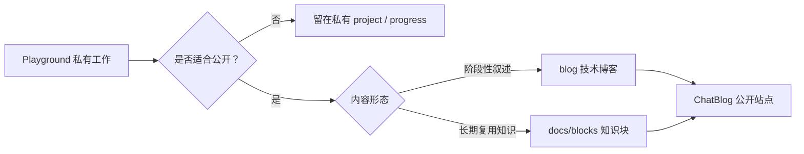

import Tabs from '@theme/Tabs';
import TabItem from '@theme/TabItem';

# Hello World：ChatBlog 框架能力展示

这篇文章是 ChatBlog 的第一篇博客，也是当前博客框架的能力展示页。

它的目的不是写一篇普通的 hello world，而是先让我们感受一下：这个公开博客站点除了常规 Markdown 文章之外，还能承载哪些更丰富的技术表达形式。

<!-- truncate -->

:::tip 当前结论
ChatBlog 当前基于 Docusaurus 搭建，默认中文，支持 Markdown / MDX、Mermaid 图示、提示框、Tabs、折叠内容、代码块、表格，以及后续自定义 React 组件。
:::

## 这个框架适合做什么

ChatBlog 面向公开知识产出：把 ChatArch 工作中可以公开的技术发现、设计解释和实现笔记，整理成更容易阅读、引用和维护的文章与知识块。

它适合承载：

- 技术博客：阶段总结、实现记录、排错复盘；
- 知识块：比 Skill 更轻、更偏阅读和引用的结构化知识；
- 架构说明：模块关系、流程图、状态机、方案对比；
- 项目文章：可以公开的项目背景、设计取舍和结果说明。

## 从私有工作到公开内容

ChatBlog 的核心动作不是“复制聊天记录”，而是“把可以公开的知识重新整理”。



:::warning 公开边界
公开内容不应该包含私有 token、未公开的项目进度、内部服务地址、个人隐私、未确认的商业信息或只能在私有 workspace 中流转的上下文。
:::

## 支持哪些写作能力

| 能力 | 用途 | 适合场景 |
| --- | --- | --- |
| Markdown | 常规结构化写作 | 标题、列表、表格、链接、引用 |
| MDX | 在文章中嵌入组件 | Tabs、项目卡片、后续自定义组件 |
| Mermaid | 画流程图、架构图、状态机 | 解释系统流程、模块关系 |
| Admonition | 提示、警告、结论先行 | 风险、注意事项、推荐方案 |
| Details | 折叠补充说明 | 细节较长但不是主线 |
| 代码块 | 展示命令、配置、示例 | 可复制操作或配置片段 |

## 同一个知识点可以有不同形态

<Tabs>
  <TabItem value="blog" label="博客" default>
    适合记录有时间线的内容：一次实现、一次调研、一轮设计取舍、一次排错复盘。博客可以有背景、过程、结论和后续计划。
  </TabItem>
  <TabItem value="block" label="知识块">
    适合沉淀长期可复用的知识：一个概念、一种模式、一段操作规范、一个架构解释。知识块应该短、稳、方便被其他文章引用。
  </TabItem>
  <TabItem value="skill" label="Skill">
    适合可执行的流程：当内容不只是解释，而是需要模型反复按步骤操作时，才更适合做成 Skill。
  </TabItem>
</Tabs>

## 写作模板示例

```md
---
title: 标题
date: 2026-06-29
tags: [chatblog, public]
description: 一句话摘要。
---

# 标题

先说明背景，再给出结论。

## 关键点

- 用结构组织内容；
- 用图示解释流程；
- 用代码块保留可复制片段；
- 用提示框标出风险和边界。
```

<details>
  <summary>为什么不直接公开原始聊天记录？</summary>

  原始聊天记录通常包含上下文跳跃、临时假设、私有路径、未整理的中间状态。公开内容应该先经过筛选、改写和结构化，让读者能直接理解它的价值。
</details>

## 后续可以继续增强的能力

第一版先证明“站点能跑、内容能写、结构能展示”。后续可以继续加入：

- 自定义项目卡片；
- 文章与知识块的来源链接；
- 中英文多语言版本；
- 从 Playground 中筛选公开内容的同步流程；
- 更复杂的图表组件和交互式示例。
