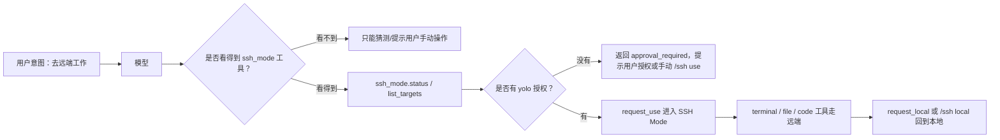
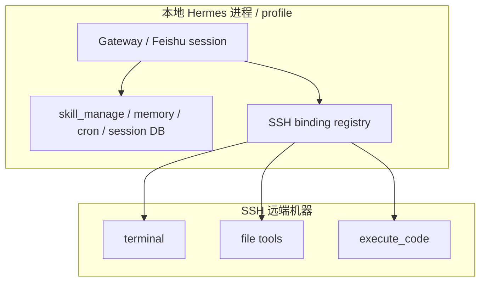

# Hermes SSH Mode：让模型安全地进入远端工作区

Hermes SSH Mode 的核心目标，是让同一个 Agent 会话可以在需要时把 terminal、file、code execution 等任务执行面切到远端机器，同时保留清晰的授权边界和会话隔离。

<!-- truncate -->

:::tip 一句话结论
SSH Mode 不只是“帮模型跑一条 ssh 命令”，而是把当前会话的工具执行面切到远端；模型要能自主进入/退出，必须能看到一个明确、安全、受授权约束的 `ssh_mode` 工具。
:::

## 为什么需要 SSH Mode

普通 SSH 命令适合人类临时登录一台机器，但对 Agent 来说还不够。

Agent 的工作不是只执行一条命令。它会连续调用：

- `terminal`：运行命令、看进程、跑测试；
- `read_file` / `write_file` / `patch` / `search_files`：读写和搜索项目文件；
- `execute_code`：运行小脚本做验证或自动化。

如果只有一条 `ssh user@host` 命令，后续 file/code 工具并不会自动知道“我现在应该在远端”。Hermes SSH Mode 解决的是这个问题：**把某个会话范围内的工具 backend 统一切到 SSH remote**。

## 两种 SSH backend：系统级与会话级

Hermes 里可以从两个层面理解 SSH：

| 模式 | 影响范围 | 适合场景 |
| --- | --- | --- |
| 系统级 SSH backend | 整个 Hermes 默认 terminal backend | 这台 Hermes 实例主要就是在远端工作 |
| Section / Thread 级 SSH Mode | 当前聊天 section 或飞书 Thread | 临时把一个任务切到远端，其他聊天仍保持本地 |

两者对模型的工具体验应该是等价的：只要当前上下文已经处于 SSH backend，`terminal`、文件工具、`execute_code` 就应该都打到同一个远端环境。

差别在于范围：系统级是全局默认，会话级是局部绑定。

## 在飞书里推荐的使用方式

Hermes 在 Feishu / Lark 里使用 SSH Mode 时，推荐把远端工作放进 Thread，而不是污染父会话。

| 目标 | 命令 | 说明 |
| --- | --- | --- |
| 在父会话进入远端 | `/ssh use <alias>` | 默认创建一个 Feishu Thread，并把 SSH 绑定到这个 Thread |
| 在已有 Thread 切换目标 | `/ssh use <alias>` | 只影响当前 Thread / section |
| 查看当前状态 | `/ssh status` | 查看是否绑定 SSH、绑定到哪个 target |
| 回到本地 | `/ssh local` | 推荐的退出方式 |
| 兼容旧命令 | `/ssh off` | 保留为兼容别名，不作为主要文档入口 |

:::info Feishu Thread 边界
父会话里的 `/ssh use <alias>` 默认创建 Thread，是为了让“远端任务上下文”有一个清晰边界。父会话继续保持本地，Thread 内后续消息才进入远端工作模式。
:::

## 为什么模型之前“不知道怎么进入 SSH”

一个重要经验是：模型不是通过读 slash command 列表来自动获得所有能力的。它主要依赖当前请求里暴露给它的工具 schema。

如果 `ssh_mode` 工具没有出现在模型可见的工具集中，即使系统内部已经支持 `/ssh use`，模型也很难主动发现：

- 当前是否已经在 SSH？
- 有哪些 SSH target？
- 如何请求进入？
- 如何请求退出？
- 什么时候需要用户授权？

这类能力需要一个模型可见的 affordance。

因此，SSH Mode 需要同时有两层入口：

1. **用户入口**：`/ssh use`、`/ssh local`、`/ssh status`；
2. **模型入口**：`ssh_mode.status`、`ssh_mode.list_targets`、`ssh_mode.request_use`、`ssh_mode.request_local`。

## 模型自主切换必须有授权边界

让模型“能请求进入 SSH”，不等于让模型随便切机器。

一个安全的模型侧流程应该是：

| 情况 | 行为 |
| --- | --- |
| 当前 section 没有授权 | `request_use` 返回需要授权 |
| 用户运行 `/ssh yolo on <alias>` | 模型可在当前 section 请求进入该 alias |
| 用户运行 `/ssh yolo on all` | 模型可在当前 section 请求进入任意已配置 target |
| 用户用 `/ssh use` 手动创建 sticky binding | 模型不应擅自清掉它 |
| 模型创建的临时 binding | 模型可用 `request_local` 清理 |

:::warning 安全边界
`/ssh yolo on <alias>` 应该是 section-scoped 授权，而不是全局永久授权。它让模型在当前任务上下文里更自主，但仍然把权限限制在用户明确打开的范围内。
:::

## SSH Mode 影响什么，不影响什么

最容易混淆的是“任务执行面”和“Hermes 控制面”。

SSH Mode 影响的是任务执行面：

- `terminal`
- `read_file` / `write_file` / `patch` / `search_files`
- `execute_code`

这些工具在当前 section 进入 SSH 后，应当像在远端工作一样。

但 Hermes 自己的控制面仍然属于本地 Hermes 进程和本地 profile：

- `skill_view` / `skill_manage`
- memory
- cron jobs
- session database
- gateway 状态
- profile config

这意味着：如果模型完成一次远端任务后，要更新自己的 skill，正确方式是调用 `skill_manage`，写入本地 Hermes profile 的 skills；不要通过远端 file/terminal 去改远端机器上的 `~/.hermes/skills`，除非目标明确就是维护远端那套 Hermes 安装。

## 一个推荐工作流

下面是一个典型的 Feishu Thread 工作流：

1. 用户在父会话说：这个任务去远端做。
2. 用户运行 `/ssh use <alias>`。
3. Hermes 创建一个 Thread，并把该 Thread 绑定到 SSH target。
4. Thread 中的后续任务，`terminal` / file / code 工具都走远端。
5. 如果希望模型后续能自己切入同一 target，用户运行 `/ssh yolo on <alias>`。
6. 任务完成后，用户运行 `/ssh local`，把该 Thread 回到本地 backend。

如果用户只想让模型“建议进入”，而不是允许它自主切换，就不需要开 yolo：模型看到缺少授权后，应提示用户手动运行 `/ssh use <alias>`。

## 设计上的关键点

这次 SSH Mode 的经验可以总结为几条通用 Agent 设计原则：

1. **Slash command 是用户 affordance，不是模型 affordance。**  模型要自主使用某能力，需要工具 schema 或等价的模型可见入口。
2. **远端 backend 要覆盖整套任务执行工具。**  只切 terminal 不够，file/code 工具也要命中同一个 backend。
3. **Thread / section 是天然的隔离边界。**  尤其在 IM 场景，不要让父会话被临时远端任务污染。
4. **控制面不要被远端 backend 意外劫持。**  skills、memory、cron、gateway 等属于 Hermes 本地 profile。
5. **自主性必须配授权。**  yolo grant 应该是显式、局部、可撤销的。

## 适合沉淀成 Skill 的内容

博客适合解释概念和设计；Skill 适合让模型重复执行流程。

SSH Mode 的操作 Skill 应该记录：

- 如何查看 `/ssh list` / `/ssh status`；
- 如何验证 target 元数据而不泄露私钥路径；
- 如何从父会话进入 Thread；
- 如何授权模型自主请求进入；
- 如何退出到 local；
- 如何验证 terminal/file/code 是否真的走远端；
- 哪些控制面仍然是本地。

这类内容一旦稳定，就可以成为模型每次处理 SSH Mode 任务前加载的操作手册。

## 结语

Hermes SSH Mode 的价值不只是“能连远端”，而是把远端执行、会话隔离、模型可发现能力和用户授权放进同一个闭环里。

当这个闭环成立后，用户可以用 `/ssh use` 明确切换任务上下文，模型也可以在得到授权后主动请求进入或退出远端环境；而 Hermes 自己的 skills、memory、profile 仍然保持在本地控制面中，不会因为一次远端任务而混乱。
