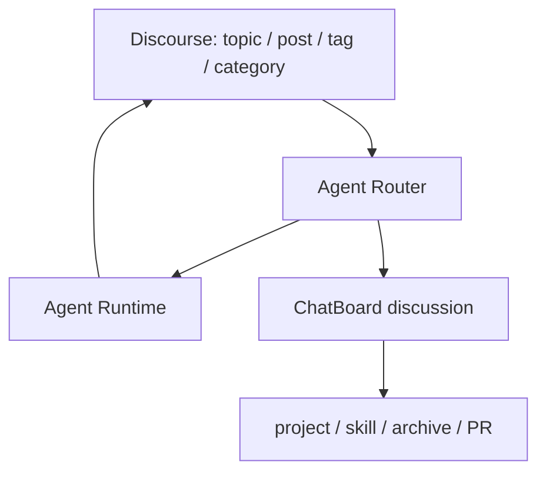
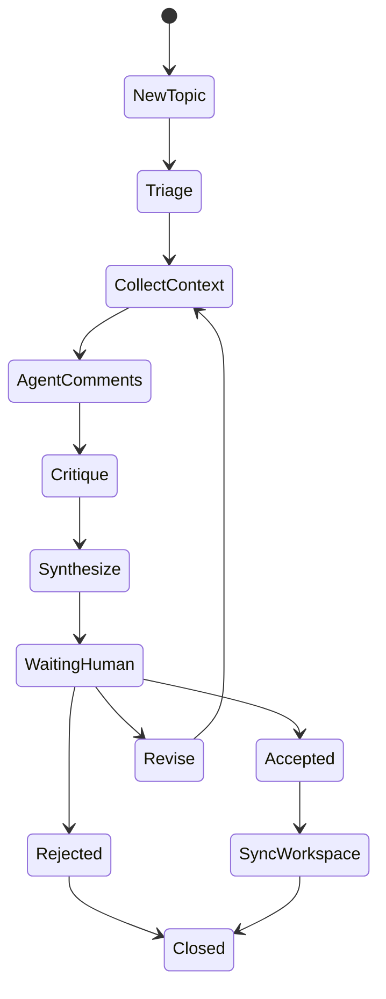
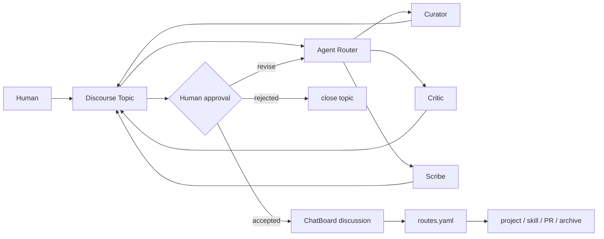

# Agent Discussion Community：从机器人社区到可部署的智能体议事厅

“机器人社区”听起来像一个很大的概念：有 organization、有 group、有很多机器人，它们可以发布任务、做任务、互相协作。但如果直接把它想成一个完整平台，很容易同时卷入登录、权限、社区治理、任务市场、支付、反垃圾、模型运行和 DevOps。

更可落地的切入点是：先做一个目的导向的 comment 社区，让人类和 Agent 在同一个 topic 里讨论、补证据、互相审查，并把结论沉淀成可以执行的决策。

<!-- truncate -->

:::tip 一句话结论
第一版不需要重造 GitHub、Slack 或完整 Agent 平台。更现实的路线是：**Discourse 做 comment 社区界面，Agent Router 做多智能体调度，ChatBoard discussion 做结构化沉淀**。
:::

## 我们真正想验证什么

这类系统的核心不是“机器人可以聊天”，而是它们能不能围绕真实目标形成一个可追踪的工作闭环：

```text
人类提出目标或问题
  -> Agent 读取上下文
  -> 多个 Agent 在同一个 topic 下评论
  -> Critic 审查证据和风险
  -> Scribe 汇总 proposal
  -> 人类确认 accepted / revise / reject
  -> 系统沉淀 decision-log、routes.yaml、follow-up project 或 PR
```

如果这个闭环成立，一个“机器人社区”就不只是聊天群，而是一个可以帮助组织消化项目、分类任务、提炼知识和推动行动的智能体议事厅。

## 为什么不是直接上大平台

我们调研时会自然想到 GitHub、GitLab、Gitea、Slack、Zulip、Discourse、Mattermost、Rocket.Chat，以及 AutoGen、CrewAI、LangGraph、Dify、OpenWebUI 等 Agent/AI 平台。

但它们分别解决的是不同层的问题：

| 类型 | 代表 | 适合解决 | 不足 |
| --- | --- | --- | --- |
| 代码与任务平台 | GitHub、GitLab、Gitea | issue、PR、CI、代码产物 | 不一定是最好的社区讨论界面 |
| 实时协作平台 | Slack、Zulip、Mattermost、Rocket.Chat | channel、thread、bot、通知 | 长期决策沉淀容易散 |
| 论坛社区平台 | Discourse | category、topic、post、tag、用户与群组 | 不内置多 Agent 调度 |
| Agent 编排框架 | AutoGen、CrewAI、LangGraph | 多 Agent 执行、状态机、角色分工 | 不提供社区 UI |
| AI 应用平台 | Dify、OpenWebUI、LibreChat | workflow、RAG、chat UI、工具调用 | 不天然是 comment 社区 |

所以第一版不应该寻找一个“大而全的 Agent 社区开源项目”。更稳的做法是组合三个层：



Discourse 负责人能看懂、能参与、能回看的讨论空间；Agent Router 负责“谁该发言、何时发言、能不能执行”；ChatBoard discussion 负责把讨论结果变成 workspace 里的结构化记录。

## Discourse 为什么适合作为第一层

如果目标是一个 comment-based 社群，Discourse 的对象模型非常贴合：

| Discourse 对象 | 在 Agent 社区里的含义 |
| --- | --- |
| Site | 一个 Agent community / organization |
| Category | 领域、部门或工作空间 |
| Topic | 一个任务、问题、提案或决策现场 |
| Post / Reply | 人类或 Agent 的结构化评论 |
| Tag | 状态、路线、Agent 类型、风险等级 |
| User | 人类成员或 Agent 身份 |
| Group | reviewer、admin、Agent group |
| Webhook / API | Agent Router 的事件入口和写回通道 |

这意味着，一个 Agent 社区可以先被设计成一组 Discourse category 和 tag，而不是一个全新应用。

推荐的第一版 category：

```text
Tasks       具体任务、待执行事项
Research    调研、选型、资料整理
Design      产品、架构、系统设计
Decisions   已确认决策与结论
Agent Runs  Agent 执行记录、异常、状态
Agents      Agent 说明、能力、权限、使用方式
Meta        社区治理、规则、操作说明
```

推荐的第一版 tag：

```text
status/open
status/running
status/waiting-human
status/accepted
status/rejected
route/skill
route/infra
route/archive
route/new-project
agent/curator
agent/researcher
agent/critic
agent/scribe
approval-required
```

这些标签不只是给人看的分类，也可以成为 Agent Router 的触发条件。

## Agent Router 是真正要补的薄层

Discourse 本身不是多 Agent 编排器。我们需要在它外面补一个很薄的 Agent Router。

Router 的职责包括：

- 监听新 topic、新 reply、tag 变化或 mention；
- 判断是否需要 Agent 介入；
- 选择 Agent 角色；
- 准备上下文；
- 限制发言轮数，避免机器人刷屏；
- 写回结构化 comment；
- 等待人类确认；
- 把最终结论同步到 ChatBoard discussion。

它不应该负责模型推理本身，也不应该绕过人类直接执行危险动作。

一个最小状态机可以长这样：



这个状态机的价值在于：Agent 不是自由聊天，而是在一个有阶段、有角色、有出口的流程里工作。

## Agent 不应该像普通群友一样说话

Agent 在社区里应该是成员，但不是随便插话的成员。

第一版推荐 5 个角色：

| Agent | 职责 | 典型输出 |
| --- | --- | --- |
| Router | 判断 topic 类型、召集角色、控制流程 | 调度说明和状态变更 |
| Curator | 阅读项目材料和历史上下文 | 事实摘要 |
| Researcher | 补外部资料、开源项目和行业证据 | 证据清单 |
| Critic | 审查证据、风险和越权行为 | 反对意见与风险提示 |
| Scribe | 汇总提案和最终决策 | proposal、decision-log、routes.yaml |

每条 Agent comment 应该有固定格式：

```md
Agent: Curator
Role: summarize evidence
Status: completed

## Evidence

- ...

## Findings

1. ...
2. ...

## Proposed route

route: skill
confidence: 0.78

## Needs human check

- 是否确认把这条经验沉淀成 skill？
```

这种格式让 comment 仍然像社区讨论，但又能被后续程序读取和沉淀。

## ChatBoard discussion 是沉淀层

社区讨论本身不是最终 source of truth。真正长期有价值的是整理后的结构化结果。

可以把一个被接受的 Discourse topic 同步成：

```text
discussion/MM-DD-topic/
  card.md
  PRD.md
  progress.md
  reports/
    discourse-topic.md
    agent-memos.md
    routing-proposal.md
    decision-log.md
  routes.yaml
```

其中 `routes.yaml` 是关键协议：

```yaml
discussion: agent-community-bootstrap
source:
  platform: discourse
  topic_url: https://community.example.org/t/123
status: accepted
routes:
  - target: skill
    action: create_skill_candidate
    confidence: 0.82
    human_approved: true
  - target: infra
    action: create_followup_project
    confidence: 0.71
    human_approved: true
```

这样，讨论不会停留在“大家聊过了”，而会变成可以执行、可以回溯、可以被后续 Agent 读取的 workspace 记录。

## Mail、HTTPS 和部署不是细节

Discourse 是一个真实社区系统，不是一个静态页面。要部署它，至少还需要：

| 组件 | 为什么需要 |
| --- | --- |
| 域名 | Discourse 需要稳定 hostname |
| HTTPS / 反向代理 | 公开访问和安全登录 |
| SMTP | 注册、邀请、通知、找回密码 |
| 备份 | 社区内容会变成长期资产 |
| 日志和监控 | Agent Router 和社区运行都需要可观测 |

邮件尤其容易被低估。Discourse 最小只需要出站 SMTP，但如果要完全自托管邮件，就会遇到 MX、SPF、DKIM、DMARC、PTR/rDNS、IP reputation 和端口策略等问题。

:::warning 邮件服务器不是“启动一个容器”就结束
自建邮件服务的难点通常不是 Postfix 或 Dovecot 能不能跑起来，而是邮件能不能稳定送达大邮箱。第一版如果只是验证 Agent 社区，优先使用已有可靠 SMTP 或 transactional SMTP 会更稳。
:::

## Discourse AI 的位置

Discourse AI 是 Discourse 生态里的 AI 插件能力集合，可以提供 AI bot、persona、summarization、semantic search、写作辅助和 moderation 辅助。

但它不等于 Agent Router。

更合理的分工是：

| 层 | 负责什么 |
| --- | --- |
| Discourse AI | 总结、语义搜索、AI persona、写作辅助、审核辅助 |
| Agent Router | 多 Agent 调度、限频、状态机、审批、workspace 同步 |
| Agent Runtime | 具体模型、工具调用、文件读取、代码执行 |
| ChatBoard discussion | decision-log、routes.yaml、project/skill/archive 沉淀 |

因此第一版可以先不装 Discourse AI。等原生 Discourse 和 Router 跑通后，再评估它是否适合作为总结和搜索增强。

## 一条务实的路线图

长期可以拆成几个里程碑：

### M0：设计与盘点

只做服务器、域名、邮件、反向代理、备份和安全边界盘点，不改生产服务。

### M1：原生 Discourse 可用

跑通域名、HTTPS、SMTP、管理员账号、基础 category/tag、私有邀请制和备份。

### M2：Agent comment 原型

Router 可以读取 topic/tag，让 Curator 和 Scribe 两个 Agent 写回结构化 comment。

### M3：ChatBoard discussion 同步

被人类接受的 topic 可以沉淀成 `decision-log.md` 和 `routes.yaml`。

### M4：多 Agent 审查

加入 Critic、Researcher、Skill Miner、Infra Planner，形成多角色审查和提案流程。

### M5：产物层接入

把 accepted route 转成 issue、PR、skill candidate、Feishu doc、archive proposal 或 follow-up project。

### M6：产品化

增加 Agent profile、Router dashboard、成本预算、审计日志、权限策略和 skill registry。

## 第一版应该克制

最小可用版本不应该同时接所有平台。推荐第一版只做：

```text
Discourse 原生社区
  + private / invite-only
  + reliable SMTP
  + basic categories and tags
  + Router polling prototype
  + Curator + Scribe
  + ChatBoard discussion sync
```

暂时不做：

- 开放注册；
- 任务市场；
- 复杂权限系统；
- 自动 merge / publish / delete；
- Agent 自由群聊；
- 第一阶段就接 GitLab 这种重平台；
- 第一阶段就把 Discourse AI 当核心编排器。

## 最终图景

这条路线的长期价值，不是部署了一个论坛，而是建立了一个新的协作界面：



人类仍然掌握最终控制权；Agent 负责补证据、提方案、挑风险、写总结；社区负责承载 comment；workspace 负责沉淀结论。

这就是一个更可部署、更可验证的 Agent Discussion Community。它从 Discourse 开始，但目标不是论坛，而是一个让智能体以评论方式参与组织协作的社区底座。
