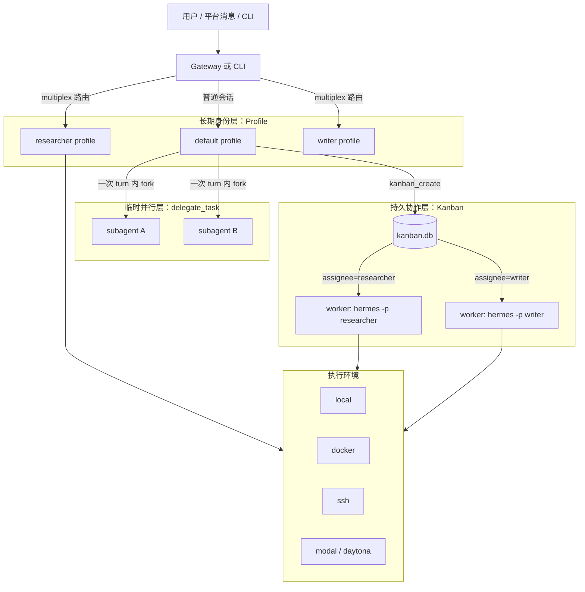
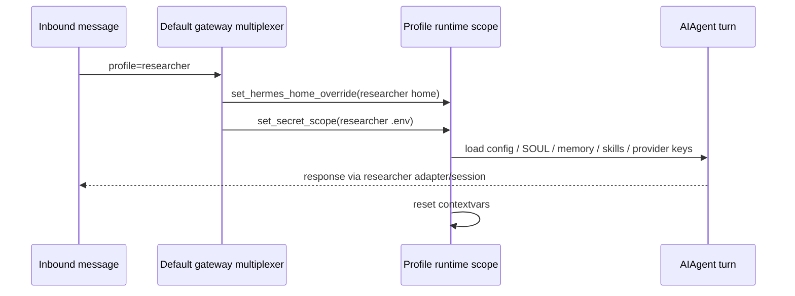

# Hermes Multi-Agent：Profile、Subagent 与 Kanban 的三层协作模型

Hermes 不是用一个单一的“多智能体开关”来实现 Multi-Agent，而是把能力拆成几层：Profile 负责长期身份，`delegate_task` 负责临时并行，Kanban 负责持久协作，Gateway multiplex 负责多入口路由，terminal backend 负责把执行面放到本地、容器、SSH 或云环境。

<!-- truncate -->

:::tip 一句话结论
如果目标是“不同个性、不同记忆、长期分工的多个 Agent”，用 **Profile + Kanban**；如果只是“一次对话里并行查几个方向”，用 **`delegate_task`**；如果要“不同机器执行”，给对应 profile 或 session 配 **SSH / Docker / Modal / Daytona** 等 terminal backend。
:::

## 先把几个概念分开

Hermes 里的 Multi-Agent 至少有五个相关概念，它们解决的问题不同：

| 层级 | 机制 | 解决什么 | 生命周期 | 是否有独立人格/记忆 |
| --- | --- | --- | --- | --- |
| 长期身份 | Profile | 独立配置、人格、记忆、技能、会话、密钥 | 长期 | 是 |
| 临时并行 | `delegate_task` subagent | 同一次任务内并行推理或局部探索 | 单次任务 | 默认不是 |
| 持久协作 | Kanban | 多 profile 之间用任务板交接、重试、审计 | 跨进程、跨天 | 是，按 assignee profile |
| 多入口路由 | Gateway multiplex | 一个 gateway 同时服务多个 profile | gateway 进程期 | 是，按路由 profile |
| 执行环境 | terminal backend / SSH mode | 把 terminal、file、code 工具放到本机、容器、远端或云 | profile 或 session 级 | 不直接决定人格 |

可以把它理解成下面这张图：



这篇文章按源码路径解释这些层怎么配合。

## Profile：真正的长期 Agent 身份

Profile 是 Hermes 的长期多 Agent 基础。源码注释直接把它定义成“多个隔离 Hermes 实例”的管理层：每个 profile 都是一个独立 `HERMES_HOME`，拥有自己的 `config.yaml`、`.env`、memory、sessions、skills、gateway、cron 和 logs。对应代码在 `hermes_cli/profiles.py:1`。

默认 profile 是根目录本身，named profile 在 `profiles/<name>/` 下。`get_profile_dir()` 把 `default` 映射到默认 Hermes home，把 named profile 映射到 profiles 目录，见 `hermes_cli/profiles.py:367`。

创建一个 profile 时，Hermes 会初始化一组目录：

```text
memories/
sessions/
skills/
skins/
logs/
plans/
workspace/
cron/
home/
```

这组目录定义在 `hermes_cli/profiles.py:39`。也就是说，profile 不是一个标签，而是一套完整状态目录。

### 人格：`SOUL.md`

Profile 的人格主要来自 profile-local `SOUL.md`。用户文档也明确说：`--clone` 会复制 `config.yaml`、`.env`、`SOUL.md` 和 skills；如果要不同 personality，可以编辑目标 profile 的 `SOUL.md`，见 `website/docs/user-guide/profiles.md:47`。

系统提示构建时会从当前 `get_hermes_home()/SOUL.md` 读取身份内容。这样 `researcher` 和 `writer` 可以拥有不同的叙述风格、职责边界和默认行为。

### 记忆：`memories/MEMORY.md` 与 `memories/USER.md`

内置记忆也跟随 profile。`memory_tool` 使用当前 `get_hermes_home()/memories`，而不是 import 时固定一个全局路径。这是 profile 隔离很关键的一点：不同 profile 的 `MEMORY.md` / `USER.md` 不会自然混到一起。

外部 memory provider 也是 profile 可配置的。以 Honcho 为例，文档明确提到 multi-agent profiles 会用不同 peer profiles 隔离 AI peer 的观察与结论，避免不同 agent 的上下文交叉污染，见 `website/docs/user-guide/features/honcho.md:31`。

### 配置与密钥：`config.yaml` / `.env`

每个 profile 有自己的 `config.yaml` 与 `.env`。这使得不同 Agent 可以用不同模型、不同工具集、不同 terminal backend、不同 bot token 或 API key。

多 profile gateway multiplex 时，密钥隔离更严格：`agent/secret_scope.py` 明确说明不能把所有 profile 的 `.env` union 到进程全局 `os.environ`，否则 profile A 的 key 可能泄漏给 profile B。它提供了 context-local secret scope，并在 multiplex active 但无 scope 时 fail-closed，见 `agent/secret_scope.py:1` 和 `agent/secret_scope.py:123`。

具体 per-turn scope 在 `gateway/run.py:_profile_runtime_scope`：

- `set_hermes_home_override(profile_home)`：把 `get_hermes_home()` 指向当前路由 profile；
- `set_secret_scope(build_profile_secret_scope(profile_home))`：把该 profile 的 `.env` 作为当前 context 的密钥来源；
- 结束时 reset 两个 contextvar。

代码入口在 `gateway/run.py:1441`。

### 会话与 skills：也随 profile

会话数据库默认是当前 `HERMES_HOME/state.db`，skills 目录也是当前 `HERMES_HOME/skills`。因此一个 profile 的会话历史、长期技能和 prompt snapshot 都可以独立演化。

这就是为什么 Profile 才是 Hermes 里“真正的长期 Agent”：它有名字、有身份、有记忆、有配置、有密钥、有技能、有会话。

## `delegate_task`：临时 subagent，而不是另一个 profile

`delegate_task` 是 Hermes 的短期并行机制。它用于一次对话或一次任务中，把若干子任务分给临时子 Agent 做，最后把 summary 回流给父 Agent。

源码文件 `tools/delegate_tool.py` 的开头说明了设计目标：子 Agent 有 fresh conversation、自己的 task id、受限 toolset、聚焦的 system prompt；父 Agent 只看到最终 summary，看不到子 Agent 的中间工具调用，见 `tools/delegate_tool.py:1`。

### 子 Agent 怎么创建

`_build_child_agent()` 会构造一个新的 `AIAgent`，并传入：

- child prompt：由 goal + context 拼出；
- `quiet_mode=True`；
- `platform="subagent"`；
- `skip_context_files=True`；
- `skip_memory=True`；
- `parent_session_id`：指向父 session；
- `enabled_toolsets`：从父 Agent 工具集继承并过滤。

关键调用在 `tools/delegate_tool.py:1050` 到 `tools/delegate_tool.py:1350` 一带。

这里的 `skip_memory=True` 很关键：subagent 默认不是一个长期 profile identity，它不会自然带着自己的 `SOUL.md` 和长期 memory 生活。它更像是父 Agent 在一次任务里临时 fork 出来的匿名执行分支。

### 工具隔离与安全限制

子 Agent 的默认黑名单包括：

```text
delegate_task
clarify
memory
send_message
execute_code
cronjob
```

定义在 `tools/delegate_tool.py:44`。这意味着 leaf subagent 不能继续递归生子、不能向用户发起澄清、不能写共享 memory、不能跨平台发消息、不能自己创建 cron job。

`role="orchestrator"` 可以让子 Agent 保留 delegation 能力，但要受 `delegation.max_spawn_depth` 与 `delegation.orchestrator_enabled` 约束。默认 `max_spawn_depth=1`，所以默认是扁平结构：父 Agent 可以开子 Agent，子 Agent 不能再开孙 Agent。深度控制在 `tools/delegate_tool.py:467`。

### 并行、限流与异步回流

`delegation.max_concurrent_children` 控制一次 fan-out 的最大并行子 Agent 数，默认是 3，见 `tools/delegate_tool.py:354`。

批量任务会通过 daemon thread pool 并行运行，核心逻辑在 `tools/delegate_tool.py:2457` 到 `tools/delegate_tool.py:2680`。顶层 Agent 调用 `delegate_task` 时，`run_agent.py:_dispatch_delegate_task` 会强制 background：父会话不阻塞，子 Agent 完成后结果作为新的 completion event 回到原会话，见 `run_agent.py:5696`。

异步 registry 在 `tools/async_delegation.py`。它会把 dispatch 和 completion 记录到当前 profile 的 `state.db`，并通过共享 completion queue 把结果送回 CLI / gateway drain loop，见 `tools/async_delegation.py:1`、`tools/async_delegation.py:425` 和 `tools/async_delegation.py:632`。

### 适合和不适合的场景

`delegate_task` 适合：

- 并行阅读几个独立文件；
- 让两个子 Agent 分别调研 A/B 方案；
- 让子 Agent 做代码 review、资料摘录、局部验证；
- 父 Agent 需要一个短 summary 才能继续推理。

它不适合：

- 需要跨天继续的工作；
- 需要长期身份、长期记忆、长期技能演化的 Agent；
- 需要人类中途评论、block/unblock、审计 trail 的流程；
- 需要不同 profile 各自带不同 `SOUL.md` 与 `.env` 的工作。

这些应该交给 Kanban + Profile。

## Kanban：把 profile 当成长期 worker 调度

Kanban 是 Hermes 里最像“多 Agent 协作系统”的机制。文档把它定义为一个 SQLite-backed durable task board：所有 profile 共享同一个 board，每个 task 有 assignee，每个 worker 是完整 OS process，带自己的 identity。见 `website/docs/user-guide/features/kanban.md:7`。

官方文档也明确比较了 Kanban 和 `delegate_task`：

| 维度 | `delegate_task` | Kanban |
| --- | --- | --- |
| 形态 | RPC / fork-join | Durable queue + state machine |
| 子 Agent | 匿名 subagent | named profile worker |
| 记忆 | 默认无长期记忆 | 使用 assignee profile 的长期记忆 |
| 恢复 | 不可恢复 | 可 block、unblock、retry、reclaim |
| 审计 | summary 回流 | SQLite events / comments / runs |
| 人类介入 | 不支持 | 可以评论、阻塞、解阻塞 |

对应说明在 `website/docs/user-guide/features/kanban.md:32`。

### dispatcher 如何 spawn worker

Kanban dispatcher 会扫描 ready tasks，检查 assignee 是否是一个真实 Hermes profile，然后 claim 任务并调用 `_default_spawn()`。调度主逻辑在 `hermes_cli/kanban_db.py:7240`。

`_default_spawn()` 的核心动作是启动一个子进程：

```text
hermes -p <assignee> --cli --accept-hooks chat -q "work kanban task <task_id>"
```

源码入口在 `hermes_cli/kanban_db.py:7904`。它会给 worker 注入一组环境变量：

| 变量 | 含义 |
| --- | --- |
| `HERMES_HOME` | assignee profile 的 home，让 worker 读取自己的配置、记忆和 skills |
| `HERMES_PROFILE` | worker 的 profile 名，用于评论署名 |
| `HERMES_KANBAN_TASK` | 当前任务 id |
| `HERMES_KANBAN_WORKSPACE` | 当前任务 workspace |
| `HERMES_KANBAN_DB` | 当前 board 的 SQLite 路径 |
| `HERMES_KANBAN_BOARD` | 当前 board slug |
| `HERMES_KANBAN_WORKSPACES_ROOT` | 当前 board 的 workspace root |
| `TERMINAL_CWD` | pin 到任务 workspace |

`HERMES_HOME` 注入逻辑在 `hermes_cli/kanban_db.py:7933`，board / workspace pinning 在 `hermes_cli/kanban_db.py:7994`，最终 `subprocess.Popen` 在 `hermes_cli/kanban_db.py:8069`。

这意味着 Kanban worker 不是匿名子 Agent，而是一个完整 profile：它会使用 assignee profile 的 `SOUL.md`、memory、skills、model、toolsets、secrets 和 terminal backend。

### worker 协议

每个 Kanban worker 的系统提示都会注入 `KANBAN_GUIDANCE`：

1. 先调用 `kanban_show()` 读任务、父任务 handoff、历史尝试和评论；
2. 进入 `$HERMES_KANBAN_WORKSPACE` 工作；
3. 长任务定期 `kanban_heartbeat()`；
4. 完成时 `kanban_complete()`；卡住时 `kanban_block()`。

文档说明见 `website/docs/user-guide/features/kanban.md:361`。

如果 worker 进程正常退出但任务仍是 running，dispatcher 会认为这是 protocol violation，而不是直接把任务当完成。这样任务状态不会只靠文本输出漂移，而是必须通过 `kanban_*` 工具落库。

### orchestrator profile

Kanban 还支持 orchestrator 模式：一个 profile 不自己做实现，而是把高层目标拆成多个子任务，分配给 researcher、coder、writer、reviewer 等 specialist profile。

文档里的推荐做法是：orchestrator profile 只开 `kanban` / gateway / memory 等控制面工具，关闭 terminal / file / code / web 这类实现工具，避免它“忍不住自己干活”，见 `website/docs/user-guide/features/kanban.md:430`。

## Gateway multiplex：一个入口服务多个 profile

默认情况下，每个 profile 可以跑自己的 gateway：

```bash
coder gateway start
writer gateway start
researcher gateway start
```

这是一 profile 一进程，隔离最清晰。文档在 `website/docs/user-guide/multi-profile-gateways.md:5`。

另一种模式是 multiplex：default gateway 作为唯一入口进程，同时服务机器上的多个 profile。开启方式：

```bash
hermes config set gateway.multiplex_profiles true
hermes gateway restart
```

文档说明见 `website/docs/user-guide/multi-profile-gateways.md:59`。

multiplex 的关键不是“把所有 profile 配置混进一个进程”，而是每个 turn 动态切 profile scope：



同时，gateway session key 会按 profile namespace 隔离。默认 profile 继续用历史兼容的 `agent:main`，named profile 用 `agent:<profile>`，这样同一个平台、同一个 chat 在不同 profile 下不会撞 session。实现见 `gateway/session.py:851` 和 `gateway/session.py:1300`。

## 多机器：靠执行 backend，不靠 profile 名字本身

Profile 不是 sandbox，也不是机器。它只是 Hermes 状态目录隔离。用户文档特别提醒：profile 和 workspace / sandbox 是不同概念；local backend 下，agent 仍然有同一个 OS 用户能访问的文件权限，见 `website/docs/user-guide/profiles.md:125`。

如果要让 Agent 到不同机器或不同隔离环境工作，要配置 terminal backend。

文档列出的 backend 包括：

| Backend | 作用 |
| --- | --- |
| `local` | 在当前机器执行，默认方式 |
| `docker` | 容器隔离，适合安全和复现 |
| `ssh` | 远端机器，适合把 Agent 执行面放到服务器 |
| `singularity` | HPC / rootless container 场景 |
| `modal` | serverless cloud 执行 |
| `daytona` | cloud sandbox workspace |

见 `website/docs/user-guide/features/tools.md:56`。

Profile 级配置示例：

```yaml
terminal:
  backend: ssh
  cwd: /absolute/path/to/project
```

这会让该 profile 的 terminal / file / code execution 默认走 SSH backend。

另外，gateway session 也可以临时进入 SSH Mode。`tools/ssh_mode_tool.py` 提供模型可见控制面：

- `ssh_mode.status`：查看当前 session 是否在 SSH；
- `ssh_mode.list_targets`：列出 Hermes 管理的 SSH targets；
- `ssh_mode.request_use`：在授权后切入 SSH；
- `ssh_mode.request_local`：退出模型创建的 SSH binding。

对应实现见 `tools/ssh_mode_tool.py:144`、`tools/ssh_mode_tool.py:170` 和 `tools/ssh_mode_tool.py:262`。

### 任务执行面和控制面要分开

SSH / Docker / Modal 影响的是任务执行面：

- `terminal`
- file tools
- `execute_code`

但 Hermes 控制面仍属于本地 profile：

- skills
- memory
- cron
- session database
- gateway status
- profile config

这也是为什么“远端机器”不等于“远端 Hermes profile”。如果目标是维护远端那套 Hermes，需要在那里单独部署 Hermes；如果只是让本地 profile 在远端工作区执行命令，配置 terminal backend 即可。

## 三种典型组合

### 1. 一次性并行调研

```text
用户问题 -> 父 Agent -> delegate_task(A/B/C) -> 子 Agent summaries -> 父 Agent 总结
```

适合短平快，不需要长期记忆。

### 2. 长期角色协作

```bash
hermes profile create researcher --description "Searches docs, code, and web sources."
hermes profile create writer --description "Writes polished Chinese technical posts."
hermes profile create reviewer --description "Reviews claims, risks, and missing tests."

hermes kanban init
hermes gateway start
hermes kanban create "整理某个系统的公开技术文章" --assignee researcher
```

接下来可以让 researcher 完成资料、writer 接 synthesis、reviewer 做事实校验。每个 worker 都是自己的 profile。

### 3. 多环境执行

```bash
hermes profile create remote-coder --description "Implements code on a remote staging host."
remote-coder config set terminal.backend ssh
remote-coder config set terminal.cwd /srv/project
```

`remote-coder` 的身份、记忆、skills 在本地 profile；它的执行面走远端 SSH。需要更强隔离时，用 Docker / Modal / Daytona。

## 边界与风险

:::warning Profile 不是安全沙箱
Profile 隔离的是 Hermes 应用状态，不是 OS 权限。local backend 下，同一 Unix 用户能读写的路径，profile 通常也能访问。强隔离需要容器、SSH 到独立机器、云 sandbox 或 OS 级权限隔离。
:::

需要特别注意：

1. **secrets 不能全局混用。** multiplex 模式下应该通过 `get_secret()` 与 secret scope 读取密钥，避免直接读 `os.environ` 造成跨 profile 泄漏。
2. **修改 `SOUL.md` / skills / memory 不一定影响当前 session。** 很多 prompt 内容在 session 开始或 prompt cache 中固定；修改后最好开新 session。
3. **`delegate_task` 的结果是 self-report。** 父 Agent 应验证子 Agent 声称写入的文件、URL 或外部副作用。
4. **Kanban board 是共享协作面。** comments、metadata、task bodies 不应该写入 token、私密路径或不可公开信息。
5. **clone profile 会复制身份与密钥。** `--clone` / `--clone-all` 很方便，但复制 `.env` 前要确认是否真的希望两个 profile 使用同一批凭据。
6. **多机器不是自动分布式。** Hermes 默认是单机 profile + 单机 SQLite board；跨机器 fleet 需要额外部署、共享存储或外部 lane 设计。

## 推荐心智模型

最后可以用这四句话记住 Hermes 的 Multi-Agent 设计：

```text
Profile       = 长期身份、人格、记忆、配置、密钥、技能
Subagent      = 一次任务里的匿名临时并行分支
Kanban        = 多个长期 profile 之间的 durable work queue
Terminal backend = 把某个 profile/session 的执行面放到本地、容器、远端或云
```

因此，Hermes 确实能做到“不同个性、不同记忆、不同机器协作”，但正确组合是：

- 不同个性 / 记忆：创建不同 Profile；
- 多角色长期协作：用 Kanban 把任务分配给不同 profile；
- 临时并行探索：用 `delegate_task`；
- 不同机器执行：给 profile 或 session 配 SSH / Docker / Modal / Daytona；
- 一个入口服务多个 profile：在确认 secret 路径安全后开启 Gateway multiplex。

这套设计的优点是边界清晰：长期身份、临时并行、持久调度、入口路由、执行环境各自独立，可以按任务复杂度逐层启用，而不是把所有“多 Agent”场景都塞进一个机制里。
