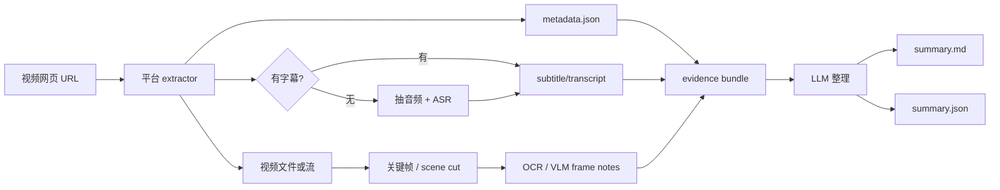

# ChatVideo：从视频网页 URL 自己搭建内容理解流水线

如果目标是“给一个 B 站视频链接，然后自动整理视频里讲了什么”，最稳的做法不是把网页 URL 直接丢给一个大模型，而是自己搭一条可观察、可缓存、可替换的 evidence pipeline：先拿到网页 metadata、字幕或音频，再用 ASR、抽帧、OCR/VLM 和 LLM 逐层补全证据。

<!-- truncate -->

:::tip 一句话结论
自建方案应该先产出 `metadata + transcript + frames + frame notes` 这组 evidence bundle，再让 LLM 生成章节、摘要、要点和问答。这样比“直接喂视频给模型”更便宜、更可控，也更容易追溯时间戳。
:::

## 为什么不是直接把 URL 交给模型

视频网页不是一个稳定的输入格式。一个 B 站或 YouTube 页面里可能有标题、简介、字幕、弹幕、评论、分 P、合集、封面、音轨、视频流和页面脚本。不同平台、登录状态和风控策略都会影响可获取内容。

直接把 URL 交给大模型会遇到几个问题：

- 模型不一定能访问该平台的视频流。
- 即使能访问，也很难保证它拿到的是哪一版字幕、哪一段视频、哪一个分 P。
- 长视频成本高，而且输出不一定带可靠时间戳。
- B 站等平台可能需要用户登录、cookies 或扫码，不能把这些凭据暴露给模型或日志。
- 如果视频是 PPT、屏幕录制或教程，只看字幕会漏掉画面里的关键代码、图表和操作步骤。

所以 ChatVideo 更适合采用“证据优先”的工程路线：先把能复用、能审计的中间件生成出来，再做总结。

## 总体架构



这条链路的关键不是某一个模型，而是把每一步的输入输出拆清楚。以后替换 ASR、替换 VLM、替换总结模型，都不影响前后层协议。

## 输入层：视频网页能拿到什么

以 B 站为例，一个视频网页可能提供这些信息源：

| 信息源 | 用途 | 注意事项 |
| --- | --- | --- |
| 标题、简介、UP 主、发布时间、标签 | 建立上下文，辅助摘要和分类 | 属于页面 metadata，不等于视频正文 |
| 分 P / `cid` / 合集结构 | 拆分长内容和全集总结 | 多 P 要逐个处理，不要混成一个 transcript |
| 人工字幕 / 自动字幕 | 最便宜、最快的语义主线 | 要保留时间戳和来源 |
| 音频 | 字幕缺失时做 ASR | 长视频需要切片和重试 |
| 视频帧 / 镜头 | PPT、屏幕、图表、场景信息 | 需要抽帧去重，否则成本高 |
| 弹幕 / 评论 | 观众关注点、补充线索 | 不能当作视频事实依据 |

处理边界也要写清楚：只处理用户有权访问的公开视频，或者用户明确提供 cookies 后可访问的视频；不绕过登录、付费、风控和版权限制；cookies、token、API key 都不能写进项目记录、摘要或日志。

## Phase 1：URL ingest

第一阶段只做“拿证据”，不做总结。

推荐优先使用 `yt-dlp`，因为它覆盖 B 站、YouTube、Twitter/X、TikTok 等大量平台，并且能输出 metadata、字幕、音频和视频流信息。对于 B 站，如果后续需要更细控制，可以再补平台 API fallback，比如 `bvid -> cid -> player/subtitle`。

MVP 输出：

```text
evidence/
  metadata.json
  subtitles/
    zh-Hans.vtt
  audio.m4a
  raw-info.json
```

`metadata.json` 建议统一成下面的形状：

```json
{
  "url": "https://www.bilibili.com/video/BV...",
  "platform": "bilibili",
  "title": "...",
  "author": "...",
  "duration": 1234.5,
  "published_at": "2026-07-27",
  "parts": [
    {"id": "...", "title": "P1", "duration": 600.0}
  ]
}
```

## Phase 2：字幕优先，ASR fallback

总结视频最重要的是 transcript。优先级应该是：

1. 人工字幕。
2. 平台自动字幕。
3. 本地或云 ASR。

统一 transcript 结构比具体 ASR 后端更重要：

```json
{
  "language": "zh",
  "source": "subtitle|asr",
  "segments": [
    {"start": 0.0, "end": 12.3, "text": "..."}
  ]
}
```

ASR 选择可以按部署环境分层：

| 场景 | 推荐 |
| --- | --- |
| 只想先跑通 | 云 ASR，速度快，少折腾 |
| 中文课程/长视频 | FunASR / QwenASR / Paraformer 值得评估 |
| 通用本地方案 | `faster-whisper` 或 WhisperX |
| 需要逐字/说话人/对齐 | WhisperX 或专业 ASR 服务 |

长视频不要一次性转写。先抽音频，再按静音或固定时长切片，失败片段可重试，最后合并时间戳。

## Phase 3：关键帧、OCR 和 VLM

如果视频是访谈或播客，transcript 就能覆盖大部分信息；但如果是教程、PPT、代码演示、产品操作或图表分析，只看 transcript 会漏很多。

关键帧策略可以从简单到复杂逐步升级：

| 策略 | 说明 | 适合阶段 |
| --- | --- | --- |
| 每 N 秒抽一帧 | 例如每 10 秒一帧 | MVP |
| scene change | 按镜头切换抽帧 | 视频内容变化明显时 |
| OCR 去重 | 保留文字变化大的截图 | PPT、屏幕录制 |
| VLM 精选 | 先粗抽，再让模型挑 3-10 张关键图 | 成本可控后 |

frame note 建议保持客观，不要直接让 VLM 写长篇总结：

```json
{
  "frames": [
    {
      "time": 125.0,
      "path": "frames/000125.jpg",
      "ocr": "...",
      "description": "屏幕展示一个包含三层 pipeline 的架构图。",
      "confidence": "medium"
    }
  ]
}
```

## Phase 4：evidence bundle

把 `metadata`、`transcript` 和 `frame notes` 对齐后，形成真正交给 LLM 的 bundle。

```text
evidence/
  metadata.json
  transcript.json
  frames/
    000010.jpg
    000125.jpg
  frame-notes.json
  chunks/
    0000.json
    0001.json
```

chunk 设计建议：

- 每个 chunk 覆盖 5-15 分钟视频内容。
- 每个 chunk 包含 transcript segments 和同时间段的 frame notes。
- 每个 chunk 输出局部摘要、实体、概念、行动项和低置信度点。
- 最后用 map-reduce 合成全局摘要。

这样能避免长视频超过上下文，也能保留“这个结论来自哪一段”的时间线证据。

## Phase 5：结构化输出

最终输出至少有两个版本：

```text
outputs/
  summary.md
  summary.json
```

Markdown 面向人读：

- 一句话结论。
- 3-7 条核心要点。
- 分章节摘要，每章带时间范围。
- 关键概念、人物、产品、代码或术语。
- 行动项和待复核点。
- 时间戳引用。

JSON 面向后续系统：

```json
{
  "title": "...",
  "short_summary": "...",
  "chapters": [
    {
      "start": 0.0,
      "end": 300.0,
      "title": "...",
      "summary": "...",
      "evidence": ["transcript:12.3-48.0", "frame:125.0"]
    }
  ],
  "key_points": [],
  "entities": [],
  "questions": []
}
```

## 直接部署前需要准备什么

如果你要把这条 pipeline 部署到服务器上，至少要准备下面几类东西。

| 你要提供 | 为什么需要 | 可以先不提供吗 |
| --- | --- | --- |
| 一台能跑 Docker 或 Python 的服务器 | 跑 extractor、ASR、FFmpeg 和 Web/API 服务 | 不行 |
| 可访问端口或域名 | 访问 Web UI/API，或做反向代理 | MVP 可只用 localhost |
| LLM API key | 生成摘要、章节和问答 | 可以先只输出 transcript，不做 summary |
| ASR key 或本地 ASR 环境 | 没字幕时转写音频 | 有字幕的视频可以先跳过 |
| B 站 cookies 或扫码登录能力 | 遇到风控、登录可见、收藏夹、多 P 批处理 | 公开视频可以先不配 |
| 存储目录 | 保存下载视频、音频、字幕、截图、摘要和数据库 | 不行 |
| 视觉模型 key | 做截图理解、VLM 图文笔记 | 只做字幕总结时可不配 |

在 ChatArch 的服务体系里，还要额外考虑：

- 服务目录放在长期位置，不要放一次性 `/tmp`。
- secrets 只进 `.env` 或服务 secret，不写进 blog、Git、project record。
- 对外入口先明确是 local、public 还是 Pages 文档站，不混用。
- 生成内容要带来源和时间戳，方便复核。

## 什么时候才应该进入 ChatVideo CLI

当前建议先用探索脚本或独立服务验证，而不是马上在 `chatvideo` 包里加命令。

只有下面条件满足后，才适合变成真实 CLI：

- URL ingest 能稳定产出 `metadata.json`。
- 字幕优先和 ASR fallback 都有测试样例。
- 抽帧/VLM 逻辑能关闭、能限流、能缓存。
- 输出 `summary.md` 和 `summary.json` 的 schema 稳定。
- 帮助文本只列真实可运行命令，不把蓝图包装成命令。

未来命令可以长这样：

```bash
chatvideo ingest url "https://www.bilibili.com/video/BV..." --out workdir
chatvideo summarize workdir/evidence --format md,json
```

在实现前，这些仍然应该留在文档和 PoC 里。

## 最小 PoC

最小 PoC 可以只验证一条公开视频：

```text
输入：一个 B 站公开视频 URL
输出：metadata.json + transcript.json + frames/ + summary.md
```

实施顺序：

1. 建隔离 venv 或容器，不污染 ChatVideo 主包。
2. 安装 `yt-dlp`、`ffmpeg` 和一个 ASR 后端。
3. 先只跑 metadata/subtitle/audio，不接大模型。
4. 再加入 ASR fallback。
5. 再加入关键帧抽取和 OCR/VLM。
6. 最后接 LLM 生成 Markdown/JSON。

这条路线的好处是每一步都有产物可看。即使 LLM 摘要质量不好，也能回头检查到底是字幕、ASR、抽帧还是 prompt 的问题。
