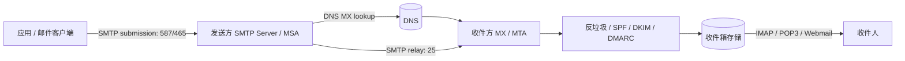

# SMTP 入门：邮件是怎么发出去的，以及常见平台怎么配置

SMTP 的全称是 **Simple Mail Transfer Protocol**，中文通常译作“简单邮件传输协议”。它负责把邮件“发出去”和“转交下去”：从你的应用、邮箱客户端或业务系统出发，经由 SMTP 服务器、DNS/MX 解析和收件方邮件服务器，最终进入对方邮箱系统。

<!-- truncate -->

:::tip 一句话结论
SMTP 管“发送和中转”，IMAP/POP3 管“读取邮箱”。如果你在一个系统里配置“发邮件”，通常要填的是 SMTP host、port、加密方式、用户名、密码或授权码、发件人地址；如果你在邮件客户端里“收邮件”，才会配置 IMAP 或 POP3。
:::

## SMTP 解决什么问题

电子邮件不是“从我的电脑直接塞进对方收件箱”的。更准确地说，它是一套分布式投递系统：

1. 你的应用或邮件客户端把邮件提交给一个 SMTP submission server。
2. 发送方邮件服务器根据收件人域名查询 DNS MX 记录。
3. 发送方服务器把邮件转交给收件方域名的邮件服务器。
4. 收件方服务器做反垃圾、病毒扫描、SPF/DKIM/DMARC 校验、投递规则处理。
5. 邮件进入收件人的 mailbox，之后用户通过 IMAP、POP3 或网页邮箱读取。

可以把 SMTP 理解成“邮件世界里的投递和转运协议”。它关注的是：谁在发、发给谁、邮件内容是什么、下一跳是谁、对方是否接受。



## 几个角色先分清

| 缩写 | 全称 | 作用 |
| --- | --- | --- |
| MUA | Mail User Agent | 用户使用的邮件客户端，比如 Apple Mail、Outlook、网页邮箱、业务系统里的发信模块。 |
| MSA | Mail Submission Agent | 接收用户或应用提交邮件的服务器，通常要求登录认证，常见端口 587 或 465。 |
| MTA | Mail Transfer Agent | 邮件服务器之间中转邮件的组件，典型端口是 25。Postfix、Exim、Exchange 都可以扮演这个角色。 |
| MDA | Mail Delivery Agent | 把邮件投递进具体 mailbox 的组件。 |
| MX | Mail Exchange | DNS 记录类型，告诉外部服务器“这个域名的邮件应该投给哪些服务器”。 |

你在业务系统里配置 SMTP，通常是在配置“应用作为 MUA，把邮件提交给某个 MSA”。你不是在配置完整邮件服务器，也不一定需要自己管理 MX。

## 一封邮件的 SMTP 对话大概长什么样

SMTP 是文本协议。真实连接会先建立 TCP/TLS，再一行一行交换命令。一个简化版流程像这样：

```text
S: 220 smtp.example.com ESMTP ready
C: EHLO app.example.com
S: 250-smtp.example.com Hello
S: 250-STARTTLS
S: 250 AUTH LOGIN PLAIN
C: STARTTLS
S: 220 Ready to start TLS

# TLS 握手之后
C: EHLO app.example.com
S: 250 AUTH LOGIN PLAIN
C: AUTH LOGIN
C: username
C: password-or-app-password
S: 235 Authentication successful
C: MAIL FROM:<noreply@example.com>
S: 250 OK
C: RCPT TO:<user@example.net>
S: 250 Accepted
C: DATA
S: 354 End data with <CR><LF>.<CR><LF>
C: From: noreply@example.com
C: To: user@example.net
C: Subject: Hello
C:
C: This is the message body.
C: .
S: 250 Queued as ABC123
C: QUIT
S: 221 Bye
```

这里的核心命令是：

| 命令 | 含义 |
| --- | --- |
| `EHLO` | 客户端自我介绍，并询问服务器支持哪些扩展能力。 |
| `STARTTLS` | 在明文连接上升级到 TLS 加密。 |
| `AUTH` | 登录认证，应用发信通常必须做。 |
| `MAIL FROM` | 信封发件人，用于退信和投递逻辑。 |
| `RCPT TO` | 信封收件人，可以有多个。 |
| `DATA` | 正文和邮件头开始。 |
| `QUIT` | 结束会话。 |

注意这里有两层“发件人”：

- **信封发件人**：SMTP `MAIL FROM`，用于投递、退信、SPF 等。
- **邮件头 From**：用户看到的 `From:`，用于展示和 DMARC 对齐。

很多“为什么进垃圾箱”的问题，都和这两层身份不一致、域名认证不完整有关。

## SMTP、IMAP、POP3 的区别

| 协议 | 主要用途 | 常见端口 | 你什么时候会配它 |
| --- | --- | --- | --- |
| SMTP | 发送邮件、服务器间转发邮件 | 25、465、587、2525 | 应用要发验证码、通知、邀请邮件。 |
| IMAP | 在线同步读取邮箱 | 143、993 | 邮件客户端要读取邮箱并同步已读、文件夹、搜索。 |
| POP3 | 下载式读取邮箱 | 110、995 | 老式客户端把邮件拉到本地。 |

一句话：**SMTP 是出站，IMAP/POP3 是入站。**

## 端口和加密方式怎么选

最容易配错的是端口和加密模式。

| 端口 | 常见用途 | 加密方式 | 建议 |
| --- | --- | --- | --- |
| 25 | 邮件服务器之间中转 | 可 STARTTLS，也可能被云厂商封禁 | 普通应用不要优先用；很多云主机默认屏蔽 25。 |
| 587 | 标准邮件提交端口 | 先明文连接，再 `STARTTLS` 升级 | 应用发信最推荐的默认选择。 |
| 465 | SMTPS / implicit TLS | 一连接就 TLS | 很多邮箱服务仍支持；配置时通常叫 SSL/TLS。 |
| 2525 | 替代提交端口 | 通常 STARTTLS | 有些邮件服务商给云环境准备的备选端口。 |

常见配置名之间的对应关系：

| UI 字段 | 真实含义 |
| --- | --- |
| SSL / TLS / SMTPS | 多数情况下表示 implicit TLS，对应 465。 |
| STARTTLS / TLS | 先连上，再用 `STARTTLS` 升级，通常对应 587。 |
| secure=true | 在 NodeMailer 等库里通常表示 implicit TLS，常配 465。 |
| secure=false + requireTLS/starttls | 通常表示 587 + STARTTLS。 |

## 应用里通常要填哪些字段

| 字段 | 示例 | 说明 |
| --- | --- | --- |
| SMTP host | `smtp.gmail.com` | 发信服务器地址。 |
| SMTP port | `587` | 端口。应用默认优先考虑 587。 |
| Encryption | `STARTTLS` | 587 通常是 STARTTLS，465 通常是 SSL/TLS。 |
| Username | `user@example.com` | 多数平台要求完整邮箱地址，也有平台要求固定用户名如 `apikey`。 |
| Password | app password 或 SMTP password | 不建议使用主登录密码；优先使用授权码、应用专用密码、SMTP credential 或 API key。 |
| From address | `noreply@example.com` | 展示给收件人的发件人，最好和认证域名一致。 |
| From name | `ChatArch` | 展示名。 |
| Reply-To | `support@example.com` | 用户回复时的目标地址，可与 From 不同。 |

一个通用 `.env` 形态可以是：

```bash
SMTP_HOST=smtp.example.com
SMTP_PORT=587
SMTP_ENCRYPTION=starttls
SMTP_USERNAME=noreply@example.com
SMTP_PASSWORD=app-password-or-smtp-secret
MAIL_FROM_ADDRESS=noreply@example.com
MAIL_FROM_NAME=Example App
MAIL_REPLY_TO=support@example.com
```

如果是 NodeMailer，通常会看到这种映射：

```js
const transporter = nodemailer.createTransport({
  host: process.env.SMTP_HOST,
  port: Number(process.env.SMTP_PORT || 587),
  secure: process.env.SMTP_PORT === '465',
  auth: {
    user: process.env.SMTP_USERNAME,
    pass: process.env.SMTP_PASSWORD,
  },
});
```

## 常见平台 SMTP 配置速查

不同平台会调整策略，下面适合作为“配置方向”。真正上线前，应以平台后台和官方文档的最新说明为准。

| 平台 | Host | Port | 加密 | Username | Password / Credential | 备注 |
| --- | --- | --- | --- | --- | --- | --- |
| Gmail / Google Workspace | `smtp.gmail.com` | 587 或 465 | STARTTLS 或 SSL/TLS | 完整 Gmail 地址 | App Password 或 OAuth2 | 个人账号通常需要开启两步验证后生成应用专用密码；Workspace 可能有组织策略。 |
| Outlook / Microsoft 365 | `smtp.office365.com` | 587 | STARTTLS | 完整邮箱地址 | 邮箱密码、App Password 或 OAuth2 | 企业租户可能禁用 SMTP AUTH，需要管理员在租户或邮箱级别开启。 |
| iCloud Mail | `smtp.mail.me.com` | 587 | STARTTLS | iCloud 邮箱地址 | App-specific password | 需要 Apple ID 的应用专用密码。 |
| QQ 邮箱 | `smtp.qq.com` | 465 或 587 | SSL/TLS 或 STARTTLS | QQ 邮箱地址 | 授权码 | 不是 QQ 登录密码；需在邮箱设置里开启 SMTP 并生成授权码。 |
| 腾讯企业邮箱 | `smtp.exmail.qq.com` | 465 或 587 | SSL/TLS 或 STARTTLS | 企业邮箱完整地址 | 密码或客户端专用密码 | 以企业管理后台策略为准。 |
| 163 / 126 邮箱 | `smtp.163.com` / `smtp.126.com` | 465、994 或 587 | SSL/TLS 或 STARTTLS | 完整邮箱地址 | 授权码 | 常见坑是把登录密码当 SMTP 授权码。 |
| 阿里云邮件推送 DirectMail | `smtpdm.aliyun.com` | 25、80 或 465 | 明文/SSL 取决于端口 | 控制台生成的 SMTP 用户名 | SMTP 密码 | 云环境 25 可能受限，常用 465 或服务商推荐端口。 |
| SendGrid | `smtp.sendgrid.net` | 587、465 或 2525 | STARTTLS 或 SSL/TLS | `apikey` | SendGrid API key | Username 固定写 `apikey`，密码才是 API key。 |
| Mailgun | `smtp.mailgun.org` | 587 或 465 | STARTTLS 或 SSL/TLS | 控制台 SMTP login | 控制台 SMTP password | 通常和验证过的发信域名绑定。 |
| Amazon SES | `email-smtp.<region>.amazonaws.com` | 587、465 或 2587 | STARTTLS 或 SSL/TLS | SES SMTP username | SES SMTP password | SMTP 凭据不同于 AWS access key；生产发信需域名/邮箱验证并解除 sandbox。 |
| 自建 Postfix / 企业网关 | 组织自定义 | 587 或 465 | STARTTLS 或 SSL/TLS | 组织分配账号 | 组织分配密码或证书 | 需要确认是否允许 relay、是否限制发件人域名。 |

## 平台配置背后的共同逻辑

虽然表格里每个平台字段不同，但本质只有四件事：

1. **你连到谁**：SMTP host + port。
2. **连接是否加密**：STARTTLS、SSL/TLS 或明文内网通道。
3. **你是谁**：SMTP username、认证方式、发件人域名。
4. **你有没有权限代表这个地址发信**：授权码、应用密码、SMTP credential、域名认证、relay policy。

很多系统只要填对这四层，就能工作。

## 域名认证：为什么能发不代表能进收件箱

SMTP 连接成功只说明“邮件被提交了”。它不保证进 inbox，更不保证不进垃圾箱。生产发信要关注三组 DNS 认证：

| 机制 | 解决什么 |
| --- | --- |
| SPF | 指定哪些服务器可以代表这个域名发信。 |
| DKIM | 给邮件加数字签名，证明内容和域名身份没有被篡改。 |
| DMARC | 告诉收件方 SPF/DKIM 不通过时怎么处理，并要求 From 域名对齐。 |

如果你用 `noreply@example.com` 作为 From，却通过一个没有被 `example.com` 授权的 SMTP 服务发信，很多收件方会降低信任度。正确做法是：在邮件服务商后台验证发信域名，并按它给出的 SPF、DKIM、DMARC 提示配置 DNS。

## 常见报错怎么排查

| 现象 | 常见原因 | 处理方式 |
| --- | --- | --- |
| `Authentication failed` | 用户名错、密码错、把登录密码当授权码、SMTP AUTH 被禁用 | 重新生成 app password / 授权码；检查是否需要管理员开启 SMTP AUTH。 |
| `Must issue STARTTLS first` | 服务器要求加密后登录，但客户端没启 STARTTLS | 587 端口启用 STARTTLS。 |
| 连接超时 | 端口被防火墙或云厂商封禁，尤其是 25 | 改用 587、465 或服务商推荐替代端口。 |
| `Relay access denied` | 服务器不允许这个账号替别人域名发信 | 使用已授权发件人，或在企业网关里配置 relay 权限。 |
| `Sender address rejected` | From 地址不在允许列表，或域名未验证 | 在平台后台验证发件人或域名。 |
| 能发但进垃圾箱 | SPF/DKIM/DMARC 不完整、内容像垃圾邮件、退信率高 | 配 DNS 认证，降低批量发送频率，改善内容和退订机制。 |
| 本地可以，服务器不行 | 服务器出口端口被封、DNS 不同、证书链不同 | 在服务器上用相同 host/port 测试连通性和 TLS。 |

## 上线前检查清单

在把 SMTP 配进生产系统前，建议逐项确认：

- 用的是 587 + STARTTLS，或 465 + SSL/TLS；不要默认用 25。
- 密码不是个人主登录密码，而是 app password、授权码、SMTP credential 或 API key。
- `MAIL_FROM_ADDRESS` 是平台允许的发件人地址。
- 发件域名配置了 SPF、DKIM，最好也有 DMARC。
- 发送失败会被记录日志，不会静默吞掉。
- 对验证码、通知、邀请、营销邮件分别设置限频和重试策略。
- 不把 SMTP 密码写进代码仓库、日志、截图或工单。
- 有退信、投诉、退订和频率控制策略，尤其是批量发信。

## 和 ChatSMTP 这类工具的关系

像 ChatSMTP 这样的工具包，通常不是重新实现一整套邮件服务器，而是把 SMTP 的配置、测试、发送、诊断流程封装得更稳：

- 检查 host、port、TLS 模式是否匹配；
- 统一读取环境变量或配置文件；
- 提供 `send test mail` 这类 smoke test；
- 把常见错误翻译成人能看懂的提示；
- 避免把真实密码打印到日志里。

也就是说，SMTP 是底层协议，ChatSMTP 这类包是面向应用开发者的操作层。理解 SMTP 的基本原理之后，再配置这些工具就不会只是“复制一堆 host/port/password 字段”。

## 小结

SMTP 其实不复杂：它就是邮件的发送和中转协议。复杂的是现代邮件系统为了反垃圾、安全和品牌信誉叠加了认证、加密、域名验证、频率限制和平台策略。

真正实用的配置思路是：先选对端口和加密方式，再用平台要求的授权码或 SMTP credential 登录，最后把发件域名的 SPF/DKIM/DMARC 配完整。这样一封邮件不只是“发出去了”，而是更有机会被收件方接受、信任并投进 inbox。
