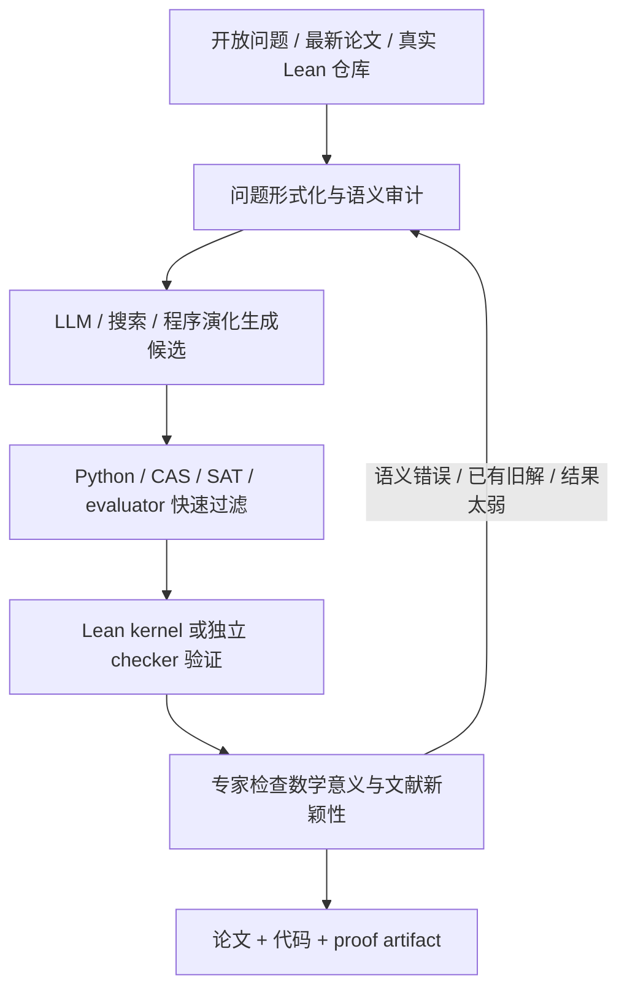

# AI 数学进入开放问题时代了吗：ICM 2026 后的数据集、系统与真实进展

2026 年 7 月，ICM 在费城开会时，AI 已经不再只是数学大会外围的技术展示。Terence Tao 谈“AI 时代的数学”，Alex Kontorovich 谈数学的未来形态，会场还把 `Mathematics for AI` 和 `AI for Mathematics` 拆成两场方向相反的圆桌。

几乎在同一时间，另一批更具体的变化正在发生：开放猜想被整理成 Lean 语句，真实数学仓库中的 `sorry` 被做成动态 benchmark，最新 arXiv 论文里的 lemma 被实时抽取，模型也开始参与形成研究预印本。

但“AI 已经开始解决开放猜想”这句话仍然需要拆开。它可能指奥赛题，可能指把已知证明翻译成 Lean，可能指找到一个更好的有限构造，也可能真的指一个此前未知的数学结论。这四件事的证据强度完全不同。

<!-- truncate -->

:::tip 一句话结论
2025–2026 年最重要的变化，不是某个模型单枪匹马攻克了重大猜想，而是数学研究开始形成一条可运行的机器协作链：**开放问题库 → 候选生成 → 程序或 Lean 验证 → 专家检查语义与新颖性 → 论文和 proof artifact**。真实的新结果已经出现，但截至 2026-07-31，仍没有可信证据表明 AI 已自主完成里程碑级开放猜想。
:::

:::info 调研口径
本文只重点覆盖 2025–2026 年，动态数据核验日为 2026-07-31。较早工作只在解释技术谱系时出现。项目规模、排行榜和“已解决”状态会继续变化，文中均尽量标明这是论文结果、项目方自报、程序验证还是人类确认。
:::

## 先看 ICM 2026：数学界真正接受了什么

[ICM 2026](https://www.icm2026.org/) 于 7 月 23–30 日举行。它没有发布一个统一的“ICM 数学数据集”，但[科学议程](https://www.icm2026.org/event/ac193975-5d24-4628-8c30-ddb23de19a8b/Invited-Lectures-and-Panel)把 AI 数学放进了主会场：

- **Terence Tao，Mathematics in the Age of AI**：讨论 AI、形式验证和大规模协作，同时明确说当前工具对单个极难数学问题仍只有有限影响。
- **Alex Kontorovich，The Shape of Math to Come**：把计算工具、形式验证和 AI 放到未来研究数学的整体图景里。
- **Geordie Williamson，AI and Humanity's Long Conversation**：讨论机器如何进入人类长期积累的数学对话。
- **Mathematics for AI / AI for Mathematics**：前者关注数学如何支撑 AI，后者关注 AI 如何改变证明、论文、审稿和数学训练。
- 另有 AI in College Math Education、AI-assisted asymptotic analysis、Lean 生态等活动。

[Simons Foundation 会前综述](https://www.simonsfoundation.org/2026/05/04/ai-will-be-top-of-mind-at-icm-maths-biggest-conference/)很好地概括了会场氛围：数学家已经把 AI 当作研究工作流的一部分，但并没有形成“模型即将自动解决所有难题”的共识。

ICM 2026 真正确认的是两件事：

1. **形式化证明成为公共基础设施**。自然语言模型可以提出想法，Lean、Coq、Isabelle 一类系统负责压缩信任边界。
2. **研究过程本身成为数据**。不只收集题目和答案，还收集引理、失败轨迹、讨论链、验证器、仓库依赖和人类修订。

## 一张图看懂 2026 年的 AI 数学链条



这条链里任何一环缺失，新闻标题都可能夸大结果：

- 只有自然语言答案，可能是“看起来像证明”。
- 只有 Lean 通过，可能形式化错了原问题。
- 只有程序找到更好构造，只证明了一个方向的界。
- 只有数据库写着 `Open`，可能旧文献早已解决。
- 只有模型厂商给出 benchmark 分数，可能计算预算和提示条件完全不同。

## 证据阶梯：不要把五类成果写成一类

| 层级 | 典型成果 | 证明了什么 | 没有证明什么 |
|---|---|---|---|
| L0：训练与静态 benchmark | MATH、miniF2F、旧竞赛题 | 模型能复现已知解或完成形式证明 | 不代表发现新数学 |
| L1：最新竞赛和动态评测 | IMO 2025、USAMO 2026、MathArena | 降低数据污染，测新题泛化 | 题目仍有人类命题和可解性保证 |
| L2：已知研究定理的形式化 | RLMEval、论文到 Lean | 能处理研究级定义、依赖和 proof engineering | 定理和证明思路可能已经存在 |
| L3：新构造、新界、反例 | AlphaEvolve、FrontierMath constructions | 产生此前未知、可验证的数学对象 | 不一定解决完整猜想，也不一定证明最优 |
| L4：真正开放问题的新证明 | Erdős #1196/#1217、部分 Aletheia 案例 | 对此前未知问题形成新结果 | 仍要审查人类参与、文献新颖性和同行评议 |
| L5：重大或里程碑猜想 | 尚无可信案例 | 会改变一个成熟领域的核心理论 | 不能用普通“open problem solved”标题替代 |

Google DeepMind 在 [Towards Autonomous Mathematics Research](https://arxiv.org/abs/2602.10177) 中也提出了类似的自主性和新颖性分级。其 2026 年公开总结明确表示，目前没有 Level 3“重大进展”或 Level 4“里程碑突破”。

## 第一类数据：直接面向开放问题和研究数学

### Formal Conjectures：当前最重要的开放猜想形式化库

[Formal Conjectures](https://github.com/google-deepmind/formal-conjectures) 把数学开放问题写成 Lean 4，并通过持续集成保持可编译。[2026 年论文](https://arxiv.org/abs/2605.13171)的快照包含：

- 2,615 个形式陈述；
- 1,029 个研究级开放猜想；
- 836 个研究级已解决问题；
- 来源包括 Erdős Problems、Kourovka Notebook、开放量子问题、定理网站和研究者贡献；
- 两个冻结的 100 题子集，用于比较 theorem prover。

它的价值不只是规模，而是把“开放”状态、来源、Lean 版本和修复历史一起保存。论文基线在开放子集上几乎没有进展，说明奥赛榜接近饱和并不等于研究数学已经饱和。

它也暴露了形式化最核心的风险：**kernel 能证明 Lean statement，但不能保证这个 statement 忠实表达了原始自然语言猜想。** 项目已经修复过数百个形式化问题，因此任何声称“解决”的提交都还需要数学家做 semantic audit。

### FrontierMath Open Problems：公开题目，付费验证器

[FrontierMath: Open Problems](https://epoch.ai/frontiermath/open-problems) 不是原来那套封闭测试题的简单升级，而是一批真正未解决、数学家已经认真尝试过、又能设计自动 verifier 的问题。

[项目说明](https://epoch.ai/frontiermath/open-problems/about)列出的设计原则是：

- 真正开放而不是把答案暂时藏起来；
- 专业数学家判断其有研究价值；
- 候选答案可由程序验证；
- 模型不能访问 verifier，只能提交答案；
- 验证器访问需要付费，以支持命题者和人工核查。

项目 2026 年 1 月启动时有 14 题；截至 7 月 31 日主页显示 15 题，其中 2 题标记为 solved。它比传统 benchmark 更接近“开放问题竞技场”，但验证器不完全开放也意味着外部团队无法完整复现排行榜。

### ACD Repo：把猜想生成变成机器学习任务

[Machine Learning meets Algebraic Combinatorics](https://arxiv.org/abs/2503.06366) 在 ICML 2025 获 oral，并发布了 [Algebraic Combinatorics Dataset Repository](https://github.com/pnnl/ML4AlgComb)。仓库包含 9 组数据，部分规模达到约一千万样本，覆盖：

- cluster algebra 与 quiver mutation；
- Kazhdan–Lusztig polynomial；
- Schubert 结构常数；
- Littlewood–Richardson coefficient；
- braid、link 和相关组合结构。

它与“给一道题，输出答案”的 benchmark 不同：模型从大量有限对象中寻找规律，再由数学家提炼猜想。2026 年 1 月，作者还专门修复过可能让模型利用数据捷径的问题。对 conjecture generation 来说，这种数据卫生比单纯扩大样本量更重要。

### AlphaEvolve 的 67 题仓库：开放 evaluator，不开放核心 Agent

[Mathematical Exploration and Discovery at Scale](https://arxiv.org/abs/2511.02864) 把 67 个分析、组合、几何、数论问题交给 AlphaEvolve 式程序演化，并发布了[问题仓库](https://github.com/google-deepmind/alphaevolve_repository_of_problems)：

- 问题说明和机器提示；
- evaluator 与 verifier；
- 最终候选程序；
- 部分 Colab 复验；
- 包括成功、失败和“模型钻 evaluator 空子”的记录。

核心 AlphaEvolve 服务没有开放，因此仓库更适合作为问题和验证器集合，而不是完整可复现系统。它仍是研究“可执行数学发现”最好的公开材料之一。

### ResearchMath-14K：研究级训练材料，不是答案库

[ResearchMath-14K](https://huggingface.co/datasets/amphora/ResearchMath-14k) 收集 14,056 个研究级问题，并生成约 22 万条开放模型推理轨迹。[论文](https://arxiv.org/abs/2605.28003)把它定位为 research reasoning 数据，而不是全都带可靠标准答案的评测集。

作者自己分析了几个重要失败模式：

- 模型拒绝回答；
- 给出貌似合理但错误的长论证；
- 伪造论文、作者和引用；
- 不知道某个问题是否已经在文献中解决。

因此它适合训练研究行为、研究 verifier 或失败检测，不应该直接被当成“14K 个已解决研究题”。

### LemmaBench 与 CrowdMath：开始记录研究过程

[LemmaBench](https://github.com/ahayat16/LemmaBench) 动态抓取最新 arXiv 数学论文中的 lemma，让模型只看前置定义和结果、尝试重建证明。它没有固定规模，因此比静态 benchmark 更抗污染。[论文](https://arxiv.org/abs/2602.24173)报告前沿模型自然语言 Pass@1 约为 10–15%。局限是主要依赖 LLM judge，而不是 proof assistant 内核。

[CrowdMath](https://github.com/text-machine-lab/crowdmath) 则从 MIT PRIMES/AoPS 2016–2025 的开放问题讨论中整理出 164 条专家标注的“进展链”。每条链可能包含：

- 一个部分引理；
- 一个被指出的错误；
- 修正后的构造；
- 反例或更弱命题；
- 最终形成论文的路径。

它测的不是模型能否一次答对，而是模型能否理解“现在已经推进到哪里、下一步缺什么”。这比普通问答更接近真实协作数学。

## 第二类数据：形式化证明从奥赛转向真实项目

| 数据集 / 基准 | 2025–2026 规模 | 它真正测什么 | 主要限制 |
|---|---:|---|---|
| [SorryDB](https://github.com/SorryDB/SorryDB) | 78 个真实 Lean 项目；`SorryDB-2601` 有 2,601 个 `sorry`，论文抽取 1,000 个评测 | 在完整仓库依赖中补真实证明；数据库每晚更新 | `sorry` 难度和质量不均，项目版本持续变化 |
| [RLMEval](https://github.com/augustepoiroux/RLMEval) | 6 个 Lean Blueprint 研究项目，613 个定理 | 研究级 theorem proving 与 autoformalization | 领域和项目数量仍有限 |
| [FATE](https://github.com/frenzymath/FATE) | FATE-M 150、H 100、X 100 | 本科到博士资格考试以上的代数证明 | 发布数月后已有模型大幅提升，需要持续升级 |
| [Discover and Prove](https://github.com/liuchengwucn/discover-and-prove) | MiniF2F 244 题中 197 题 Hard；FIMO 149 题中 70 题 Hard | 先发现待求答案，再给 Lean 证明 | 仍以竞赛题为主，完整 pipeline 很重 |
| [CAM-Bench](https://github.com/optpku/CAM-Bench) | 778 个练习、1,000 个 proof targets | 优化、数值线代、数值分析和应用数学 | 2026 新基准，独立复现仍少 |
| [MA-ProofBench](https://huggingface.co/datasets/openbmb/MA-ProofBench) | 200 个分析定理，本科 100、博士资格级 100 | 测度积分、复分析、泛函分析等高阶 Lean 证明 | 规模小，但难度高 |
| [CombiBench](https://github.com/MoonshotAI/CombiBench) | 100 个 Lean 组合题 | 组合构造和长证明 | 仍是已知竞赛题，不是开放研究题 |
| [MathArena](https://github.com/eth-sri/matharena) | 持续加入 AIME/USAMO 2026、IMO/Putnam 2025、ArXivMath、BrokenArxiv | 最新竞赛、最新论文定理、错误命题识别 | 部分自然语言证明依赖人工或模型评分 |

### SorryDB 为什么比 miniF2F 更有价值

miniF2F 曾经是最常用的 Lean 数学榜，但到 2026 年已经接近饱和。它的问题短、环境统一，且长期出现在公开训练数据中。

[SorryDB 论文](https://arxiv.org/abs/2603.02668)的基准来自现实 GitHub 项目：概率论、分析、组合、形式逻辑、数学物理、密码学和代码验证。模型不只要看当前 goal，还要理解项目 import、局部定义和依赖版本。

论文的 1,000 题快照上：

- 最佳单个 agentic 方法约 30.3%；
- 多种互补方法联合约 35.7%；
- 通用 coding agent、专用 Lean 模型和普通 tactic 各自能解不同题。

这揭示了一个重要反差：在 miniF2F 上接近 100% 的系统，进入真实仓库后仍会大量失败。

### Discover and Prove 修复了“答案写在定理里”的泄漏

许多形式化竞赛题会写成：

```lean
example : requested_value = 42 := by
  ...
```

模型并没有发现答案 `42`，只是在证明一个已经把答案暴露出来的命题。[Discover and Prove](https://aclanthology.org/2026.acl-long.3/)增加 Hard Mode，把待求值从 statement 中拿掉，系统必须先在自然语言或程序空间中找到结果，再生成可检查证明。

这个设计对“AI 是否会做数学发现”比普通 proof completion 更有区分度。

### 新基准正在快速老化

FATE 论文发布时，最强系统在 FATE-H 只有 3%，FATE-X 为 0%。到 2026 年 7 月，[Leanstral 1.5](https://mistral.ai/news/leanstral-1-5/)已经自报 FATE-H 87%、FATE-X 34%。

这不一定表示抽象代数在几个月里“被解决了”。它也可能来自：

- 更高的 test-time token 预算；
- agent 可以反复调用 Lean；
- 更好的 mathlib retrieval；
- benchmark 公开后进入训练或调参流程；
- 不同 Pass@k 口径。

因此未来更值得建设 SorryDB、MathArena 和 LemmaBench 这类持续更新、带时间戳和版本的评测。

## 第三类数据：训练语料不能冒充评测结果

两个 2025 年的重要开放训练项目经常被和 benchmark 混在一起：

### MegaMath

[MegaMath](https://github.com/LLM360/MegaMath) 提供约 370B tokens 的数学预训练语料，其中超过 80B 是合成数据，包含网页、数学代码、问答和文码混合数据。它适合预训练和持续训练，但其中的问题或文本不应再直接用于声称“模型在未见问题上取得突破”。

### OpenMathReasoning

[OpenMathReasoning](https://huggingface.co/datasets/nvidia/OpenMathReasoning)包含：

- 约 306K 个独立数学问题；
- 3.2M 条长 chain-of-thought；
- 1.7M 条 tool-integrated reasoning 轨迹；
- 566K 条 solution-selection 样本。

它是 2025 年最重要的开放数学后训练集之一，也帮助开放模型在 AIMO 一类竞赛上取得进展。但它证明的是数据工程有效，不是训练后模型已经创造新定理。

:::warning 数据卫生底线
训练集、开发集、评测集和“真正未解问题”必须分开。最稳妥的组合是：MegaMath/OpenMathReasoning 用于训练，冻结版 Formal Conjectures 和 FATE 用于可比评测，SorryDB/MathArena 的未来时间切片用于抗污染评测，真正开放问题还要单独做专家与文献审查。
:::

## 2025–2026 主流系统：谁开放，谁只是发布结果

| 系统 | 核心路线与代表结果 | 可复现性判断 |
|---|---|---|
| [Aletheia](https://arxiv.org/abs/2602.10177) | Gemini Deep Think 驱动的生成、验证、修订与搜索 Agent；扫描 700 个 Erdős 问题并参与研究预印本 | 模型闭源；[提示和输出](https://github.com/google-deepmind/superhuman/tree/main/aletheia)开放 |
| [Leanstral 1.5](https://mistral.ai/news/leanstral-1-5/) | 119B 总参数、6B 激活；厂商自报 miniF2F 100%、PutnamBench 587/672、FATE-H 87%、FATE-X 34% | [Apache-2.0 权重](https://huggingface.co/mistralai/Leanstral-1.5-119B-A6B)；高分使用很大的测试时预算 |
| [Goedel-Architect](https://arxiv.org/abs/2606.06468) | 先生成依赖图式 blueprint，再并行证明与全局修订；带自然语言引导时 PutnamBench 597/672 | 使用开放权重主干；论文称 pipeline 开源，但截至核验日未找到正式仓库链接 |
| [Numina-Lean-Agent](https://github.com/project-numina/numina-lean-agent) | 通用 coding agent 接 Lean、Leandex 和讨论工具；项目报告完成 Putnam 2025 全 12 题及论文级形式化 | Agent 代码 MIT；依赖 Claude、Gemini、OpenAI 等闭源 API |
| [Aristotle](https://arxiv.org/abs/2510.01346) | 非形式推理、Lean proof search 与专用几何组件组合，达到 IMO 2025 金牌等价成绩 | 核心闭源，有 [API](https://aristotle.harmonic.fun/)；[IMO proof artifact](https://github.com/harmonic-ai/IMO2025)和部分工具开放 |
| [Seed-Prover 1.5](https://github.com/ByteDance-Seed/Seed-Prover) | Lean 反馈、引理分解和 agentic RL；项目自报 PutnamBench 约 88%、Putnam 2025 11/12 | 论文和 proof artifact 开放，完整训练系统和权重开放程度有限 |
| [Goedel-Prover-V2](https://github.com/Goedel-LM/Goedel-Prover-V2) | 8B/32B 开放模型，scaffolded synthesis 与 Lean 自纠错 | Apache-2.0；模型、代码、数据较完整，是实用开放基线 |
| [DeepSeek-Prover-V2](https://github.com/deepseek-ai/DeepSeek-Prover-V2) | 7B/671B，递归子目标分解后强化学习，并发布 ProverBench | 模型和数据开放，受 DeepSeek Model License 约束；已不是 2026 最新成绩 |
| [STP](https://github.com/kfdong/STP) | “猜想者—证明者”自博弈，自动生成 Lean 命题和证明 | 代码、模型和数据开放；其 conjecture 主要是训练用合成命题，不等于研究开放猜想 |
| [AlphaEvolve](https://arxiv.org/abs/2506.13131) | LLM 生成程序，evaluator 评分，进化搜索改进构造、算法和界 | 核心 Agent 闭源；问题、verifier 和大量输出开放 |

### Leanstral 和 Goedel-Architect 代表了新的性能来源

2026 年形式化证明的进步，不只是“模型记住更多 tactic”。高分系统通常同时使用：

- 自然语言证明或 proof sketch；
- mathlib 语义检索；
- 多轮 Lean compiler 反馈；
- 自动拆引理和依赖图；
- 并行采样与自纠错；
- 每题数十万到数百万 token 的 test-time compute。

因此必须同时报告 `Pass@k`、每次尝试 token、Lean 调用次数、是否给官方自然语言解、总成本和 Lean/mathlib 版本。只报一个百分比已经不能公平比较系统。

### 实用开放栈已经出现

如果要搭一个可复现的研究原型，而不是只调用商业网页，可以组合：

- [mathlib4](https://github.com/leanprover-community/mathlib4)：形式化数学公共库；
- [Leanstral 1.5](https://huggingface.co/mistralai/Leanstral-1.5-119B-A6B) 或 [Goedel-Prover-V2](https://github.com/Goedel-LM/Goedel-Prover-V2)：开放 proof model；
- [Numina-Lean-Agent](https://github.com/project-numina/numina-lean-agent) 或 [AxProverBase](https://github.com/Axiomatic-AI/ax-prover-base)：agent scaffolding；
- [Kimina Lean Server](https://github.com/project-numina/kimina-lean-server)：批量编译和验证；
- [Leandex](https://leandex.projectnumina.ai/)：mathlib 语义检索；
- [SorryDB](https://github.com/SorryDB/SorryDB)：真实仓库评测；
- [Formal Conjectures](https://github.com/google-deepmind/formal-conjectures)：开放问题池。

这套栈仍不能自动判断一个结果是否“有数学价值”或“文献中从未出现”，但至少能把 proof correctness 的大部分工作交给小型可信内核。

## 逐案核查：哪些开放问题真的有新结果

### 强证据：Erdős #1196 与 #1217

[Primitive sets and von Mangoldt chains](https://arxiv.org/abs/2605.00301)解决了两个 1966 年提出的 Erdős–Sárközy–Szemerédi 猜想：Erdős #1196 和 #1217。

论文披露得相当具体：

- 定理 1.1 的初始证明来自一次 GPT-5.4 Pro 自主运行；
- 另一主定理由类似运行得到；
- 人类作者检查、重写和扩展了最终论文；
- 当前 [Erdos1196 Lean 仓库](https://github.com/plby/Erdos1196)已经形式化论文的顶层结果。

这里同时具备“原问题此前开放、AI 给出关键初始论证、人类完成数学审查、机器可检查 artifact”四层证据，是目前最强的 AI 辅助开放问题案例之一。

仍需保留两个限定：

1. 截至 7 月 31 日它仍是 arXiv preliminary version，不等于已完成同行评议。
2. 同文给出 Erdős primitive set conjecture #164 的新短证明，但该猜想此前已经由 Jared Duker Lichtman 解决，不能把短证明写成首次解决。

### 中强证据：Aletheia 扫描 700 个 Erdős 问题

[Semi-Autonomous Mathematics Discovery with Gemini](https://arxiv.org/abs/2601.22401)对 [Erdős Problems](https://www.erdosproblems.com/) 中 700 个标记为 `Open` 的问题做半自动扫描。

预印本摘要报告处理了 13 个：

- 8 个其实在既有文献中已有答案；
- 5 个是“看起来新颖”的自主解。

DeepMind 后续公开总结更保守地突出 4 个自主开放问题结果，包括 Erdős-1051。另有：

- [Eigenweights for arithmetic Hirzebruch Proportionality](https://arxiv.org/abs/2601.23245)，记录 Agent 对 arithmetic geometry 计算的贡献；
- [Irrationality of rapidly converging series](https://arxiv.org/abs/2601.21442)，原始问题由 Aletheia 自主解答，推广部分来自人机协作；
- [Lower bounds for multivariate independence polynomials](https://arxiv.org/abs/2602.02450)，关键技术步骤由研究 Agent 辅助获得。

这些是实质研究材料，但“5 个看起来新颖”和后续“4 个被重点确认”之间的变化也说明：开放状态与 novelty 会在专家复核中继续收缩。

### 一个已确认、一个仍应保守表述：FrontierMath Open

截至核验日，FrontierMath Open Problems 首页有两个 solved 标记。

#### Ramsey-style Hypergraphs

[Ramsey-style Hypergraphs](https://epoch.ai/frontiermath/open-problems/ramsey-hypergraphs)最初由 GPT-5.4 Pro 给出方案，问题贡献者 Will Brian 确认，页面称计划整理投稿，并把数学价值评为“moderately interesting”。随后多种前沿模型也在部分采样中找到了相同方向。

这是一个相对扎实的真实开放问题结果，但仍不是领域级重大猜想。

#### 2-adic Absolute Galois Group

[2-adic Absolute Galois Group](https://epoch.ai/frontiermath/open-problems/q2-absolute-galois)的 Claude Fable 5、GPT-5.5 Pro 输出被程序 verifier 接受。页面同时明确说，验证器只提供很强证据，不能替代完整证明；人类仍在检查。

因此它应该被写成“高可信候选解”或“verifier-accepted solution”，而不是无条件宣布定理已经完全证明。

### 真实改进，但不是重大猜想突破：AlphaEvolve

DeepMind 最初的 [AlphaEvolve 公告](https://deepmind.google/discover/blog/alphaevolve-a-gemini-powered-coding-agent-for-designing-advanced-algorithms/)称，在 50 多个数学开放问题中，约 20% 改进了当时的最好结果。后续 67 题研究确实找到新的 packing、Kakeya/Nikodym 构造、算法和界。

但 Terence Tao 在[项目说明](https://terrytao.wordpress.com/2025/11/05/mathematical-exploration-and-discovery-at-scale/)中同样写得很清楚：

- 对 Sidorenko、Sendov、Crouzeix 等著名猜想，没有找到更强反例；
- 没有推翻重大开放猜想；
- 许多结果只改进一侧界，不能证明构造最优；
- 程序可能利用 evaluator 漏洞得到无意义高分。

最准确的描述是：AlphaEvolve 已能规模化产生**新构造和更好界**，但还不是通用定理发现器。

### 形式验证贡献，不是首次发现：Sidon / perfect difference set 案例

[Forbidden Sidon subsets of perfect difference sets](https://arxiv.org/abs/2510.19804)中，ChatGPT 生成了六千多行 Lean 形式证明。这看起来像一个“AI 反驳长期猜想”的故事，但人类后来发现 Marshall Hall 早在 1947 年已经给出过另一反例，时间早于 Erdős 正式提出该猜想。

AI 的突出贡献是大规模形式验证，而不是首次发现数学事实。更值得警惕的是，模型的文献检索也没发现 Hall 的旧结果。

这个案例说明：

> proof checker 解决 correctness，文献审查解决 novelty；两者任何一个都不能替代另一个。

## 为什么目前的成功集中在组合与可执行数学

成功案例有一个共同特征：**verification leverage 很高**。找到答案很难，但检查答案相对便宜。

典型场景包括：

- 有限图、超图和组合设计；
- packing、covering、矩阵乘法和调度算法；
- 明确整数、序列或多项式的构造；
- 可以写成 SAT、MIP、动态规划或短程序的优化问题；
- 能由 Lean 在已有 mathlib 基础上检查的代数、数论和不等式。

更困难的仍然是：

- 需要建立多年新定义和理论框架的领域；
- 缺少成熟形式库的高阶几何与分析；
- 很难写出自动 verifier 的结构性问题；
- 证明正确但无法自动确认“这是有价值的新视角”；
- 需要搜索海量旧文献才能确认 novelty 的问题。

所以“开放问题”这个标签本身并不能预测难度。一个数据库中长期无人注意、但有短证明的问题，可能比一个已知最佳构造只差一点的优化题更容易被模型推进。

## 看排行榜时必须同时问的七个问题

1. **题目何时公开？** 是否早于模型训练截止时间？
2. **statement 是否泄漏答案？** 模型是在 discover，还是只在 prove？
3. **Pass@k 是多少？** 一次尝试还是数千次采样？
4. **每题预算是多少？** token、Lean calls、wall-clock 和美元成本是多少？
5. **是否给了官方自然语言解？** 有 proof sketch 和从零解决不是一回事。
6. **谁验证结果？** Lean kernel、独立 checker、程序 verifier、LLM judge 还是人类？
7. **谁确认 novelty？** 数据库状态、作者自查、领域专家还是同行评议？

PutnamBench 本身还出现过 660、658、672 等不同统计口径；Lean 和 mathlib 版本也会改变可用定理。没有版本、预算和 proof artifact 的百分比，长期价值很低。

## 如果现在要做项目，应该从哪里开始

### 路线一：做开放猜想发现

推荐组合：

1. 从 Formal Conjectures、ACD Repo 或 Erdős Problems 选问题；
2. 优先选择有便宜 verifier 的组合、数论或优化问题；
3. 让模型生成程序、构造、反例和中间引理，而不是直接写一篇长证明；
4. 用 Python、CAS、SAT/MIP 做第一层过滤；
5. 把稳定 conjecture 和 proof obligation 写入 Lean；
6. 由领域专家检查语义和文献新颖性；
7. 发布 prompt、日志、失败候选、verifier、最终代码和 proof artifact。

### 路线二：做形式化证明 Agent

推荐组合：

- 训练：OpenMathReasoning、MegaMath、公开 Lean 数据；
- 模型：Leanstral 1.5、Goedel-Prover-V2；
- Agent：Numina-Lean-Agent 或 AxProverBase；
- 编译：Kimina Lean Server；
- 检索：Leandex；
- 静态评测：FATE、MA-ProofBench、Discover and Prove；
- 真实评测：SorryDB 的未来快照；
- 开放研究：Formal Conjectures 冻结子集。

不要只在 miniF2F 上继续做小数点后的提升。

### 路线三：做持续观测网站

最值得监控的入口是：

- [Formal Conjectures docs](https://google-deepmind.github.io/formal-conjectures/)
- [FrontierMath Open Problems](https://epoch.ai/frontiermath/open-problems)
- [MathArena](https://matharena.ai/)
- [Erdős Problems](https://www.erdosproblems.com/)
- [SorryDB nightly data](https://github.com/SorryDB/sorrydb-data)
- [Aletheia outputs](https://github.com/google-deepmind/superhuman/tree/main/aletheia)
- [AlphaEvolve problem repository](https://github.com/google-deepmind/alphaevolve_repository_of_problems)
- [Lean mathlib](https://github.com/leanprover-community/mathlib4)

一个有价值的 dashboard 不应只显示“解了多少题”，还应显示：状态变化、验证方式、模型版本、计算预算、是否公开 artifact、是否经专家确认、是否有同行评议。

## 2025–2026 时间线

| 时间 | 事件 | 意义 |
|---|---|---|
| 2025-03 | ACD Repo / ML meets Algebraic Combinatorics | 猜想生成进入标准 ML 数据集形态 |
| 2025-04 至 08 | DeepSeek-Prover-V2、Goedel-Prover-V2、Kimina 等 | 开放 Lean 模型快速扩张 |
| 2025-05 | CombiBench、MathArena、Formal Conjectures 仓库 | 从旧奥赛题转向新题和研究问题 |
| 2025-07 | Gemini Deep Think、Aristotle、Seed-Prover 报告 IMO 金牌级结果 | 自然语言与形式化两条路线同时跨过奥赛门槛 |
| 2025-11 至 12 | AlphaEvolve 67 题研究、FATE、Seed-Prover 1.5 | 新构造、抽象代数和 agentic proof 成为重点 |
| 2026-01 至 02 | Aletheia、Erdős 700 题扫描、LemmaBench、FrontierMath Open | 研究级数学和真正开放问题进入公开评测 |
| 2026-03 | SorryDB | 真实 Lean 仓库取代人工小题作为主要压力测试 |
| 2026-05 至 06 | Formal Conjectures 论文、ResearchMath-14K、CAM、MA-ProofBench、CrowdMath、Goedel-Architect | 数据、Agent、研究过程与高阶数学基准同时成熟 |
| 2026-07 | Leanstral 1.5、Erdős #1196 Lean 形式化、ICM 2026 | 开放权重 proof model 与人机研究成果进入数学界主议程 |

## 最终判断

如果把“AI 解开放猜想”理解为“无需人类、无需验证器、直接攻克黎曼猜想或 P vs NP”，答案仍然是否定的。

如果把它理解为“AI 已能在精心选择、可验证的研究问题上提出新构造、新引理甚至完整初始证明，并与人类共同形成论文”，答案已经是肯定的。

当前最可靠的表述是：

- **奥赛级数学推理已经成为工程能力，而不是终点。**
- **形式化 proof engineering 正在快速接近真实项目，但远未完全解决。**
- **新数学结果已经出现，主要集中在 verification leverage 高的窄领域。**
- **重大猜想和理论级创新仍没有可靠自主突破。**
- **未来竞争的核心不是谁写出最长的“证明”，而是谁能建立最可信的问题、验证、文献和审计闭环。**

这也与 ICM 2026 的信号一致：AI 正在改变数学家如何探索、协作和检查，而不是替代数学家对问题意义、证明结构和新颖性的最终判断。

## 核心论文与项目索引

### 开放问题与研究过程

- [Formal Conjectures: A Benchmark for the Next Generation of Mathematical Reasoning Models](https://arxiv.org/abs/2605.13171)
- [Towards Autonomous Mathematics Research](https://arxiv.org/abs/2602.10177)
- [Semi-Autonomous Mathematics Discovery with Gemini](https://arxiv.org/abs/2601.22401)
- [Mathematical Exploration and Discovery at Scale](https://arxiv.org/abs/2511.02864)
- [Machine Learning meets Algebraic Combinatorics](https://arxiv.org/abs/2503.06366)
- [ResearchMath-14K](https://arxiv.org/abs/2605.28003)
- [LemmaBench](https://arxiv.org/abs/2602.24173)
- [CrowdMath](https://arxiv.org/abs/2606.06526)

### 形式化证明与评测

- [SorryDB](https://arxiv.org/abs/2603.02668)
- [RLMEval](https://arxiv.org/abs/2510.25427)
- [FATE](https://arxiv.org/abs/2511.02872)
- [Discover and Prove](https://aclanthology.org/2026.acl-long.3/)
- [CAM-Bench](https://arxiv.org/abs/2605.17255)
- [MA-ProofBench](https://arxiv.org/abs/2606.13782)
- [CombiBench](https://arxiv.org/abs/2505.03171)
- [Beyond Benchmarks: MathArena](https://arxiv.org/abs/2605.00674)

### 真实结果与案例审计

- [Primitive sets and von Mangoldt chains](https://arxiv.org/abs/2605.00301)
- [Erdos1196 Lean formalization](https://github.com/plby/Erdos1196)
- [Eigenweights for arithmetic Hirzebruch Proportionality](https://arxiv.org/abs/2601.23245)
- [Irrationality of rapidly converging series](https://arxiv.org/abs/2601.21442)
- [Lower bounds for multivariate independence polynomials](https://arxiv.org/abs/2602.02450)
- [Forbidden Sidon subsets of perfect difference sets](https://arxiv.org/abs/2510.19804)
