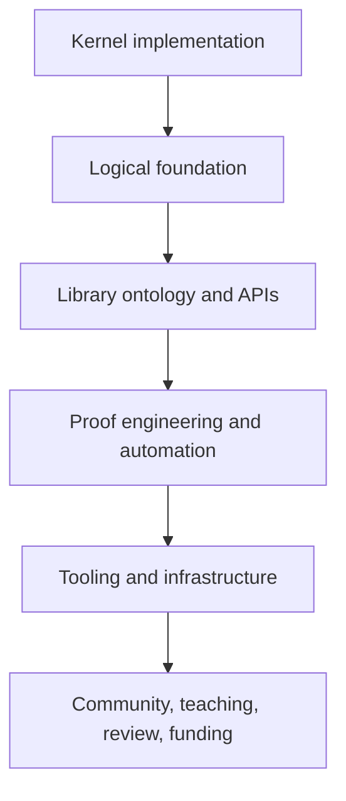
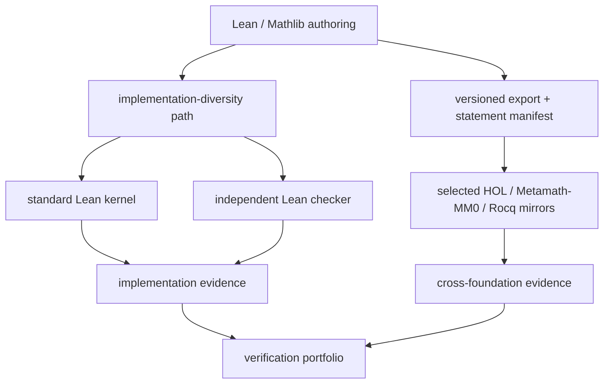

# 我们真的被 Lean 锁定了吗？Mathlib、soundness 与证明可移植性

2026 年 7 月 30 日，Timothy Chow 在 MathOverflow 发了一个标题很直接的问题：[*Are we stuck with Lean?*](https://mathoverflow.net/questions/513742/are-we-stuck-with-lean)

截至本文抓取页面时，这个刚出现一天的问题已有 39 票、超过 1.6 万次浏览、6 个回答。它紧跟在 Lean 的 Collatz-themed soundness 事件之后：一份 AI 参与生成的 artifact 同时穿过了当时的 Lean kernel 与旧版 nanoda。于是一个工程事故很快被推到更大的问题上：

> Are there any prospects for any organization to seriously support an alternative to Lean?

如果只按标题回答，讨论很容易变成两种口号：Lean 已经赢了，接受现实；或者 Lean 有过 soundness bug，应该换成 Metamath。六个回答和几十条评论真正说明的是：**“被 Lean 锁定”不是一个 yes/no 问题，因为这里至少有六种不同的锁。**

:::tip 先给结论
短期内，数学形式化确实在 Mathlib、工具链和共同体层面形成了很高的 switching cost；但这不等于 Lean 的 kernel、逻辑基础或今天的实现会永远不可替代。比“全部迁移”更现实的目标，是降低不可逆性：让重要证明能被独立 checker 复核、能跨系统重建，让替代生态得到长期工程投入。
:::

:::info 关于来源
MathOverflow 讨论仍在变化。本文中的票数、浏览量和回答数是 2026 年 7 月 31 日的快照；观点均按作者归属，不代表 MathOverflow、Lean 社区或本文的共同结论。
:::

<!-- truncate -->

## 原问题并不是“要不要抛弃 Lean”

Chow 回忆，三年前他曾把那一刻称作一个 “[Dumey microsecond](https://en.wikipedia.org/wiki/Arnold_Dumey)”：数学界或许还来得及把资源投向自己选择的 proof assistant。当时 Mathlib 刚完成 Lean 3 到 Lean 4 的迁移，Lean FRO 刚成立，Terry Tao 也还没有自学 Lean。今天，Lean 看起来远比当时不可避免。

他提出 Metamath 作为具体候选，理由有两类：

1. [Metamath Zero](https://arxiv.org/abs/1910.10703) 提供了一条不同的高 assurance 路线；
2. Metamath 可以使用 set-theoretic foundation，为 propositions-as-types 之外保留一条路线。

但他也明确说自己不是 Metamath 的利益相关者，更没有主张“ditch Lean”。他的实际诉求是：数学界是否会从一个**可用、持续维护、基础不同的第二生态**中受益，以及谁愿意为此提供 institutional support。

这句话里混着四个本该分开的问题：

- **Assurance**：怎样相信 AI 或其他 adversarial source 生成的 proof artifact？
- **Foundation**：dependent type theory、HOL、set theory 各自适合承担什么？
- **Ecosystem**：谁能提供 Mathlib、editor、package manager、教程与 review？
- **Institution**：谁能连续多年支付开发、维护和基础设施成本？

如果不拆开，kernel bug 会被误写成 foundational inconsistency，缺少 VS Code 插件会被误写成逻辑不够好，社区网络效应又会被误写成几位名人的偶然选择。

## 六个回答，其实在回答六种“锁定”

| 回答 | 主要视角 | 对问题的贡献 |
|---|---|---|
| [Jacques Carette](https://mathoverflow.net/a/513746) | 社会学 | 工具选择有趋势、声望与协调效应，主导地位不是自然定律 |
| [James E Hanson](https://mathoverflow.net/a/513774) | 资金与 UX | 好用的 proof assistant 需要全职团队、服务、教程和 library design，不只需要好 kernel |
| [Lawrence Paulson](https://mathoverflow.net/a/513761) | 逻辑与工程 | 真正的替代路线也许是 Isabelle/HOL，而不是另一套 dependent type theory 或直接使用 set theory |
| [Ricky](https://mathoverflow.net/a/513745) | 实用主义 | Lean 目前是高 confidence、可理解性与可用性的折中；多元化值得，但成本很高 |
| [Jason Rute](https://mathoverflow.net/a/513762) | AI 与转换 | AI 可能先让跨系统翻译和重要证明的多重复核变得可行 |
| [Stanley Yao Xiao](https://mathoverflow.net/a/513743) | 经济史 | 领先产品可能被后来者取代，但市场类比低估了 formal library 的不可移植性 |

### “工具是社会现象”，但 proof assistant 不是浏览器

Carette 的回答只有几段，最重要的一句是：

> The tools we use are a *sociological* phenomenon.

这提醒我们，Lean 的位置不是纯粹跑分结果。Buzzard、Scholze、Tao、Hales 的可见度，Mathlib contributor 的响应速度，课程、Zulip 与合作项目都会制造正反馈。

Chow 后来在[评论](https://mathoverflow.net/questions/513742/are-we-stuck-with-lean#comment1341125_513742)中转述 Kevin Buzzard 的解释：他选择 Lean 的一个重要原因，是 Lean community 当时是唯一愿意支持“形式化全部本科数学”这个项目的社区。这个细节比“名人带动 herd”更有解释力——社区对一个具体 contributor 说 yes，本身就是产品能力。

但评论很快指出 Internet Explorer 类比的边界。换浏览器不会让你失去过去写过的网页；换 foundation 却可能让 definitions、theorem statements 与整个 library graph 都无法直接复用。Emil Jeřábek 的评论把它说得很具体：你不能把“Ford proof assistant”换成“Toyota proof assistant”，同时保留此前形式化的所有证明。

更接近的类比或许是 HTML、JavaScript 或 LaTeX：实现和工具可以更换，但共享 artifact、接口与社会惯例会长期留下。

### 真正昂贵的是持续的工程组织

Hanson 的回答把标题改写成一个更可操作的问题：这里的 “seriously” 是指有组织愿意做，还是指能吸引足够多数学家形成 viable alternative？

前者已经存在。Rocq、Isabelle、Mizar、Metamath 都不是业余玩具。后者要求的东西要多得多：

- 安装和升级不要折磨用户；
- editor response、autocomplete 与 diagnostics 足够好；
- 有教程、文档和 onboarding；
- library 的 definitions 与 APIs 适合实际数学；
- CI、package hosting、web editor 和 review queue 有人维护；
- 破坏性 migration 时有能力带着生态一起走。

Hanson 因此认为，一个有竞争力的新项目更像 [Lean FRO](https://lean-lang.org/fro/about/)、CoCalc 或 Overleaf，而不是给几位 academic researchers 发几笔短期 grant。

他还提出了一个很重要的架构分离：数学家使用的 frontend 可以从数学 UX “top down” 设计，最终再编译到一个极小、Metamath-like 的 checking backend。用户看到什么，与 root of trust 用什么逻辑，不必是同一个决策。

### 替代 dependent types，不等于默认选择 set theory

Paulson 直接把问题推广成：“Are we stuck with dependent types?” 他批评 proof objects、kernel complexity 和 dependent equality 带来的成本，并建议读者看看 Isabelle/HOL 与 [Alexandria project](https://www.cl.cam.ac.uk/~lp15/Grants/Alexandria/)。

但这条讨论里最值得保留的材料来自他在问题下的评论。作为 Isabelle/ZF 的作者，Paulson 明确说自己**不建议**把 set theory 当作日常形式化数学的默认环境：types 能简化 notation、排除荒谬项；很多数学用 Isabelle/HOL 的 simple type theory 已经足够，只有数学本身涉及 ordinals 等对象时才加载 ZFC library。

与此同时，Jean Abou Samra 也反对“dependent types 必然需要大 kernel”的定论：toy MLTT 可以很小，proof-irrelevant proposition 与 weak type theory 仍有未充分探索的设计空间。

因此，这里的合理结论不是 “DTT bad, ZFC good”，而是：**proof assistant 的 design space 远未收敛，而今天主流实现的复杂度不等于逻辑路线的理论下界。**

### Lean 的 practical compromise

Mathlib maintainer Ricky 的回答最接近日常使用者的判断：Lean 不是唯一实践选择，也绝不完美；但对很多人，它目前确实更好用，benefit 超过 drawback。

他还把 AI proof verification 分成两个目标：只需要一个 oracle，还是想理解 proof？Lean 的价值之一，是当 proof 没有偏离 Mathlib idiom 太远时，人仍有机会理解它，同时获得很高但非绝对的 confidence。

这个回答也纠正了“没有组织认真支持 alternatives”的说法。Rocq 已获得 Inria 的长期支持。缺失的不是 seriousness 本身，而是 Lean 目前在 pure-math mind share、library coordination 与 contributor growth 上形成的组合优势。

### AI 最可能先改变翻译，而不是重造一切

Rute 给出了一条不要求选出唯一赢家的路线：为特别重要的证明，在 Lean、HOL 和 Metamath 等不同 foundations 中保留可复核版本。

他认为，AI 可能很快擅长把 formal mathematics 从一种系统翻译到另一种系统。即使 symbolic conversion 生成的代码难看，它仍可能适合 machine checking；如果追求可维护性，再让模型做 target-idiomatic reconstruction。

这比“从空白开始在第二个系统重证全部 Mathlib”现实得多。它把投资单位从整套生态改成：

- 基础 definitions 的对应关系；
- 高价值 theorem 的 statement mapping；
- landmark proof 的独立重建；
- 能持续运行的 cross-check pipeline。

### 市场会带来后来者吗？

Xiao 用汽车、搜索引擎和电动车说明先发者常被取代。评论指出一个事实错误：Lean 根本不是 proof assistant 的 first mover；它相对较晚出现，强调 usability 与 setup 正是后来居上的原因之一。

这个回答仍触及一个真实问题：谁为“更好但免费”的数学基础设施付费？传统 consumer-software 市场未必会自动产生答案。潜在资金可能来自 research infrastructure、philanthropy、government strategy 或需要可靠 formal reasoning 的 AI/technology companies。

市场可能带来竞争者，但 formal mathematics 的 switching cost 使“产品更好自然获胜”远不像浏览器或汽车那么简单。

## 我们到底被什么锁住了

Julia M. Himmel 在[评论](https://mathoverflow.net/questions/513742/are-we-stuck-with-lean#comment1341000_513742)里提醒：proof assistant 不只是 kernel 和 mathematical library，还包括 incremental elaborator、tactics、typeclasses、linting、language server、package manager、documentation 与 compiler。

把这条提醒和六组观点放在一起，可以得到一个六层模型：

| 层与切换成本 | 被固定的东西 | 可行的减锁方式 |
|---|---|---|
| Kernel implementation（低—中） | checker 行为、bugs、binary 与版本 | independent kernels、conformance tests、version pin |
| Logical foundation（高） | universes、inductives、equality、axioms | formal specification、受限片段翻译、跨 foundation replay |
| Library ontology（很高） | definitions、statement shapes、instances、APIs | aligned core libraries、schema 与 statement mapping |
| Proof engineering（中—高） | tactics、automation、idioms、proof terms | AI translation、target-side reconstruction、proof exchange |
| Tooling（高） | editor、package manager、docs、build、CI | 全职工程、开放协议、可复现环境 |
| Community/institution（很高） | maintainers、review、课程、协作、资金 | 长期组织、plural funding、共享 benchmarks |

这个表解释了两件看似矛盾的事：

1. **更换 Lean kernel 并没有想象中困难。** 同一份 export 可以交给独立 checker；nanoda 就是例子。
2. **更换 Lean/Mathlib 生态比更换 kernel 困难得多。** 最贵的是大家已经共同接受的 definitions、APIs、review norms 与协作网络。

所以“Lean lock-in”不是一块石头。kernel 层可以今天就多元化；foundation 和 library 层需要多年映射；community 层不能靠 transpiler 搬运。

## 最近的 soundness bug 改变了什么

本轮 MathOverflow 讨论的直接导火索，是我们此前详细复盘的 [Lean Conjecture soundness 事件](/blog/lean-conjecture-soundness-bug-collatz-comparator-nanoda)。那份 Collatz 外衣下的 artifact 同时组合了 Lean nested-inductive 漏检与旧版 nanoda 的另一处 projection bug。

事件真正改变的是 threat model：

- AI-authored proof 必须按 adversarial artifact 处理；
- checker、toolchain、config 和 artifact 都必须 versioned；
- 一套实现是一个 single failure point；
- 绿色 build 不是脱离版本和信任链的永久证书。

但它没有证明：

- Lean 的 idealized type theory 本身不一致；
- set-theoretic checker 不会有 implementation bug；
- dependent type theory 必然需要 Lean 当前这套 kernel architecture；
- 换掉整个 ecosystem 比增加 independent verification 更便宜；
- LLM 已被证实自主发现并主动利用了公开漏洞。

社区的实际响应也不是迁移：Lean 修复 kernel，nanoda 修复自身漏洞，[Comparator](/blog/lean-comparator-trust-boundary-guide) 开启 external checking，LeanEval 强制 standard kernel 与 [nanoda](/blog/nanoda-lean-external-kernel-guide) 同时接受。

这覆盖的是 kernel-implementation layer。它不能替代长期 foundation pluralism，却说明**提升 assurance 并不要求先复制 Mathlib**。

## Metamath 与 MM0 为什么仍然重要

[Metamath](https://us.metamath.org/) 的官方说明强调几件与 Lean 很不同的事：

- language specification 很小，axioms 由各 database 定义；
- proof 写出每一步，而不是在验证时重新运行 `simp` 或 `auto`；
- 有多种语言的独立 verifier；
- discovery 与 verification 分离，目标之一是长期归档。

这使它很适合作为“一个 proof 到底依赖哪些 primitive steps”的极简参照系。

[Metamath Zero](https://arxiv.org/abs/1910.10703) 又向前走了一步。Mario Carneiro 将其描述为追求 logic 与 implementation simplicity、支持其他 proof language 的双向 translation，并希望最终把 verifier 自身一路验证到 executable binary 的 root of trust。

这是很强的 assurance story。但它没有自动回答另一组问题：数学家愿不愿意在它的 frontend 里工作？category theory 是否好写？editor feedback、search、package management、documentation 和 review workflow 谁来维护？

换句话说，MM0 可以成为一条优秀的 checking backend，而不必要求每位数学家把它当作日常 authoring environment。Hanson 的 top-down 设想与 MM0 并不冲突：**丰富、typeful、符合数学习惯的 frontend，完全可以向更小、甚至不同 foundation 的 proof format 编译。**

这也是为什么“foundation 之争”和“UX 之争”不应该绑定销售。

## Alternatives 已经存在，缺少的是“可比较”

把问题理解成“Lean 之外有没有 serious proof assistant”，答案显然是有。

### Rocq

[Rocq](https://rocq-prover.org/about) 已有四十多年历史，提供 Gallina、interactive proof、相对小的 certification kernel、program extraction、package ecosystem 与长期 research lineage。[Rocq Consortium](https://rocq-prover.org/consortium) 由 Inria 托管，以 membership、donation 与 support subscription 为维护和工程资源提供制度入口。

### Isabelle

[Isabelle](https://isabelle.in.tum.de/) 是 generic proof assistant，Isabelle/HOL 拥有独立的 formalization tradition、PIDE、jEdit/VSCode 环境和 [Archive of Formal Proofs](https://www.isa-afp.org/)。它不是“没人维护的理论备选”，而是另一套成熟实践。

### Mizar

[Mizar](https://mizar.uwb.edu.pl/) 有五十年左右的历史、持续发布的 Mizar system 和 Mizar Mathematical Library。它证明了接近数学 prose 的 authoring tradition 可以长期存在，但其 tooling、贡献流程与当下 Lean 社区的协作方式不同。

### Metamath

Metamath Proof Explorer 从 ZFC axioms 开始，官方页面列出四万余 proof，并有十余种 verifier。它的 verification surface 极简，但交互式 authoring、automation 与现代 pure-math API 不是 Mathlib 的等价替身。

因此，真正的问题不是 alternative 是否存在，甚至也不是有没有机构支持。问题是能否同时具备：

- pure mathematics 所需 library coverage；
- 足够顺滑的 daily UX；
- 持续 review 与 migration 能力；
- 能让协作者聚到同一处的 mind share。

“认真存在”和“可与 Lean 当前协调点比较”之间，还有很长一段工程与社会距离。

## AI 能复制代码行，不能直接复制 library

Rute 的回答提到，一个 AI-authored Lean project 已达到 120 万行，而 Mathlib 大约 250 万行。这个数量级很有启发，但 line count 不是 library quality 的代理。

[Mathlib statistics](https://leanprover-community.github.io/mathlib_stats.html) 在本文写作时列出：

- 134,859 个 definitions；
- 283,710 个 theorems；
- 772 名 contributors。

更关键的证据来自 [Mathlib Initiative](https://mathlib-initiative.org/about/) 对自身任务的描述：PR 会等待 review，new contributors 遇到 documentation gap，ecosystem updates 需要协调。它提供 professional editorial support、infrastructure development 与 ecosystem coordination，正是因为 volunteer code generation 不足以维持当前规模。

AI 很可能降低这些成本：

- routine declaration 和局部 proof obligation；
- 对应 lemma 搜索；
- naming/API adapter；
- 跨系统的初稿翻译；
- 在第二个 checker 中重建 proof。

但它不会自动消除这些成本：

- 什么 definitions 应当 canonical；
- 两个 statement 是否表达同一数学命题；
- 如何避免重复、冲突和 API fragmentation；
- provenance、license 与 review accountability；
- source/target library 更新后的持续 migration；
- documentation、teaching 与 governance。

生成 100 万行代码是 throughput。Mathlib 的 moat 是长期形成的 ontology、reviewed interfaces、discoverability 与一群能够协商 breaking change 的人。

因此，AI 可能先让**核心库和 landmark theorems 的跨系统 mirror**变得经济，再让完整第二个 Mathlib 变得经济。

## “Proof portability”其实有五个等级

人们说“把 Lean proof 翻译到另一系统”时，可能在说完全不同的事情。

### 1. 翻译 surface syntax 与 tactics

这是最像 programming-language transpilation 的一层。AI 可以把 `simp` 风格重写成目标系统的 automation，但成功编译只说明目标系统接受某个结果，不保证 formal statement 与原 statement 语义相同。

### 2. 同 foundation 家族内交换 theory packages

[OpenTheory](https://www.gilith.com/opentheory/) 的目标，是在 HOL Light、HOL4、ProofPower 等 higher-order logic prover 之间共享 specifications 与 proofs；Isabelle 也有 read interface。共同 foundation 和相近 primitive concepts 大幅降低了 mapping 成本。

这同时说明：可移植性不是幻想，但越接近共同逻辑 core，越容易做。

### 3. 编译到 common logical framework

[Dedukti](https://github.com/Deducteam/Dedukti) 是 λΠ-calculus modulo rewriting 的 type checker。不同逻辑可以通过 encoding 进入同一 framework，再由一个小 checker 验证。

这里的 trust 从原系统转移到 encoding、translation 与 Dedukti checker。它是桥，不是“任何两边天然语义相同”的魔法。

### 4. 导出到 root-of-trust format

MM0 的设计明确包含与其他 proof languages 的 translation。这样的格式可以把复杂 authoring system 的最终 artifact 交给更小 verifier，但仍要说明 source logic 如何映射到目标 primitive rules。

### 5. 跨 foundation 独立重建

最强的多样性，是让同一 informal theorem 在 Lean、HOL、Metamath 或 Rocq 中分别形成 statement 和 proof。它最能降低 common-mode failure，也最昂贵，因为 statement equivalence 本身需要审查。

这五层不应混称为 “export”。把同一 byte stream 交给两个 checker，解决 implementation diversity；在不同 foundations 中重建同一数学结论，解决 specification diversity。两者都重要，但不是同一种保证。

## 认真支持 alternative，需要资助什么

现有组织已经给出很清楚的成本清单。

[Lean FRO](https://lean-lang.org/fro/about/) 是一个 nonprofit focused research organization，有明确的五年 mission 和 researcher/engineer team，目标包括 scalability、usability、documentation 与 proof automation。

[Mathlib Initiative](https://mathlib-initiative.org/about/) 则把资源放在 editorial support、infrastructure 和 ecosystem coordination，避免 proof projects 被 review bottleneck 卡住。

[Rocq Consortium](https://rocq-prover.org/consortium) 由 Inria 托管，让 stakeholder 通过 donation、membership 和 support subscription 参与维护，并影响一部分 engineering resource 的配置。

这些案例说明，一个 serious alternative 需要的不是只有：

- 一篇新的 foundation paper；
- 一个漂亮的 kernel prototype；
- 一次把现有 library 批量翻译过去的 grant。

它还需要多年运营：release engineering、editor integration、package hosting、docs、reviewers、migration、community support 与稳定治理。

更好的 institutional question 也许不是“谁来选出 Lean 的对手”，而是：

> 谁愿意长期资助形式化数学的可移植性、独立复核和第二生态，使未来的选择不必从零开始？

## 不要发迁移令，做一个组合投资

如果目标是避免单一生态成为永久的 trust 和 coordination bottleneck，可以同时做五件事。

### 1. 保留今天最好用的 frontend

在 Lean/Mathlib 最有效的地方继续使用它。Pluralism 不需要先让当前用户承担一次大迁移。

### 2. 多元化 trusted backend

资助 nanoda、Lean4Lean、small checkers、formal kernel specifications 和 Lean Kernel Arena 一类 adversarial conformance tests。让一个 kernel bug 不再等于所有 verification 都失效。

### 3. 为高价值结果维护跨 foundation 版本

不必镜像全部 Mathlib。先选 foundational libraries、著名定理和 AI-generated high-stakes proofs，在 HOL、Metamath/MM0、Rocq 或另一 genuinely independent system 中重建。

### 4. 把替代系统的 UX 当基础设施

长期资助 editor、package manager、documentation、web environment、CI、search 和 maintainer time。没有这些，kernel 再优雅也无法形成数学共同体。

### 5. 建立可移植性的公共层

维护 statement manifests、definition mappings、proof provenance、shared benchmarks 和 export specifications。即使未来没有发生迁移，这些资产也能改进 audit、reproducibility 和 cross-checking。

这不是要求所有 proof 同时走五条路径。它是一种分级策略：普通开发保持低成本；重要程度、对抗性和长期保存价值越高，独立路径越多。

## 那么，我们被 Lean 锁定了吗？

**短期、在生态层面：是。** Mathlib 的 definitions、APIs、automation、review culture 与 contributor network 形成了真实 switching cost。不能靠一段 transpiler 或一笔短 grant 重建。

**长期、在技术和社会层面：不是。** Rocq、Isabelle、Mizar、Metamath 已证明其他传统可以长期存在；OpenTheory、Dedukti、MM0 和 independent kernels 说明 proof artifact 也并非注定只能活在一个 implementation 里。

**但“找到赢家替换 Lean”是错的问题。** 更有价值的目标，是降低不可逆性：如果 kernel 改写、foundation 改变、社区迁移或技术风潮反转，重要数学仍能被理解、复核和带走。

Lean 不必输，proof-assistant pluralism 才能赢。

## 主要来源

- [Timothy Chow, *Are we stuck with Lean?*](https://mathoverflow.net/questions/513742/are-we-stuck-with-lean)
- [MathOverflow: *Should we trust AI-generated formal proofs in Lean 4?*](https://mathoverflow.net/questions/513540/should-we-trust-ai-generated-formal-proofs-in-lean-4)
- [Metamath 官方介绍](https://us.metamath.org/)
- [Metamath Zero paper](https://arxiv.org/abs/1910.10703)
- [Lean FRO](https://lean-lang.org/fro/about/)
- [Mathlib Initiative](https://mathlib-initiative.org/about/)
- [Rocq overview](https://rocq-prover.org/about) 与 [Rocq Consortium](https://rocq-prover.org/consortium)
- [Isabelle](https://isabelle.in.tum.de/) 与 [Archive of Formal Proofs](https://www.isa-afp.org/)
- [Mizar](https://mizar.uwb.edu.pl/)
- [OpenTheory](https://www.gilith.com/opentheory/)
- [Dedukti](https://github.com/Deducteam/Dedukti)
- [Mathlib statistics](https://leanprover-community.github.io/mathlib_stats.html)
