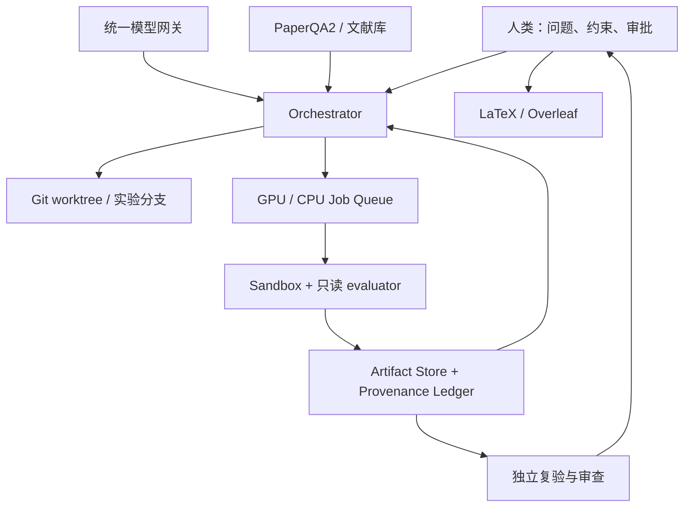

# AutoResearch 工程底座：runtime、benchmark、provenance 与独立审查

> 本文是 AutoResearch 系列专题 C。项目能力与仓库状态以 2026-07-31 的本地 checkout 为准；“项目提供”“论文报告”与本文的工程建议分开表述。生态定义与项目选型见[全景总览](/blog/autoresearch-open-source-landscape)。

如果团队已经有模型网关、GPU 集群、代码仓库和 Overleaf，接入 AutoResearch 最危险的做法，是再引入一个包办检索、改码、实验、写作和审稿的“大 Agent”，然后把它的最终 PDF 当作完成证明。

更稳妥的做法是把 AutoResearch 当成一组可替换的控制面：Agent 可以提出动作，但不能同时控制实验环境、评价器、证据记录和最终裁决。系统真正的信任根不是某个模型，也不是某个项目，而是不可变的实验合同、可回放的 provenance、独立复验和人类签字。

<!-- truncate -->

## 先拆系统，再谈选哪个 Agent

一套可上线的 AutoResearch 底座至少应拆成五层：

| 层 | 负责什么 | 不能负责什么 |
|---|---|---|
| Orchestrator | 研究状态机、任务依赖、预算、审批和角色路由 | 直接伪装成实验结果 |
| Runtime / runner | worktree、容器、作业队列、超时、重试和恢复 | 修改只读 evaluator 与 test split |
| Artifact / provenance | 保存代码、配置、日志、指标、模型调用和文件哈希 | 用“总结”替代原始产物 |
| Benchmark / evaluator | 在固定协议下评分、复验和比较 | 宣判研究问题有价值或结论新颖 |
| Reviewer / governance | 查实验完整性、claim、引用、伦理与合规 | 与 executor 共用上下文后自我批准 |

文献检索是输入层，Overleaf 是发布协作层，两者都不应成为实验真相源。推荐的数据流如下：



这里最重要的箭头不是 `Agent -> GPU`，而是 `run -> artifact -> review`。没有这条证据链，再漂亮的自动化流程也只是一次难以复查的演示。

## Runtime 的目标不是“跑起来”，而是可替换、可恢复

2026 年的新项目已经开始把研究看成长期运行问题，而不是一次 prompt。

[ARIS](https://github.com/wanshuiyin/Auto-claude-code-research-in-sleep)把自己定义为 methodology 而非平台：核心工作流以 Markdown skills 组织，可接到 Claude Code、Codex 等执行器上；仓库还提供 experiment queue、Research Wiki、review trace、claim/citation audit 与 Overleaf sync。它最值得借鉴的不是某个默认模型，而是“执行、证据、审查分开”的 SOP：实验先审完整性，结果再映射到 claim，论文数字再回查原始结果，引用最后单独核验。需要注意，这些能力主要是工具链和项目自报证据；一次跨模型高分仍不能替代真实复验。

[DeepScientist](https://github.com/ResearAI/DeepScientist)采用 local-first、one quest per Git repository 的设计，用 branch、worktree、文件、artifact 和 memory 保存长期状态，并允许人随时暂停、接管再交还控制权。[EvoScientist](https://github.com/EvoScientist/EvoScientist)则提供 plan、research、code、debug、analyze、write 六类子 Agent，以及持久记忆、定时任务、多 provider 和多入口；其 Docker 路径可以把 shell 写入限制在显式挂载卷内。这两类“research studio / OS”适合观察运行态、管理长任务，但它们覆盖流程更广，不等于每个科研结论都经过独立验证。

[FAROS](https://github.com/OpenNSWM-Lab/FAROS)提出 Blueprint、Capability、Profile、Provider 四个抽象，方向上很适合把 workflow 与具体模型、工具解耦；但当前 `1.1.0-rc1` README 也明确列出尚无完整实验执行/评估 loop、完整 DAG 调度和成熟跨领域 provider 生态，本地 checkout 还未找到 LICENSE。因此它更适合作为 runtime blueprint，而不是现成的生产信任根。[Aviary](https://github.com/Future-House/aviary)的 `reset/step/reward/done` 环境接口则说明了另一条路线：先标准化 Agent 与环境的交互，再在相同环境上训练或比较不同 Agent。

无论选哪一个项目，runtime 都应对上层暴露稳定合同，而不是暴露一台可随意登录的 GPU 主机。一个 job spec 至少要固定代码 commit、容器 digest、数据版本、seed、资源、超时、网络策略、evaluator 版本和输出 schema；暂停、OOM 或 API 中断后可以从 checkpoint 恢复，但重试必须创建新的 `attempt_id`，不能覆盖第一次失败的日志。

## 文献层提供证据入口，不提供科研结论

[PaperQA2](https://github.com/Future-House/paper-qa)、[STORM](https://github.com/stanford-oval/storm)和[OpenScholar](https://github.com/AkariAsai/OpenScholar)经常被放进 AutoResearch 流程，但它们解决的是不同的知识问题：

| 组件 | 擅长什么 | 接入时要保留什么 |
|---|---|---|
| PaperQA2 | 科学文档 RAG、agentic query、页码引用、metadata 与 retraction check | 文档 ID、版本、页码、原文片段、查询与检索配置 |
| STORM / Co-STORM | 多视角提问、检索、outline、带引用长文和人机知识整理 | 搜索来源、访问时间、问答轨迹；官方明确其输出通常不是 publication-ready |
| OpenScholar | 科学检索、rerank、自反馈和 post-hoc citation attribution | 索引快照、reranker/generator 版本；完整 45M 论文、200M+ embeddings 索引资源很重 |

检索到真实论文，只能证明“文献存在”；metadata 正确，也不能证明“这篇论文支持当前句子”。因此文献层输出应进入 evidence inbox，而不是直接进入参考文献表。每条引用至少经过存在性、书目信息和上下文支撑三次检查；无法解析或暂时无法联网核验的来源应标为 `unverified` / `verify_pending`，保留但不能静默升级为已证实先验。

## 程序演化只是改码内核

[OpenEvolve](https://github.com/codelion/openevolve)用 MAP-Elites、islands、LLM mutation、evaluator 和 archive 搜索候选程序；[ShinkaEvolve](https://github.com/SakanaAI/ShinkaEvolve)同样维护程序种群和 archive，并支持本地或 Slurm 并行评估；[Darwin Gödel Machine](https://github.com/jennyzzt/dgm)更进一步，让 Agent 修改自身代码，再用 SWE-bench、Polyglot 等 coding benchmark 实证筛选改动。

这些项目适合做 `candidate generator`，不适合拥有整条责任链。生产接入时必须把可演化代码区、评价代码和最终复验环境物理分开：mutation worker 只能提交 patch；evaluator 在只读镜像中运行；进入 archive 的候选仍要在隐藏 split、多 seed 和干净 runner 上复验。尤其是会自改代码的系统，项目 README 本身也警告会执行不可信的模型生成代码。若它还能改 scorer、读取 held-out label 或接触宿主机凭证，所谓“演化”很可能只是 evaluator tampering。

## Benchmark 测到哪一层，结论就只能到哪一层

AutoResearch benchmark 并不是同一种考试：

| Benchmark | 任务与评分对象 | 能说明什么 | 不能说明什么 |
|---|---|---|---|
| [MLE-bench](https://github.com/openai/mle-bench) | 75 个 Kaggle competition，提交文件按隐藏切分评分 | ML engineering、资源内产出有效提交和相对竞赛表现 | 研究问题价值、论文新颖性、claim 是否克制 |
| [MLGym](https://github.com/facebookresearch/MLGym) | 13 个 CV/NLP/RL/game theory 等开放 AI research tasks，容器内记录 trajectory | Agent 能否提出、实现并迭代实验 | 跨领域泛化；项目仍标为 experimental，主体许可证为 CC BY-NC 4.0 |
| [MLAgentBench](https://github.com/snap-stanford/MLAgentBench) | 13 个端到端 ML experimentation tasks，以相对 starter baseline 的改进评估 | 在真实文件和算力环境中持续实验的能力 | 未见任务上的稳健性、长期原创研究能力 |
| [MLR-Bench](https://github.com/chchenhui/mlrbench) | 201 个 workshop research tasks，分 idea、proposal、experiment、writeup，并由 MLR-Judge 评审 | 开放式研究流程的分阶段表现 | LLM judge 与人类专家的一致性，以及结果是否可独立复现 |

MLE-bench 的官方建议本身就说明了比较协议的重要性：至少 3 个 seed，并报告运行时间和算力；完整 75 题成本很高，Lite split 才缩到 22 题。仓库还列出数据泄漏、切分和 grading 的已知问题，2026-04 起暂停接收 leaderboard 新提交以改进公平可比流程。Benchmark 不是静态真理，而是需要版本、污染检查和治理的工程系统。

因此，不应把所有能力压成一个总分。至少拆成五个 gates：任务完成率、独立 evaluator 分数、多 seed 复现率、claim-to-evidence 通过率、专家最终判断。模型、prompt、token/GPU 预算、网络权限、任务版本和失败 run 的计分方式只要不同，两个 leaderboard 数字就不应直接横比。

## Provenance：让每个数字都能倒着走回原始 run

最低可用的 provenance 不是一份聊天记录，而是两本相互引用的 ledger。

**Experiment ledger** 为每个 attempt 保存：研究假设与父实验、代码 commit/patch、数据与 split digest、容器与依赖 lock、模型和 prompt 版本、命令、seed、GPU/驱动、开始结束时间、token/美元/GPU-hour 预算、stdout/stderr、原始 metrics、artifact 哈希以及 accepted/rejected 原因。失败、超时和负结果同样追加，不能因“没用”而删除。

Ledger 还要记录实验之间的可比性边界。只要数据切分、evaluator、数值精度模式或主指标定义发生变化，就应开启新的 `protocol_version`；旧结果只能作为历史参考，不能继续计算同口径 delta 或混入同一排行榜。这样既能保留研究谱系，也能阻止 Agent 借协议漂移制造虚假提升。

**Claim ledger** 则把论文中的结论绑定到证据，而不是绑定到一段模型解释。例如：

```yaml
claim_id: C-07
text: "方法在固定协议下提升验证集指标"
supports:
  - run: exp-042/attempt-2
    artifact: metrics.json
    selector: $.aggregate.mean
scope: "dataset-v3, seeds=[1,2,3], A100-80GB"
status: replicated
review:
  experiment_integrity: pass
  statistical_check: pass
  paper_claim_audit: pass
```

论文表格和图最好从 ledger/artifact 自动生成；手工修改 LaTeX 中的数字应触发校验失败。Overleaf 可以接收已审草稿，但不能反向覆盖原始实验。一次 run 的合理状态机是 `planned -> running -> failed/candidate -> replicated/rejected -> approved`，而不是“指标更好 -> 直接写进摘要”。

## 独立审查不是“再问同一个 Agent 一遍”

ARIS 的 cross-model reviewer、fresh thread、experiment audit 和 paper claim audit 提供了可借鉴的实现，但工程上的独立性还需要更严格的边界：

1. reviewer 使用新会话，关键 gate 最好使用不同模型或不同执行栈；
2. reviewer 先看只读代码、manifest 和原始 artifact，不先看 executor 的成功叙事；
3. replication runner 在干净环境重跑，多 seed，并且不能复用 executor 可写目录；
4. evaluator、test split、guardrail metrics 与预算策略由人类或平台持有；
5. 最后分别审实验完整性、统计结论、claim 范围、引用支撑、伦理与数据许可。

跨模型只能降低部分相关性错误，不能自动创造独立性。两个模型如果看到同一份被污染的数据、同一个错误 evaluator 和同一种提示框架，仍会一起得出错误结论。反过来，reviewer 输出本身也会随模型版本变化，所以其模型、prompt、工具权限、完整 transcript 和输入哈希也要进入 provenance。Reviewer 的职责是发现阻断项和要求复验，不是用一个 8/10 分数给系统“洗白”。

## 接入现有模型、Git、GPU 与 Overleaf

已有基础设施的团队可以按以下合同组合，而不必整体替换技术栈：

1. **模型网关**：把 planner、coder、analyst、reviewer 做成带版本的角色路由；保存实际 provider/model、参数、prompt 和 tool trace，并为每轮设置 token 与费用上限。
2. **Git worktree**：每个 hypothesis/attempt 使用独立 worktree 和分支；只有通过复验的候选才能进入集成分支，失败分支保留可检索记录。
3. **GPU queue**：Agent 只能提交声明式 job spec，不能直接占满集群；平台限制并发、wall-clock、GPU-hour、重试次数、外网和挂载目录。
4. **隔离 evaluator**：评分器、held-out split 和 guardrail metrics 放在 Agent 不可写的位置；最终评估由独立 service account 执行。
5. **Artifact store**：采用 append-only run 目录或对象存储，上传后计算 hash；checkpoint 用于恢复，完成标记必须幂等，重试不得覆盖旧 attempt。
6. **Overleaf bridge**：只同步由 artifact 生成并通过 claim/citation gates 的草稿；token 由人配置且不进入 Agent 上下文，共享项目的 push 与投稿仍需人工确认。

预算也不能只有“最多花 100 美元”一个开关。至少同时限制迭代数、模型 token/费用、单 job 时长、GPU-hour、并发数、存储量和失败重试；触顶后状态应变成 `budget_exhausted` 并请求人类决策，而不是静默换模型、缩数据或改变 evaluator。

## 把安全策略和失败语义写进 runtime

AutoResearch 会持续执行不可信代码，安全边界不能只靠 prompt 中一句“不要做危险操作”。Runner 应默认使用非 root 容器、只读根文件系统和最小挂载，只给当前 worktree、临时缓存与 artifact 输出目录写权限；模型服务、对象存储和 GPU 队列的凭证应由短期 token broker 按 job 下发，SSH 私钥、云主密钥和 Overleaf token 不应进入容器。外网默认关闭；确需下载论文、模型或数据时，使用域名白名单、缓存代理和下载哈希，把网络输入也纳入 provenance。

依赖安装同样属于实验变量。动态 `pip install`、拉取未经 pin 的 Git HEAD 或直接执行远程脚本，都会让两次 run 得到不同环境。生产 runner 应从 lockfile 构建带 digest 的镜像；若 Agent 要增加依赖，应先生成可审 patch，再创建新镜像和新 attempt，而不是在运行中的容器里悄悄改变环境。对私有数据还要在 job spec 中声明数据分级、许可证、地域和可调用模型范围，并在 artifact 出库前扫描密钥、个人信息与受限样本。

恢复也必须区分“基础设施失败”和“科学失败”。API 5xx、节点掉线可以在同一实验合同下有限重试；OOM 后改 batch size、NaN 后改 optimizer、评估超时后缩小数据，已经改变了实验，必须生成新 attempt 和明确的 parent edge。Evaluator hash 变化、held-out 数据可见、artifact 缺失或 reviewer 无法验证时，应禁止结果晋级。探索阶段可以在某些审查服务不可用时继续收集候选，但从 `candidate` 升到 `replicated/approved` 必须 fail closed。

Watchdog 只负责发现心跳停止、资源失控或状态长期不更新，不能替系统判定实验成功，也不应无限自动重启有裁决含义的任务。平台需要全局 kill switch、每个 run 的可取消句柄和清晰的终止原因；被取消的 run 仍要写入 ledger。这样，“可以恢复”才不会退化成“无论发生什么都继续花钱”。

## 推荐落地顺序

- **P0：验证链路。** 用一个小仓库、一个主指标和一个 guardrail，跑通 `agent -> job -> result -> decision -> commit`，重点测试超时、失败和恢复，而不是追求 SOTA。
- **P1：建立复验。** 候选进入独立 runner，固定完整数据、多 seed；reviewer 只读原始产物，negative results 同样入 ledger。
- **P2：接文献与论文。** PaperQA2 等只负责 evidence inbox；从 artifact 自动生成图表，建立 claim ledger，再把已审 LaTeX 推到 Overleaf。
- **P3：比较端到端系统。** 在相同任务、模型、硬件、预算和网络策略下，比较完成率、可复现改进率、unsupported claim/citation rate、人工修复时间和总成本。

实验合同如何设计，可继续阅读[专题 A：可控实验闭环](/blog/autoresearch-experiment-loops)；为什么端到端论文管线仍需这些外部边界，见[专题 B：端到端 AI Scientist](/blog/ai-scientist-end-to-end)。

## 结论

AutoResearch 真正需要长期建设的，不是一个越来越会写论文的总控 Agent，而是一套允许 Agent 被替换、结果被重放、结论被挑战的工程制度。Runtime 负责让任务安全地活下去，benchmark 负责在有限合同内测量，provenance 负责让每个数字可追溯，独立审查负责阻止系统给自己发毕业证。

当每个 idea、patch、失败 run、指标、引用和 claim 都能被重新定位、重新执行和推翻时，AutoResearch 才从“自动生成科研内容”迈向“可治理的科研基础设施”。
