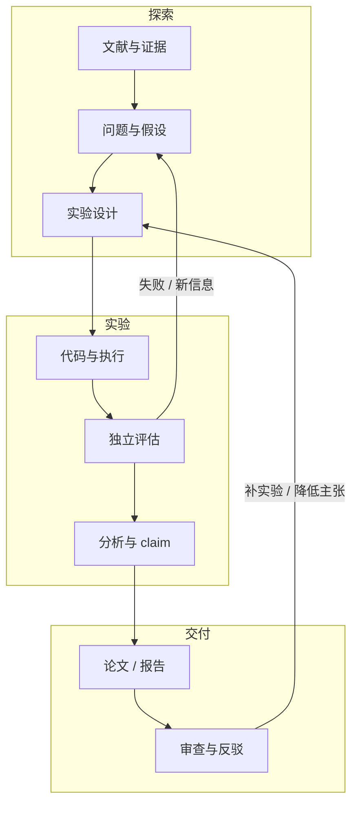
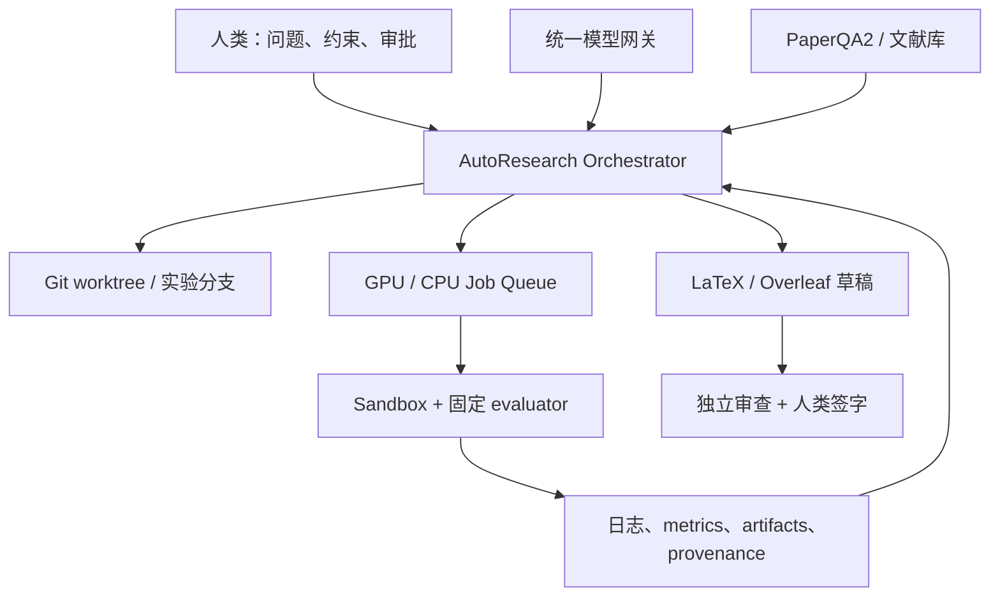

# AutoResearch 开源项目全景：35 个项目、7 层生态与选型路线

2026 年的 AutoResearch 已经不再是一个单独项目，也不只是“让模型搜论文并写综述”。它正在分成一整套技术栈：有人专做自动改代码和跑实验，有人把 literature、idea、experiment、paper 串成端到端 AI Scientist，也有人只做 runtime、benchmark、文献证据或独立审查。

这篇核验了 35 个本地 checkout，并对 16 个核心仓库做了 2026-07-31 同日 GitHub 动态快照。结论不是“选 star 最高的”，而是先判断你需要哪一种闭环。

<!-- truncate -->

:::tip 一句话结论
想尽快落地，先用 **`autoresearch` / AIDE / RD-Agent** 做可量化实验闭环，再接 **PaperQA2** 的文献证据和 **data-to-paper / ARIS** 的 provenance、论文与审查流程。端到端 AI Scientist 适合做评估对象，暂时不应成为无人值守的信任根。
:::

## 先定义：什么才算 AutoResearch

本文把 AutoResearch 定义为：

> 模型在有反馈的循环中持续推进真实科研工作，并把假设、代码、环境、实验、结果和结论沉淀为可复查产物。

一个系统至少要覆盖两个以上科研阶段，并且存在真实的“行动—观测—反馈—修正”闭环。只做网页检索、论文问答、综述或长报告的工具属于 Deep Research / 写作组件，不单独算完整 AutoResearch。

真正成熟的系统还要保存输入、模型与 prompt、代码 diff、依赖和硬件、随机种子、原始日志、指标、图表、引用、失败路径和人工审批记录。

## 2026 年已经形成七层生态

| 层 | 解决的问题 | 代表项目 |
|---|---|---|
| 指标驱动研究循环 | 改代码、跑固定实验、按指标保留或回退 | [autoresearch](https://github.com/karpathy/autoresearch)、[AIDE](https://github.com/WecoAI/aideml) |
| 端到端 AI Scientist | 从文献和 idea 走到实验、论文、review | [AI Scientist](https://github.com/SakanaAI/AI-Scientist)、[data-to-paper](https://github.com/Technion-Kishony-lab/data-to-paper)、[AutoResearchClaw](https://github.com/aiming-lab/AutoResearchClaw) |
| 实验与研发 Agent | 强调代码、实验执行、验证和报告 | [RD-Agent](https://github.com/microsoft/RD-Agent)、[AutoRA](https://github.com/AutoResearch/autora)、[Curie](https://github.com/Just-Curieous/Curie) |
| 程序演化 | 用 mutation、selection、archive 搜索代码空间 | [OpenEvolve](https://github.com/codelion/openevolve)、[ShinkaEvolve](https://github.com/SakanaAI/ShinkaEvolve)、[DGM](https://github.com/jennyzzt/dgm) |
| Runtime / Research OS | sandbox、资源、状态、恢复和 provenance | [FAROS](https://github.com/OpenNSWM-Lab/FAROS)、[DeepScientist](https://github.com/ResearAI/DeepScientist)、[EvoScientist](https://github.com/EvoScientist/EvoScientist) |
| Benchmark | 衡量 ML 工程、实验执行或科研任务 | [MLE-bench](https://github.com/openai/mle-bench)、[MLGym](https://github.com/facebookresearch/MLGym)、[MLAgentBench](https://github.com/snap-stanford/MLAgentBench) |
| 文献与写作组件 | 科学 RAG、引用、综述和长文 | [PaperQA2](https://github.com/Future-House/paper-qa)、[STORM](https://github.com/stanford-oval/storm)、[OpenScholar](https://github.com/AkariAsai/OpenScholar) |

这七层不能混为一谈。一个项目在 MLE-bench 上得分高，不代表它能写出可信论文；一个系统能生成带引用的 PDF，也不代表它真的执行了有效实验。

## 主流项目怎么选

下面的 stars 是 2026-07-31 快照，只表示影响力。成熟度评价的是“能否作为工程基线或组件复用”，不是它已经能独立完成可信科学发现。

| 项目 | Stars | 真正擅长什么 | 许可证状态 | 判断 |
|---|---:|---|---|---|
| [karpathy/autoresearch](https://github.com/karpathy/autoresearch) | 92,548 | 固定预算、固定指标的代码研究循环 | README 声明 MIT；无独立 LICENSE | **M3 窄闭环** |
| [AI Scientist v1](https://github.com/SakanaAI/AI-Scientist) | 14,322 | 模板内 idea → experiment → LaTeX → review | 受限自定义 license | **M2 / source-available** |
| [RD-Agent](https://github.com/microsoft/RD-Agent) | 14,084 | 数据驱动 R&D、Kaggle、量化、模型/因子 | MIT | **M3** |
| [ARIS](https://github.com/wanshuiyin/Auto-claude-code-research-in-sleep) | 14,049 | research skills、跨模型审查、实验与论文运维 | MIT | **M3 工具链 / M2 科研证据** |
| [AutoResearchClaw](https://github.com/aiming-lab/AutoResearchClaw) | 13,926 | 23-stage 端到端研究管线 | MIT | **M2 新锐** |
| [PaperQA2](https://github.com/Future-House/paper-qa) | 8,969 | 科学文献 RAG、页码引用、metadata/retraction check | Apache-2.0 | **M3 组件** |
| [AI Scientist v2](https://github.com/SakanaAI/AI-Scientist-v2) | 6,940 | 无模板 experiment manager + tree search | 受限自定义 license | **M2 / source-available** |
| [Agent Laboratory](https://github.com/SamuelSchmidgall/AgentLaboratory) | 5,777 | 文献—实验—报告多 Agent workflow | MIT | **M2** |
| [AI-Researcher](https://github.com/HKUDS/AI-Researcher) | 5,631 | 参考论文/idea 到 Docker 实验与论文 | **无 LICENSE** | 可研究，不可默认复用 |
| [EvoScientist](https://github.com/EvoScientist/EvoScientist) | 4,435 | 多 Agent、memory/skills、human-on-the-loop | Apache-2.0 | **M2 新锐** |
| [DeepScientist](https://github.com/ResearAI/DeepScientist) | 3,239 | one quest = one Git repo 的长时研究工作区 | Apache-2.0 | **M2 新锐** |
| [AIDE](https://github.com/WecoAI/aideml) | 1,454 | metric-guided code tree search | MIT | **M3 组件** |
| [data-to-paper](https://github.com/Technion-Kishony-lab/data-to-paper) | 813 | 原始数据到可追溯论文 | MIT | **M3 窄域** |
| [AutoSOTA](https://github.com/tsinghua-fib-lab/AutoSOTA) | 617 | 研究代码优化协议与 leaderboard | repo MIT；核心 CLI 不可审计 | 协议可学，内核慎用 |
| [Curie](https://github.com/Just-Curieous/Curie) | 367 | 假设、实验、诊断和自动报告 | Apache-2.0 | **M2** |
| [AutoRA](https://github.com/AutoResearch/autora) | 99 | 可程序化的闭环实证研究 | MIT | **M3** |

## 第一梯队为什么反而是“窄”系统

### autoresearch：把研究变成可审计合同

`karpathy/autoresearch` 不做文献和论文。它只允许 Agent 修改 `train.py`，固定 `prepare.py`、数据和 evaluator；每轮训练 5 分钟，以更低 `val_bpb` 为目标。失败或无提升就回退，有提升就 commit，所有结果进入 TSV ledger。

这套方法容易复用，因为四个边界非常清楚：

1. **editable surface**：Agent 到底能改什么；
2. **immutable evaluator**：Agent 不能改评价脚本和 test split；
3. **fixed budget**：每轮时间、算力和依赖固定；
4. **experiment memory**：失败也留下，避免重复探索。

它的限制也明确：单 NVIDIA GPU、单数据集、单 scalar reward，不能证明创新性、鲁棒性或科学意义。

更完整的机制比较见：[《别先做 AI Scientist：从 autoresearch、AIDE 到 RD-Agent 的可控实验闭环》](/blog/autoresearch-experiment-loops)。

### AIDE 与 RD-Agent：把“改码”扩展成研发

[AIDE](https://github.com/WecoAI/aideml) 让每份候选 Python 脚本成为 solution tree 节点，LLM 负责 draft、debug 和改进，用户定义的 metric 负责剪枝。它被 MLE-bench、AI Scientist-v2 等研究使用，更像可替换实验内核。

[RD-Agent](https://github.com/microsoft/RD-Agent) 则把 Research 与 Development 分开：R 提 idea，D 实现，并从真实数据和指标中继续迭代。它有 MIT、PyPI、CI、release、Docker 和可视化日志，已经覆盖量化、Kaggle、模型、因子和 LLM fine-tuning。

[AutoRA](https://github.com/AutoResearch/autora) 更特别：它不以 LLM 为中心，而是让 experimentalist、experiment runner、theorist 通过统一 state 循环更新条件、数据和模型。对行为科学、脑科学和其他实证任务，这比“自动改一个训练脚本”更接近真实实验设计。

## 端到端 AI Scientist：链条完整，不等于结果可信

### v1 有模板，所以更容易成功

[AI Scientist v1](https://github.com/SakanaAI/AI-Scientist) 在 NanoGPT、2D Diffusion、Grokking 等人工模板里生成 idea、改代码、跑实验、画图、写 LaTeX，再让 LLM 模拟 review。模板限制了自由度，也提高了成功概率。

### v2 自由度更高，官方承认成功率更低

[AI Scientist v2](https://github.com/SakanaAI/AI-Scientist-v2) 去掉模板，引入 experiment manager、best-first / progressive tree search 和多 worker。官方 README 同时明确：v2 成功率低于模板清晰的 v1，生成论文不保证更好，完整运行要数小时、约 20–25 美元，并需要 Linux + NVIDIA GPU/CUDA。

这个反差很关键：**AutoResearch 最难的不是把步骤串起来，而是自由度扩大后如何保持实验有效。**

### data-to-paper 更接近可核验论文

[data-to-paper](https://github.com/Technion-Kishony-lab/data-to-paper) 从原始数据出发，经假设、文献、分析代码、结果解释和逐段写作生成 manuscript。它最有价值的是 data chain：论文中的数值可以追到生成它的代码行；还支持 record/replay、rewind、成本跟踪和人工 review。

官方也把边界写得很诚实：当前更适合较简单的统计问题和数据集，系统不是 error-proof，必须由领域专家检查并负责。

端到端系统的详细比较、许可证和证据边界见：[《一条 Prompt 到一篇论文？AI Scientist、data-to-paper 与 2026 全链路系统》](/blog/ai-scientist-end-to-end)。

:::warning 公开源码不等于开源
- AI Scientist v1/v2 当前使用自定义受限 license，不再是普通 MIT/Apache。
- AI-Researcher 的本次 checkout 没有 LICENSE，默认不能自由复制、修改或部署。
- `autoresearch` 只在 README 写明 MIT，没有独立 LICENSE 文件。
- AutoSOTA 顶层 repo 是 MIT，但提交的 CLI tarball 使用混淆 JS 和 PyArmor 封装 Python，核心实现不可审计。
:::

## 文献、runtime 和 benchmark 都只是组件

- **PaperQA2** 能做科学 PDF/代码 RAG、页码引用和 metadata/retraction check，但不执行实验。
- **STORM** 能多视角提问、检索和写长文，官方明确不能直接产出 publication-ready 文章。
- **OpenScholar** 有科学检索、rerank、自反馈和 citation attribution，但完整 45M 论文索引资源很重。
- **OpenEvolve / ShinkaEvolve / DGM** 能演化代码，但必须由外部提供可靠 evaluator。
- **MLE-bench / MLGym / MLAgentBench** 能测执行任务，不证明研究问题有价值、结果跨 seed 复现、baseline 完整或论文 claim 成立。
- **FAROS** 目前还是 runtime RC，README 明确缺完整实验执行/评估 loop、DAG 调度和跨领域 provider 生态，且本次 checkout 没有 LICENSE。

如何把这些组件接到已有模型、GPU、Git 和 Overleaf，见：[《AutoResearch 工程底座：runtime、benchmark、provenance 与独立审查》](/blog/autoresearch-engineering-stack)。

## 已有基础设施时，推荐这样组合

这里 AutoResearch 只负责 orchestration，不替代模型服务、作业系统、代码仓库或论文协作平台。

### 模型层

- planner、coder、reviewer 设为可替换角色；
- reviewer 至少与 executor 分会话，关键 gate 最好跨模型；
- 保存模型版本、参数、prompt 和 tool trace；
- 每轮设置 token、时间和美元预算。

### 实验层

- 每个 run 使用隔离 worktree/container；
- evaluator、test split、预算和 guardrail metrics 对 Agent 只读；
- 多 seed 由 queue 管理，不让 Agent 直接占满集群；
- 记录镜像 digest、依赖 lock、GPU、驱动、seed 和 wall-clock。

### 论文层

- 每个 accepted experiment 对应 commit；
- 不删除失败和 negative result；
- 论文表格/数字从 artifacts 生成，不靠手抄；
- Overleaf 只接收草稿和已审 artifacts；
- 合并和投稿必须保留人工 approval gate。

## 推荐的试跑顺序

### P0：先跑最小闭环

用 `autoresearch` 或 AIDE 选一个小代码库：一个主指标、一个 guardrail、5–20 分钟单轮预算、20–50 轮上限、不可编辑 evaluator，以及完整 patch/log/cost ledger。

目标不是立刻做出新科学，而是确认 agent → job → result → decision → commit 能恢复、能审计。

### P1：增加独立复验

- 前半程可以用便宜 proxy metric；
- 候选进入独立 runner 做多 seed / 完整数据复验；
- reviewer 不看 executor 的解释，只读代码和原始结果；
- 无提升、crash 和 negative result 同样进入 ledger。

### P2：再接文献和论文

- 文献先经过 PaperQA2、OpenAlex、Crossref 等核验；
- 用 data-to-paper 的 data chain 或 ARIS 的 result-to-claim 思路连接结果与主张；
- 最后输出 LaTeX 到 Overleaf，由人类负责论证、伦理和署名。

### P3：最后评估端到端 Agent

在相同任务、模型、预算和硬件下比较 AI Scientist、AutoResearchClaw、Agent Laboratory：run completion rate、可复现提升率、独立 evaluator 通过率、unsupported claim/citation rate、人工修复时间和总成本。

## 选型结论

| 目标 | 第一选择 | 第二选择 |
|---|---|---|
| 单 GPU 夜间优化训练脚本 | autoresearch | AIDE |
| Kaggle / 数据驱动 ML 研发 | RD-Agent | AIDE / Curie |
| 可程序化闭环实证研究 | AutoRA | Curie |
| 原始数据到可核验论文草稿 | data-to-paper | Agent Laboratory |
| 研究完整端到端流程 | AI Scientist / AutoResearchClaw | Agent Laboratory |
| 给 coding agent 加研究 SOP 与审查 | ARIS | 自建 skills + independent reviewer |
| 科学文献证据与页码引用 | PaperQA2 | OpenScholar / STORM |
| 研究代码演化算法 | AIDE / OpenEvolve | ShinkaEvolve / DGM |

## 最低安全线

任何无人值守 AutoResearch 至少需要：

1. **不可变 evaluator**：Agent 不能改评价脚本、测试集或预算；
2. **guardrail metrics**：防止只优化主指标却破坏速度、稳定性、公平或数据边界；
3. **sandbox**：模型生成代码不得默认接触宿主机凭证和全网；
4. **provenance**：每个数字能回到原始结果、配置、seed、commit 和环境；
5. **独立复验**：最终结果在干净环境、多 seed、最好不同 runner 下复跑；
6. **claim gate**：论文关键结论必须有对应证据；
7. **人工责任**：选题、伦理、数据许可、结论、署名和提交由人类确认。

## 调研口径与来源

本次以项目官方仓库、LICENSE、论文、README、安装入口和示例为一手来源；awesome list 只用于发现候选。动态数据查询日是 2026-07-31，stars 后续会变化。项目宣称、论文实验、仓库可见事实和本文判断在正文中分开表达。

核心来源包括：

- [AI Scientist v1 paper](https://arxiv.org/abs/2408.06292) / [v2 paper](https://arxiv.org/abs/2504.08066)
- [RD-Agent technical report](https://arxiv.org/abs/2505.14738)
- [AutoRA JOSS paper](https://doi.org/10.21105/joss.06839)
- [Curie](https://arxiv.org/abs/2502.16069) / [EXP-Bench](https://arxiv.org/abs/2505.24785)
- [AIDE](https://arxiv.org/abs/2502.13138)
- [data-to-paper](https://arxiv.org/abs/2404.17605)
- [MLE-bench](https://arxiv.org/abs/2410.07095)
- [PaperQA2](https://arxiv.org/abs/2409.13740)

真正值得长期建设的，不是让模型写出一篇看起来像论文的 PDF，而是让每个 idea、实验、失败、数字、引用和结论都可回放、可质疑、可推翻。
