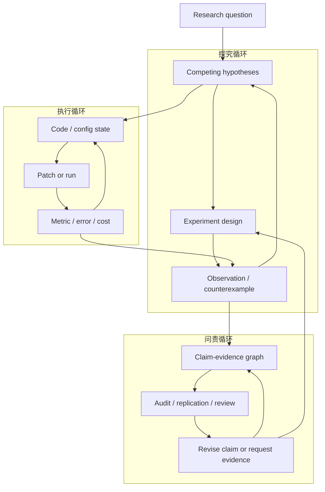
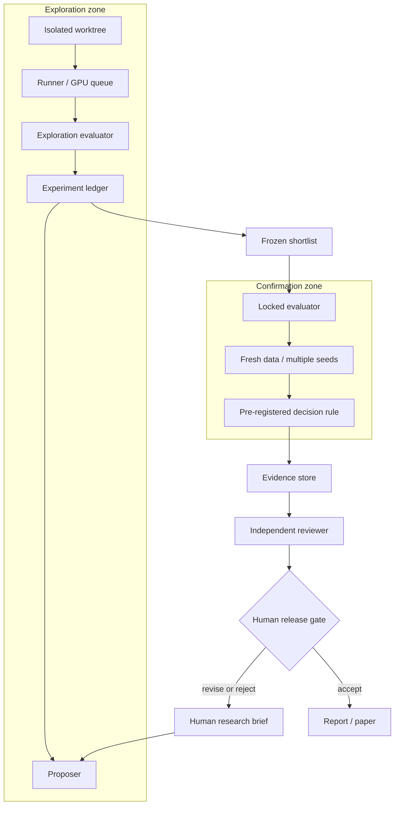

# AutoResearch 怎么落地：验证债务与可信闭环

AutoResearch 最容易被描述成一条越来越长的流水线：搜论文、提 idea、改代码、跑实验、画图、写 LaTeX，再让另一个模型 review。按照这个口径，覆盖阶段越多，系统就越接近“AI Scientist”。

但两个代表项目给出了相反信号。

[karpathy/autoresearch](https://github.com/karpathy/autoresearch) 只允许 Agent 修改一个 `train.py`，每轮训练 5 分钟，只看一个 `val_bpb`；[AI Scientist-v2](https://github.com/SakanaAI/AI-Scientist-v2) 则从主题、idea 和文献一路走到实验树、论文与 review。后者的行动空间大得多，官方 README 却明确提醒：开放探索的成功率低于模板更强的 v1，有强起始模板时也不一定生成更好的论文。

这不是“简单 Agent 比复杂 Agent 聪明”，而是两套系统承担了不同的**验证债务**：Agent 每多获得一种行动能力，系统就必须多证明一件事——它没有因为扩大搜索、重复看分数、选择性报告或自我审查而制造假改进。

<!-- truncate -->

:::tip 核心判断
AutoResearch 的能力边界不取决于它自动化了多少科研步骤，而取决于：**行动空间扩大以后，探索、确认、证据和发布是否仍由相互独立、可审计的权限主体控制。**
:::

:::info 证据口径
本文核验了 35 个仓库，并保存了 16 个核心项目在 2026-07-31 的同日 GitHub 快照。但这是一篇源码、README、论文和许可证审计，不是统一硬件上的横向实跑 benchmark。下文严格区分：仓库记录的设计能力、项目方报告的结果、本地可检查的实现，以及尚需第三方复现的科学结论。
:::

## 一个模型：行动空间每扩大一层，就新增一层验证债务

把科研画成 `literature -> idea -> experiment -> paper`，只能说明系统经过了哪些站点，不能说明失败以后如何修正。判断一个 AutoResearch 系统是否真的闭环，应该在每一层问同样四个问题：

1. 被更新的状态是什么；
2. 系统可以采取什么动作；
3. 动作产生了什么新观测；
4. 谁依据什么规则决定下一步。

按这四个问题，当前系统可以拆成三个不同但可嵌套的循环：

| 循环 | 状态 | 动作与观测 | 决策 |
|---|---|---|---|
| **执行循环** | 代码、配置、环境 | patch / run → metric、错误、成本 | 固定 evaluator 与 guardrail |
| **探究循环** | 竞争假设与已有证据 | 设计实验 → 数据、效应、反例 | 预先声明的规则与研究者 |
| **问责循环** | claim-evidence graph | audit / replicate → review 与证据缺口 | 独立 reviewer / human gate |



这三层不是按分钟、小时、天机械划分。一次湿实验可能比论文 review 更慢。它们的区别在于**更新什么状态、依据什么反馈做决定**。

执行循环可以优化一个固定目标；探究循环必须在竞争解释之间更新认知；问责循环只有在审计或复现意见真正返回主张与实验设计时才闭合。单纯生成 citation、PDF 或 reviewer 文本仍然只是 pipeline。

Sandbox、Git worktree、GPU queue、budget、artifact store 和权限系统也不是“第四种科研能力”。它们是横跨三层的控制面：限制 Agent 能做什么，并保留别人检查它做过什么的证据。

## 三组机制案例：新增能力，也新增验证债务

### 1. 受限程序搜索：autoresearch 与 AIDE

[autoresearch](https://github.com/karpathy/autoresearch) 的价值不在于 Codex 会写 PyTorch，而在于它把问题压缩成三个明确边界：

- `prepare.py` 固定数据、tokenizer、dataloader 和 evaluation，Agent 不可修改；
- `train.py` 是唯一可编辑面；
- `program.md` 由人类维护研究协议。

每个候选在同一台 GPU 上训练固定 5 分钟，`val_bpb` 改善就保留，否则回退。官方 [`progress.png`](https://github.com/karpathy/autoresearch/blob/master/progress.png) 记录了一次 83 个候选、15 次保留改进的运行。

它新增的能力是持续程序搜索；新增的验证债务是：单一 `val_bpb` 是否代表真正目标，反复查询同一 validation set 是否已经过拟合，以及延迟、显存、稳定性等未进入主指标的属性是否被牺牲。

[AIDE](https://github.com/WecoAI/aideml) 与其[论文](https://arxiv.org/abs/2502.13138)把线性爬山扩成 solution tree：保留多份脚本节点，分别做 draft、debug 和 improvement，再由 metric 决定扩展哪条分支。它避免过早丢弃暂时次优的路线，却也增加了候选数量和多重比较风险。搜索树越大，最终“最佳节点”越可能包含偶然优势。

因此，这类系统目前最容易做成可用工具，但前提不是 metric 被写成只读文件，而是探索分数与最终确认必须分离。

### 2. 探究状态：RD-Agent、AutoRA 与 Curie

当任务不再是“把一个分数调高”，失败可能来自 idea，也可能来自 implementation。[RD-Agent](https://github.com/microsoft/RD-Agent)把两者拆成 Research 与 Development：Research 提出结构化 idea，Development 将其实现，scenario 提供数据、runner、baseline 与 metric，结果再回到下一轮 Research。

这项拆分新增的是归因能力：系统可以分别检查“假设不成立”和“代码没实现假设”。但如果 idea specification、patch、run、metric 和分析没有分别记录，角色越多，责任反而越模糊。

[AutoRA](https://github.com/AutoResearch/autora)采用更接近经验科学的 [state loop](https://github.com/AutoResearch/autora/blob/main/docs/img/overview.png)：experimentalist 基于当前状态选择条件，experiment runner 产生观测，theorist 根据累计数据更新模型，再把新状态交给下一轮。

这里的关键变化不是增加 LLM，而是系统开始决定“下一次应该收集什么数据”。[Curie](https://github.com/Just-Curieous/Curie)也把 question、starter code、实验 workspace、执行结果与报告组织成可复查过程，并用 [EXP-Bench](https://arxiv.org/abs/2505.24785)区分真实实验任务与普通 coding benchmark。

但“根据观测选择下一次行动”本身还不等于科研——恒温器也会这样做。探究循环至少需要显式记录：当前假设、竞争解释、预期观测、证伪条件，以及什么结果会改变哪一个判断。否则它仍然只是更复杂的优化器。

### 3. 端到端编排与证据链：AI Scientist、data-to-paper

[AI Scientist v1](https://github.com/SakanaAI/AI-Scientist)第一次公开串起 idea、实验、plot、LaTeX 与 LLM review。它依赖 NanoGPT、Diffusion、Grokking 等人工模板；模板限制自由度，也提供可运行 baseline、图表脚本和论文骨架。

[AI Scientist-v2](https://github.com/SakanaAI/AI-Scientist-v2)与其[论文](https://arxiv.org/abs/2504.08066)去掉强模板，将主题转为结构化 idea，再用 progressive / best-first tree search 扩展实验节点。它新增开放探索与并行编排，也同时放大环境失败、候选选择、文献遗漏和自我 review 的验证债务。

这里能从仓库确认的是 stage、artifact 与搜索协议；项目方展示的生成论文和 review 结果，不应自动升级成独立确认的科学成果。

[data-to-paper](https://github.com/Technion-Kishony-lab/data-to-paper)提供了另一个值得保留的方向：论文中的数字能够回到生成它的分析代码。它的重点不是让 introduction 更像人写，而是建立 data-chained manuscript，并通过可回退步骤、运行记录与 human-in-the-loop 保护证据链。

这导出一条比“自动写论文”更重要的原则：**publication layer 不拥有实验事实；它只能引用已经登记、可追溯、经过确认的事实。**

## 真正瓶颈：evaluator 只读，不代表 evaluator 有效

让 Agent 不能修改 evaluator，只解决了权限问题。一个可信评价体系至少需要五个彼此独立的属性：

| 属性 | 要回答的问题 | 常见失败 |
|---|---|---|
| **immutable** | Agent 能否修改 scorer、test data 或评价 prompt？ | 直接篡改、删除难例、改变口径 |
| **valid** | 指标真的测量研究目标吗？ | proxy failure、Goodhart、遗漏副作用 |
| **independent** | proposer 与 reviewer 是否共享模型、数据和偏差？ | 自我确认、共同盲点、benchmark contamination |
| **fresh** | 最终确认数据是否从探索阶段隔离？ | 反复查询导致自适应过拟合 |
| **auditable** | 结论能否回到 commit、环境、seed、原始输出？ | 只剩最佳分数和摘要，无法复查 |

### 为什么隐藏 label 仍然不够

假设 Agent 连续生成 100 个候选，每轮都读取同一个 validation score，并把结果写进下一轮 prompt。即使它看不到 label，分数本身也在泄露 holdout 信息。候选越多，最终赢家越可能同时包含真实改进与随机噪声，也就是 winner's curse。

这属于 adaptive data analysis：后一次查询依赖前一次结果。Dwork 等人的 [Reusable Holdout](https://arxiv.org/abs/1506.02629)工作正是为了说明，普通 holdout 在反复自适应使用时会失去原有统计保证。

工程上至少要把评价拆成两阶段：

- **exploration evaluator**：便宜、反馈快，允许有限次数查询，用于搜索；
- **locked confirmation evaluator**：Agent 不可见，数据、决策规则和 query budget 预先冻结，只对少量候选运行；
- 重要结论再使用 fresh confirmation set、多 seed 或独立环境复验；
- 若允许中途查看结果，必须采用预先声明的 sequential testing / alpha-spending 策略，而不是看到“显著”就停止；
- 负结果与失败候选必须进入 ledger，避免只展示最好的路径。

### 指标正确，也不代表科学主张正确

即使 statistical test 没有问题，construct validity 仍可能失败：benchmark accuracy 不等于真实用户价值，validation loss 不等于机制解释，LLM reviewer score 也不等于同行评审。

还要区分三个经常被混用的词：

| 概念 | 本文采用的含义 |
|---|---|
| **repeatability** | 同一团队、同一环境与方法能否重复得到结果 |
| **reproducibility** | 另一团队使用相同 artifact / 方法能否得到一致结果 |
| **replicability** | 独立团队用新的数据或实现能否再次支持主张 |

不同社区对术语偶有相反用法，因此正式项目应在 Research Contract 中写清定义，而不是只写“可复现”。美国国家科学院的 [Reproducibility and Replicability in Science](https://nap.nationalacademies.org/catalog/25303/reproducibility-and-replicability-in-science)提供了更完整的讨论。

Human gate 也不能只是一个“Approve”按钮。它需要明确：谁审批、能看到哪些原始材料、依据什么规则、是否与 proposer 分离，以及拒绝后系统如何处理。否则人类只是给自动流程盖章。

## 一套更可信的架构：探索与确认必须分权

下面的控制面不要求先安装某个 AI Scientist。它可以接 autoresearch、AIDE、RD-Agent，也可以接团队已有的 GPU 调度、Git 与论文工具。



关键权限边界是：

- Proposer 可以读取 exploration ledger，但不能访问 confirmation data、修改 scorer 或无限查询；
- 每个候选在独立 worktree/container 中运行，保留 commit、环境锁、命令、seed、stdout/stderr 与资源消耗；
- 候选 shortlist 冻结后才进入 confirmation，confirmation 结果不立即反馈给同一轮搜索；
- Writer 只读 evidence store，论文数字由 artifact 生成，不允许手抄；
- Reviewer 与 proposer 使用不同权限，必要时使用不同模型和独立人类；
- 发布 gate 对主张范围、伦理、署名与外部数据传输承担责任。

最小执行逻辑可以写成：

```python
for step in exploration_budget:
    plan = proposer.propose(question, exploration_ledger.summary())
    run = executor.run_in_isolation(plan)
    score = exploration_evaluator.score(run.artifacts)
    exploration_ledger.record(plan, run, score)

shortlist = freeze(select_candidates(exploration_ledger))

for candidate in shortlist:
    result = confirmation_service.run_once(
        candidate,
        locked_data=True,
        pre_registered_rule=True,
        fresh_seeds=True,
    )
    evidence_store.record(candidate, result)

release_gate.review(evidence_store, include_failed_runs=True)
```

这套结构的目标不是消灭错误，而是让错误有明确归属：搜索策略、环境执行、指标有效性、统计确认、证据映射或发布判断，分别留下可审计接口。

## Research Contract：把假设、统计和负结果写进合同

只写 editable files、GPU budget 和 primary metric，得到的是一份 ML 优化作业。真正的 Research Contract 还必须规定认知和确认规则：

```yaml
question: >-
  Does the proposed mechanism improve generalization
  without increasing latency?

hypotheses:
  primary: >-
    The mechanism reduces validation error by improving
    representation quality.
  rival_explanations:
    - The gain comes only from increased parameter count.
    - The gain is validation-set overfitting.
  expected_observations:
    - Improvement persists across locked seeds and fresh data.
  falsification_conditions:
    - No gain after controlling parameter count.
    - Gain disappears on the locked confirmation set.

action_space:
  editable:
    - src/model.py
    - configs/experiment.yaml
  immutable:
    - evaluators/
    - data/confirmation/

exploration:
  evaluator: validation_error
  query_budget: 40
  wall_clock_minutes_per_run: 30
  guardrails:
    latency_ms_p95: "<= 40"
    peak_memory_gb: "<= 20"

confirmation:
  data: locked
  candidates_max: 3
  seeds: [11, 23, 47]
  decision_rule: pre_registered
  sequential_testing: fixed_horizon_or_alpha_spending
  distribution_shift_checks: required

reporting:
  negative_result_policy: keep_all_failed_and_null_runs
  required_artifacts:
    - git_diff
    - environment_lock
    - raw_metrics
    - stdout_stderr
    - plots
    - claim_evidence_map

gates:
  before_external_network:
    owner: security_reviewer
  before_budget_increase:
    owner: research_lead
  before_claim_or_publish:
    owner: independent_domain_reviewer
    separation_from_proposer: required
```

这份合同让“实验失败”不再是一个模糊标签：可能是实现没有通过、探索指标无改善、guardrail 失败、确认集不支持、竞争解释仍成立，或证据不足以支撑原主张。

它也给现有基础设施提供了清晰接入点：模型负责 proposal 和分析，GPU 平台负责隔离执行，Git 负责候选状态，统计服务负责 confirmation，Overleaf 或写作 Agent只消费已经批准的 evidence。

## 今天怎么选：不要先安装最大的 Scientist

| 现有条件 | 建议起点与作用 | 首要验证债务 |
|---|---|---|
| 一个 ML repo、明确 metric、便宜实验 | [autoresearch](https://github.com/karpathy/autoresearch)：最小搜索合同 | 独立 confirmation、query budget、guardrail |
| 同时保留多条代码路线 | [AIDE](https://github.com/WecoAI/aideml)：solution tree | 多重比较、winner's curse |
| 已有量化/Kaggle/模型 runner | [RD-Agent](https://github.com/microsoft/RD-Agent)：分开 idea 与实现 | idea、patch、run、feedback 分别留痕 |
| 下一次数据采集需要选择 | [AutoRA](https://github.com/AutoResearch/autora) / [Curie](https://github.com/Just-Curieous/Curie)：主动实验 | measurement bias、证伪规则、人工 gate |
| 已有稳定实验平台，研究端到端编排 | [AI Scientist v1/v2](https://github.com/SakanaAI/AI-Scientist-v2)：实验树与写作协议 | sandbox、文献遗漏、自我 review、独立确认 |
| 结构化数据需要论文级追溯 | [data-to-paper](https://github.com/Technion-Kishony-lab/data-to-paper)：evidence chain | 统计有效性与领域专家审查 |
| 多天任务需要恢复、接管和审计 | [DeepScientist](https://github.com/ResearAI/DeepScientist) / [ARIS](https://github.com/wanshuiyin/Auto-claude-code-research-in-sleep)：Research OS | 另建 evaluator；持久状态不能替代确认 |

对已有模型、算力、Git 和论文工具的团队，推荐顺序是：

1. 选一个 30 分钟内能跑完的真实任务，先写 Research Contract；
2. 固定 baseline、环境与 editable surface，跑通 exploration ledger；
3. 设 query budget，并把 confirmation data 和 scorer 放到独立服务；
4. 只对冻结 shortlist 做多 seed / fresh-data 确认，保留所有失败与负结果；
5. 最后再接 literature、writer 和 Overleaf，让它们只读批准后的 evidence。

如果第一阶段还不能稳定回答“哪个 commit、哪份数据、哪次 run 产生了这个数字”，就不应该先增加 literature agent、reviewer agent 或自动投稿。

## 最终判断

AutoResearch 已经能在边界清楚的任务上持续产生可执行候选，也开始把假设、实验、证据与论文组织成长期 workflow。但仓库覆盖的阶段、作者展示的论文和模型给出的 review，都不能自动证明系统已经承担科学责任。

最值得迁移的不是某个“全自动 Scientist”品牌，而是四种可组合能力：受限搜索、显式研究状态、分权确认、可追溯证据。

好的 AutoResearch 系统也不是最会把结果写成论文的系统，而是最容易让别人回答四个问题的系统：它做了什么、为什么认为有效、什么证据会推翻它、谁有权决定发布。

当行动空间扩大时，验证债务不会消失。可信系统的工作，是在 Agent 跑得更快之前，先让这笔债务可见、可分配、可偿还。

### 核心一手来源

- [karpathy/autoresearch](https://github.com/karpathy/autoresearch)
- [AIDE paper](https://arxiv.org/abs/2502.13138) 与 [WecoAI/aideml](https://github.com/WecoAI/aideml)
- [microsoft/RD-Agent](https://github.com/microsoft/RD-Agent)
- [AutoRA](https://github.com/AutoResearch/autora) 与 [JOSS paper](https://doi.org/10.21105/joss.06839)
- [Curie paper](https://arxiv.org/abs/2502.16069) 与 [EXP-Bench](https://arxiv.org/abs/2505.24785)
- [AI Scientist v1](https://github.com/SakanaAI/AI-Scientist) 与 [AI Scientist-v2](https://github.com/SakanaAI/AI-Scientist-v2)
- [data-to-paper](https://github.com/Technion-Kishony-lab/data-to-paper) 与 [NEJM AI paper](https://doi.org/10.1056/AIoa2400555)
- [The Reusable Holdout](https://arxiv.org/abs/1506.02629)
- [Reproducibility and Replicability in Science](https://nap.nationalacademies.org/catalog/25303/reproducibility-and-replicability-in-science)
