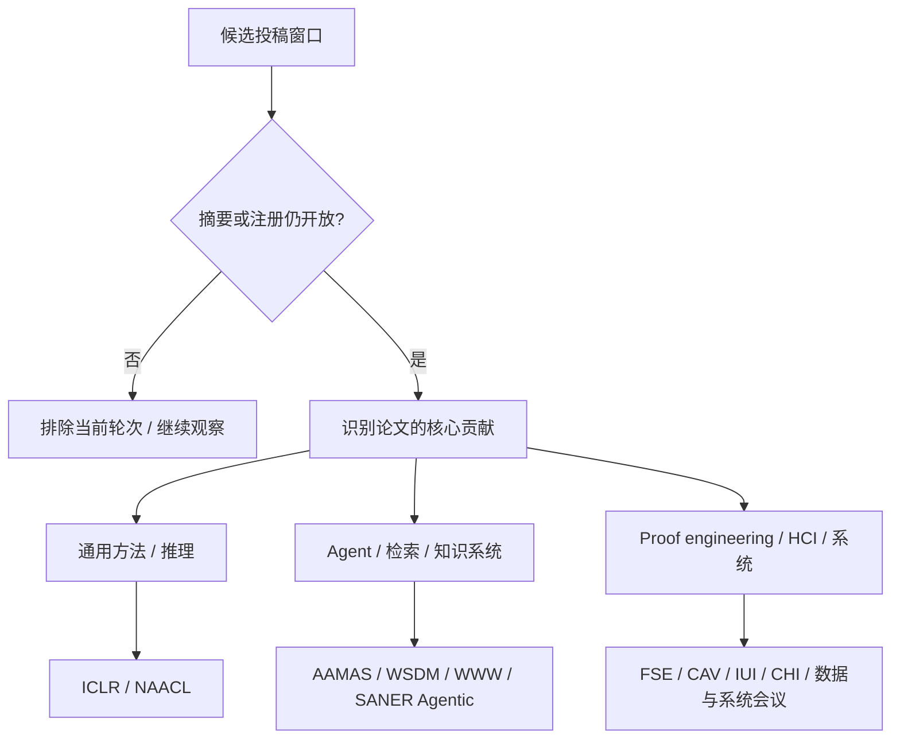

# 别只搜 AI for Math：2026 下半年 CCF A/B 会议怎么选

到 2026 年 7 月底，再问“今年还有哪些会能投”，最容易得到两种错误答案。

一种只按全文截止日期排序，于是把 mandatory abstract 已经过期的会议也算成“仍开放”；另一种只搜索 CFP 里有没有 `AI for Math`，于是错过 WSDM、FSE、CAV、IUI 这类名字不直接写数学、却可能非常适合的 venue。

更麻烦的是，这里说的“2026 下半年可投”，大多是**投稿截止发生在 2026 年、会议在 2027 年举行**，而不是只找会期在 2026 年的会议。

<!-- truncate -->

:::tip 一句话结论
会议选择应该经过两道筛选：**先验证这一轮是否仍对新稿开放，再按论文的核心贡献匹配会议的评价逻辑。** 对 AI for Math / AI for Science，最值得优先核验的是 ICLR、AAMAS、WSDM、WWW、NAACL；如果工作偏 proof engineering、交互或形式验证，则进一步看 FSE、SANER、IUI、CHI 与 CAV。
:::

:::info 数据口径
本文数据快照为 **2026-07-31**。基础数据来自 [ccfddl/ccf-deadlines](https://github.com/ccfddl/ccf-deadlines) 的 commit [`4217803`](https://github.com/ccfddl/ccf-deadlines/commit/4217803444d8099856cb794c273ef549a4e2c5a3)，只保留该项目标记为 CCF A/B 的会议。主窗口为 2026-07-31 至 2026-12-31，补充窗口延长至 2027-01-31。高相关候选另用会议官网复核；所有可执行时间均换算为北京时间。
:::

## 不要先排会议：先判断“这一轮”是否真的开放

CCFDDL 很适合发现候选，但它是社区维护的 deadline 数据库，不是会议官方 CFP。一个页面显示倒计时，不代表新作者此刻还能开始投稿。

先检查四件事：

1. **是否有 mandatory abstract 或 paper registration。** 摘要过期以后，全文按钮还开着也不代表能新建投稿。
2. **当前节点属于新稿、revision 还是 resubmission。** “only for major revisions” 不能算普通投稿机会。
3. **这是 main research、short、industry、findings 还是 companion track。** 它们的篇幅、评价标准和出版位置可能不同。
4. **时区到底是什么。** AoE / UTC-12 的 `23:59`，在北京时间通常是次日 `19:59`。

按这个规则，CCFDDL 快照在剩余 2026 年有 **46 个开放 timeline/round**；延长到 2027 年 1 月后有 **51 个**，对应 **40 个会议届次**。官网复核又补出 CCFDDL 没有单列的 SANER Agentic AI4SE track、CAV 2027 和 FSE Industry Papers，最终广筛地图包含 **54 个开放 track/round、41 个会议届次**。

下面几项说明为什么不能只看“全文日期还没到”：

| 条目 | 表面上看到的节点 | 实际判断 |
|---|---|---|
| HPCA 2027 | 全文北京时间 8 月 1 日 | mandatory abstract 已于 7 月 25 日截止，不能算新投稿仍开放 |
| INFOCOM 2027 | 全文北京时间 8 月 1 日 | 同样因为摘要已过而排除当前轮次 |
| VLDB 2027 早期轮次 | 全文北京时间 8 月 2 日 | 7 月 26 日的 mandatory abstract 已过，但后续月度轮次仍开放 |
| UbiComp/ISWC 8 月轮次 | 全文北京时间 8 月 2 日 | CCFDDL 条目标注为仅限 major-revision resubmission；11 月轮次才是另一个入口 |
| AAAI 2027 | 旧报告仍可能写“短线冲刺” | 全文已于北京时间 7 月 29 日截止 |
| KDD 2027 AI for Sciences | 方向非常匹配 | Cycle 1 已于北京时间 7 月 27 日截止；官网确认一年两轮，但 Cycle 2 日期尚未公布 |

这一步过滤掉的不是会议，而是**已经失效或不适用于新稿的轮次**。

## 第二道筛选：论文贡献比会议标签更重要

`AI for Math`、`AI for Science` 和 `STEM AI` 不是单一学科。两篇都使用 LLM 解数学问题的论文，可能分别属于机器学习方法、agent 协作、信息检索、软件工程或人机交互。

手机端可横向滑动查看完整流程图。

为了先广后窄，可以把论文适配度分成四档。这里特意加上 `Fit-` 前缀，避免与会议自身的 CCF-A / CCF-B 等级混淆：

- **Fit-S：优先候选。** 常见论文形态可以自然对齐，不必改成另一个研究问题。
- **Fit-A：强条件匹配。** 做一次清晰且合理的叙事选择后很合适，例如 proof engineering 或 HCI。
- **Fit-B：明确赛道匹配。** 可以投，但必须提供数据库、系统、HPC、可视化或机器人等会议本位贡献。
- **Fit-C：需要明显领域转向。** 通常要让安全、网络、密码、芯片或编码本身成为核心问题。

## 官网核验后的高相关时间线

下面先给出截至 2026-07-31 已用一手官网确认的 Fit-S / Fit-A 日期索引；它回答“什么时候交”，下一节再按核心贡献回答“为什么投”。日期全部为北京时间。

| 关联度 | 会议 / Track | 摘要或注册 | 全文 | 适合什么 |
|---|---|---:|---:|---|
| Fit-A | [IUI 2027 Main Paper](https://iui.acm.org/2027/call-for-papers/)（CCF-B） | 8 月 14 日 19:59 | 8 月 21 日 19:59 | 数学/科学助手、AI tutor、人机协作；需要交互系统、用户研究或相称的计算证据 |
| Fit-S | [WSDM 2027 Full Paper](https://wsdm-conference.org/2027/cffp.html)（CCF-B） | 8 月 18 日 19:59 | 8 月 25 日 19:59 | RAG、proof retrieval、科学知识发现、foundation model 与 agent |
| Fit-A | [CHI 2027 Papers](https://chi2027.acm.org/authors/papers/)（CCF-A） | 无摘要 deadline | 9 月 11 日 19:59 | STEM 教育、human-AI collaboration、科学工作流；需要扎实 HCI 研究设计 |
| Fit-S | [ICLR 2027 Main Paper](https://www.iclr.cc/Conferences/2027/Dates)（CCF-A） | 9 月 19 日 19:59 | 9 月 26 日 19:59 | 通用数学/科学推理、训练方法、搜索、verifier 与表示学习 |
| Fit-A | [SANER 2027 Research Track](https://conf.researchr.org/track/saner-2027/saner-2027-papers)（CCF-B） | 9 月 22 日 19:59 | 9 月 26 日 19:59 | proof-library maintenance、proof repair、科学软件演化与 repository mining |
| Fit-S | [AAMAS 2027 Main Track](https://warwick.ac.uk/fac/sci/dcs/aamas2027/calls/)（CCF-B） | 10 月 2 日 19:59 | 10 月 9 日 19:59 | planner–prover–critic、多 agent 协作、工具调用与 agent verification |
| Fit-A | [FSE 2027 Research Papers](https://conf.researchr.org/track/fse-2027/fse-2027-research-papers)（CCF-A） | 无摘要 deadline | 10 月 3 日 19:59 | Lean/Coq/Isabelle proof engineering、proof repair、验证工作流与开发者工具 |
| Fit-S | [The Web Conference 2027](https://acmweb2027.org/important-dates/)（CCF-A） | 10 月 12 日 19:59 | 10 月 19 日 19:59 | 知识系统、RAG、科学信息基础设施以及真实平台或用户数据 |
| Fit-S | [NAACL 2027](https://2027.naacl.org/)（CCF-B） | — | ARR：10 月 13 日 19:59 | 数学语言推理、autoformalization、证明生成和科学文本；conference commitment 日期仍待公布 |
| Fit-A | [SANER Agentic AI4SE Track](https://conf.researchr.org/track/saner-2027/saner-2027-agentic-ai4se-track)（CCF-B） | 10 月 20 日 19:59 | 10 月 24 日 19:59 | 会规划、维护状态、调用工具并处理真实软件或证明工程任务的 Agent |
| Fit-S | [WSDM 2027 Short Paper](https://wsdm-conference.org/2027/cfsp.html)（CCF-B） | 无摘要 deadline | 11 月 18 日 19:59 | 4 页、范围较窄但已有扎实实证的工作 |
| Fit-A | [CAV 2027 Main Paper](https://conferences.i-cav.org/2027/)（CCF-A） | 无摘要 deadline | 2027 年 1 月 21 日 19:59 | verification tools、ML verification、autonomous systems 与形式推理 |

这张表不是“推荐所有团队都同时冲”。它展示的是不同论文形态对应的自然入口。

## 按核心贡献收窄：七条投稿路径

日期索引只能完成第一道筛选。第二道筛选要从论文的主张出发：如果删掉数学 benchmark，方法贡献是否仍然成立；如果删掉 Lean、知识库或交互界面，论文还剩下什么不可替代的创新？

### 通用方法与语言推理：ICLR、NAACL

ICLR 适合把数学或科学任务作为通用学习问题来研究，例如训练方法、搜索、verifier、表示学习和推理机制。关键证据不是“在一个数学榜单上更高”，而是方法为什么有效、能否跨任务或难度泛化，以及 ablation 和误差分析是否支持机制主张。

NAACL 更适合语言贡献：数学语言推理、autoformalization、证明生成、科学文本理解与可控生成。它通过 ARR 接稿，而 2027 年的 conference commitment 在快照日仍未公布；有一个 ARR deadline 不等于已经拥有完整的 NAACL 投稿时间表。

### 检索与知识系统：WSDM、WWW

WSDM 名字是 Web Search and Data Mining，看起来不像数学或科学会议。但 2027 年的 [Full Paper CFP](https://wsdm-conference.org/2027/cffp.html) 与 [Short Paper CFP](https://wsdm-conference.org/2027/cfsp.html) 都明确列出：

- foundation models and agentic systems；
- generative question answering and reasoning；
- retrieval、indexing、ranking 与 RAG；
- web agents 与 multi-agent systems；
- `AI for Data-rich Science`；
- `Scientific Foundation Models`。

这意味着只要论文的核心是科学知识检索、定理/证明检索、RAG、scientific foundation model 或 agentic search，它不是“硬蹭 WSDM”，而是在官方 scope 内。

Full Paper 适合完整方法和系统；Short Paper 接受贡献范围更窄、但经过实证验证的工作。短文 track 的 submission site 在快照日仍写作 TBD，因此日期虽然已公布，投稿入口仍应持续检查。

WWW 同样能接住知识系统、RAG 和科学信息基础设施，但更期待 Web 语境：web-scale 数据、知识图谱、在线平台、真实用户或社会技术影响。如果核心是检索与 ranking 而没有明显 Web 对象，WSDM 通常更自然；如果贡献依赖开放 Web、平台行为或真实用户生态，WWW 更有说服力。

### Agent 工作：AAMAS 与 SANER Agentic 是两种不同叙事

如果系统由 planner、retriever、prover、critic、verifier 等角色组成，AAMAS 是自然候选。但论文不能只把一次 LLM 调用拆成多个角色名称，还需要回答：

- 多 agent 机制相对单 agent 的收益来自哪里；
- 协调、通信、记忆与冲突解决如何设计；
- 工具调用失败或 verifier 拒绝以后如何恢复；
- 成本、延迟和错误传播是否被测量；
- 机制能否泛化到新的问题或工具。

SANER 的 [Agentic AI4SE Track](https://conf.researchr.org/track/saner-2027/saner-2027-agentic-ai4se-track)则要求 Agent 真正服务于软件分析、演化、维护或重构。对形式化数学，这可以是：

- 大型 Lean/Coq 库升级后的 proof repair；
- proof CI failure 的定位和恢复；
- agent 在真实仓库中维护状态、调用 compiler 和检索工具；
- 定理库迁移、依赖修复与长期维护。

两者都接受 Agent，但 AAMAS 关心 agent/multi-agent 方法本身，SANER 关心 Agent 是否解决真实软件维护问题。

### Proof engineering：FSE、SANER 与 CAV 不能混成一个方向

三者都可能接住 theorem proving 工作，但评价问题不同。

#### FSE：证明系统是一种软件工程工具

FSE 适合研究 proof repair、specification/invariant generation、formal verification workflow、proof CI 与开发者工具。核心证据通常包括真实项目、工具 artifact、项目级成功率、人类时间节省、失败分析和可复现实验。

如果论文只是在 MATH、AIME 或 miniF2F 上提升一个分数，没有软件工程对象，FSE 并不是自然归宿。

#### SANER：证明库如何演化和维护

SANER Research Track 对 AI/ML 稿件写得很明确：必须解决软件系统整体、软件演化/维护 artifact，或 AI-intensive software 的维护问题。proof library migration、repair、repository mining 与维护经验可以对齐；纯模型能力论文容易被认为 scope 不足。

#### CAV：验证理论、算法与工具本身

CCFDDL 快照尚未收录 CAV 2027，但 [CAV 官网](https://conferences.i-cav.org/2027/)已经确认 2027-01-20 AoE 截止，即北京时间 1 月 21 日 19:59。官网将 machine learning、quantum verification、autonomous systems 与 computer security 列为扩展方向。

对 theorem proving 团队，CAV 更关注验证方法、算法、工具和严谨性；它不是“有 Lean 就能投”，而是 formal verification 本身要构成研究贡献。

### STEM 助手：IUI 与 CHI 要求的不只是一个界面

数学 tutor、科学助手、交互式证明工具看起来适合 IUI 或 CHI，但两个 venue 都不会因为有聊天界面就自动接受。

[IUI CFP](https://iui.acm.org/2027/call-for-papers/)明确要求同时讨论 computational 与 human-centric aspects，并用与主张相称的证据支持。可以是用户研究，也可以是系统评价和计算分析，但必须解释用户如何进入智能系统的闭环。

CHI 的范围更广，也更强调 HCI 理论、方法和严谨研究设计。若主张“系统提高了数学学习效果”，就需要学习实验、对照、伦理与统计设计；只报告模型正确率通常不够。

### Fit-B 不是备胎：它要求真正的领域贡献

第一轮广筛没有把数据、系统和计算会议删掉。40 个 CCFDDL 会议届次中，Fit-B 条件候选共有 20 个：

| 贡献簇 | 保留会议 | 进入条件 |
|---|---|---|
| 科学/数学数据系统 | CIDR、VLDB、ICDT、EDBT、SIGMOD、ICDE | theorem/scientific knowledge base、query、provenance、数据管理或数据库理论成为核心贡献 |
| AI for Science 系统与 HPC | PPoPP、ASPLOS、CGO、FAST、EuroSys、IPDPS、SIGMETRICS、OSDI | 并行算法、编译、架构、存储、调度、性能或分布式系统创新 |
| STEM 交互与科学模态 | IEEE VR、ICRA、ICASSP、UbiComp/ISWC | VR/3D、机器人科学家、科学信号、多模态文档或真实情境部署 |
| 可靠性与形式化安全 | CSF、DSN | security foundations、dependability、容错或可信基础设施贡献 |

例如，[PVLDB 2027](https://www.vldb.org/2027/submission-guidelines.html)采用月度滚动截稿：每月 25 日先交 mandatory abstract，次月 1 日 `17:00 Pacific Time` 交全文。它还明确包含 Data Management for ML/AI、ML/AI for Data Management、Provenance and Workflows、Specialized and Domain-Specific Data Management 等主题。

但“我们建立了一个数学数据集”本身仍不够。要投 VLDB/SIGMOD/ICDE，需要数据库研究问题；要投 ASPLOS/OSDI，需要系统创新和强实证；要投 ICRA，需要机器人或具身实验。

### Fit-C 仍保留，但通常不该作为第一选择

Fit-C 共有 11 个：USENIX Security、NDSS、MobiCom、NSDI、DATE、EUROCRYPT、DCC、ISCAS、CHES、IEEE S&P、SECON。

它们并非“不支持 AI for Science”，而是需要明显领域转向：

- AI for security、Agent 安全或形式化安全验证，才考虑 USENIX Security、NDSS、S&P；
- 密码协议、密码理论或侧信道，才考虑 EUROCRYPT、CHES；
- 网络化科学系统、无线感知或边缘 AI，才考虑 MobiCom、NSDI、SECON；
- EDA、芯片、电路或硬件实现，才考虑 DATE、ISCAS；
- 科学数据、模型或证明对象的压缩/编码成为贡献，才考虑 DCC。

先保留这些候选，是为了避免早筛掉跨学科工作；真正收窄时，如果对应领域贡献不存在，就应果断移除。

## 2027 年 1 月：多一个月能换来哪些选择

如果 2026 年内没有合适窗口，延长到 2027 年 1 月会多出七个可执行入口：

其中 CAV 与 FSE Industry 是官网补充项；其余五项来自 CCFDDL 广筛数据。临近投稿时仍应回到官方页面确认时区、registration/abstract 性质与 track 规则。

| 关联度 | 会议 / Track | 北京时间 | 关键限定 |
|---|---|---|---|
| Fit-B | [SIGMETRICS 2027 Winter](https://www.sigmetrics.org/sigmetrics2027/) | 摘要 1 月 5 日；全文 1 月 12 日 | 性能建模、测量、调度、成本或排队分析 |
| Fit-C | [CHES 2027 Volume 2027/3](https://ches.iacr.org/2027/) | 全文 1 月 16 日 | 密码硬件、实现安全或侧信道 |
| Fit-C | [USENIX Security 2027 Cycle 2](https://www.usenix.org/conference/usenixsecurity27) | mandatory registration 1 月 20 日；全文 1 月 27 日 | 安全必须是核心贡献 |
| Fit-A | [CAV 2027 Main Paper](https://conferences.i-cav.org/2027/) | 全文 1 月 21 日 19:59 | 形式验证、算法与工具 |
| Fit-B | [FSE 2027 Industry Papers](https://conf.researchr.org/track/fse-2027/fse-2027-industry-papers) | 全文 1 月 24 日 19:59 | 真实工业应用；进入 companion proceedings，不等同主 Research Track |
| Fit-B | [VLDB 2027 月度轮次](https://www.vldb.org/2027/submission-guidelines.html) | 摘要 1 月 26 日；全文 2 月 2 日 | 1 月进入投稿流程，数据库贡献必须成立 |
| Fit-B | [CSF 2027 Winter](https://www.ieee-security.org/TC/CSF2027/) | 全文 1 月 29 日 | 形式化推理必须落到 security foundations |

这七项里，对一般 AI for Math 最值得关注的是 CAV；对科学计算系统可看 SIGMETRICS；对知识基础设施可看 VLDB；已有真实工业部署时，FSE Industry 才有意义。

## 根据手稿成熟度倒排，而不是只看关联度

### 现在已经接近成稿

IUI 与 WSDM Full 的窗口最早。到 7 月 31 日，它们只剩两到三周，适合已有方法、主实验和论文骨架的团队，不适合从零开始换题。

### 8 月可以完成主实验

CHI、ICLR 和 SANER Research 集中在 9 月。通用方法优先 ICLR；有人机实验看 CHI；有真实 proof/software maintenance artifact 再看 SANER。

### 需要两个月完善系统与叙事

AAMAS、FSE、WWW、NAACL 和 SANER Agentic 集中在 10 月。这个窗口最适合仍需补 ablation、系统实验、用户/仓库 case study 和错误分析的项目。

### 结果范围较窄，或主会窗口来不及

WSDM Short 在 11 月，篇幅更短，但不是“弱稿收容所”：它要求清晰、经过实证支持的研究贡献。形式化验证方向还可以继续准备 CAV 2027。

## 还有哪些会只能观察，不能写进确定时间表

截至快照日：

- [ACL 2027](https://2027.aclweb.org/) 的 ARR submission 与 commitment 仍为 TBA；
- [COLING 2027](https://2027.coling-iccl.org/) 的 Important Dates 仍为 TBD；
- [KDD 2027 AI for Sciences](https://kdd2027.kdd.org/ai4sciences-track-call-for-papers/)确认一年两轮，但只公布了已经关闭的 Cycle 1；
- ICML、IJCAI、COLT、LICS、ISSTA 2027 尚未找到可由一手官网确认、且落在 2027-01-31 前的正式主会 deadline。

观察项应该进入 watchlist，而不是用往年日期推算后写成“预计截止”。

## 一张可复用的投稿检查表

对任何候选会议，都按下面顺序核验：

1. **入口**：mandatory abstract、registration 和 full deadline 是否都还没过？
2. **Track**：main、short、industry、findings、journal-first、revision 还是 companion？
3. **贡献**：论文最不可替代的贡献究竟是模型、Agent、检索、软件工程、HCI、数据还是系统？
4. **评价逻辑**：该会议会用什么证据判断贡献成立？只跑通 benchmark 是否远远不够？
5. **材料**：页数、匿名、artifact、OpenReview profile、用户伦理和开放获取要求是否来得及满足？
6. **官方证据**：日期和 scope 是否已经回到会议官网，而不是只看 deadline 聚合站？
7. **备选路径**：如果主会不匹配，是否有 short、industry、下一轮或 1 月窗口，而不是强行换叙事？

## 最终判断

AI for Math / AI for Science 的投稿面并不窄。真正窄的是：一篇论文只有一种核心贡献，而每个会议只奖励特定类型的贡献证据。

只按会议名字筛，会漏掉 WSDM 的 AI for Data-rich Science、SANER 的 Agentic AI4SE、FSE 的 proof engineering 和 CAV 的 ML verification；只按日期筛，又会把摘要已过、仅限 revision 或 track 性质完全不同的入口混在一起。

更稳妥的方法是长期维护两张表：

- 一张是**经过 gate 校验的开放窗口表**；
- 一张是**按论文贡献分层的 Fit-S / Fit-A / Fit-B / Fit-C 目标地图**。

前者回答“还能不能投”，后者回答“为什么应该投”。只有两张表同时成立，deadline 才会变成投稿计划，而不是焦虑倒计时。

## 核心一手来源

- [CCFDDL GitHub 数据仓库](https://github.com/ccfddl/ccf-deadlines)与[数据字段说明](https://github.com/ccfddl/ccf-deadlines#conference-entry-file)
- [ICLR 2027 Dates and Deadlines](https://www.iclr.cc/Conferences/2027/Dates)
- [AAMAS 2027 Call for Papers](https://warwick.ac.uk/fac/sci/dcs/aamas2027/calls/)
- [WSDM 2027 Full Paper CFP](https://wsdm-conference.org/2027/cffp.html)与[Short Paper CFP](https://wsdm-conference.org/2027/cfsp.html)
- [The Web Conference 2027 Important Dates](https://acmweb2027.org/important-dates/)
- [NAACL 2027](https://2027.naacl.org/)
- [IUI 2027 Call for Papers](https://iui.acm.org/2027/call-for-papers/)
- [CHI 2027 Papers](https://chi2027.acm.org/authors/papers/)
- [FSE 2027 Research Papers](https://conf.researchr.org/track/fse-2027/fse-2027-research-papers)与[Industry Papers](https://conf.researchr.org/track/fse-2027/fse-2027-industry-papers)
- [SANER 2027 Research Track](https://conf.researchr.org/track/saner-2027/saner-2027-papers)与[Agentic AI4SE Track](https://conf.researchr.org/track/saner-2027/saner-2027-agentic-ai4se-track)
- [CAV 2027](https://conferences.i-cav.org/2027/)
- [KDD 2027 AI for Sciences Track](https://kdd2027.kdd.org/ai4sciences-track-call-for-papers/)
- [PVLDB 2027 Submission Guidelines](https://www.vldb.org/2027/submission-guidelines.html)
