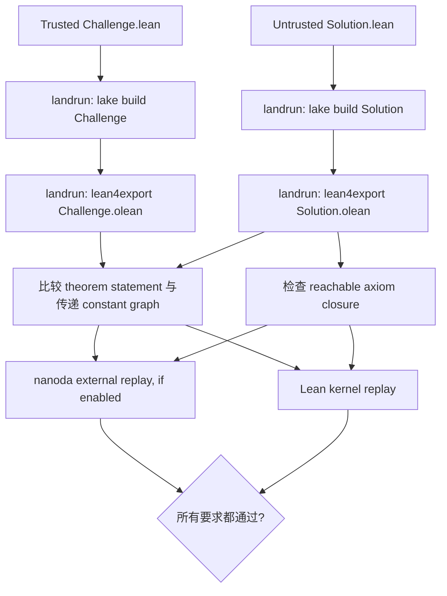

# Comparator 到底在检查什么：从 Challenge/Solution 到 external kernel

一份不可信的 Lean 项目能够 `lake build`，不等于它证明了你以为的 theorem。

它可能重新定义了 statement 里的 identifier，用 macro 或 notation 改变表面语法的含义，用不同 typeclass instance 让同一个类型别名展开成另一项，也可能在 build 阶段运行 meta code、写文件，最后再把 `sorry` warning 藏起来。Lean 很灵活，这种灵活性对正常开发是能力，对 adversarial proof 则是攻击面。

[Comparator](https://github.com/leanprover/comparator) 的工作，是在一个 reviewer 控制的 theorem statement 与 untrusted proof project 之间建立边界。它不只问“这份代码能否编译”，而是问：**它是否证明了 trusted Challenge 中那个精确的 statement，只用了允许的 axioms，并且能被指定的 kernel 接受？**

<!-- truncate -->

:::info 这篇文章在系列里的位置
本文是主文 [一份“反证 Collatz 猜想”的 Lean 代码，为什么同时通过了两个 checker](/blog/lean-conjecture-soundness-bug-collatz-comparator-nanoda) 的工具补充。主文讲事件；这里专门拆开 Comparator 的检查流程和信任边界。
:::

:::tip 最短定义
Comparator 是一个面向不可信 Lean proof 的 judge。它把 reviewer 写的 `Challenge` 与 submitter 提供的 `Solution` 分开构建和导出，比较 statement 及其传递依赖，限制 reachable axioms，再把 exported proof replay 给 Lean kernel 和可选的 external checker。
:::

## 为什么 `lake build` 还不够

日常开发里，编辑器出现蓝色双勾或 `lake build` 成功，通常已经足够。它说明：

- 当前 import、notation 和 typeclass environment 下，statement 成功 elaborated；
- Lean kernel 接受了一个该 statement 的 proof term。

这里的限定词是“当前 environment 下”。如果整个项目由你或可信团队维护，这没什么问题。如果项目来自 proof marketplace、奖金竞赛或自动生成 agent，reviewer 还要面对另一类风险：提交者控制的可能不只是 proof body，还包括 imports、macros、commands、tactics、lakefile 和 build-time code。

一个项目可以在视觉上打印：

```lean
theorem result : RiemannHypothesis := by
  ...
```

却让 `RiemannHypothesis` 指向自己定义的 trivial proposition；也可以让一个 custom tactic 在运行时修改 artifacts；还可以把 `sorryAx` 藏在传递依赖深处。`#print axioms` 对诚实项目很有用，却不是为积极误导 observer 的代码设计的安全沙箱。

Lean Reference 因此把验证分成递进层级：日常的 blue checks、`#print axioms`、`lean4checker`，以及面向 seriously malicious proof 的 gold standard：**Comparator + external checker**。

## 核心模型：Challenge 与 Solution 必须分家

最简单的 Comparator workspace 有两个 module。

Reviewer 在可信环境中写 `Challenge.lean`：

```lean
import Mathlib

theorem target : RiemannHypothesis := by
  sorry
```

这里的 `sorry` 只表示“这是等待提交者证明的 statement”。它不属于最终 Solution proof。

提交方写出或导入自己的证明，再在 `Solution.lean` 暴露同名、同类型 theorem：

```lean
import UntrustedProject

theorem target : RiemannHypothesis :=
  UntrustedProject.claimedProof
```

配置文件告诉 Comparator 哪两个 module、哪些 theorem、哪些 axioms 允许出现：

```json
{
  "challenge_module": "Challenge",
  "solution_module": "Solution",
  "theorem_names": ["target"],
  "permitted_axioms": [
    "propext",
    "Quot.sound",
    "Classical.choice"
  ],
  "enable_nanoda": true
}
```

LeanEval 使用三文件变体：`Challenge.lean` 是可信题目，`Submission.lean` 是 solver 唯一能改的文件，生成的 `Solution.lean` 只做 `exact Submission.foo`。这个 bridge 让 Comparator 仍然维持 Challenge/Solution 模型，同时把用户输入限制在 Submission 区域。

关键不是文件名，而是控制权：**Challenge、config、toolchain 和 build policy 由 verifier 控制；Solution 及其 proof dependencies 被视为不可信。**

## Comparator 实际跑了哪些步骤



### 1. 在 landrun sandbox 中分别 build

`safeLakeBuild` 对 Challenge 和 Solution 分别执行 `lake build`。Solution build 会运行 untrusted elaboration 和 metaprogram，因此它被放进 `landrun` 的 Linux Landlock sandbox。

当前 Comparator 给 project read access，只允许 `.lake` 作为必要的 writable build directory，并限制可执行文件与传入 environment。README 还建议不要用 privileged user 运行，并在外层用 `systemd-run` 限制 Unix domain sockets。

sandbox 解决的是“构建 proof 时能否改写 verifier 机器”，不解决 proof term 的逻辑正确性。

### 2. 用 lean4export 导出，不直接信任 `.olean`

build 完成后，Comparator 在 sandbox 中调用 `lean4export`，把 Challenge 与 Solution 的相关 environment 转成序列化 export。

Comparator 的 README 特意说明，它通常避免把 untrusted `.olean` 直接 mmap 进自己的地址空间。`.olean` 是 Lean 内部高效加载格式，不是一个为 hostile bytes 设计的独立 proof certificate format。export 让后续逻辑可以在更受控的结构上比较和 replay。

### 3. 比较 statement 与传递 constant graph

`Comparator/Compare.lean` 从配置里的 `theorem_names` 建立 worklist。

它先要求 Challenge 和 Solution 中的目标：

- 都存在；
- declaration kind 相同；
- theorem statement 的 `ConstantVal` 完全相同。

然后沿 statement 使用的 constants 递归遍历。除显式列入 `definition_names` 的 definition hole 外，每个 reachable constant 都必须在 Challenge 与 Solution environment 中一致。

这一步防的不是“证明错误”，而是“题被换了”。例如 Solution 导入了一个同名 `RiemannHypothesis`，或者改变了 statement 所依赖的某个 definition，constant graph comparison 会把差异找出来。

### 4. 检查 axiom closure

`Comparator/Axioms.lean` 从目标 theorem 和 definition holes 出发，递归遍历 proof body 使用的 constants。遇到 axiom declaration 时，它要求 axiom name 出现在 `permitted_axioms` allowlist。

在 LeanEval 中，allowlist 是：

```text
propext
Quot.sound
Classical.choice
```

`sorryAx` 不在其中，因此提交中的 `sorry` 会失败；`Lean.ofReduceBool` 也不在其中，因此依赖旧式 native-evaluation trust path 的 proof 不会被当作普通 kernel-only proof 接受。

### 5. 把 export replay 给 kernel

完成 statement 与 axiom 检查后，Comparator 会重建一个空 Lean environment，并调用 `env.replay` 把 Solution declarations 送入 standard Lean kernel。

如果 `enable_nanoda` 为 `true`，它还会把同一份 Solution export 通过 stdin 交给 sandbox 中的 `nanoda_bin`，并传入相同的 permitted-axiom policy。当前代码先运行 nanoda，再运行 Lean default kernel；其中任何一个返回失败，整体都失败。

这最后一步把两个问题分开：

- Comparator 自己确认“proof 对应的是哪道题”。
- kernel 确认“proof term 是否符合 Lean type theory 的实现规则”。

## 它能保证什么

在 README 明列的前提成立时，Comparator 成功意味着：

1. `Solution` 里的目标 theorem 与 trusted `Challenge` 是同一个 statement。
2. proof 与列出的 definition holes 没有传递使用 allowlist 以外的 axiom。
3. exported environment 被启用的 kernel 接受。

“前提成立”不是法律小字。Comparator 的保证依赖：

- Challenge 的 import closure 与 lakefile 可信；
- reviewer 没有事先在同一环境里编译 hostile Solution，导致 Challenge 被污染；
- landrun 正常生效，Solution 没逃出 sandbox；
- `lean4export` 与 Comparator plumbing 正确；
- standard Lean kernel，或者启用 nanoda 时至少一个 kernel，实现没有被同一个 artifact 绕过；
- OS、hardware 与执行环境没有撒谎。

Comparator README 把 kernel assumption 写得很清楚：单 kernel 模式要相信 Lean kernel 正确；启用 nanoda 后，这个假设可降低为“Lean 或 nanoda 至少一个正确”。

## 它挡住哪些攻击，又不挡哪些

| 风险 | Comparator 的作用 |
| --- | --- |
| Solution 偷换目标 statement | 比较目标 theorem 与传递 constant graph |
| 同名 identifier 指向不同 definition | Challenge/Solution environment comparison 拒绝漂移 |
| proof 依赖 `sorryAx` | axiom allowlist 拒绝 |
| custom tactic 在 build 时读写系统 | landrun 限制 filesystem、exec 与 environment |
| malformed proof term | standard Lean kernel replay；启用后再由 nanoda replay |
| Lean kernel 自身的 soundness bug | 单 kernel 模式无法解决；需要 external checker |
| Challenge 写错或不对应自然语言问题 | 无法自动解决，需要 reviewer 与 proof digestion |
| definition hole 选择了钻空子的合法定义 | 只能校验签名/axiom/typecheck，必须增加人类或领域 verifier |
| 两个 checker 同时出现可组合 bug | 风险降低但不能排除，本系列主事件就是实例 |

## 2026 年 Collatz 事件为什么没有否定 Comparator

[主文讨论的 artifact](/blog/lean-conjecture-soundness-bug-collatz-comparator-nanoda) 没有偷换 statement，没有隐藏 axiom，也没有逃逸 sandbox。它提交了一个当时 standard Lean kernel 会错误接受的 proof term。

因此，当时只依赖这个 kernel replay 的 comparator.live 显示成功。Comparator 完成了它配置中要求的工作，只是“kernel 自身正确”这条信任假设不成立。

事件后的修复不是移除 Comparator，而是按文档的 gold standard 给它接上 nanoda。这样验证栈同时覆盖：

- Comparator：statement integrity、axiom policy、sandboxed build/export。
- Lean kernel：官方实现 replay。
- nanoda：另一个实现的 replay。

如果只跑两个 kernel、不跑 Comparator，proof 仍可通过偷换题意得分；如果只跑 Comparator 和同一个 vulnerable kernel，kernel exploit 仍可得分。三层各有职责。

## Definition holes 为什么需要额外 verifier

Comparator 支持让 Challenge 留出 definition hole。例如题目允许 solver 构造一个大型对象：

```lean
def large : Nat := sorry

theorem large_lt : 37 < large := by
  sorry
```

配置把 `large` 放进 `definition_names` 后，Solution 可以填：

```lean
def large : Nat := 38

theorem large_lt : 37 < large := by decide
```

Comparator 会检查 hole 的 name、type、universe levels、safety level、axiom closure 和 type correctness。

但它无法理解出题人的非形式化意图。README 给出的经典陷阱是：如果 `ChallengeSolution : Prop` 本应让 solver 回答 `True` 或 `False`，solver 却直接把它定义成待证 conjecture 本身，再用 reflexivity 证明等价，所有 kernel checks 都可能合法，题意却被钻空子。

因此 definition hole 题必须有额外的领域或人工 verifier。这里不存在一个纯类型检查器能自动猜出的人类意图。

## 一个实际坑：imports 会改变 elaborated statement

Comparator 要求的是 elaborated constant 一致，不是源码字符串一样。这使它会暴露一些日常 Lean 开发中容易忽略的 import/typeclass 问题。

2026 年 7 月的 Zulip 讨论里，一个 Euclidean geometry Challenge 在精简 imports 后，竟然需要 `Mathlib.AlgebraicTopology.SimplexCategory.Basic` 才能与使用 `import Mathlib` 的 full proof 对齐。

原因不是 Desargues theorem 依赖 simplex category，而是额外 import 引入的 `Fintype` instance 影响了 `EuclideanSpace ℝ (Fin 2)` 中 typeclass synthesis，形成 comparator-observable instance diamond。

这类失败通常说明：Challenge 与 Solution 在 elaboration 时没有处于完全相同的 canonical instance environment。实用处理方式是：

1. 把 statement 所需 definitions 单独放进一个短小、可信 module。
2. Challenge 与 Solution 都 import 这个 module。
3. 避免让两边通过不同 blanket imports 各自重新 elaborate statement。
4. 如果必须精简 imports，检查 typeclass-generated arguments，而不只看源码文本。

Comparator 在这里看起来“过于严格”，但严格是对的。不同 imports 如果能让 theorem 意味着不同 term，verifier 就不该把它们当同一道题。

## 推荐的高风险验证流程

### Reviewer 侧

1. 在可信 checkout 中写短小的 Challenge。
2. 人工审查 statement、definitions、notation 和 typeclass surface。
3. 锁定 Lean、mathlib、Comparator、landrun、lean4export、nanoda commit。
4. 将 permitted axioms 限到确实需要的最小集合。
5. 在 Linux 非 privileged user 下运行 sandbox。
6. 强制 `enable_nanoda: true`，并让缺失 binary 直接失败。
7. 保存 config、完整 logs、export 与 checker version 作为复现证据。

### Submitter 侧

1. 把核心 statement definitions 与 proof implementation 分开。
2. 让 Solution 只暴露 Challenge 要求的 theorem。
3. 不依赖 `sorry`、未允许 axioms 或 native trust path。
4. 在与 verifier 相同的 pins 上跑完整流程。
5. 如果出现 constant mismatch，先查 imports、instances 与 definition reducibility，不要通过放宽 comparison 绕过去。

## 怎么读一次 Comparator 成功

不要把输出 `Your solution is okay!` 翻译成“数学结论绝对正确”。更准确的展开是：

> 在这份 trusted Challenge、allowlist、sandbox、tool pins 和 kernel 组合下，Comparator 没发现 statement/dependency drift 或非法 axiom，且所有启用 checker 接受了 exported proof。

这句话更长，但它把可审计的保证和仍需信任的前提都保留下来了。

回到本系列的主事件，Comparator 的价值恰好因此更清楚：它不是万能 kernel，也不是 `lake build` 的包装器。它负责保护 proof verification 中非常重要的一段边界；然后把 kernel 自身的实现风险交给多个 checker 分担。

- [返回主文：一份“反证 Collatz 猜想”的 Lean 代码，为什么同时通过了两个 checker](/blog/lean-conjecture-soundness-bug-collatz-comparator-nanoda)
- [继续阅读：nanoda 为什么能作为另一个 Lean kernel](/blog/nanoda-lean-external-kernel-guide)

## 主要来源

- [leanprover/comparator README](https://github.com/leanprover/comparator)
- [Comparator `Main.lean`](https://github.com/leanprover/comparator/blob/master/Main.lean)
- [Comparator `Compare.lean`](https://github.com/leanprover/comparator/blob/master/Comparator/Compare.lean)
- [Comparator `Axioms.lean`](https://github.com/leanprover/comparator/blob/master/Comparator/Axioms.lean)
- [Lean Reference：Validating a Lean Proof](https://lean-lang.org/doc/reference/latest/ValidatingProofs/#validating-comparator)
- [Lean Zulip：Why use Comparator?](https://leanprover.zulipchat.com/#narrow/channel/583339-AI-authored-projects/topic/Why.20use.20Comparator.3F/near/609719700)
- [Lean Zulip：Comparator-related import subtleties](https://leanprover.zulipchat.com/#narrow/channel/583339-AI-authored-projects/topic/Comparator-related.20import.20subtleties/near/613332501)
- [LeanEval `SECURITY.md`](https://github.com/leanprover/lean-eval/blob/main/SECURITY.md)
