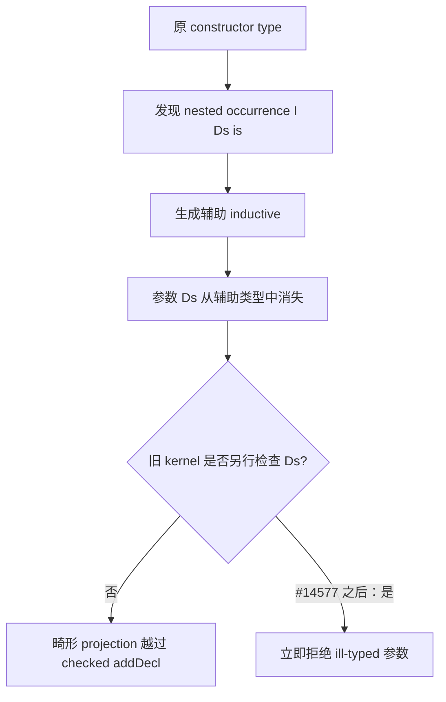
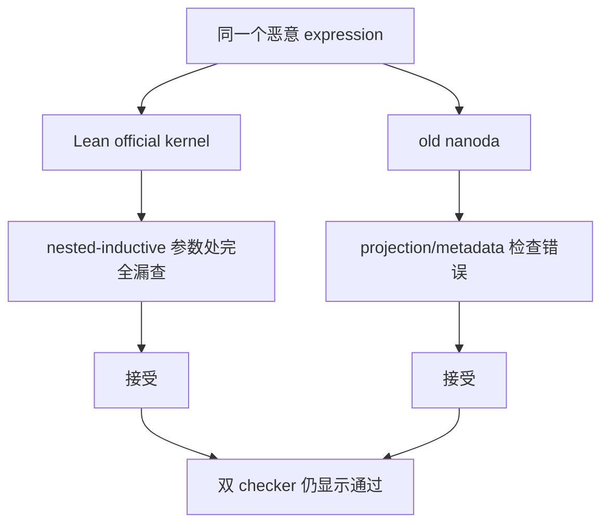
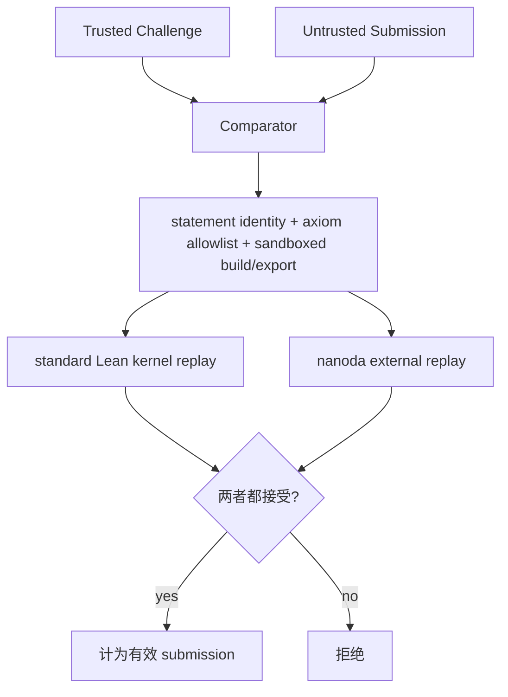

# 一份“反证 Collatz 猜想”的 Lean 代码，为什么同时通过了两个 checker

2026 年 7 月 28 日，Lean Zulip 的 `lean4` stream 出现了一个很难忽略的 topic：[`Counterexample to the Lean Conjecture (Soundness Bug)`](https://leanprover.zulipchat.com/#narrow/channel/270676-lean4/topic/Counterexample.20to.20the.20Lean.20Conjecture.20.28Soundness.20Bug.29/near/613135216)。

帖子里的三个事实放在一起，几乎像一道故意设计的判断题：

1. 一个不到 500 行的 Lean 仓库声称“反证”了 Collatz 猜想。
2. 它没有 `sorry`，`#print axioms` 没暴露隐藏公理，当时的 comparator.live 和旧版 nanoda 都接受了它。
3. 它没有解决 Collatz。它真正构造出来的是一个利用 kernel soundness bug 的无公理 `False`。

这不是“形式化验证忽然失效”的故事，也不是一个模型真的完成了世纪数学突破。它更具体，也更值得研究：一份 proof artifact 把 **Lean 官方 kernel 的漏检** 与 **旧版 nanoda 的另一处漏检** 拼在一起，恰好穿过了两套原本彼此独立的检查。

<!-- truncate -->

:::tip 一句话结论
这份 Collatz“反证”同时通过两个 checker，并不是两个 checker 共享同一个 bug。Lean 在 nested-inductive 翻译时漏查了一个参数；旧版 nanoda 又错误接受了一个 non-structure projection。artifact 把一个表达式放进“Lean 完全没检查、旧 nanoda 检查错了”的交集里。
:::

:::info 系列说明
这是三篇系列的主文，完整讲事件、技术机制、社区讨论与修复。两篇工具补充分别解释 [Comparator 到底在检查什么](/blog/lean-comparator-trust-boundary-guide) 和 [nanoda 为什么能作为另一个 Lean kernel](/blog/nanoda-lean-external-kernel-guide)。不打开补充文章，也不影响理解本文。
:::

## 先说清楚：它反证的不是 Collatz

原始仓库是 [`xrchz/CollatzLean`](https://github.com/xrchz/CollatzLean)。Ramana Kumar 在 7 月 25 日提交了 [`a793574`](https://github.com/xrchz/CollatzLean/commit/a79357462a33d2a6babd4cf6c8d8bcd25425d653)，commit 标题是 `Finish disproof`。

从公开 theorem surface 看，它像一个正常的数学结论：

```lean
theorem exists_nonterminating_orbit : ∃ n, Diverges n :=
  limitingProfile_is_exceptional

theorem not_conjecture : ¬ Conjecture :=
  exceptionalOrbit_refutes_conjecture exists_nonterminating_orbit
```

如果这些 theorem 真由 Lean 的逻辑规则推出，那么 Collatz conjecture 的确被反驳了。问题在于，仓库里的 proof term 不是通过正常数学构造得到的。`Collatz/ProfileEnvelope.lean` 和 `Collatz/Limit.lean` 使用 Lean metaprogramming API 直接拼 `Expr`、投影和 `Declaration`，再通过 `addDecl` 把声明交给 kernel。

这种写法本身并不等于作弊。Lean 的设计允许 tactic 和 metaprogram 任意复杂，甚至完全不可信；安全边界在于它们最终生成的 term 必须由 kernel 检查。真正的问题是：这次 kernel 恰好漏看了一部分 term。

所以 Zulip topic 标题里的 “Lean Conjecture” 是一个黑色幽默式的双关。被给出 counterexample 的不是数学上的 Collatz conjecture，而是“Lean 的 checked kernel 不会接受 `False`”这条人们平时依赖的 soundness 假设。

## 三天里发生了什么

| 时间（UTC） | 事件 | 结果 |
| --- | --- | --- |
| 7 月 25 日 | `CollatzLean@a793574` 提交 `Finish disproof` | Collatz 外衣下的 exploit artifact 公开 |
| 7 月 26–27 日 | Lean Kernel Arena 合并 #81、#82、#83；`nanoda_lib#22` 修复 | nanoda 的 projection 与 inductive metadata 检查被加固 |
| 7 月 28 日 03:28 | Kiran 提交 [`lean4#14576`](https://github.com/leanprover/lean4/issues/14576) | 把问题缩成普通 checked `addDecl` 可接受的无公理 `False` |
| 7 月 28 日 05:08–13:39 | Leonardo de Moura 提交并合并 [`lean4#14577`](https://github.com/leanprover/lean4/pull/14577) | Lean 补上 nested-inductive 参数检查 |
| 7 月 28 日 07:16 | Jack McCarthy 发起 Zulip 主帖 | 39 名参与者留下 202 条消息 |
| 7 月 29 日 | comparator.live 改用 Comparator + nanoda | 旧 Lean 上由 nanoda 拒绝；新 Lean 自己先拒绝 |
| 7 月 30 日 | [`lean-eval#486`](https://github.com/leanprover/lean-eval/pull/486) 与 submissions #895 合并 | LeanEval 强制 standard kernel 与 nanoda 同时接受 |

这里有个容易误读的时间关系：`CollatzLean` commit 早于公开的 Kernel Arena nanoda 报告和修复。

Ramana Kumar 后来[确认有一个或多个 LLM 参与了仓库生成](https://leanprover.zulipchat.com/#narrow/channel/270676-lean4/topic/Counterexample.20to.20the.20Lean.20Conjecture.20.28Soundness.20Bug.29/near/613197533)，但他说 nanoda 报告的时间重合很可能只是巧合，同时也保留了“不知道模型是否已见过相关材料”的不确定性。

现有证据不足以把这件事写成“AI 读取新漏洞报告后主动攻击 Lean”。能够确认的只有 LLM involvement，以及最终 artifact 确实组合了两处独立漏洞。

## Lean kernel 漏看了什么

Kiran 的 issue 给出了一份自包含 reproducer。它特意说明，代码走的是普通、应当受检查的 `addDecl` 路径，没有使用：

- `sorry`
- `unsafeCast`
- `debug.skipKernelTC`
- `addDeclWithoutChecking`
- FFI
- 手工篡改 `.olean`

这点很重要。如果 reproducer 只是显式关闭 kernel checking，那不构成 kernel soundness bug。这里的声明确实提交给了 checked path，只是检查不完整。

### 那个本来不该合法的 projection

reproducer 先定义几种简单类型：

```lean
inductive P : Prop where | mk (b : Bool)
structure C where b : Bool
inductive W : Type where | mk (p : P)
inductive L (α : Type) (b : Bool) : Type where | mk
inductive T : Bool → Prop where | mk : T true
```

随后 metaprogram 构造一个 nested inductive `E`。它的 constructor type 中含有大致这样的 nested occurrence：

```text
L (E w) (C.0 (C.0 w))
```

但局部变量 `w` 的类型是 `W`，不是 structure `C`。对 `w` 连续做 `C` 的 field projection 明显不应通过 type checking。

Lean 处理 nested inductive 时，并不是原样保留所有 nested occurrence。它会把 `I Ds is` 一类应用翻译成辅助 inductive 声明。bug 就出在这次翻译里：参数 `Ds` 从生成的辅助类型中被丢掉了，但 kernel 没有在完整 inductive environment 可用后单独检查这些参数。



[`lean4#14577`](https://github.com/leanprover/lean4/pull/14577) 的修复说明很直接：nested occurrence 的 parametric arguments 过去会逃过 type checking；修复后，kernel 在正在声明的 inductive types 可用时逐一检查它们。

这才是根本 bug。后面那些 hash collision、cache 和复杂 `let`，都是把“一个表达式没人检查”放大成 `False` 的工程。

## 从漏查一个参数，到证明 `False`

光把一个 ill-typed subexpression 塞进 environment 还不够。要生成最终的 `boom : False`，artifact 还需要让 Lean 在不同上下文里对相关表达式产生矛盾的类型判断。

代码先构造两个语义不同的 Boolean expression：

```lean
let exceptionalParity := stageParity (mkConst ``Bool.false) 78670
let descendingParity := stageParity (mkConst ``Bool.true) 24083
unless exceptionalParity.hash == descendingParity.hash &&
    exceptionalParity.approxDepth == descendingParity.approxDepth do
  throwError "finite-stage parity summaries are not aligned"
```

一个最终归约到 `false`，另一个归约到 `true`。数字 `78670` 和 `24083` 不是数学常数，而是为 expression hash collision 挑出来的 padding。代码还要求两者的 `approxDepth` 相同。

后续大致做了六件事：

1. 用这两个碰撞表达式构造 dependent values。
2. 把不合法 projection 放进 nested-inductive 参数，也就是 Lean 漏检的位置。
3. 安排多个局部 `let`，让 type inference 先沿“正常”路径缓存一个结果。
4. 用相同 hash 和 `approxDepth` 避开某些快速区分路径。
5. 在另一条路径上命中不该复用的 infer cache 结果。
6. 最终得到一个被视为 `T false` 的值，而 `T` 唯一的 constructor 只能构造 `T true`；对这个不可能值做 elimination，得到 `False`。

Joachim Breitner 在[消息 613671451](https://leanprover.zulipchat.com/#narrow/channel/270676-lean4/topic/Counterexample.20to.20the.20Lean.20Conjecture.20.28Soundness.20Bug.29/near/613671451) 里强调了这段工程的复杂度。

作者不仅找到一个没被 type-check 的位置，还用了 carefully crafted expressions、hash collision 和 infer cache 布局，把它做成了 proof of false。

需要再强调一次：**hash collision 不是 Lean 的 soundness bug**。hash 本来就只该用于加速，正确实现必须在碰撞时回退到结构或 definitional equality 检查。真正打开缺口的是 nested-inductive 参数漏检；collision 和 cache choreography 负责把缺口武器化。

## 为什么代码看起来像 Collatz 数学

原始仓库没有使用 `E`、`W`、`T` 这种方便写 issue 的名字。它把构造放进一套 Collatz 语义外衣：

- `OrbitToken`
- `OrbitCarrier`
- `NormalizedStep`
- `ProfileEnvelope`
- `synchronizedDescentProfile`
- `limitingDescentProfile`

比如它会检查“finite-stage parity summaries are aligned”，再构造“stable dependent envelope”。只看 theorem 名和注释，读者容易把它理解成某种有限阶段收敛或极限论证。

但关键代码并没有藏到看不见的地方：仓库直接调用 `mkProj`、`mkApp`、`Expr.hash`、`approxDepth` 和 `addDecl`。Kiran 在讨论中表示，仓库总量不到 500 行、meta code 很醒目，而且它声称解决的是 Collatz，任何有经验的 verification researcher 都会把它当成需要深挖的异常样本。他把这种呈现描述为“cheeky”，但不认为这是一次试图秘密夹带 bug 的恶意提交。

社区对这种披露风格没有完全一致的评价。有人觉得数学命名增加了不必要的混淆，也有人认为它恰好展示了真实对抗性 proof artifact 会是什么样。无论站在哪边，Kiran 的最小 issue 都完成了一件关键工作：把“Collatz 叙事”与“Lean kernel bug”分开，让修复者可以直接面对一个短小的 `False` reproducer。

## 第一个工具：Comparator 为什么会通过

[Comparator](/blog/lean-comparator-trust-boundary-guide) 的主要任务，不是证明 Lean kernel 本身没有 bug。它防的是另一组常见攻击：

- Challenge 和 Solution 实际证明的 statement 不一致。
- untrusted imports 重新定义了 statement 依赖的 constant。
- 宏、notation 或 typeclass 让同一段表面文字表达不同含义。
- proof 偷用了 `sorryAx` 或未列入 allowlist 的 axiom。
- build-time meta code 修改文件、环境或 trusted artifacts。

Comparator 会分别 sandbox-build/export Challenge 与 Solution，比较目标 theorem 的 statement 和传递依赖 constant graph，检查 reachable axioms，最后把 exported environment replay 到 kernel。

这份 exploit 恰好满足了 Comparator 当时能验证的条件：

- statement 没有漂移；
- 没用禁止 axiom；
- sandbox 没被逃逸；
- exported proof 被当时有 bug 的 standard Lean kernel 接受。

因此 comparator.live 当时显示 `Success` 并不神秘。它把 proof 交给了与漏洞处在同一信任边界内的 kernel，没有另一个实现来否决结果。

7 月 29 日，Rob Simmons 在[消息 613492055](https://leanprover.zulipchat.com/#narrow/channel/270676-lean4/topic/Counterexample.20to.20the.20Lean.20Conjecture.20.28Soundness.20Bug.29/near/613492055) 记录：Jack 最初贴出的链接确实曾返回成功；随后 comparator.live 改为文档所称的 gold standard，也就是 Comparator 配至少一个 external checker，这里使用 nanoda。

改完后，Lean 4.32.0 的 proof 被 nanoda 拒绝；到修复后的 Lean 4.32.2，standard kernel 自己就先拒绝了它。

事件证明的是“Comparator 需要独立 kernel 才能覆盖 kernel implementation bug”，不是“Comparator 没有用”。没有它，statement drift、hidden axiom 和 build-time manipulation 仍然没有被解决。

## 第二个工具：为什么旧 nanoda 也通过了

这里最容易写错成一句笼统的“nanoda 也有相同漏洞”。事实恰好相反。

[nanoda](/blog/nanoda-lean-external-kernel-guide) 是 Rust 编写的外部 Lean type checker。对 Kiran 的最小 Lean reproducer，修复版 nanoda 会检查 constructor 的完整原始类型，因此能够看到 Lean nested-inductive translation 丢掉的那个畸形参数，并独立拒绝它。

原始 Collatz artifact 之所以能通过旧 nanoda，是因为它额外触发了 nanoda 自己的一处 projection bug。

Lean Kernel Arena PR [`#81`](https://github.com/leanprover/lean-kernel-arena/pull/81) 把问题压缩成了这个示意：

```lean
inductive Bad : Prop
  | mk1 : False → Bad
  | mk2 : True → Bad

theorem bad : False := (Bad.mk2 True.intro).1
```

`Bad` 有两个 constructor，不是 structure。`.1` 却把 `Bad.mk2 True.intro` 当成可以从第一个 constructor 投影字段的 structure value。旧 nanoda 没有严格验证“被投影的 inductive 确实是合法 structure”，于是按错误的 constructor metadata 推出了 `False`。

Collatz artifact 里的 `OrbitCarrier` 与 `NormalizedStep` 正好构造出这类 non-structure projection。结果变成：



Joachim 在[消息 613170568](https://leanprover.zulipchat.com/#narrow/channel/270676-lean4/topic/Counterexample.20to.20the.20Lean.20Conjecture.20.28Soundness.20Bug.29/near/613170568) 里的概括最准确：

> a proof that passes two independent checkers with two independent bugs

这也是为什么版本信息不能省略：

- **修复版 nanoda** 拒绝 Lean-only 最小 reproducer。
- **旧版 nanoda** 接受包含额外 non-structure projection 的原始 Collatz artifact。
- `ammkrn/nanoda_lib#22` 在 7 月 27 日加强了 structure、constructor、inductive 与 recursor auxiliary-data 检查。

一句“nanoda 能过/不能过”没有意义，必须同时写明 artifact、checker commit 和 export format 版本。

## 社区真正争论的，不只是一个 C++ 漏检

### nested inductive 缺少完整、独立的规格

Chris Bailey 把 nested inductive 称作 kernel 最复杂的区域之一，并指出其理论与实现细节没有一份脱离 C++ codebase 的完整严格说明。Jeremy Chen 也提醒，Lean4Lean 当时并没有完整的 inductive specification，相关实现基本沿用了 official kernel，因此同样会带上这处 bug。

这揭示了“另写一个 checker”的边界。如果第二个实现照抄第一个实现的复杂分支，它们在代码仓库上独立，却未必在错误模式上独立。implementation diversity 有价值，但真正强的独立性还需要独立规格、独立实现策略和持续的 adversarial test suite。

### LLM 参与，不等于已证明 AI 自主攻击

直接证据只有两点：Ramana 确认 LLM 参与；artifact 展现了相当高的 exploit engineering 水平。

无法确认的部分更多：哪个模型写了哪段、模型是否看过 nanoda 报告、人是否提示它寻找 verifier bug、它是否“理解”自己在做 soundness exploit。把这些空白补成一个完整的 AI 攻击故事，会比原始 artifact 更像虚构。

但 Joseph Myers 提出的风险不依赖这次 provenance 是否能完全还原：当 agent 有能力合法解决数学题，也有能力寻找 verifier bug 时，重大结果不能只问“CI 绿了吗”。审查还要判断 proof architecture 是否对应预期数学论证，尤其要检查 custom metaprogramming、直接 `Expr` 构造和声明注入。

### proof digestion 没有被形式化证明淘汰

形式化 proof 的强项，是把庞大推理压缩到一个小 trusted checker 可以机械核验的对象。但“checker 接受”从来不是一句脱离前提的绝对结论。它依赖：

- formal statement 与人类想表达的问题一致；
- imports 和 definitions 是可信的；
- proof 没使用未允许 axioms；
- build 与 export 没被攻击；
- kernel logic 和具体实现没有被 exploit；
- 运行 verifier 的系统没有撒谎。

Comparator、external checker 和 proof digestion 分别覆盖不同层。把其中任意一层叫作“最终答案”，都会掩盖剩下的信任假设。

## 修复后的验证链是什么

Lean 自身在 #14577 补上了漏掉的 type check。工具层也同时改变。

LeanEval PR [`#486`](https://github.com/leanprover/lean-eval/pull/486) 不再让单个 problem 自己决定是否启用 nanoda。`WorkspaceTest.lean` 会读取 committed config 后强制覆盖：

```lean
let config := config.setObjVal! "enable_nanoda" (Json.bool true)
```

如果 `nanoda_bin` 不存在，evaluation 失败，而不是静默回退到单 kernel。当前流程可以画成：



这是比“再跑一次 comparator”强得多的变化，因为第二次 replay 使用不同语言、不同代码和不同实现结构。

但它仍不是数学意义上的绝对保证。Lean 官方文档列出的剩余假设包括：Lean logic sound、Comparator plumbing 正确、sandbox 安全、所有 checker 不会同时命中 implementation bug、trusted Challenge 没有人为错误或误导。此次事件甚至展示了“不同 checker 的不同 bug 可以被同一个 artifact 组合利用”这种低概率但真实的失败模式。

## 这件事留下的五条实用规则

### 1. 把“statement integrity”和“kernel soundness”分开

Comparator 很擅长确认你证明的是 trusted Challenge，而不是一个被换过定义的相似句子。external kernel 擅长减少单个 kernel implementation bug。两件事不能互相替代。

### 2. 记录精确版本，而不是只写工具名

验证报告至少要带：Lean toolchain、Comparator、landrun、lean4export、external checker 的 commit；原始 artifact 与 minimized MWE 也应同时保留。否则下一位复现者只会得到互相矛盾的“我这里能过”和“我这里不能过”。

### 3. 对 major AI proof 审计 meta code

自定义 tactic 很正常，不能看到 `meta` 就判定恶意。但直接构造 `Expr`、调用 `addDecl`、手写 projection、比较 hash/depth，应该触发更高等级的人工检查。尤其当这些代码与数学叙事之间的关系说不清时。

### 4. external checker 必须 fail closed

配置里写了 `enable_nanoda` 不够。CI 必须证明 binary 确实存在、确实执行，缺失时整个 validation 失败。LeanEval #486 专门加入了这条行为。

### 5. 多 checker 是风险降低，不是神谕

两个实现通常比一个好，特别是在 host language、term representation 和检查策略不同的时候。但 checker 数量不是 soundness 的形式证明。更长期的工作包括独立规格、kernel verification、adversarial regression corpus，以及对复杂 inductive machinery 的更清晰理论描述。

## 最后

这份代码没有反证 Collatz。它反证了一种更随意的验证习惯：只要 `lake build` 成功、`#print axioms` 干净、某个网页显示绿色，就把整条信任链压成一句“Lean verified”。

更准确的说法应该带上主语和前提：**某个明确版本的 checker，在某个明确配置和 trusted statement 下，接受了这份 artifact。**

Lean 社区对事件的响应其实相当快：最小化、修 kernel、补 external checker、把 nanoda 变成 LeanEval 的强制门槛，前后不到三天。真正需要记住的不是“Lean 也会有 bug”这句常识，而是修复所体现的分层思路：statement、axiom、sandbox、kernel replay、implementation diversity、human digestion，各自解决不同问题。

## 工具补充

- [Comparator 到底在检查什么：从 Challenge/Solution 到 external kernel](/blog/lean-comparator-trust-boundary-guide)
- [nanoda：为什么 Lean 还需要另一个 kernel](/blog/nanoda-lean-external-kernel-guide)

## 主要来源

- [Lean Zulip 主帖：Counterexample to the Lean Conjecture](https://leanprover.zulipchat.com/#narrow/channel/270676-lean4/topic/Counterexample.20to.20the.20Lean.20Conjecture.20.28Soundness.20Bug.29/near/613135216)
- [`leanprover/lean4#14576`](https://github.com/leanprover/lean4/issues/14576)：无公理 `False` 的最小 reproducer
- [`leanprover/lean4#14577`](https://github.com/leanprover/lean4/pull/14577)：nested-inductive 参数检查修复
- [`xrchz/CollatzLean@a793574`](https://github.com/xrchz/CollatzLean/commit/a79357462a33d2a6babd4cf6c8d8bcd25425d653)：原始 artifact
- [Lean Kernel Arena #81](https://github.com/leanprover/lean-kernel-arena/pull/81)：nanoda non-structure projection reproducer
- [`ammkrn/nanoda_lib#22`](https://github.com/ammkrn/nanoda_lib/pull/22)：nanoda inductive/projection hardening
- [`leanprover/lean-eval#486`](https://github.com/leanprover/lean-eval/pull/486)：强制 nanoda external kernel
- [Lean Reference：Validating a Lean Proof](https://lean-lang.org/doc/reference/latest/ValidatingProofs/#validating-comparator)
