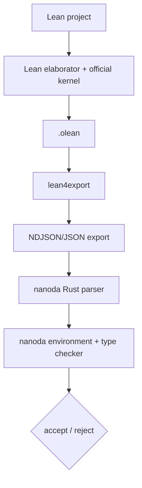
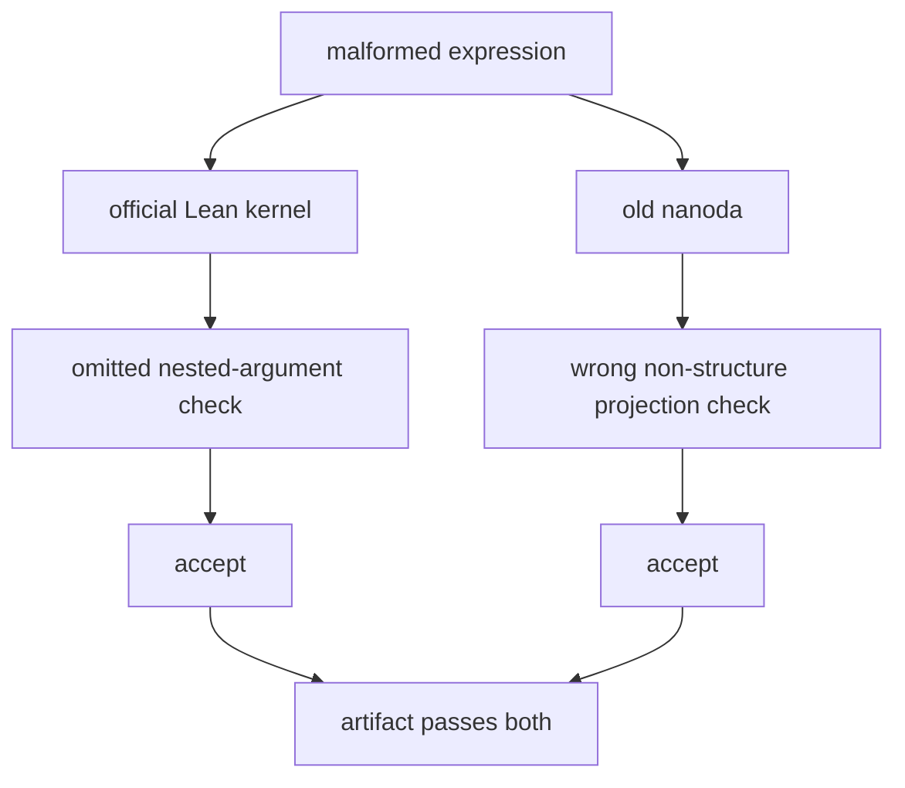

# nanoda：为什么 Lean 还需要另一个 kernel

Lean 已经有 kernel，为什么还要再写一个？

答案不是“官方 kernel 不可信，所以换成 nanoda”。nanoda 也有过 soundness bug，而且本系列的主事件正是旧版 nanoda 接受了一个它本应拒绝的 artifact。它的价值来自另一件事：**用另一种语言、另一套代码和另一条 proof replay 路径，减少 official Lean kernel 成为唯一故障点。**

[nanoda](https://github.com/ammkrn/nanoda_lib) 是一个 Rust 编写的 Lean 4 external type checker。

它读取 `lean4export` 产生的 proof environment，重新检查 declarations、theorem bodies、inductive types、recursors、projections、axioms 和 definitional equality。它不运行 tactic，也不需要相信原项目的 elaborator 输出过程；它关心的是最终导出的 kernel-level 对象能否在自己的实现中成立。

<!-- truncate -->

:::info 这篇文章在系列里的位置
本文是主文 [一份“反证 Collatz 猜想”的 Lean 代码，为什么同时通过了两个 checker](/blog/lean-conjecture-soundness-bug-collatz-comparator-nanoda) 的第二篇工具补充。主文是重点；这里专门解释其中另一个 checker：nanoda。
:::

:::tip 最短定义
nanoda 是 Lean 4 的外部 kernel/type checker 实现。它通过 `lean4export` 接收序列化 proof environment，在 Rust 进程里独立 replay；它降低单一 kernel implementation bug 的风险，但自己仍是需要版本锁定、回归测试和持续审计的软件。
:::

## kernel 在 Lean 里负责什么

Lean 前端做了大量方便人的工作：解析语法、展开 notation、寻找 typeclass instance、运行 tactic、执行 metaprogram、生成隐式参数。最后，这些工作都会变成一组更小的 kernel expressions 和 declarations。

kernel 的职责是检查这些对象是否符合 Lean type theory。对 theorem 来说，最核心的问题是：

```text
在当前 environment 与允许的 axioms 下，proof body 的 inferred type
是否 definitionally equal 于 theorem 声明的 type？
```

这也是 Lean trusted code base 可以相对小的原因。tactic 可以有 bug，甚至可以故意生成垃圾；只要 kernel 拒绝垃圾，逻辑 soundness 不受影响。

但“kernel”仍然是一份实现。实现复杂规则时可能漏检、错误归约或错误相信 auxiliary metadata。external checker 的思路不是改变 Lean logic，而是让同一份 proof object 接受第二次、实现不同的检查。

## external checker 与“再跑一次 Lean”有什么区别

如果同一份 `.olean` 再交给同一版本的 Lean kernel，能够捕获 transient corruption 或某些 loading 路径问题，却无法覆盖稳定存在于同一代码路径里的 implementation bug。

nanoda 走的是另一条链：



这条路径把几项信任拆开：

- source syntax、macros 和 tactics 已经消失，只剩 export。
- nanoda 不复用 official kernel 的 C++ implementation。
- Rust compiler/runtime 与 Lean 自举编译链不同。
- nanoda 可以独立实施 axiom allowlist 和 Nat/String kernel-extension policy。

当然，export layer 本身也成为边界。你仍然要相信 `lean4export` 输出的是待检查对象，或者至少让多个 checker 对同一份 export 达成一致。external checker 不是“摆脱所有信任”，而是重新划分和分散信任。

## nanoda 的输入和配置

`nanoda_bin` 接受一个 JSON config。proof export 可以从文件读取，也可以通过 stdin 流入：

```json
{
  "use_stdin": true,
  "permitted_axioms": [
    "propext",
    "Classical.choice",
    "Quot.sound"
  ],
  "unpermitted_axiom_hard_error": true,
  "nat_extension": true,
  "string_extension": true,
  "num_threads": 4
}
```

几个字段值得单独理解。

### `permitted_axioms`

nanoda 不会因为某个 declaration 名叫 axiom 就自动相信它。operator 要明确列出允许的 axioms。对常见数学 proof，通常会允许 `propext`、`Classical.choice` 与 `Quot.sound`。

`unpermitted_axiom_hard_error: true` 表示 export 里只要出现未允许 axiom 就立即失败。设为 `false` 时，nanoda 可以忽略没进入任何后续 declaration dependency 的 axiom；如果有实际 declaration 使用它，仍会失败。

当前版本还有 `unsafe_permit_all_axioms`，名字已经说明风险。它适合某些 Kernel Arena compatibility tests，不应成为验证数学提交的默认设置。

### Nat 与 String extensions

Lean 的 Nat/String kernel extensions 是性能和实践兼容性的一部分，但它们扩大了具体 checker 的实现面。nanoda 默认要求显式启用 `nat_extension`、`string_extension`，让 operator 知道自己把哪些 extension 纳入 trusted path。

### config 而不是一长串 CLI flags

nanoda README 解释，JSON config 是刻意选择：external checker 更可能被 CI 或 verifier suite 调用，而不是让人手动在终端逐项传参数。config 可以进入版本控制，也方便多个 checker 使用统一 policy。

## nanoda 怎么检查一份 export

代码入口很短：`src/main.rs` 解析 config 与 export，调用 `check_all_declars()`，任何检查 panic/error 都让进程失败。

真正工作分在几层。

### 1. parser 与 environment

`src/parser.rs` 读取 export 中的 names、universe levels、expressions 和 declarations，建立内部 DAG 与 declaration map。解析阶段也执行 back-reference、索引与配置约束检查，避免把格式错误的引用当作合法对象。

`src/env.rs` 定义 nanoda 认识的 declaration kinds：

- axiom
- definition
- theorem
- opaque
- inductive
- constructor
- recursor
- quotient

它还保存 constructor 的 `num_params`、`num_fields`，inductive 的 constructor 列表、index 数量、recursive/nested 标记，以及 recursor 的 motives、minors、rules、K-like 标记。这些 auxiliary fields 正是很多 checker soundness bug 的高风险区域：如果直接相信 export，而不从类型规则重新计算，它们可以让归约走向错误分支。

### 2. 普通 theorem 与 definition

`src/tc.rs` 的 `check_declar` 对 theorem、definition 和 opaque declaration 做两步：

```text
check_declar_info
infer(value)
assert_def_eq(inferred_type, declared_type)
```

`check_declar_info` 还会确认 universe parameters 不重复、declaration type 没有 free variables、type 自己确实 infer 成一个 sort；theorem 的 type 必须位于 `Prop`。

这与 official kernel 的抽象职责相同，但代码、数据结构、cache 和 reduction 实现不同。

### 3. inductive declarations

inductive checking 是最复杂的一块。nanoda 会：

1. 读取 mutual block 的原始 types 与 constructors。
2. 对 nested inductive 做 specialization。
3. 检查 inductive specs 与 constructors。
4. 构造临时 environment extensions。
5. 根据规则重新生成 recursors 与 recursor rules。
6. 将自己计算的 type、constructor、recursor 与 export 中声明的对象做 definitional equality 和 auxiliary-data 对照。

当前 `src/inductive.rs` 不只检查 term type，还会重新计算 `is_recursive`，验证 constructor 名称集合、参数/index 数、field 数、recursor motive/minor 数与 `is_k` 等 metadata。

这类“自己算一遍再比较”是 external checker 的关键。否则一个 hostile export 可以在 proof expression 看似正常的同时，对 `numFields` 或 recursor flags 撒谎。

### 4. Quotient、projection、reduction 与 equality

`src/quot.rs` 处理 Lean quotient primitives；`src/tc.rs` 实现 infer、weak-head normalization、definitional equality、projection 与 recursor reduction。`TcCache` 为 inference、reduction、equality 检查提供缓存。

缓存不是可有可无的性能细节。只要 cache key 或复用条件不够精确，攻击者就可能构造 hash/depth 相似但语义不同的 expressions，让错误结果跨上下文复用。本系列主事件对 official kernel 的 weaponization 就涉及这类 cache choreography。

## Lean Kernel Arena 如何测试 nanoda

[Lean Kernel Arena](https://github.com/leanprover/lean-kernel-arena) 是一个统一比较 Lean kernel implementations 的测试与 benchmark 框架。它把两个维度都写成配置：

- `tests/*.yaml`：proof/export、预期 `accept` 或 `reject`。
- `checkers/*.yaml`：checker 的 repo/commit、build command、run command。

checker 返回码被标准化：

- `0`：接受；
- `1`：拒绝；
- `2`：decline，表示实现不支持该 feature，而不是宣称 proof 无效；
- 其他值：checker error。

这种区分很实用。一个不支持 `native_decide` 的精简 kernel 可以 decline，而不需要为了覆盖率假装实现自己没有的逻辑。

Arena 的价值不只是跑 mathlib happy path。它明确鼓励提交 tricky corner cases，尤其是能暴露现有 checker bug 的 adversarial tests。2026 年 7 月，三个紧邻的 PR 把 nanoda 的问题集中在 inductive auxiliary data：

| Arena PR | 测试形态 | 错误信任的内容 |
| --- | --- | --- |
| [#81](https://github.com/leanprover/lean-kernel-arena/pull/81) | non-structure projection | 一个多 constructor inductive 被当作 structure 投影 |
| [#82](https://github.com/leanprover/lean-kernel-arena/pull/82) | constructor `numFields` lie | export 谎报 field 数，影响 eta/projection 行为 |
| [#83](https://github.com/leanprover/lean-kernel-arena/pull/83) | recursor K-like lie | export 错误声称 recursor 可以使用 K-like reduction |

这些测试后来成为 regression corpus。checker 的独立性不仅来自重写代码，也来自有人持续尝试构造它应该拒绝的输入。

## 旧版 nanoda 的 non-structure projection bug

Arena #81 的 schematic reproducer 很短：

```lean
inductive Bad : Prop
  | mk1 : False → Bad
  | mk2 : True → Bad

theorem bad : False := (Bad.mk2 True.intro).1
```

正常 structure projection 有严格前提：被投影的 inductive 应该只有一个 constructor、没有 indices，并满足相应 recursive 条件。`Bad` 有两个 constructors，显然不应该允许 `.1`。

旧 nanoda 在 inference projection 时没有完整验证这些结构条件。它可以拿第一个 constructor `mk1 : False → Bad` 的 field type，套到来自第二个 constructor的值 `Bad.mk2 True.intro` 上，于是“投影”出 `False`。

`nanoda_lib` commit `8e02a15`（合并于 PR #22）做了两类加固：

1. 更严格地区分可作为 structure 的 inductive，检查 single-constructor、no-index 和 recursion 条件。
2. 不再盲信 export 的 inductive auxiliary data，而是比较自己重建的 `num_params`、`num_indices`、constructor sets、`num_fields`、recursor motives/minors、rules 与 `is_k`。

这次修复同时覆盖了 #81 的 projection class，以及 #82/#83 暴露的 metadata trust 问题。

## 它怎样与 Lean 的 bug 拼在一起

[主事件](/blog/lean-conjecture-soundness-bug-collatz-comparator-nanoda) 中有两个相关 artifact，必须分开。

### Kiran 的 Lean-only 最小 reproducer

这个 MWE 利用 official Lean kernel 在 nested-inductive translation 中漏查参数。nanoda 的正常路径会检查 constructor 的完整、未被 translation 抹去的 declared type，因此修复版 nanoda 可以看到那个 ill-typed projection，并拒绝。

换句话说，external checker 正在做它应做的事：从不同表示与实现路径看见 official kernel 没看见的 term。

### 原始 Collatz artifact

原仓库额外使用了 `OrbitCarrier` / `NormalizedStep` 形式的 non-structure projection。旧 nanoda 在这里触发自己的 #81-class bug。

于是同一个 expression 同时满足：

- official Lean kernel：它位于 nested-inductive 参数漏检点，根本没被 type-check；
- old nanoda：它被检查了，但 projection 规则实现错了，因此被接受。



这是 independent checkers 很少见但不能忽略的失败模式：不同 bug 不需要长得一样，只要 adversarial input 能找到它们的接受集合交集。

它不说明多 checker 没意义。随机或普通实现 bug 通常会被另一实现挡住；这次 artifact 为同时命中两者投入了大量工程。多 checker 把攻击从“找到任一 kernel bug”提高到“找到可组合的跨实现 bug”，风险显著下降，只是没有归零。

## “独立实现”究竟独立到什么程度

外部 checker 的价值与独立性有关，但独立性不是 Boolean。

### host language 独立

nanoda 用 Rust，official Lean kernel 的关键实现路径来自 Lean/C++ runtime。compiler、memory model、容器类型和许多基础库不同，这能减少一部分 common-mode failure。

### 数据结构与算法独立

nanoda 使用自己的 expression DAG、environment、union-find/caches、reduction 与 equality code。即使实现同一逻辑规则，错误位置通常不同。

### specification 独立

这是最弱也最难的一层。nested inductive 在 Lean 中非常复杂，完整可执行 spec 并不充分独立于 official implementation。Zulip 讨论指出，Lean4Lean 的 inductive 实现当时也主要跟随 official kernel，因而带上同一 bug。

如果第二个 checker 为了兼容性照着第一个 checker 的特殊 case 翻译，它可能拥有独立代码，却继承同一未写明的假设。Kernel Arena、Type Checking in Lean 4 这类文档与 formal kernel specification，都是在补这层独立性。

## LeanEval 现在怎样强制使用 nanoda

2026 年 7 月 30 日，LeanEval 合并 [`#486`](https://github.com/leanprover/lean-eval/pull/486)。它没有简单地把每个 problem 的 config 手工改成 `enable_nanoda: true`，而是在统一 `WorkspaceTest.lean` 中覆盖提交的配置：

```lean
let config := config.setObjVal! "enable_nanoda" (Json.bool true)
```

这有三个效果：

1. nanoda 是整个 eval 的 policy，不是 problem author 可选项。
2. submitter 或旧 config 不能关闭 external checker。
3. `nanoda_bin` 缺失时 evaluation 失败，不会静默降级。

LeanEval 还 pin 了具体 nanoda commit，并要求 submissions pipeline 同步安装。此次变更记录的是 comparator.live 使用的 fork [`robsimmons/nanoda_lib@68d5ca9`](https://github.com/robsimmons/nanoda_lib/commit/68d5ca9db226849b41a6fff59d796ff19d0a8840)，不能把它和任意时刻的 `ammkrn/nanoda_lib@master` 当成同一个抽象版本。当前有效验证链是：

```text
Comparator
  ├─ Challenge/Solution constant graph
  ├─ permitted axioms
  ├─ sandboxed build + export
  ├─ standard Lean kernel replay
  └─ nanoda external replay
```

注意“用了 nanoda”仍不是版本无关的安全声明。原始 Collatz artifact 对 old nanoda 和 fixed nanoda 的结果不同。任何 evaluation report 都应该保存 nanoda commit、lean4export format、Lean toolchain 与实际 stdout/exit status。

## nanoda 不能替你做什么

### 它不判断 theorem statement 是否是你想问的问题

nanoda 检查 kernel object，不理解“这个 formal definition 真的是 Collatz divergence 吗”。statement integrity 需要 Comparator，数学语义对应需要 reviewer。

### 它不自动隔离 untrusted build

nanoda 接收 export。source elaboration 和 export 生成时的 sandbox 属于 Comparator/runner 的职责。只在已经被 hostile project 控制的机器上运行 nanoda，没有恢复可信环境。

### 它不提供绝对 soundness 证明

nanoda 是一份相当复杂的 Rust implementation。#81–#83 已经说明它也会犯错。对 checker 本身仍需要 code review、pins、regression tests、fuzzing 与更清晰的理论 spec。

### 它不应被配置成“什么 axiom 都接受”后仍宣称 kernel-only proof

Arena 为兼容性可能使用 `unsafe_permit_all_axioms`，数学验证不应照抄。operator 必须明确说明 axiom policy 与 kernel extensions。

## 如果要在自己的验证流程中使用

1. 用 `lean4export` 生成与 nanoda 版本兼容的 export。
2. 将 nanoda source pin 到具体 commit，不要在 CI 每次拉 mutable `master`。
3. 配置最小 `permitted_axioms`，明确 Nat/String extensions。
4. 将 `nanoda_bin` 缺失、decline 或非零退出都处理成明确结果，不能静默跳过。
5. 保留 standard Lean kernel replay；nanoda 是第二意见，不是简单替换。
6. 用 Lean Kernel Arena 的 reject tests 验证所 pin 版本，尤其关注 inductive、projection、universe 和 recursor cases。
7. 记录 export format 与 checker versions，确保未来能复现。

## 最后

nanoda 的意义不在于“Rust 比 Lean/C++ 更可靠”。它的意义是让一份重要 proof 不再只面对一个实现、一种数据结构和一条 replay path。

本系列事件也给这种乐观加了一条必要限制：独立 checker 可以有独立 bug，甚至被同一个精心构造的 artifact 同时命中。正确结论不是退回单 kernel，而是继续提高独立性：更完整的 spec、更强的 auxiliary-data reconstruction、更多 adversarial tests、严格版本 pin，以及 Comparator 对 statement 和 build boundary 的保护。

- [返回主文：一份“反证 Collatz 猜想”的 Lean 代码，为什么同时通过了两个 checker](/blog/lean-conjecture-soundness-bug-collatz-comparator-nanoda)
- [配套阅读：Comparator 到底在检查什么](/blog/lean-comparator-trust-boundary-guide)

## 主要来源

- [ammkrn/nanoda_lib](https://github.com/ammkrn/nanoda_lib)
- [Type Checking in Lean 4](https://ammkrn.github.io/type_checking_in_lean4/)
- [Lean Kernel Arena](https://github.com/leanprover/lean-kernel-arena)
- [Lean Kernel Arena #81：non-structure projection](https://github.com/leanprover/lean-kernel-arena/pull/81)
- [nanoda_lib #22：structure 与 inductive checks](https://github.com/ammkrn/nanoda_lib/pull/22)
- [leanprover/comparator](https://github.com/leanprover/comparator)
- [LeanEval #486：require nanoda for every solution](https://github.com/leanprover/lean-eval/pull/486)
- [Lean Zulip 主帖](https://leanprover.zulipchat.com/#narrow/channel/270676-lean4/topic/Counterexample.20to.20the.20Lean.20Conjecture.20.28Soundness.20Bug.29/near/613135216)
