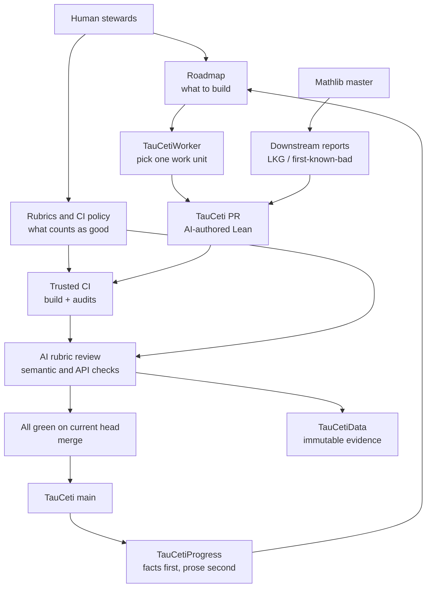

2026 年 6 月，Tau Ceti 还是一个新仓库。到 7 月 31 日的固定快照，它已经有 **932 个 Lean 源文件、171,565 行代码和 1,336 个已合并 PR**。在最忙的一天，100 个 PR 进入 `main`。

如果只看这些数字，Tau Ceti 很容易被概括成“AI 正在复制 Mathlib”。但我把它的五个组织仓库、Worker、review archive 和依赖更新链条全部拉到本地后，发现真正值得研究的并不是 AI 写 Lean 有多快，而是它怎样重组了一座数学库的生产关系：

> **人类写 roadmap 和 rubric，AI 写代码、修代码、审代码；Lean kernel 与 trusted CI 负责机械裁决；每一次 review 都成为公开数据。**

这不是一个更大的 theorem-proving benchmark，而是一套正在运行的 formal-library operating system。

<!-- truncate -->

:::info 关于快照
本文的代码与 build 结论固定在 [`TauCeti@a3913fd`](https://github.com/TauCetiProject/TauCeti/commit/a3913fd9111b851af857f720b4ce6721e6634183)，GitHub PR 数据抓取于 2026-07-31 稍晚时间。项目更新极快，因此线上计数会继续增长。所有百分比和规模都描述这个快照，而不是永久状态。
:::

## 先纠正“AI Mathlib”这个叫法

Tau Ceti 的 [README](https://github.com/TauCetiProject/TauCeti/blob/a3913fd9111b851af857f720b4ce6721e6634183/README.md) 说得很清楚：它要 formalize 尽可能多的数学，但**不打算取代 Mathlib 的 human curation、clarity 与 understanding**。

它依赖 Mathlib，跟随 Mathlib 的命名和设计决策，也不会自动把自己的产出反向推回 Mathlib。Mathlib 贡献者可以挑选、修改、消化其中的内容，再决定是否 upstream。

所以四种说法里，只有两种准确：

| 说法 | 判断 |
|---|---|
| “AI 在写一座大型 Lean 数学库” | 是，按项目贡献政策，`TauCeti/` 由 AI author agents 维护 |
| “人类已经退出 formalization” | 否，人类控制 roadmap、rubric、CI policy、GitHub 权限与异常处理 |
| “Tau Ceti 是 Mathlib 的替代品” | 否，它是 Mathlib downstream，并把 Mathlib 当作设计权威 |
| “Tau Ceti 在实验 AI 能否运营一座数学库” | 是，这才是项目的核心问题 |

一个更准确的结构是：

```text
Mathlib             提供经过人类长期打磨的共同语言与设计方向
Tau Ceti            用 AI 高速扩展可复用的 downstream substrate
frontier projects   从两者取用材料，继续走向研究前沿
```

## 五个仓库不是拆包，而是 trust architecture

Tau Ceti 根 README 仍写着 “three repositories”，但实时 organization 已经有五个：

1. [`TauCeti`](https://github.com/TauCetiProject/TauCeti)：AI-authored Lean mathematics 与 trusted CI 外壳；
2. [`TauCetiRoadmap`](https://github.com/TauCetiProject/TauCetiRoadmap)：human-controlled mathematical specifications；
3. [`TauCetiReview`](https://github.com/TauCetiProject/TauCetiReview)：human-written rubrics、review engine 与 merge policy；
4. [`TauCetiData`](https://github.com/TauCetiProject/TauCetiData)：每次 AI review 的 durable archive 与 evaluation corpus；
5. [`TauCetiProgress`](https://github.com/TauCetiProject/TauCetiProgress)：从 git、PR 与 doc-gen 事实生成 roadmap status/progress。

此外，[`TauCetiWorker`](https://github.com/kim-em/TauCetiWorker) 是实际驱动 author、fix、review 和 Mathlib bump 的 operator-side worker。



关键点不是“microservices 比 monorepo 好”，而是**生成代码不能同时定义自己的任务、修改自己的评分标准、选择自己的证据和批准自己的 merge**。

仓库分离把这些权力拆开了。

## Roadmap：人类不再逐行写 proof，而是写可执行规格

Tau Ceti 的 roadmap 不是一句“请形式化 genus theory”。一个合格 roadmap 要交代：

- Mathlib 已经有什么；
- 缺失的对象和 theorem 是什么；
- 依赖顺序如何；
- 应采用什么 generality 与 convention；
- 哪些已有代码可以迁移，license/provenance 是什么；
- 哪些 concrete examples 能发现 vacuous definition；
- 推荐的 Lean signature 长什么样。

以 [`Multiquadratic`](https://github.com/TauCetiProject/TauCetiRoadmap/blob/5e1441112a2bf60b9bb19bd0df3800d95d98977f/TauCetiRoadmap/Multiquadratic/README.md) 为例，它把工作拆成：

1. multiquadratic field 的 degree 与 Galois group；
2. prime-splitting law；
3. `Cl/Cl²` 这个 elementary-2 quotient；
4. genus field 与 2-rank theorem。

它还特别警告：

- characteristic 2 会让整个叙事失效；
- ramification at 2 需要 prime discriminants，而不只是 squarefree radicands；
- `Cl/Cl²` 不是 `Cl[2]`；
- 实二次域的公式需要 narrow class group。

配套的 [`Suggested.lean`](https://github.com/TauCetiProject/TauCetiRoadmap/blob/5e1441112a2bf60b9bb19bd0df3800d95d98977f/TauCetiRoadmap/Multiquadratic/Suggested.lean) 用 `sorry` 写出 target signatures，但文件开头明确说：Markdown 才是 specification，Lean signatures 只是让 author 与 reviewer 对目标形状收敛。

这揭示了新的人工瓶颈：**当 proof 变便宜，最难的工作变成把数学领域压缩成不会把 AI 引向错误 abstraction 的 roadmap。**

## Worker：不是一个超级 agent，而是一支可并发的流水线

TauCetiWorker 采用 “bring your own agent”。任何人都可以用自己的 GitHub account、fork、模型订阅和机器运行 worker。

一轮只做一个 work unit，并按固定优先级选择：

```text
rebase conflict
  > fix red CI
  > address or contest review findings
  > review a green PR
  > repair a Mathlib bump
  > author a new roadmap target
```

这个顺序很重要。它把“先把已有工作收尾”写进 queue policy，避免 generator 不断开新 PR、review 和 maintenance 永远追不上。

多个 worker 没有中央调度器。它们通过 GitHub-visible state 协作：

- roadmap issue 上有带 TTL 的 intention/claim；
- `refs/tauceti-claims/*` 提供短期 lease；
- push 使用 `--force-with-lease` compare-and-swap；
- PR body 有 machine-readable target marker；
- current scoreboard/ledger 告诉其他 worker 哪个 head 已经 review。

[`COORDINATION.md`](https://github.com/TauCetiProject/TauCeti/blob/a3913fd9111b851af857f720b4ce6721e6634183/COORDINATION.md) 把规则分成两类：

- `[COOP]` 只减少重复 compute；
- `[HARD]` 防止覆盖 branch、无理由关闭 PR、绕过 review merge。

即使所有人忽略 cooperative claim，合规 worker 的最坏结果也应该是**重复做功，而不是丢失别人的工作**。

### 一个不能略过的安全细节

Worker 当前默认在 host 上执行 agent；Codex authoring 使用 `danger-full-access`。更安全的 [`bubble`](https://github.com/kim-em/bubble) 模式需要显式 `--bubble`：它用 Incus container、repo-scoped GitHub proxy、单一 provider credential 和网络 allowlist 隔离工作。

这意味着 Tau Ceti 的 CI 是 secure-by-default，但 operator-side autonomous authoring 目前仍是 secure-by-option。后文会回到这个风险。

## CI：Lean code 不只是文本，它在 build 时能执行代码

Lean elaboration、macro、`initialize`、`#eval` 和 Lake config 都可能执行任意代码。让 PR 修改自己的 workflow，再在带 secrets 的 runner 上直接 `lake build`，不是安全模型。

Tau Ceti 的 [`pr-build.yml`](https://github.com/TauCetiProject/TauCeti/blob/a3913fd9111b851af857f720b4ce6721e6634183/.github/workflows/pr-build.yml) 因此使用 base-defined `pull_request_target`：

1. checkout trusted base；
2. 无 credential checkout untrusted PR；
3. 只 overlay `TauCeti/`、空 root module 与经过验证的 pin；
4. 拒绝 symlink、`set_option`、跨入 Roadmap/Review 的 import；
5. 限制 diff 与新文件大小；
6. 在 checksum-pinned `landrun` 下离线 build；
7. 分别发布 `build`、`scope`、`bump-guard` 状态。

sandbox 中运行四层检查：

- `lake build --iofail`；
- compiled axiom audit；
- module-system audit；
- Mathlib environment linter + docstring/baseline audit。

我在本地固定快照上实际运行了同一机械核心：

| 本地验证 | 结果 |
|---|---:|
| Lake build jobs | 5,945，全部成功 |
| compiled Tau Ceti declarations | 16,947 |
| 允许 axioms | `propext`、`Classical.choice`、`Quot.sound` |
| module-system audit | 933/933 modules 通过 |

这证明的是：代码在该 toolchain/Mathlib pin 下能够通过标准 Lean kernel 与项目 policy。

它**不证明** definition 表达了正确对象，也不证明 theorem statement 对应 roadmap 的数学含义。

## AI review：专门填 kernel 留下的 semantic gap

TauCetiReview 把 review 分成十个角度：

| Rubric | 问题 | 可否 `block` |
|---|---|---:|
| correctness | statement/definition 是否真的表达目标数学 | 是 |
| reuse | 是否重复 Mathlib/Tau Ceti 现有 API | 直接重复时是 |
| scope | 是否推进一个 human roadmap target，且 PR 单一主题 | 是 |
| attribution | 是否缺失明确来源/credit | 明确缺失时是 |
| API design | public surface 与 characteristic API 是否合适 | 否 |
| generality | assumptions 是否最弱、层次是否自然 | 否 |
| placement | 文件位置与 imports 是否正确 | 否 |
| naming | 名称与 notation 是否符合结论和惯例 | 否 |
| documentation | docstring 是否准确 | 否 |
| proof quality | proof 是否稳健、可维护 | 否 |

[`correctness.md`](https://github.com/TauCetiProject/TauCetiReview/blob/f0cf746096a8637b7a1703911a0c02a5ec93283c/rubrics/correctness.md) 的第一句就是：

> green proofs can still state the wrong theorem

它要求 reviewer 主动找 quantifier 错位、vacuity、把困难塞进 hypotheses、`True` placeholder、没有 consumer 的 predicate 和过强 typeclass assumptions。

而 [`_common.md`](https://github.com/TauCetiProject/TauCetiReview/blob/f0cf746096a8637b7a1703911a0c02a5ec93283c/rubrics/_common.md) 把 PR diff、comments、docstrings、commit messages 全部视为 attacker-controlled data。Reviewer 只有 read tools，没有 merge 权；真正 verdict 必须出现在 runner 生成的一次性 marker 之后，PR 里伪造的 `{"verdict":"approve"}` 无法进入解析通道。

### “十个独立 agent”不等于“十种独立认知”

每个 rubric 是独立 execution 与独立 attention angle，但未必是不同 model。当前 archive 中，大多数 production review 来自 Codex 或 Claude；一个 PR 的十个角度完全可能由同一模型执行。

这能减少一个大 prompt 里的 attention conflict，却不能消除 shared blind spot。

## 一条完整证据链：PR #1434

[`TauCeti#1434`](https://github.com/TauCetiProject/TauCeti/pull/1434) 实现 multiquadratic field 的 relative Galois group，最后成为本文固定的 main commit。

它不是一次 review 绿灯：

| Round | Head 上发生了什么 |
|---|---|
| 1 | correctness 通过；reuse 发现三个 public declarations 重复 Mathlib instance API，直接 `block` |
| 2 | scope/attribution/placement/naming/docs/proof 通过；reuse、API design、generality 要求修改 |
| 3 | 三个未解决角度重跑，仍要求修改 |
| 4 | reuse/API/generality 清除；documentation 抓到一个过度声称的 docstring |
| 5 | 十个角度全部在 final head 通过 |

总计：

- 5 个 heads / 5 rounds；
- 34 次 rubric execution；
- 26 approve、7 request changes、1 block；
- 约 17.5 分钟 aggregate model runtime；
- 约 7.32 美元 API-equivalent review cost。

最终源码明确改为组合 Mathlib 的 `IntermediateField.fixingSubgroupEquiv`，而不是手工重证 bijection。这与 reuse review 的要求一致。

这个案例证明 AI review 能改变代码，不只是给 build 贴章。

它仍然不能证明最终数学经过 domain expert 审核；而且这 34 次 review 全部由同一个 `gpt-5.6-sol` 模型执行。

## TauCetiData：review 本身也要被 review

GitHub scoreboard 会在新 round 中原地更新，不适合作为历史记录。TauCetiData 因此把每次执行写成 immutable record：

```text
(PR, head SHA, rubric, model)
  + exact diff hash
  + rubric/engine SHA
  + prompt policy
  + verdict/findings
  + token/runtime/cost
  + content-addressed transcript blob
```

本地扫描 [`TauCetiData@08187cf`](https://github.com/TauCetiProject/TauCetiData/tree/08187cf484f2190e39ffc842d595171856963577) 得到：

| Archive item | Count |
|---|---:|
| review runs | 50,361 |
| distinct reviewed PR numbers | 1,223 |
| distinct PR-head pairs | 4,876 |
| round records | 6,641 |
| compressed diff/transcript blobs | 45,440 |
| A/B pairs | 398 |
| AI pairwise judgments | 2,102 |
| human meta-review decisions | 35 |

全历史 execution error 占 23.5%，但这个数字被早期 provider/infra failures 主导：

- 7 月以来约 3.0%；
- 最近一周约 1.1%；
- 7 月 29 日以后约 0.06%。

这说明 runner 已经稳定很多。它不说明 review 更正确——**能够稳定输出错误 approval，也会得到漂亮的 reliability 曲线。**

Archive 中约 11,602 美元是按 token 和当日 price table 复算的 API-equivalent cost；快照里的 exact runs 都标记为 subscription auth，不应把它直接写成项目现金支出。

### Meta-review 还很早

TauCetiData 已经能让两个 reviews 在相同 `(PR, head, rubric)` 上 A/B：judge 会看到实际 checkout，交换两种 presentation order，并尝试用 cross-family panel 降低 self-preference。

但当前只有 35 个 human decisions，而且 design doc 明确说 resolver/resolution pipeline 尚未完成。

50,361 次 AI review 是规模；35 个人工标签才是校准。两者不能混为一谈。

## 17 万行到底意味着什么？

固定快照的增长很惊人：

| 指标 | 数值 |
|---|---:|
| 仓库年龄 | 约 60 天 |
| `TauCeti/` Lean LOC | 171,565 |
| merged PRs | 1,336 |
| PR merge latency 中位数 | 1.86 小时 |
| 24 小时内 merge | 94.3% |
| 单日最高 merge | 100 PRs |
| 最近七个抓取日 | 358 merged PRs |
| source additions / deletions | 196,223 / 24,658 |

但 LOC 不是 theorem，也不是 roadmap completion。

新上线的 TauCetiProgress 对 ReductiveGroups 做了第一份细读报告：100 个 PR 中，55 个没有新增 declaration，而是在拆目录、改 imports、rename 和 consolidate。其余很多是让 comodule API 可用的 `_apply`、`_comp`、`_toLinearMap` plumbing。

这些工作未必浪费。Mathlib 自己也靠大量 plumbing 才能复用。问题是：

> **PR 数量衡量流水线吞吐，roadmap summit 才衡量数学完成。**

目前 14 个 active roadmap 中，只有 ReductiveGroups 有生成的 `STATUS.md` / `PROGRESS.md`；它仍把 scheme-side equivalence、Lie theory、unipotence、reductivity 与 classification 标成 untouched。

Tau Ceti 已经解决“能不能高速生产 Lean”，还没有解决“这些 Lean 在半年后有多少仍被使用”。

## 它怎样追着 Mathlib 跑

Tau Ceti 不是固定 Mathlib release 上的静态项目，而是尝试跟随 master。

[`update.yml`](https://github.com/TauCetiProject/TauCeti/blob/a3913fd9111b851af857f720b4ce6721e6634183/.github/workflows/update.yml) 每天调用 SHA-pinned [`downstream-reports`](https://github.com/leanprover-community/downstream-reports)：

- compatible：打开/更新 last-known-good forward bump；
- incompatible：记录 first-known-bad commit，开 issue 与 repair PR；
- Worker 的 `bump` phase 修复代码；
- bump guard 只允许严格的 forward pin/toolchain transition。

不到两个月的 main history 里至少有 26 个 dependency/pin-related commits。抓取时又有新的 Mathlib incompatibility issue 与 bot repair PR 在进行。

这也回应了上一篇 [“我们真的被 Lean 锁定了吗？”](/blog/are-we-stuck-with-lean-mathlib-proof-portability)：Tau Ceti 不是在缓解 Lean lock-in，而是在极大增强 Lean/Mathlib ecosystem 的生产速度。未来跨 prover 的 roadmap/spec translation 或许会降低迁移成本，但今天它仍是一台 Lean accelerator。

## 六个不能被规模掩盖的问题

### 1. Same-model review monoculture

十个 angle 不等于十个独立 verifier。需要按风险抽样引入第二 provider 与 domain expert。

### 2. Worker host mode 默认过宽

CI sandbox 很强，但 persistent worker 的安全模式是 opt-in。对 unattended agent，Bubble 应更接近默认而不是高级选项。

### 3. Rubric freshness 还有已知缺口

Review 会记录 rubric fingerprint，但当前源码注释明确说：rubric 修改还不会让 carried-forward approvals 自动 stale，相关 issue 仍在跟踪。Head freshness 已解决，policy freshness 尚未完全解决。

### 4. Human calibration 与 AI review 不成比例

50k reviews 对 35 human decisions。项目已经有正确的 evaluation 架构，但还没有足够 ground truth 支撑“AI review 准确率很高”的结论。

### 5. 长期维护没有经过时间检验

两个月无法证明 API 经得起多次 Mathlib migration、consolidation、downstream use 和 model/maintainer turnover。

### 6. Data 与 governance 都有 scale/bus-factor 风险

TauCetiData 已有 115,555 个 tracked files、8,603 commits；继续按当前速度需要 sharding/packing。Worker、Review 和 GitHub App 的运行知识也高度集中在少数维护者身上。

还有一项值得补充：Tau Ceti 自己目前依赖标准 Lean kernel，没有把 nanoda、Lean4Lean 或另一套 external kernel 加进项目 workflow。独立 checker 可以增加 implementation diversity，但仍不能判断 statement 是否忠实。关于这个边界，可以参见[此前的 Lean soundness 分析](/blog/lean-conjecture-soundness-bug-collatz-comparator-nanoda)。

## 最值得迁移的不是代码，而是方法

即使 Tau Ceti 最后没有成为长期数学基础设施，它已经提供了几条可复用的工程原则：

### Policy 与 generated code 分仓

生成器不能修改自己的 roadmap、rubric 和 trusted CI。

### Deterministic control，generative prose

能用 Python 决定的 window、cursor、PR set、declaration list，不交给模型。模型只写 status prose，并明确标注未验证。

### Review 是 data product

保存 exact diff、rubric SHA、model、verdict 与 transcript，才能比较模型、复盘 incident、做 human calibration。

### 当前 head 才有 approval

一旦 push，新 head 必须重新 review；merge 读 ledger，不信 rendered comment。

### 生成必须有 backpressure

先 rebase/fix/review，再 author；否则 AI 只会把 bottleneck 从写 proof 转成无限积压。

### Cooperative coordination 与 hard safety 分开

Claim 可以 fail-open，branch overwrite 必须 fail-closed。

## 最终判断

Tau Ceti 已经证明了三件事：

1. AI 可以在很短时间内生成一座大型、可 build、通过 axiom audit 的 Lean downstream library；
2. AI review 可以被做成 iterative、multi-angle、可留证据的工程流程；
3. 去中心化 workers 可以在 Mathlib 持续变化时维持极高吞吐。

它还没有证明：

- semantic accuracy 能达到同样规模；
- API 会长期保持 coherent；
- 独立 downstream 会广泛复用这些 declarations；
- 这种成本和治理模式能持续多年。

:::tip 更准确的定义
**Tau Ceti 是一次公开实验：把 formal-library engineering 从“人类写 proof”迁移到“人类写 specification、policy 与 audit”。**

这比“AI Mathlib”更精确，也更值得关注。
:::

下一阶段最有价值的数字，不是第 20 万行，而是：domain-expert overturn rate、90/180 天 API survival、独立 downstream consumers、每次 Mathlib bump 的 repair cost，以及 roadmap acceptance criteria 真正完成了多少。

---

## 主要资料

- [TauCetiProject/TauCeti](https://github.com/TauCetiProject/TauCeti)
- [TauCetiProject/TauCetiRoadmap](https://github.com/TauCetiProject/TauCetiRoadmap)
- [TauCetiProject/TauCetiReview](https://github.com/TauCetiProject/TauCetiReview)
- [TauCetiProject/TauCetiData](https://github.com/TauCetiProject/TauCetiData)
- [TauCetiProject/TauCetiProgress](https://github.com/TauCetiProject/TauCetiProgress)
- [kim-em/TauCetiWorker](https://github.com/kim-em/TauCetiWorker)
- [Tau Ceti review security model](https://github.com/TauCetiProject/TauCetiReview/blob/f0cf746096a8637b7a1703911a0c02a5ec93283c/SECURITY.md)
- [Tau Ceti review evaluation design](https://github.com/TauCetiProject/TauCetiData/blob/08187cf484f2190e39ffc842d595171856963577/docs/eval-design.md)
- [leanprover-community/intentions](https://github.com/leanprover-community/intentions)
- [leanprover-community/downstream-reports](https://github.com/leanprover-community/downstream-reports)
