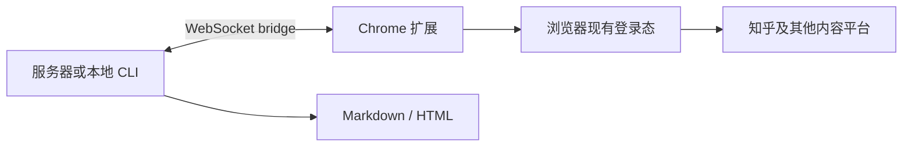
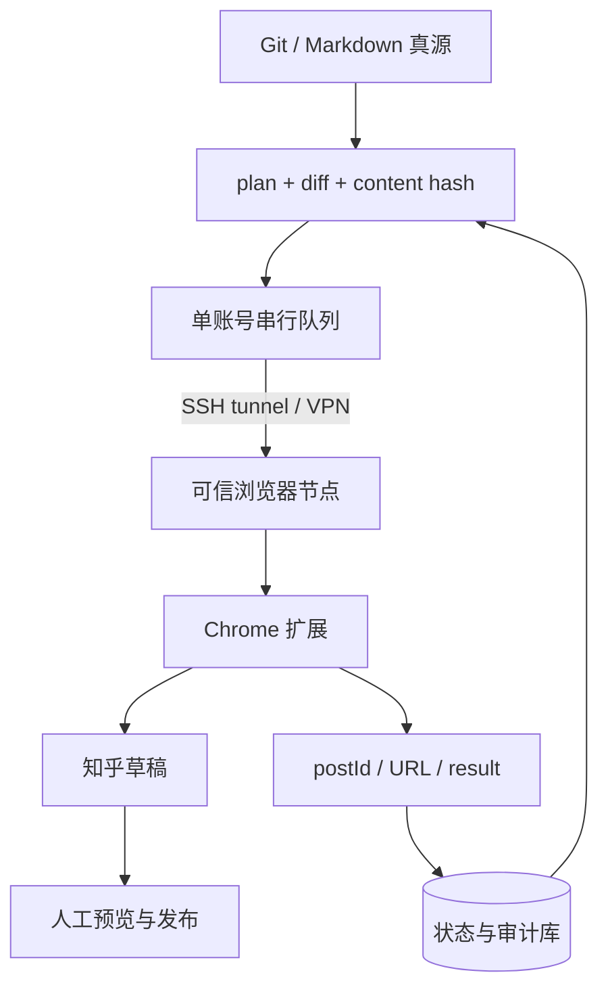

# 把知乎发布做成服务器任务：哪种 CLI 方案最稳？

理想中的知乎发布流程应该很简单：文章放在 Git 里，服务器执行一条命令，系统找到对应的知乎文章，更新正文和图片，留下日志，最后等人确认发布。

但真正把它做成长期服务，会遇到四个比“Markdown 怎么转 HTML”更难的问题：知乎是否提供稳定的写入契约、登录态应该放在哪里、怎样保证每次更新的是同一篇文章，以及失败以后如何判断远端到底有没有成功。

<!-- truncate -->

:::tip 先给结论
截至 2026-07-31，如果拿不到知乎的书面许可或合作接口，**最稳的生产路径是“服务器 CLI 自动准备 + 人工进入知乎发布”**。如果已经获得自动化授权，当前最可维护的技术基础才是“服务器 CLI 控制面 + 可信 Chrome 执行面”：服务器管理 Git、文章 ID、内容哈希、队列和审计；一台长期登录知乎的浏览器节点通过扩展执行实际写入。

开源实现里，[Wechatsync](https://github.com/wechatsync/Wechatsync) 最接近这个架构；但它当前对知乎只会创建新草稿。要稳定更新同一篇文章，还需要补上 `article_id` 映射和 `update` 流程，而 [Zhihu on Obsidian](https://github.com/zimya/zhihu_obsidian) 已经提供了可审计的实现参考。
:::

:::warning 合规边界比技术选型更优先
知乎现行[《知乎协议》](https://www.zhihu.com/term/zhihu-terms)更新于 2025-03-20、2025-03-25 生效。其中“使用规则”明确限制：除非法律允许或经知乎事先书面许可，不得使用未经授权的插件、第三方工具或自动化程序接入知乎。

因此，本文是一份架构与开源项目审计，不是对无人值守发布的授权。正式业务应先取得必要许可；技术验证也应限于自有内容、低频测试草稿，不绕过验证码和风控，不做批量垃圾发布。
:::

## “稳定”不是今天能发成功

一个脚本连续成功三次，不代表它适合放到服务器跑三年。这里把稳定拆成七个维度：

| 维度 | 要问的问题 | 常见失败 |
|---|---|---|
| **平台契约** | 是公开写 API、合作接口，还是网页内部接口？ | 接口无通知变更、账号被限制、无法获得支持 |
| **认证** | 登录态由浏览器持有，还是把 Cookie 导出到服务器？ | Cookie 过期、验证码、异地登录、凭据泄露 |
| **文章身份** | 能否更新指定文章 ID？ | 每次创建新草稿，出现重复文章 |
| **幂等** | 同一个任务执行两次会怎样？ | 超时重试后创建两份草稿或重复发布 |
| **恢复** | 能否知道远端成功到了哪一步？ | 图片只传了一半，客户端却记录“完成” |
| **维护** | 适配器、测试、许可证和社区是否健康？ | 页面选择器变更后无人修复 |
| **内容保真** | Markdown、图片、公式、表格和封面是否可预测？ | 本地预览正常，远端排版损坏 |

按这个口径，路线大致可以分成五档：

| 层级 | 路线 | 判断 |
|---|---|---|
| **S** | 知乎书面许可或合作写接口 | 契约和合规最稳，但普通开发者未必可获得 |
| **A** | 经授权的服务器 CLI + 登录浏览器扩展 | 当前开源方案中安全性、可维护性和自动化程度最平衡 |
| **B** | Obsidian/桌面插件直连网页内部接口 | 可以更新同一文章，适合个人工作流和实现参考 |
| **C** | 扩展在新建页做 DOM 填充 | 适合半自动分发，但通常没有可靠的既有文章映射 |
| **D** | 服务器直存 Cookie 或 Headless Playwright | 看起来最“纯 CLI”，实际认证、合规和运维风险最高 |

S 级路线没有技术悬念：有公开契约、权限范围、版本策略和支持渠道，当然最稳定。问题是，在本轮公开资料核验中，没有找到面向普通开发者、仍可访问且明确支持创建或编辑文章的知乎公开写 API。这不证明知乎不存在私有合作能力，只说明它不能被当成一个人人可调用的公共基础设施。

[知乎数据开放平台](https://developer.zhihu.com/)的[结构化文档端点](https://developer.zhihu.com/console/api/v2/docs)在 2026-07-31 返回 22 个条目。其中用户内容接口是 `GET https://developer.zhihu.com/api/v1/user/contents`，用于列出公开范围内的回答、文章、视频、想法和问题；本次枚举没有看到草稿创建、文章更新、发布、取消发布、删除或发布用媒体上传接口。OAuth 接入文档要求通过 `product-platform@zhihu.com` 申请 `app_id` 和 `app_key`，这也是询问合作写权限与自动化授权范围的官方入口。

所以真正需要比较的是 A 到 D。

## 开源项目里，谁最接近服务器 CLI？

这轮核验覆盖了 Wechatsync、MultiPost、PostBot、ArtiPub、COSE、SyncCaster、Zhihu on Obsidian、VSCode-Zhihu 和若干 Python 发布器。下面不是统一环境的成功率 benchmark，而是截至 2026-07-31 对 README、源码、提交活跃度、许可证和知乎适配器的审计。

| 项目 | 形态与知乎写入方式 | 更新既有文章 | 判断 |
|---|---|---|---|
| [Wechatsync](https://github.com/wechatsync/Wechatsync) | Chrome 扩展 + CLI/MCP；浏览器登录态 + 网页内部接口 | **当前未接通**；每次新建草稿 | **最接近服务器基础** |
| [Zhihu on Obsidian](https://github.com/zimya/zhihu_obsidian) | Obsidian 插件；插件登录态 + 网页内部接口 | **已实现** | 最好的更新语义参考 |
| [SyncCaster](https://github.com/RyanYipeng/SyncCaster) | Chrome 扩展 + Agent bridge；DOM 自动填充 | 未发现知乎既有 ID 入口 | 可借鉴任务模型 |
| [COSE](https://github.com/doocs/cose) | doocs/md 配套扩展；打开新建页、粘贴 Markdown | 未发现 | 适合人工编辑后多平台填充 |
| [MultiPost](https://github.com/leaperone/MultiPost-Extension) | 浏览器扩展 + API 入口；DOM 自动填充 | 未发现 | 平台广，更新语义不足 |
| [PostBot](https://github.com/gitcoffee-os/postbot) | 扩展/平台/CLI 生态；DOM 填充 | 未发现 | 功能广，需核对定制许可证 |
| [ArtiPub](https://github.com/crawlab-team/artipub) | Web 平台 + Puppeteer/AI workflow | 不是当前重点 | 部署和维护面较重 |
| [zhihu-publisher](https://github.com/delankesita/zhihu-publisher) | Python CLI；服务器 Cookie + HTTP | 代码声明支持 | 真实接口测试不足 |

### 获得授权后，为什么从 Wechatsync 起步

Wechatsync 的关键价值不是“平台最多”，而是它已经把控制面和登录态拆开：



CLI 可以读取 Markdown/HTML、处理本地图片、执行 dry-run、检查平台登录状态，再把任务交给扩展。扩展使用浏览器里已经存在的会话，避免把知乎主 Cookie 写进服务器配置。

当前公开 CLI 已经具备这些入口：

```bash
npm install -g @wechatsync/cli

# 检查扩展看到的登录状态
wechatsync platforms --auth

# 只做本地计划和内容预览
wechatsync sync article.md -p zhihu --dry-run

# 交给扩展写入知乎草稿
wechatsync sync article.md -p zhihu
```

它还提供 MCP 和 Skill，Agent 可以调用同一桥接。但生产控制面应该 **CLI first、MCP second**：调度器调用确定性的命令，Agent 只负责准备内容、解释结果或发起人工审批，不负责保存文章映射和凭据。

### 它现在为什么还不能满足“持续更新”

[知乎适配器当前实现](https://github.com/wechatsync/Wechatsync/blob/a98e42865387285afcc027c61836488748f3b30f/packages/core/src/adapters/platforms/zhihu.ts#L94-L189)的流程是：

1. 创建一个新的知乎草稿；
2. 得到新草稿 ID；
3. 上传图片、转换 HTML；
4. PATCH 刚创建的草稿；
5. 返回该草稿的编辑链接。

这里的“更新草稿”只是更新本次刚创建的草稿，不是更新上一次发布的文章。CLI 的 `sync` 参数里也没有 `--post-id`。

好消息是，[核心适配器接口](https://github.com/wechatsync/Wechatsync/blob/a98e42865387285afcc027c61836488748f3b30f/packages/core/src/adapters/types.ts#L117-L149)已经预留了：

```ts
update?(postId: string, article: Article): Promise<SyncResult>
```

也就是说，最小改造不需要推翻项目，只要把“文章身份”贯穿 CLI、bridge 和知乎 adapter。

### 远程桥接必须再加一层安全边界

Wechatsync 的[远程桥接文档](https://github.com/wechatsync/Wechatsync/blob/a98e42865387285afcc027c61836488748f3b30f/packages/cli/README.md#L101-L142)支持 CLI 跑在服务器、Chrome 跑在本地电脑。这正是我们需要的形态，但文档也明确提醒 Token 以明文传输，生产应配合 SSH tunnel 或 VPN。

源码还会在 WebSocket 端口旁启动 companion HTTP 服务。因此不能只保护一个端口，更不能把 bridge 直接暴露到公网。推荐原则是：

- 服务器防火墙拒绝公网访问 bridge 的全部监听端口；
- 浏览器节点通过 SSH tunnel、WireGuard 或 Tailscale 等加密网络连接；
- Token 放入 secret manager、systemd credential 或权限严格的环境文件；
- 一账号只允许一个可信执行节点，任务并发固定为 1；
- 定期轮换 Token，不在日志里打印文章正文、Token 或浏览器信息。

另外，仓库根目录标记 GPL-3.0，而 CLI package 标记 MIT。若要分发修改版或把多个 package 打包进自有产品，需要按实际组合边界重新核对许可证，不能只看 CLI README 末尾的一行。

## 谁已经实现了“更新同一篇文章”？

[Zhihu on Obsidian](https://github.com/zimya/zhihu_obsidian)目前给出了最清楚的参考。它在 Markdown frontmatter 中保存 `zhihu-link`：

```yaml
---
zhihu-title: 把知乎发布做成服务器任务
zhihu-topics: [自动化, 内容管理]
zhihu-link: https://zhuanlan.zhihu.com/p/1234567890
---
```

其[发布流程](https://github.com/zimya/zhihu_obsidian/blob/8a261d24a818d2c0e8ac74cae024a9664c444a8c/src/publish_service.ts#L17-L142)会先判断状态：

- 没有链接：创建新草稿；
- 链接指向草稿：复用草稿 ID；
- 链接指向已发布文章：复用文章 ID，并标记这次是更新；
- 链接无效：停止，不猜测目标。

随后，它对同一个 ID 写入标题和正文，并在重新提交成功后记录 `zhihu-updated-at`。这正是服务器发布器需要的身份模型。

但它仍然是 Obsidian 插件，而不是服务器 CLI；登录态、渲染和命令都围绕桌面应用组织。最合理的复用方式不是把 Obsidian 塞进服务器，而是把它的**状态机和同 ID 更新语义**移植到 Wechatsync 的 CLI/adapter 架构中。

## 为什么不直接在服务器跑 Playwright？

Headless 浏览器最吸引人的地方是“什么网页都能自动化”。它也确实适合做一次性验证、回归测试和人工可接管的 RPA。但把它设成长期内容发布主路径，会持续承担这些成本：

1. **登录不是普通表单。** 扫码、验证码、设备识别、Cookie 刷新和异地登录都会改变流程。
2. **DOM 不是契约。** 按钮文案、CSS class、富文本编辑器和弹窗层级都可能变化。
3. **浏览器 profile 是高价值凭据。** 放在云服务器意味着备份、快照、日志和运维人员都可能接触登录态。
4. **失败很难定性。** 点击超时可能发生在保存之前，也可能发生在保存之后；盲目重试会制造重复草稿。
5. **无头环境更容易触发额外验证。** 字体、GPU、时区、IP、浏览器版本和持久存储都要维护。

服务器直接保存 Cookie、用 `requests` 调网页内部接口，看起来比 Playwright 更轻，实际上更脆：它绕过了浏览器自然维护的 Cookie、Origin、Header 和登录刷新机制，还扩大了凭据泄露面。

所以推荐架构不是“服务器模拟一台电脑”，而是让服务器只负责它擅长的确定性工作，把平台会话留给可信浏览器节点。

## 推荐架构：服务器控制，浏览器执行



### 控制面负责什么

服务器负责可审计、可重复的部分：

- Git 仓库和 Markdown 源文件；
- 标题、封面、目标平台和文章 ID 映射；
- 内容哈希和 last successful commit；
- plan、diff、队列、锁、超时和告警；
- 任务 receipt、草稿 URL 和失败原因；
- systemd timer、CI 或手工 CLI 触发；
- 人工审批状态。

它不保存知乎 Cookie，不处理验证码，也不模拟登录。

### 执行面负责什么

浏览器节点只做平台相关动作：

- 维持一个人工登录过的 Chrome profile；
- 检查登录是否有效；
- 接收服务器发来的单个发布任务；
- 上传图片、写入指定草稿；
- 返回目标 ID、编辑 URL 和结构化结果；
- 遇到验证码或风控立即停止，等待人工处理。

这台节点可以是长期在线的 Mac mini、办公电脑、带桌面环境的小主机或专用 VM。它不需要承担内容仓库、排程和业务状态，只需要成为一个可替换的“平台驱动器”。

## 文章 ID、声明状态与运行状态要分开

最容易被忽略的不是发布 API，而是状态模型。推荐把状态拆成两层。

### Git 中保存声明状态

```yaml
version: 1
articles:
  zhihu-cli-publishing:
    source: articles/zhihu-cli-publishing.md
    targets:
      zhihu:
        article_id: "1234567890"
        url: https://zhuanlan.zhihu.com/p/1234567890
        mode: update-draft
```

`article_id` 和公开 URL 不是秘密，可以和内容一起版本化。第一次创建草稿后，必须把返回 ID 写回 manifest；如果创建成功却没能保存 ID，任务应进入人工核对，不得直接重试创建。

### SQLite/数据库保存运行状态

```text
job_id
source_commit
content_sha256
article_id
started_at
finished_at
result
remote_url
error_code
runner_id
```

运行状态更新频繁，不必每次提交 Git。它用于回答：哪次执行处理了哪个 commit、通过哪台 runner、远端返回了什么、是否需要重试。

### 状态机不要只有 success / failed

远端写入存在“请求发出后连接中断”的灰区，任务至少需要这些状态：

```text
READY
  -> UPDATING_DRAFT
  -> DRAFT_UPDATED
  -> AWAITING_REVIEW
  -> PUBLISHED

UPDATING_DRAFT -> RESULT_UNKNOWN
DRAFT_UPDATED  -> NEEDS_ACTION
manual target edit -> CONFLICT / DETACHED
source deleted     -> ORPHANED
```

`RESULT_UNKNOWN` 表示请求可能已经生效，但系统没有拿到可靠回执；此时只能核对同一文章 ID，不能盲目重试创建。`CONFLICT` 要求人决定以 Git 覆盖还是先回收远端修改。源文件被删除时只把映射标记为 `ORPHANED`，默认不级联删除知乎文章。

### 幂等规则

一个可靠的 `push` 至少遵守这些规则：

1. `content_sha256` 与上次成功值相同：直接 no-op；
2. 有 `article_id`：只更新该 ID，不创建新草稿；
3. 没有 `article_id`：允许创建一次，拿到 receipt 后立即登记；
4. 创建请求超时且不知道远端结果：停止并人工核对，不自动重试；
5. 更新请求超时：先查询或人工打开同一草稿确认，再决定是否重试；
6. 图片或正文任一步失败：不进入最终发布；
7. 发现知乎端被人工编辑且无法安全合并：停止，要求选择“以 Git 覆盖”或“先回收远端修改”。

如果没有可靠的远端 revision/read 能力，就要明确采用 **single writer**：知乎正文只从 Git 更新，人工只负责预览和点发布，不在网页里长期修改正文。否则两个来源迟早互相覆盖。

## CLI 应该长什么样

Wechatsync 当前命令可以作为底层 driver；上层还需要一个保存状态的确定性 wrapper。下面的 `chatpublish` 是建议接口，不是现成命令：

```bash
# 只生成计划：源文件、目标 ID、内容差异、图片清单
chatpublish plan articles/zhihu-cli-publishing.md

# 更新同一篇知乎草稿；默认不最终发布
chatpublish push articles/zhihu-cli-publishing.md \
  --target zhihu \
  --draft

# 查看最近一次远端 receipt 和 runner 状态
chatpublish status zhihu-cli-publishing

# 人工审核后显式进入发布 gate
chatpublish promote zhihu-cli-publishing --target zhihu
```

底层任务结构可以保持很小：

```ts
interface PublishTarget {
  platform: 'zhihu'
  postId?: string
  mode: 'create-draft' | 'update-draft'
}
```

对 Wechatsync 的最小改造路径是：

1. CLI 增加 `--post-id`，或从 manifest 读取目标 ID；
2. bridge payload 携带 `postId` 和明确的 `mode`；
3. extension 有 ID 时调用 `adapter.update()`，没有 ID 才调用 `publish()`；
4. 知乎 adapter 的 `update()` 复用现有内容转换和图片上传，但跳过“创建草稿”；
5. 返回结构化 receipt，至少包含 `postId`、编辑 URL、draft 状态和错误码；
6. 最终发布保持独立命令和人工 gate，不和“同步正文”绑在一起。

这比再写一套 Python Cookie 客户端更小，也能保留 Wechatsync 已经完成的 Markdown、HTML、图片、平台注册和浏览器桥接能力。

## 从服务器触发时，怎样连接浏览器节点

一种简单形态是：CLI 在服务器启动 bridge，浏览器节点维持 SSH local forwarding，扩展只连接本机回环地址。

浏览器节点上的隧道形态如下：

```bash
ssh -N \
  -L 127.0.0.1:9527:127.0.0.1:9527 \
  publisher@publish-server
```

扩展连接 `ws://127.0.0.1:9527`，流量通过 SSH 到达服务器的 loopback。实际部署可用 `autossh`、systemd user service、WireGuard 或 Tailscale 保持连接。

这里有三个容易踩的坑：

- **不要开放 9527 给公网。** companion HTTP 端口也要一并限制；
- **不要把 SSH tunnel 当认证替代品。** bridge Token 仍要启用和轮换；
- **不要让调度器在 runner 离线时降级成 Headless。** 正确行为是失败、告警、等待恢复。

## 怎样放进 systemd 或 CI

先不要直接给现有 `wechatsync sync` 加定时器，因为它当前会不断创建新草稿。只有在文章 ID 映射和 update 流程完成后，才适合调度。

一个草稿同步任务应按这个顺序运行：

```text
load manifest
  -> acquire article lock
  -> calculate source hash
  -> no change? exit 0
  -> runner health + auth preflight
  -> render and validate
  -> update the mapped draft
  -> verify receipt
  -> store hash and result
  -> notify reviewer
```

systemd service 只调用 wrapper，不直接拼网页请求：

```ini
[Unit]
Description=Sync approved articles to Zhihu drafts
After=network-online.target

[Service]
Type=oneshot
User=publisher
WorkingDirectory=/srv/content-publisher
EnvironmentFile=/etc/content-publisher/bridge.env
ExecStart=/usr/local/bin/chatpublish \
  push-pending \
  --target zhihu \
  --draft
```

Timer、CI 或 cron 只负责触发这个 oneshot。`push-pending` 必须默认满足：一次只处理一个账号、只更新草稿、无 runner 就失败、内容未变化就退出、创建结果不确定就停止。

GitHub Actions 这类临时 runner 并不天然更合适：它没有长期浏览器会话，网络入口和生命周期也不稳定。更推荐一台固定控制服务器配一台固定浏览器 runner。

## MCP 和 Agent 应该放在哪一层

Wechatsync 已提供 MCP，SyncCaster 也在发展 Agent bridge。这很适合让 Agent 完成：

- 从文章需求生成 Markdown 草稿；
- 运行 `plan` 并解释 diff；
- 检查登录状态和 runner 健康；
- 汇总发布 receipt；
- 向人发起“是否推送到草稿”的审批。

但以下状态不应只存在 Agent 对话里：

- 文章 ID 映射；
- 最后成功 hash；
- 当前锁和任务状态；
- Token、Cookie 和 SSH credential；
- 是否已获授权；
- 最终发布审批。

Agent 可以调用 CLI，不能取代 CLI 的状态机。否则一次上下文丢失，就可能把“更新”误解成“再创建一篇”。

## 我会怎么分阶段落地

### 第 0 阶段：确认许可和边界

- 阅读最新知乎协议和社区规则；
- 明确账号、内容和发布频率；
- 正式业务先申请书面许可或合作能力；
- 技术验证只使用自有账号和测试草稿。

### 第 1 阶段：跑通本地 draft-first

- 在专用 Chrome profile 登录知乎；
- 安装 Wechatsync 扩展和 CLI；
- 运行 `platforms --auth`、`--dry-run`；
- 用一篇无敏感内容的测试稿验证图片、代码块和草稿链接；
- 不启用自动最终发布。

### 第 2 阶段：补齐 update 语义

- 增加 manifest 和 `postId`；
- 实现 `adapter.update()`；
- 用同一测试文章连续更新两次，确认 URL 和 ID 不变；
- 验证超时、图片失败和重复执行不会创建新草稿。

### 第 3 阶段：服务器控制面

- 把内容、manifest、SQLite state 和日志放到服务器；
- 用 SSH tunnel/VPN 连接浏览器 runner；
- 加入单账号队列、健康检查、锁、告警和 receipt；
- 所有监听端口只对 loopback/私网开放。

### 第 4 阶段：调度和人工 gate

- systemd timer 只推草稿；
- 人工查看知乎预览页和 diff；
- 最终发布使用独立命令或网页确认；
- 记录发布者、时间和目标 URL。

## 最终选择

如果文章本来就在 Obsidian，而且不要求服务器统一调度，**Zhihu on Obsidian 是目前最直接的同文章更新工具**。

如果目标是 Git、Markdown、服务器 CLI、多平台分发和 Agent 接入，并且已经取得必要授权，**Wechatsync 是更好的基础，但需要补齐既有文章更新和远程桥接加固**。我不会重新写一个保存知乎 Cookie 的全新 Python 发布器，也不会把 Headless Playwright 作为生产主路径。

如果团队无法接受维护网页内部接口、浏览器 runner 和平台协议变化，那么最稳定的答案反而是：不要做无人值守写入；让服务器生成最终 Markdown/HTML 和 diff，再由人进入知乎完成更新。

这里不存在一个“装上就永远稳定”的开源平台。真正稳定的是边界清楚的系统：内容有唯一真源，文章有固定 ID，写入默认落草稿，凭据只在可信浏览器里，失败可审计，发布必须经过授权和人工 gate。

### 核心一手来源

- [知乎数据开放平台](https://developer.zhihu.com/)
- [知乎数据开放平台结构化文档](https://developer.zhihu.com/console/api/v2/docs)
- [知乎协议](https://www.zhihu.com/term/zhihu-terms)
- [wechatsync/Wechatsync](https://github.com/wechatsync/Wechatsync)
- [Wechatsync CLI 远程桥接说明](https://github.com/wechatsync/Wechatsync/blob/a98e42865387285afcc027c61836488748f3b30f/packages/cli/README.md#L101-L142)
- [Wechatsync 知乎适配器](https://github.com/wechatsync/Wechatsync/blob/a98e42865387285afcc027c61836488748f3b30f/packages/core/src/adapters/platforms/zhihu.ts#L94-L189)
- [Wechatsync adapter update hook](https://github.com/wechatsync/Wechatsync/blob/a98e42865387285afcc027c61836488748f3b30f/packages/core/src/adapters/types.ts#L117-L149)
- [Wechatsync WebSocket bridge](https://github.com/wechatsync/Wechatsync/blob/a98e42865387285afcc027c61836488748f3b30f/packages/mcp-server/src/ws-bridge.ts)
- [zimya/zhihu_obsidian](https://github.com/zimya/zhihu_obsidian)
- [Zhihu on Obsidian 的文章状态与更新流程](https://github.com/zimya/zhihu_obsidian/blob/8a261d24a818d2c0e8ac74cae024a9664c444a8c/src/publish_service.ts#L17-L142)
- [Zhihu on Obsidian 的草稿写入与发布流程](https://github.com/zimya/zhihu_obsidian/blob/8a261d24a818d2c0e8ac74cae024a9664c444a8c/src/publish_service.ts#L269-L405)
- [RyanYipeng/SyncCaster](https://github.com/RyanYipeng/SyncCaster)
- [doocs/cose](https://github.com/doocs/cose)
- [leaperone/MultiPost-Extension](https://github.com/leaperone/MultiPost-Extension)
- [gitcoffee-os/postbot](https://github.com/gitcoffee-os/postbot)
