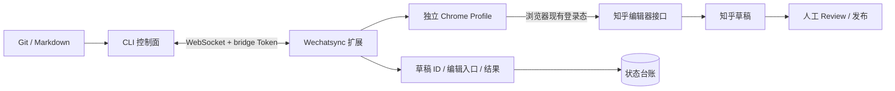
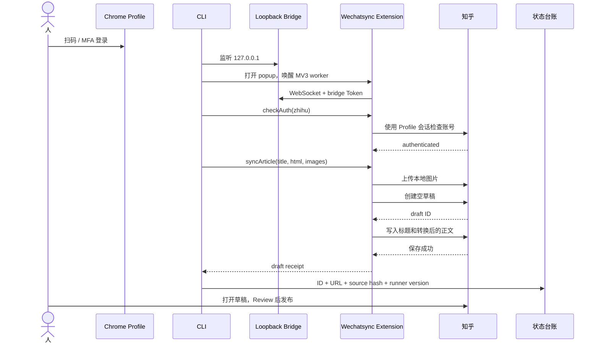
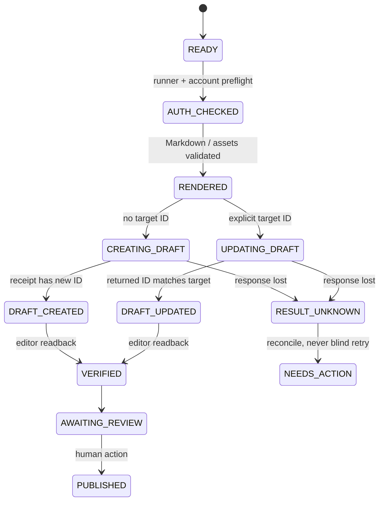

# 从 Chrome 登录态到知乎草稿：我们如何打通一条可控的写入链路

[上一篇文章](https://arch.gh.wzhecnu.cn/ChatBlog/blog/zhihu-cli-publishing-server-control-plane)回答了“哪种知乎 CLI 自动化架构更稳”：内容和任务放在控制面，平台登录态留在可信浏览器，默认只写草稿，最后由人确认发布。

这一次不再停留在架构图。我们真的启动了一个隔离 Chrome Profile，完成知乎登录，让 Wechatsync 扩展连接本机 CLI，把 Markdown、本地图片、公式、表格和代码写进知乎草稿，并从编辑页回读验证结果。

<!-- truncate -->

:::tip 先给结论
真正打通链路的关键不是“拿到知乎 Token”，而是把四件事分开：**Chrome 二进制负责运行，Profile 负责保留知乎会话，扩展负责平台写入，bridge Token 只负责 CLI 与扩展之间的鉴权。**

CLI 从头到尾不需要读取或导出知乎 Cookie。它只把内容任务发给扩展；扩展在已经登录的浏览器环境里执行写入，并把草稿链接和结果回传。最终发布仍留给人。
:::

:::warning 使用边界
这是一条自有测试账号、低频草稿和人工 Review 的工程验证，不代表知乎向普通开发者开放了文章写 API，也不构成对无人值守发布的授权。正式业务仍应遵守最新平台协议、取得必要许可，不绕过验证码、风险控制或人工确认。
:::

## 最终跑通了什么

这次闭环不是“浏览器里看起来动了一下”，而是有明确输入、回执和回读证据：

- CLI 能确认扩展连接并读取知乎登录状态；
- Markdown 标题和正文能创建为一篇新草稿；
- 本地 PNG 能直接上传到知乎，不需要临时图床；
- 标题、多级标题、图片、公式、表格、代码块、引用、链接和列表能在编辑页回读；
- 任务清单和删除线出现了可重复的降级行为；
- 返回的是草稿编辑入口，最终“发布”按钮没有被自动点击；
- 每次成功结果都会写入文章状态台账，而不是只留在终端输出里。

这条链路的最小形态如下：



## 四个对象，四种完全不同的职责

实际调试中，最容易混淆的是 Chrome、Profile、扩展 Token 和知乎登录态。它们不是同一种凭据。

| 对象 | 保存什么 | 能否单独登录知乎 | 应怎样持久化 |
|---|---|---:|---|
| Chrome / Chromium 二进制 | 浏览器程序和渲染能力 | 否 | 固定、可复现的版本 |
| 独立 Chrome Profile | Cookie、Local Storage、站点状态、扩展存储 | **是，真正的会话在这里** | 仅保留在可信执行节点 |
| Wechatsync 扩展 | 平台 adapter、图片上传、请求执行 | 否 | 版本化构建产物 |
| bridge Token | CLI 与扩展之间的调用鉴权 | 否 | 权限严格的 secret / `.env` |

### Chrome 二进制不等于登录态

换一份 Chrome 二进制，只要继续指定同一个兼容 Profile，知乎通常仍保持登录；反过来，即使浏览器版本完全相同，换一个空 Profile 也需要重新扫码或短信验证。

因此运行契约不是“保存一份 Chrome”，而是：

```text
固定 browser binary
+ 独立 user-data-dir
+ 固定 extension build
+ 可轮换 bridge Token
```

Profile 是高价值身份容器。它不应进入 Git、容器镜像、普通备份、日志或服务器配置，更不应该为了“纯 CLI”而导出 Cookie。

### bridge Token 不是知乎 Token

bridge Token 只回答一个问题：当前 CLI 是否有权向当前扩展发任务。

```text
CLI -- bridge Token --> Chrome 扩展
Chrome 扩展 -- Profile 会话 --> 知乎
```

即使 bridge Token 泄漏，它本身也不能登录知乎；但如果 bridge 端口同时暴露，攻击者可能借已登录扩展执行操作。因此 Token、loopback 监听和网络隔离必须一起使用。

## 登录：人完成一次，系统复用会话

我们没有尝试自动破解登录。流程是：

1. 启动一个不复用日常浏览器数据的独立 Profile；
2. 加载可审计的 Wechatsync unpacked extension；
3. 打开知乎登录页；
4. 由账号所有者扫码，或在平台要求时完成短信/CAPTCHA；
5. 登录成功后只检查首页和 `/api/v4/me` 的认证状态；
6. 后续任务继续使用同一个 Profile。

二维码调试提供了一个很实际的教训：**网页中的二维码可以自动刷新，但发到聊天里的截图是静态的。** 源页面仍然打开，不代表几分钟前发送的图片仍有效。

正确协议应该是：生成新二维码、立即发送、保持源浏览器和 tab 不变，然后停止所有操作等待用户确认。二维码过期后再显式刷新，不能把旧截图当作实时视图。

## 连接：CLI 先监听，扩展再被唤醒

Wechatsync 的 CLI 会启动一个 WebSocket bridge，扩展主动连接它。我们把 WebSocket 和 companion HTTP API 都限制在 `127.0.0.1`：

```bash
export SYNC_BIND_HOST=127.0.0.1
export SYNC_WS_PORT=9527
export WECHATSYNC_TOKEN='[REDACTED]'
```

这里有两个比“端口能连通”更重要的细节。

### 必须证明是正确的扩展

Chrome 本身可能运行多个内置扩展和 service worker。只看到一个 `chrome-extension://...` target，并不能证明 Wechatsync 已加载。

最终探针直接读取 `chrome://extensions`，按扩展名称和 unpacked 路径确认真实 ID，再要求对应 popup 和 service worker 出现。否则一个内置语音扩展也可能制造“扩展已加载”的假阳性。

### MV3 service worker 会休眠

扩展连接曾在 auth 验证时成功，几分钟后真正创建草稿却连接失败。原因不是 Token 丢了，而是 Manifest V3 service worker 空闲后休眠。

最终命令顺序改成：

```text
CLI server 先监听 loopback
  -> 打开目标扩展 popup
  -> 唤醒 MV3 worker
  -> worker 使用已有 Token 建立 WebSocket
  -> bridge 确认连接稳定
  -> 才发送 auth / create / update 请求
```

如果先唤醒扩展、后启动 server，worker 可能在 server 出现前重新进入冷却；把连接超时从 30 秒改成 3 分钟并不能解决时序错误。

## 一篇文章怎样穿过这条链路

下面是实际 create-draft 的请求序列：



### CLI 负责确定性工作

CLI 做这些事：

- 读取 Markdown/HTML；
- 提取标题、封面和本地图片；
- 执行 dry-run；
- 启动 bridge 并等待正确扩展；
- 发送结构化任务；
- 输出平台结果；
- 记录 source hash 和 receipt。

上游现有命令已经足够完成 create-first MVP：

```bash
# 本地检查，不写远端
wechatsync sync article.md -p zhihu --dry-run

# 通过扩展检查登录
wechatsync auth zhihu --refresh

# 创建一篇知乎草稿
wechatsync sync article.md -p zhihu
```

### 扩展负责平台相关工作

扩展使用浏览器 runtime 发请求，并设置平台所需的同源 Header。知乎 adapter 当前的 create 流程是：

1. 创建一篇空草稿；
2. 获取草稿 ID；
3. 上传或转存图片；
4. 把 Markdown 生成的 HTML 转成知乎 Draft.js 可接受的结构；
5. 写入刚创建的草稿；
6. 返回编辑入口。

这里的“PATCH 草稿”仍然属于本次 create 流程，不等于更新以前创建的文章。这也是为什么 article identity 必须单独设计。

## 为什么本地图片不需要图床

我们的 Markdown 直接使用相对路径：

```markdown

```

CLI 在执行前找到文件、读取二进制，再通过扩展调用知乎图片上传能力，最后把正文里的相对路径替换为知乎图片地址：

```text
Local PNG
  -> CLI base64 / chunk
  -> extension uploadImage
  -> Zhihu image storage
  -> replace Markdown URL
  -> write draft body
```

因此 local 同机链路不需要先把图片放到公网，也不需要搭临时图床。图床只在控制面和浏览器执行面分离、浏览器节点无法读取源文件时才可能有价值；即便如此，更适合使用带权限和生命周期的对象存储，而不是开放一个临时目录。

本轮还发现一个边界：图片扫描器会把 fenced code block 里的 Markdown 示例误当成真实资产。修复方式是在扫描前对代码围栏做保长度 mask，让代码示例继续出现在正文里，但不进入上传清单。

## 知乎编辑器实际保留了多少格式

我们用一篇专门的写作指南测试常用元素，然后从知乎编辑页读取最终 DOM，而不是只相信 CLI 的“同步成功”。

| 元素 | 实测结果 | 说明 |
|---|---|---|
| 标题、H2、H3 | 完整 | 标题和层级均可回读 |
| 本地图片 | 完整 | 两张 PNG 直接上传知乎 |
| 行内公式 | 完整 | 转成知乎 `data-eeimg="1"` 公式结构 |
| 块级公式 | 完整 | 转成 `data-eeimg="2"` |
| GFM 表格 | 完整 | 表头、行列和单元格保留 |
| fenced code block | 完整 | 两个代码块内容与换行保留 |
| 行内代码 | 视觉保留 | 编辑器转成等宽字体样式 |
| 引用、链接、普通列表 | 完整 | DOM 中均存在 |
| 任务清单 | 降级 | checkbox 丢失，变成普通列表 |
| 删除线 | 降级 | 文本保留，删除线样式丢失 |

公式并不是把 LaTeX 截成普通图片。参考 [Zhihu on Obsidian](https://github.com/zimya/zhihu_obsidian) 的实现，我们把 `$...$` 和 `$$...$$` 转成知乎认识的 equation 节点；编辑器加载后会归一化为带 `data-tex` 和 `math/tex` 的公式结构。

这个矩阵也说明：发布系统不能用“HTTP 200”代表内容保真。每个 adapter 都需要一组真实编辑器 fixture 和回读检查。

## 最值得记录的几个故障

### 1. 过早迁移到远端 runner

我们一度把 Chrome、扩展和 Profile 搬到长期在线服务器。服务器资源足够，但同时引入了浏览器版本、显示环境、二维码传输、Profile 生命周期和跨机 bridge 五个新变量。

最终回到 local-first：先在账号所有者控制的机器上完成“空 Profile -> 登录 -> auth -> 一篇标记草稿”。只有为了 uptime 或集中运维，才把浏览器执行面迁到远端。

### 2. 系统 Chrome 与 Chrome for Testing 行为不同

不是所有 Chromium 都会按相同方式加载命令行指定的 unpacked extension。最终固定 Chrome for Testing 版本，并从 `chrome://extensions` 读取真实状态，不根据命令行参数猜测“应该已经加载”。

### 3. 多条 WebSocket 的关闭事件会互相踩踏

唤醒 MV3 worker 时可能短暂产生连接替换。原 bridge 在新连接建立后，如果旧 socket 随后关闭，会无条件把当前 `client` 清空。于是 CLI 刚显示“Extension 已连接”，下一条 RPC 就可能发不到任何地方。

修复原则是：

- 只有关闭的是当前 socket，才能清空 `client`；
- 新连接稳定一个短窗口后，才释放等待中的命令；
- 独立回归测试要模拟“连接 B 替换 A，然后 A 关闭”。

### 4. update 不能是一个可选提示

最严重的一次失败来自“把目标 ID 当作 `syncArticle` 的可选字段”。某层没有执行 update 后，系统自动落回默认 `publish()`，结果不是报错，而是又创建了一篇草稿。

这改变了我们的接口设计：

```text
错误设计：syncArticle + optional postId
正确设计：createArticle / updateArticle 两条独立 RPC
```

`updateArticle` 必须 fail-closed：

- 没有目标 ID：失败；
- adapter 没有 `update()`：失败；
- 扩展版本不认识方法：失败；
- 任何中间层丢失 update 语义：失败；
- **绝不能回退到 create。**

这类问题不是普通异常处理，而是幂等和数据完整性边界。

## 把实践抽象成 Infra

跑通一次之后，真正需要长期维护的是五个平面。

### 1. Content plane

内容真源放在 Git：

```text
articles/
  how-to-write-zhihu.md
assets/
  article-structure.png
publication.yaml
```

Markdown 不携带 Cookie 或 browser profile。每次任务都记录 source commit 和内容 hash。

### 2. Control plane

控制面负责：

- dry-run 和内容检查；
- 单账号串行队列；
- create/update 模式；
- article ID 映射；
- 超时、取消和告警；
- receipt 与审计；
- 人工 Review 状态。

它不处理扫码，也不保存知乎会话。

### 3. Browser execution plane

浏览器 runner 负责：

- 固定 Chrome/extension 版本；
- 持久化隔离 Profile；
- exact-extension 健康检查；
- MV3 worker 唤醒；
- 平台 auth、图片上传和正文写入；
- 风控/CAPTCHA 时停止并等待人工接管。

### 4. Publication ledger

一个最小台账至少包含：

```json
{
  "source": "articles/example.md",
  "source_sha256": "...",
  "platform": "zhihu",
  "mode": "create-draft",
  "target_id": "...",
  "target_url": "...",
  "runner_version": "...",
  "status": "DRAFT_VERIFIED",
  "updated_at": "..."
}
```

这里保存文章身份和执行证据，不保存密码、Cookie、验证码或 bridge Token。

### 5. Human gate

系统自动化停在“草稿已经创建并验证”。人工负责：

- 检查标题和正文；
- 查看公式、表格和图片；
- 修改平台特定细节；
- 处理敏感内容、署名和合规；
- 最终点击发布。

这不是“自动化不完整”，而是明确的风险边界。

## 状态机应该怎样设计

只有 `success / failed` 不够。推荐把写入建模成：



几个硬规则：

1. create 返回 ID 后立即写台账；写台账失败就进入人工核对。
2. update 返回的 ID 必须与请求目标一致。
3. 写请求发出后连接中断，进入 `RESULT_UNKNOWN`，不能自动 create。
4. 内容 hash 未变化，直接 no-op。
5. 一个知乎账号同时只执行一个写任务。
6. 最终发布不是 create/update RPC 的参数，而是独立人工 gate。

## 现在的实现与下一步

我们在 [ChatArch/Wechatsync Fork](https://github.com/ChatArch/Wechatsync) 建立了长期 `dev` 集成分支。功能改动从 feature branch 发起 [Fork 内部 PR #1](https://github.com/ChatArch/Wechatsync/pull/1)，经过测试和 Review 后再进入 `dev`，而不是直接改上游同步分支：

- bridge 的显式 bind host；
- MV3 多连接稳定性修复；
- `--post-id` 与独立 `updateArticle` RPC；
- 知乎 adapter 的 `update()`；
- 行内/块级公式转换；
- fenced code 图片误扫描修复；
- adapter 与 fail-closed 回归测试。

当前 create-draft 和富文本链路已经在真实草稿中验收。update 代码已通过离线测试，但真实同 ID 成功路径仍应在一篇可删除测试草稿上独立完成，确认返回 ID 不变后再进入常规使用。

接下来更值得做的不是“马上定时发布”，而是：

1. 把 browser runner 做成可检查、可重启的 launchd/systemd user service；
2. 给每条任务增加 source hash、目标 ID 和 result state；
3. 把 create 与 update fixture 放进真实账号低频回归；
4. 增加编辑页语义回读，而不是只看 API 响应；
5. 为 `RESULT_UNKNOWN`、会话过期和 target-side 手工修改设计人工处理入口；
6. 最后才考虑服务器控制面、队列和调度。

## 最后的判断

“从命令行写知乎”并不要求服务器拥有知乎 Cookie，也不要求用 Headless 浏览器重演所有点击。

更清楚的分工是：**内容和状态属于 CLI 控制面，身份属于 Chrome Profile，平台动作属于扩展 adapter，最终责任属于人工 Review。**

这条链路真正有价值的地方，不只是它成功创建了一篇草稿，而是每个边界都可以被解释和验证：谁持有登录态、谁能发命令、图片去了哪里、目标 ID 是否固定、失败后能否安全停止、最终发布由谁确认。

当这些问题都有明确答案时，浏览器自动化才从一次性的演示，变成可以继续设计 Infra 的执行节点。

### 相关源码与延伸阅读

- [ChatArch/Wechatsync Fork](https://github.com/ChatArch/Wechatsync)
- [ChatArch/Wechatsync `dev` 维护分支](https://github.com/ChatArch/Wechatsync/tree/dev)
- [安全更新与 bridge 修复 PR #1](https://github.com/ChatArch/Wechatsync/pull/1)
- [wechatsync/Wechatsync](https://github.com/wechatsync/Wechatsync)
- [Wechatsync 知乎 adapter 基线实现](https://github.com/wechatsync/Wechatsync/blob/a98e42865387285afcc027c61836488748f3b30f/packages/core/src/adapters/platforms/zhihu.ts)
- [Wechatsync WebSocket bridge 基线实现](https://github.com/wechatsync/Wechatsync/blob/a98e42865387285afcc027c61836488748f3b30f/packages/mcp-server/src/ws-bridge.ts)
- [Zhihu on Obsidian](https://github.com/zimya/zhihu_obsidian)
- [上一篇：把知乎发布做成服务器任务](https://arch.gh.wzhecnu.cn/ChatBlog/blog/zhihu-cli-publishing-server-control-plane)
- [知乎协议](https://www.zhihu.com/term/zhihu-terms)
