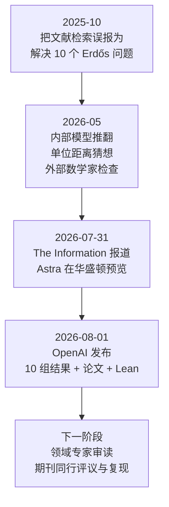
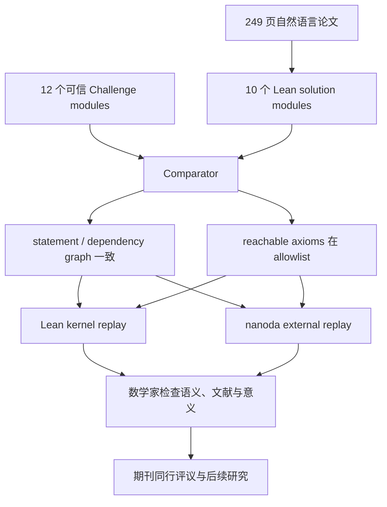

2025 年 10 月，OpenAI 曾闹过一次很难看的数学误报：公司高管把 GPT-5 找到十道 Erdős 问题的**既有文献解答**，说成了“解决十道此前未解的问题”。数学家 Thomas Bloom 当时称这是 “a dramatic misrepresentation”，相关帖子随后被删除。

不到一年后，OpenAI 又带着“十道开放问题”回来了。

这一次，材料完全不同：一份 [249 页技术文稿](https://cdn.openai.com/pdf/ten-proofs-oai.pdf)、一份 [62 页思路说明](https://cdn.openai.com/pdf/reasoning-walkthroughs.pdf)、十个大型 Lean 文件、十二组 Comparator challenge，以及 OpenAI 对正确性的公开责任声明。产生论证的模型叫 **Astra**，是 OpenAI 尚未发布的下一代内部模型。

如果这些结果经受住外部审查，这会是 AI 数学从“偶尔参与一篇论文”跨向“同一个通用系统批量产生研究级新数学”的重要节点。

但新闻标题“新模型解决十道著名数学题”仍然漏掉了几乎所有关键限定。

<!-- truncate -->

:::tip 一句话结论
这不是十道竞赛题，也不是十个千禧年难题。更准确地说，Astra 产生了**十组数学与理论计算机科学新结果**：其中有完整反例和长期猜想的解决，也有对上界、下界和复杂度结果的重大改进。公开证据远强于普通模型宣传，但数学界的独立逐项审查、模型实验的成功率和完整成本仍未公开。
:::

:::info 核验口径
本文动态资料核验至 **2026-08-01**。OpenAI 的证明仓库在发布当天仍持续更新，因此代码审计固定在 [`openai/ten-proofs@1f16bdc`](https://github.com/openai/ten-proofs/tree/1f16bdcd2f22137d294a5abd61278fa8205bfba3)。“OpenAI 声称”“媒体报道”“公开反应”和本文分析会分开标注。
:::

## 先把七个最容易误解的说法改正

| 流行说法 | 更准确的表述 |
|---|---|
| OpenAI 发布了 Astra | **没有。**官方只确认一个内部版本产生了这些结果；没有 API、模型权重、系统卡或发布日期 |
| Astra 解完了十道著名难题 | 它产生了十组新结果；有些完整解决猜想，有些只改进一侧的界或复杂度下界 |
| 这是十道 Erdős 问题 | 明确对应 Erdős 编号的只有 **146、180、183**；其余来自不同领域 |
| 这是千禧年大奖级突破 | OpenAI 研究员 Noam Brown 明确说：**没有千禧年问题** |
| 十项研究总共只花 2,000 美元 | 这是成功解法 token 按 Sol API 价格的折算，不包括训练、失败尝试、基础设施、人类工资、整理和验证 |
| AI 完全无人参与地写出十篇论文 | OpenAI 说数学论证来自 Astra；人类与模型共同整理文稿，并帮助完成 Lean 形式化 |
| 公开了完整思考过程 | 公开的是模型在事后读取原始轨迹和成稿后写出的**重建叙事**，不是完整原始运行日志 |

最重要的修正是：**“解决”不是一个二值标签。**

证明一个猜想、推翻一个猜想、把指数上界从 0.599 改到 0.604、证明某种近似问题更难、确定一个方法本身的极限，都是新数学，但它们回答的问题层级不同。

## 这件事是怎么一步步发生的



### 2025 年的误报为什么必须重提

[TechCrunch 对 2025 年事件的回顾](https://techcrunch.com/2025/10/19/openais-embarrassing-math/)记录了当时的原话：OpenAI VP Kevin Weil 宣称 GPT-5 “found solutions to 10 previously unsolved Erdős problems”。

Bloom 随后解释，`erdosproblems.com` 上的 `Open` 只代表**维护者尚不知道解答**，不是一份经过穷尽文献审查的世界真理。GPT-5 找到的是 Bloom 不知道的旧论文。OpenAI 研究员 Sébastien Bubeck 后来也承认，模型只找到了文献中的既有解法。

这个插曲留下了两条教训：

1. proof checker 只能检查 correctness，不能检查 novelty；
2. “数据库写着开放”不能替代系统性的文献审查。

当前这批材料显然是在更高证据标准下发布的：不是只发推文，而是同时给出完整论证和形式化证书。但它仍需要外部专家确认文献新颖性和领域意义。

### 2026 年 5 月：第一次真正扭转可信度

OpenAI 随后公布了一个内部模型对 [Erdős 单位距离猜想的反例](https://openai.com/index/model-disproves-discrete-geometry-conjecture/)。这一次有外部数学家检查、配套论文和后续改进；Tim Gowers 将其称为 AI 数学的一个里程碑。

8 月 1 日的官方文章也特别强调，单位距离工作已经引出多篇后续研究。它不属于今天这“十项结果”，而是当前发布方式的前奏。

### 2026 年 7 月 31 日至 8 月 1 日：Astra 首次被确认

[The Information](https://www.theinformation.com/briefings/exclusive-openai-previews-astra-ai-model-dc)先报道 Sam Altman 在华盛顿向政策制定者演示 Astra。[The Decoder 的转述](https://the-decoder.com/openai-announces-its-next-major-model-astra-by-dropping-ten-previously-unsolved-math-solutions/)称，它可能协调多个 Agent，持续数小时或数天处理复杂项目。

一天后，[OpenAI 官方公告](https://openai.com/index/ten-advances-in-mathematics/)第一次确认 Astra 名称，并称内部版本在十个至少十年没有主要进展的问题上取得结果。

注意证据边界：

- **官方确认**：内部 Astra、下一代主要模型、十项结果、约 2,000 美元成功 token、论文与 Lean；
- **媒体报道**：长时程、多 Agent、华盛顿演示；
- **仍属猜测**：最终会叫 GPT-6、GPT-5.7，还是另一条产品线。

## OpenAI 实际公开了什么

这不是只有一篇博客。

1. **技术文稿**：249 页，作者写作 `OpenAI`，包含十章数学论文；
2. **思路说明**：62 页、十二章——permanent 被拆为电路与公式两章，极值图论也拆成两章；
3. **Lean 仓库**：十个结果文件，加一个统一 import 文件；
4. **Comparator challenges**：十二组可信目标与 solution 对照配置；
5. **公开归因声明**：OpenAI 说明数学论证来自 Astra，人类负责整理、形式化协助和正确性责任。

“十项”只是发布包装。按独立 theorem family 计算，内容其实更多：编码理论有 binary/spherical 两支，最后一项又包含两个不同的 Erdős 猜想。

## 十项结果的全景地图

| # | 方向 | 结果类型 | 到底完成了什么 | 没有完成什么 |
|---:|---|---|---|---|
| 1 | 高维球堆积 | 精确方法极限 + 新上界 | 确定 Cohn–Elkies 线性规划的渐近极限，并改进一般上界 | 没求出真实最优堆积密度 |
| 2 | 二进制码、球面码 | 严格改进指数界 | 对每个固定参数都改进经典 MRRW / KL 指数 | 没给出精确码率或新解码器 |
| 3 | 非 sofic 群 | 反例 / 存在性 | 构造非 sofic 群，否定“所有可数群都 sofic” | 没解决 hyperlinear、surjunctive 等相邻问题 |
| 4 | Connes 刚性 | 无限反例族 | 不同性质 (T) 群可有相同群 von Neumann 代数 | 没否定所有更强的 W*-刚性现象 |
| 5 | Permanent 复杂度 | 新下界 | 电路达 `Omega(n^2 log log n)`，公式达 `Omega(n^4 / log n)` | 没证明超多项式下界或 VP≠VNP |
| 6 | 量子并行重复 | 一般定理 | 所有有限双人单轮纠缠博弈都指数衰减 | 定量指数不最优，范围不是所有量子协议 |
| 7 | 最近向量问题 | 近似困难性 | 确定性证明 `n^(1/400)` 因子下仍 NP-hard | 没攻破现实格密码，也没逼近平方根屏障 |
| 8 | Ehrhart 体积猜想 | 尖锐上界 | 所有维度证明 `(n+1)^n / n!` 的最佳体积界 | 没完成全部等号情形分类 |
| 9 | 多色 Ramsey 数 | 渐近阶 | 证明 `R_k(3) = k^Theta(k)`，解决 Erdős #183 | 仍不知道精确指数和常数 |
| 10 | 极值图论 | 两个反例 | 推翻 compactness 与 degeneracy 猜想，解决 #180、#146 | 是两个专业极值数命题，不是“图论全部解决” |

下面逐项解释它们为什么重要。

## 1. 高维球堆积：改进的是上界，也证明了这套方法的天花板

球堆积问的是：同样大小的球最多能多密地塞进空间。二维是硬币，三维像炮弹；维度升高后，它同时连接编码理论、离散几何和信息论。

Cohn–Elkies 方法把几何问题转成 Fourier 分析的线性规划。设 `LP_d` 是这套方法在 `d` 维能给出的最佳密度上界，新结果证明

```text
lim_(d -> infinity) LP_d^(1/d) = sqrt(e / (2 pi))
```

因此球堆积密度满足

```text
Delta_d <= 2^(-(0.6044... + o(1))d)
```

经典 Kabatianskii–Levenshtein 指数约为 `0.599055`。数值变化看起来不大，但论文称这是 **1978 年以来一般高维球堆积指数的首次改进**。

它还有双重意义：不仅给出更强上界，也证明在指数尺度上，任何 Cohn–Elkies 辅助函数都不可能继续超过这个阈值。换句话说，它既推进了方法，也找到了方法的天花板。

但真实最优密度仍然未知；“球堆积问题被解决”仍是错误标题。

## 2. 二进制码与球面码：近半个世纪没动的通用指数被严格推进

二进制码要在 `{0,1}^n` 中放尽量多的码字，同时保证任意两者 Hamming 距离足够大。球面码则把点放在高维球面上，要求点与点的内积不能太高。

它们共同描述一个核心权衡：**信息数量与抗噪间隔不能同时无限增长。**

新论文不只是找到某个参数上的小改进，而是证明：

- 每个固定相对距离 `0 < delta < 1/2`，都严格改进完整优化后的 MRRW 指数；
- 每个固定最大内积 `0 < s < 1`，都严格改进包含 spherical-cap 优化的 KL 指数；
- 这是两条一般高维指数自 1977、1978 年以来第一次整体推进。

技术上的新自由度，是不再只给每个码点附一个向量，而是附一个随码点移动的高维 harmonic subspace。指数级大的 projection rank 最后变成更小的码规模上界。

这仍然是**上界理论**，并不直接给工程上可部署的新编码或解码算法。

## 3. 非 sofic 群：十项里最像“一个世界里此前不知道对象是否存在”的结果

一个群是 sofic 的，大意是它的任意有限乘法片段都可以被有限集合上的置换近似。有限群、amenable 群、residually finite 群以及大量熟悉的群都属于这个世界。

自 Gromov 与 Weiss 在 1999–2000 年提出问题后，数学家一直不知道：**是否所有可数群都是 sofic？**

Astra 的论证证明二元 Leavitt 代数 `L_F2(1,2)` 的单位群不是 sofic。核心材料包括：

- Kazhdan 性质 (T) 与 expander；
- Kun 的 expander decomposition；
- Kun–Thom centralizer obstruction；
- Thompson 群 `V`；
- Leavitt 代数的二进制自相似结构。

纸面论文给出一个具体非 sofic 群；Lean 文件还从有限 obstruction 推出“存在有限表示的非 sofic 群”。

这个结论的边界也写得很清楚：它没有顺手解决该群是否 hyperlinear、surjunctive，也没有解决 Kaplansky 直接有限性等相邻猜想。一个核心存在性问题结束后，新的研究树才刚长出来。

曼彻斯特大学数学家、`erdosproblems.com` 维护者 [Thomas Bloom 称其为 “Big news”](https://x.com/thomasfbloom/status/2083442290735902937)，并认为它比 5 月的单位距离反例更大；他同时说明这不是自己的专业方向。

## 4. Connes 刚性：同一个“算子代数影子”不再唯一确定原群

给一个可数离散群 `G`，可以构造它的群 von Neumann 代数 `L(G)`。Connes 的问题是：如果 `G` 具有 ICC 与性质 (T)，这个算子代数对象是否足以反推出原群？

Astra 构造了

```text
Lambda, Gamma_0, Gamma_1, ...
```

它们彼此不同、都是有限生成 ICC 性质 (T) 群，却满足

```text
L(Gamma_n) ≅ L(Lambda)
```

而且这些群两两 commensurable。结果不只给 Connes 猜想一个反例，还说明把“唯一”放宽为“有限多个可能”仍然不成立：同一个 group factor 有可数无限多个实现。

这并不意味着刚性理论失效。论文特别指出，某些群仍是 W*-superrigid；被推翻的是“性质 (T) 本身就足以保证恢复原群”。

## 5. Permanent 下界：重大进展，但离 VP≠VNP 仍很远

Permanent 与 determinant 只差置换项前面的正负号，但 determinant 有高效算法，permanent 则是代数复杂性理论的核心困难对象。

新结果研究精确符号计算：

- 允许任意复用中间结果、但不允许除法的一般算术电路，需要 `Omega(n^2 log log n)` 个门；
- 树状算术公式需要 `Omega(n^4 / log n)` 个变量叶；
- 即使允许合法除法，公式仍保留同阶下界，只改变常数。

相对于输入变量数 `N = n^2`，这是 `Omega(N log log N)` 的电路下界和 `Omega(N^2 / log N)` 的公式下界。

这里必须压住最容易出现的夸张：这些仍是**多项式下界**。它没有证明 permanent 需要超多项式电路，因此没有解决 VP 与 VNP，更没有解决 P 与 NP。

## 6. 量子并行重复：把 Raz 的经典原则推到一般纠缠博弈

在双人博弈里，裁判分别给 Alice 和 Bob 发问题；两人不能通信，但可以提前共享量子纠缠。如果单局不能总赢，把同一游戏独立重复 `n` 次并要求全部获胜，成功概率是否一定指数下降？

经典情形由 Raz 在 1990 年代解决。量子情形因为跨局联合测量与纠缠，可以产生远比独立策略复杂的相关性。一般问题至少从 2004 年起就被明确列为开放问题。

新定理证明，对任意有限双人单轮纠缠博弈，只要原始纠缠值小于 1，重复值就以 `exp(-c_G n)` 的速度下降。此前一般结果只有多项式衰减，指数定理只对特殊或修改后的游戏成立。

论文中的 `epsilon^13` 定量损失并不声称最优；真正的突破是“一般游戏也指数衰减”这个定性结论。

## 7. 最近向量问题：是最坏情形困难性，不是格密码被破解

Closest Vector Problem 给出一个整数格和目标点，要求找到最近格点。它既是几何数论与算法理论的基础问题，也与格密码处在同一大类数学工具中。

论文给出从 3SAT 到 Euclidean GapCVP 的确定性多项式归约，证明在格秩为 `n` 时，近似因子达到

```text
n^(1/400)
```

仍然 NP-hard。

此前无条件结果虽超过任意固定多对数，却形如 `n^(a / log log n)`，指数趋于零；固定多项式因子的相关结果依赖更强猜想。新结论把它推进为无条件、确定性的固定正指数。

但部署中的格密码依赖结构化或平均情形假设，不是把最坏情形 CVP 实例直接塞进协议。这个结果增强理论困难性地图，不是“后量子密码破了”。

## 8. Ehrhart 体积猜想：解决 1964 年提出的尖锐不等式

考虑一个 `n` 维凸体：它的重心在原点，原点还是唯一内部格点。这样的凸体最多能有多大体积？

Ehrhart 在 1964 年猜测，中心化单纯形达到最大值。Astra 的证明给出所有维度的尖锐界：

```text
vol(K) <= (n+1)^n / n!
```

等号确实由中心化单纯形达到。证明把凸体、Monge–Ampère transport、复环面上的 Laurent monomial、Bergman kernel 和 vanishing order 联系起来。

论文保留了一个明确未解部分：是否所有极值体都必须是该单纯形的 unimodular 像，仍未分类完成。

## 9. 多色 Ramsey 数：终于知道它是超指数增长

把完全图的边涂成 `k` 种颜色，`R_k(3)` 是保证出现同色三角形所需的最少顶点数。

过去的下界基本是常数的 `k` 次方，上界则接近 `k!`。于是一个长期问题是：`R_k(3)` 到底只是指数增长，还是超指数增长？

新结果证明存在绝对常数 `c > 0`，使得

```text
R_k(3) >= (c k^(1/3) / log k)^k
```

结合经典阶乘上界，得到

```text
R_k(3) = k^Theta(k)
```

这解决 Erdős 问题 183，并推出 independence number 为 2 的图也可以有任意大的 Shannon capacity。

它确定了增长类别，但上下界指数仍在大约 `1/3` 与 `1` 之间，远没有精确渐近式。

## 10. 一个编号下其实藏着两个 Erdős 反例

### 10.1 Erdős–Simonovits compactness 猜想

对有限 forbidden family `F`，同时禁止所有成员，是否总与禁止其中某一个成员的 extremal number 同阶？修正后的猜想要求每个 forbidden graph 都含环，以排除简单的森林反例。

论文构造一个有限 family，其中每个图都 connected、bipartite 且含环，但

```text
ex(n, F) = O(n^(4/3 - 1/48))
```

而对每个单独的 `F`，仍有

```text
ex(n, F) = Omega(n^(4/3))
```

所以整个 family 的约束确实比任何单一成员强一个幂次，推翻 compactness，解决 Erdős #180。

### 10.2 退化度猜想

Erdős 猜测固定 bipartite `r`-degenerate graph 的 extremal number 至多为 `O(n^(2 - 1/r))`。

Astra 构造一个固定、connected、bipartite、2-degenerate 的图 `H`，却有

```text
ex(n, H) >= c n^(3/2 + epsilon)
```

反例在 `r = 2` 就出现，解决 Erdős #146。

因此媒体所说的“十项”并不等于十个独立题目：第十项自己就结束了两个不同猜想。

## Lean 证书让这次发布比普通 press release 强在哪里

固定提交 `1f16bdc` 的仓库包含：

- 10 个结果文件和 `All.lean`；
- **474,731 行**顶层 Lean 源码，约 18.3 MB；
- 12 个 Comparator JSON 配置；
- Lean 4.32.0、固定 mathlib 与 Comparator 依赖；
- 全部配置启用 `nanoda` external checker；
- 允许的 axiom 只有 `propext`、`Classical.choice`、`Quot.sound`。

我对十个顶层结果文件做了字面扫描，没有发现 `sorry`、`admit`、自定义 `axiom` 或 `unsafe`。Comparator 的 Challenge 文件里出现 `sorry` 是正常设计：可信题面先留洞，再检查 Solution 是否证明了同一个 elaborated statement。



这套栈把“能编译”提升为更强的问题：

1. Solution 证明的是不是 Challenge 中同一个 theorem；
2. 是否偷换 definition 或传递依赖；
3. 是否使用允许范围外的 axiom；
4. proof term 是否同时被 Lean 与另一个 checker 接受。

如果想理解这条信任边界，可以参看本站的 [Comparator 详解](/blog/lean-comparator-trust-boundary-guide) 与 [nanoda 外部内核指南](/blog/nanoda-lean-external-kernel-guide)。

### 机器检查仍留下什么

| 层次 | 能确认 | 仍不能自动确认 |
|---|---|---|
| 自然语言论文 | 论证可供人阅读 | 每一步是否无误、引用是否完整 |
| Lean typecheck | 形式 theorem 在固定环境可推出 | theorem 是否忠实表达原猜想 |
| Comparator | Challenge 与 Solution statement/依赖一致 | Challenge 本身是否写对 |
| Lean + nanoda | 两个实现都接受 proof term | 两个实现之外的共同假设、数学意义 |
| 文献审查 | 是否真是新结果 | 无法被 kernel 代替 |
| 领域同行评议 | 正确性、深度、可读性和影响 | 发布当天尚未完成 |

尤其要注意：这些 Challenge 也是 OpenAI 随仓库一起写的，不是外部数学家独立提供的题面。它们让审计具体、可重跑，却不自动构成第三方背书。

`GapCVP` 的四个 definition holes 也需要额外语义检查：Comparator 能校验它们的签名、依赖和 proof，但无法替人判断这些定义是否完整捕捉了复杂性理论中想表达的归约。

发布快照的 `formalization.yaml` 把 review 状态写为 `agent-reviewed`。仓库当时没有 GitHub Actions 运行记录，因此“公开可构建”与“官方仓库已经公开跑过 CI”也要分开。

## 62 页“思考过程”不是原始 chain of thought

OpenAI 官方称同时发布“模型对思考过程的叙述”。但 [PDF 的摘要](https://cdn.openai.com/pdf/reasoning-walkthroughs.pdf)说得更精确：这些 notes 是一个 AI 模型读取**原始 chains of thought、最终论文和 writeups 之后**写出的重建。

它记录了许多有价值的失败路线、转向和最终洞见，例如：

- 编码界中第一次 recurrence 为什么不对；
- Ehrhart 证明为何放弃 harmonic symmetrization；
- CVP 如何从 signed moment histogram 转向 characteristic-two reconstruction；
- quantum repetition 如何从条件化障碍转向 postselection-stable sampleability。

但它不是完整实验日志。我们仍然看不到：

- 每个问题的原始 prompt；
- tool、检索、代码执行和多 Agent 调度记录；
- 每次失败尝试及停止标准；
- 人类在运行过程中是否给过中间反馈；
- 候选证明被筛选和淘汰的完整轨迹。

因此这些 notes 很适合**理解最后的数学想法**，不够用来独立复现实验中的“Astra 能力”。

## 2,000 美元到底说明了什么

[官方原话](https://openai.com/index/ten-advances-in-mathematics/)是：找到十项 solution 所需 token，按 Sol API 价格大约值 2,000 美元。

它支持一个重要结论：**成功轨迹的边际推理 token 可能已经很便宜。**

但它不支持“十项研究的总成本只有 2,000 美元”，因为至少缺少：

```text
Astra 训练与后训练
+ 失败问题的全部推理
+ 每题未成功的分支和重试
+ 问题筛选、数据与检索基础设施
+ 人类研究员工资
+ 文稿整理与引用核查
+ 47 万行 Lean 的生成、构建和审计
+ 计算集群、存储和组织成本
```

Noam Brown 随后承认，他们确实尝试过其他重大问题而没有成功；但没有给出总题数、成功率和失败 compute。他还说每题没有投入很多，test-time compute 可以继续扩大。

这让 `2,000 美元` 更像成功样本的**numerator**，而不是完整实验的 denominator。

[Hacker News 的首发讨论](https://news.ycombinator.com/item?id=49132058)很快集中到三个问题：到底尝试了多少题、每题多少次、失败分支花了多少。科学漫画作者 [Zach Weinersmith](https://bsky.app/profile/zachweinersmith.bsky.social/post/3mrzhh7lhls25)也指出，若不报告失败尝试，成本数字会带有明显宣传色彩。

这些疑问不否定数学定理，但会影响我们如何解读模型效率、可扩展性与经济意义。

## 为什么成功集中在“可明确验证”的数学形态

十项结果横跨八个领域，看起来非常分散；它们的目标形态却有共同点：

- 构造一个反例或对象；
- 证明一个明确不等式；
- 优化一个渐近指数；
- 给出一个确定性归约；
- 证明一类博弈的统一衰减定理。

这些问题很难生成答案，却相对容易定义“什么算成功”，并能压缩成稳定 theorem statement。它们具有很高的 **verification leverage**：候选生成昂贵，最终检查比发现便宜。

这并不削弱结果。恰恰相反，它解释了 AI 数学最可能先在哪里改变研究：不是一上来替代所有抽象判断，而是在**目标明确、反馈严格、长链条可以被形式验证**的领域，搜索并组合人类一个世纪积累的理论。

但“selection of ten results”里的 `selection` 也很重要。数学家 [Robin Houston](https://bsky.app/profile/robinhouston.mathstodon.xyz.ap.brid.gy/post/3mrzanwxzuug2)注意到这个措辞，并追问 OpenAI 还保留了哪些结果。没有完整题库与失败集，我们不能从十个成功案例推出总体成功率。

## 数学界与公共讨论现在分成三条线

### 1. 对结果本身的震动

Bloom 对非 sofic 群的反应最直接：“Big news”。一些理论计算机科学方向的公开讨论也强调，CVP 和 permanent 下界都是被顶尖研究者追了几十年的问题。

重要的是，这种震动主要针对**具体 theorem**，不是针对“模型是不是 AGI”的营销推论。

### 2. “AI 替代数学家”的反对意见

Bloom [随后专门反驳](https://x.com/thomasfbloom/status/2083444983592284465)“GPT 正在替代数学家”的说法。他的理由是：猜想由数学家提出，工具建立在一个多世纪的理论上，系统由数学家与工程师构建，又阅读了数学家写下的材料。

更准确的变化是职责重新分配：

```text
过去：人类选题 + 找路线 + 写证明 + 检查 + 写论文
现在：人类选题/建理论/定标准
      + 模型搜索、组合、形式化
      + kernel 机械检查
      + 人类消化、归因、评估意义
```

当生成证明变快，审读、文献查新、问题选择与解释反而成为更紧的瓶颈。

### 3. 对评议制度和权力集中的担心

单日释放 249 页跨领域新数学，会把验证成本外包给许多学术共同体。模型是私有的，成功 proof 是开放的；这形成一种不对称：公司可以高并发地产生结果，公共数学界却要用稀缺专家时间逐篇消化。

这也会改变研究议程。哪些问题被送给模型、哪些结果值得发布、哪些失败永远不可见，暂时都由 OpenAI 决定。

## OpenAI 为什么引用 Leiden Declaration，又和它存在张力

[Leiden Declaration on AI and Mathematics](https://leidendeclaration.ai/)由数学界社区发起，并获得 International Mathematical Union 背书。它强调 proof、透明、独立验证、人类责任、正确归因、开放科学和正常同行评议。

OpenAI 在公告里主动引用它，但双方并非完全一致。

| 议题 | OpenAI 这次做法 | Leiden Declaration 的要求 |
|---|---|---|
| 工具披露 | 明确说论证由 Astra 生成 | 支持透明披露自动化工具 |
| 证明开放 | 论文与 Lean 公开 | 支持开放科学、形式验证和独立检查 |
| 正确性责任 | OpenAI 表示承担责任 | 责任应由具体人类作者承担 |
| 作者身份 | 文稿作者写作 `OpenAI`，并反对把 AI 论证写成人类原创 | credit 与 responsibility 不应赋给自动系统 |
| 发布渠道 | 公司博客、CDN 文稿与 GitHub 首发 | press release 不能替代同行评议 |
| 获取能力 | proof 开放，Astra 私有 | 担忧工业资源不对称和数学自治 |

OpenAI 的观点是：若人类在没有生成核心论证的情况下署名，会歪曲真实贡献。Declaration 的观点则是：AI 不是能承担学术责任的作者，数学仍应由具体人类负责。

这不是一个格式问题，而是未来论文制度必须回答的难题：

> 如果机器生成核心 idea，人类验证并对它负责，credit、authorship、liability 和 prior human work 应该如何拆分？

## 这件事真正改变了什么

### 1. “研究级 AI 数学”不再只是零散案例

此前强案例通常是一项构造、一个反例或一篇有人类深度参与的论文。现在同一个内部系统横跨几何、群论、算子代数、复杂性、量子信息和组合数学，产生一整批可形式化的结果。

即使十项中只有一部分最终被评为领域重大突破，**跨领域吞吐本身**也值得重视。

### 2. 证明资产开始和新闻同时发布

2025 年误报的问题是“一个社交媒体判断先跑出去，证据跟不上”。这一次 paper、Lean、Comparator 和 reasoning notes 同时出现，使争论可以落到具体 theorem、definition 和 proof term 上。

这应当成为未来 AI 数学发布的最低模板，而不是额外加分项。

### 3. 数学研究的瓶颈正在从生成转向验证与消化

47 万行 Lean 并不等于 47 万行人类可理解的解释。机器可以检查 theorem 是否推出，但数学共同体仍要回答：

- 证明的核心新 idea 是什么？
- 哪些引理值得复用？
- 与现有文献的关系是否准确？
- 哪项结果真正改变领域，哪项只是技术性改进？
- 新定理又打开了哪些问题？

未来稀缺资源可能不是 proof token，而是 domain-expert attention。

### 4. 闭源模型与开放 proof 可以同时存在

数学结论可以独立检查，不要求 Astra 本身开源。这比只能相信闭源 benchmark 分数更好。

但若要把这次发布当成“模型能力实验”，闭源仍是根本限制：外界不能用同一模型、同一 scaffold、同一预算复现成功率。

## 它没有证明什么

截至发布当天，这批结果没有证明：

- Astra 已经公开可用；
- 十项都属于同一等级的“著名难题”；
- AI 已解决千禧年问题；
- 2,000 美元是完整研发成本；
- 模型能以稳定成功率处理任意开放问题；
- 形式化 statement 已经得到所有相关领域专家的语义确认；
- 249 页材料已经完成传统同行评议；
- 数学家从此只剩下替 AI 检查答案的工作。

Noam Brown 的一句话反而最诚实：他们尝试了其他重大问题，也失败了；只是 test-time compute 还能继续推高。

## 接下来应该盯什么

判断这是不是一次长期转折，未来几周和几个月至少要看七件事：

1. **领域专家逐项审查**：尤其是 non-sofic、Connes rigidity 和 quantum parallel repetition；
2. **Lean challenge 的独立 semantic audit**：statement 是否忠实、definitions 是否存在弱化；
3. **仓库 errata 与 commit 变化**：发布首日已经持续更新；
4. **期刊或会议投稿**：能否进入正常同行评议，而不只停在公司 CDN；
5. **文献新颖性检查**：避免重演 2025 年“旧论文被当成新解”的问题；
6. **实验 denominator**：总题数、失败率、每题尝试次数与总 compute；
7. **Astra 产品化**：模型是否发布、第三方能否在相近预算下复现研究能力。

## 最后的判断

这次不应该被缩成“ChatGPT 又做对了十道题”。

它更像一个新的研究生产方式第一次以足够大的规模公开出现：

```text
人类积累理论与提出问题
        ↓
长时程模型搜索、组合和修订论证
        ↓
Lean / Comparator / external kernel 压缩逻辑信任边界
        ↓
人类负责语义、文献、意义、归因和公共判断
```

与 2025 年那次误报相比，OpenAI 这次提供了真正可以被反驳、复算和审计的对象。这一点非常重要。

但最准确的当前时态仍然是：

> **Astra 已经产生了十组高度实质性的数学与理论计算机科学结果，并公开了异常完整的证明资产；它们是否全部成为被数学共同体接受的定理，独立审查才刚刚开始。**

如果这些证明顺利通过消化，数学史记住的可能不只是十个 theorem，而是 2026 年开始成形的一种分工：机器大规模探索证明空间，形式系统检查逻辑，人类重新集中到问题、意义、理解与责任。

## 主要来源

### 一手材料

- [OpenAI：Ten advances in mathematics and theoretical computer science](https://openai.com/index/ten-advances-in-mathematics/)
- [完整技术文稿：Ten Advances in Mathematics and Theoretical Computer Science](https://cdn.openai.com/pdf/ten-proofs-oai.pdf)
- [Lean 形式化仓库：openai/ten-proofs](https://github.com/openai/ten-proofs)
- [How the Ideas Came Together：思路重建说明](https://cdn.openai.com/pdf/reasoning-walkthroughs.pdf)
- [OpenAI 2026 年 5 月单位距离结果](https://openai.com/index/model-disproves-discrete-geometry-conjecture/)
- [Leiden Declaration on AI and Mathematics](https://leidendeclaration.ai/)

### 报道与公开讨论

- [The Information：Exclusive: OpenAI Previews ‘Astra’ AI Model in DC](https://www.theinformation.com/briefings/exclusive-openai-previews-astra-ai-model-dc)
- [The Decoder：Astra 与十项数学结果](https://the-decoder.com/openai-announces-its-next-major-model-astra-by-dropping-ten-previously-unsolved-math-solutions/)
- [TechCrunch：OpenAI 2025 年 Erdős 误报回顾](https://techcrunch.com/2025/10/19/openais-embarrassing-math/)
- [Thomas Bloom：对 non-sofic 结果的评价](https://x.com/thomasfbloom/status/2083442290735902937)
- [Thomas Bloom：为什么不能叫“替代数学家”](https://x.com/thomasfbloom/status/2083444983592284465)
- [Noam Brown：Astra 与科学推理](https://x.com/polynoamial/status/2083467194663571701)
- [Noam Brown：失败问题与可扩大的 test-time compute](https://x.com/polynoamial/status/2083478171975082334)
- [Hacker News 首发讨论](https://news.ycombinator.com/item?id=49132058)

延伸阅读：本站此前的 [2025–2026 AI 数学开放问题全景](/blog/ai-math-open-conjectures-icm-2026)，解释了为什么奥赛成绩、形式化已知定理、新构造、开放问题和里程碑猜想必须分层评价。
