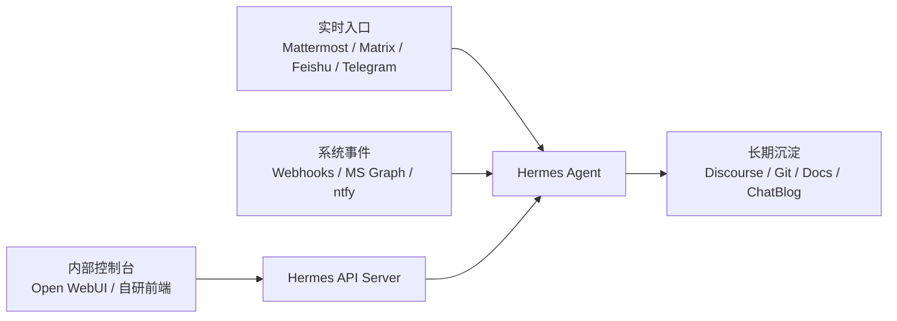

# Hermes 支持平台图鉴：从聊天窗口到 Agent 工作间

这篇调研回答一个很实际的问题：**Hermes 已经能进这么多平台，那我们以后要把 Agent 放到哪里？**

上一篇文章讲的是 Hermes 的自定义入口机制：API Server、Inbound Webhooks 和 Hooks。那篇文章偏“机制”。这一篇偏“产品形态”：把 Hermes 当前文档和源码里能确认的 messaging / platform / API / webhook 入口逐个摊开，看它们分别像什么页面、采用什么交互模式、适不适合作为 ChatArch 后续 Agent community 的入口。

<!-- truncate -->

:::tip 一句话结论
如果目标是 **自托管、频道化、接近 Discord/Slack 的 Agent 工作间**，优先看 **Mattermost**，其次是 **Matrix / Element**。如果目标是把内部系统接进 Agent，优先用 **Hermes API Server + Open WebUI/自研前端** 和 **Webhooks**。Feishu/Lark 适合当前组织协作入口，但不是自托管平台。
:::

## 先校正：这里说的“支持”分三种

不能把“我们服务器上部署过某个平台”和“Hermes 原生支持这个平台”混在一起。本文只按 Hermes 当前资料分层：

| 支持层级 | 含义 | 例子 |
| --- | --- | --- |
| 内置 Platform adapter | `gateway.config.Platform` 里有显式枚举，`gateway/platforms/` 有 adapter 或 runner 直接创建逻辑 | Telegram、Slack、Matrix、Feishu、WeCom、API Server、Webhooks |
| Platform plugin | `plugins/platforms/<name>/plugin.yaml` + `register_platform()` 动态注册 | Discord、Mattermost、Google Chat、Home Assistant、IRC、LINE、ntfy、Photon、SimpleX、Teams |
| 机制入口 | 不是传统聊天平台，但外部 UI/系统可以通过 HTTP/API/Webhook 进入 Hermes | Open WebUI/API Server、Inbound Webhooks、Microsoft Graph webhook |

这也纠正了前面对话里的一个不确定点：**ntfy、IRC、SimpleX 不是“未支持候选”，当前 checkout 里有 platform plugin / docs 证据**。但 **Revolt/Stoat、Zulip、Discourse** 虽然我们在 `rexpc` 上部署过或讨论过，不在本文这份 Hermes 原生 gateway 清单里；要接它们，应走 API Server/Webhook bridge 或新增 connector。

## 这篇文章怎么读

下面每个平台都给五个字段：

- **页面形态**：用户看到的产品大概长什么样。
- **Hermes 接入层**：内置 adapter、platform plugin、API Server，还是 webhook 入口。
- **交互模式**：DM、频道、thread、webhook、API、卡片、语音等。
- **自托管边界**：平台本身能不能自托管，还是只有 bot/bridge 可以自己跑。
- **ChatArch 适配判断**：适合作主社区、实时工作间、个人入口、告警入口，还是只适合专项 pipeline。

截图说明：本文截图来自各平台公开官网/文档页面的 headless 抓取；其中少数平台官网对远端 headless 截图不友好，本文改用其官方支持页、开发者文档或官方源码仓库页面作为页面形态参考。

## 快速选择框架

| 目标 | 首选 | 备选 | 不推荐作为主入口的原因 |
| --- | --- | --- | --- |
| 自托管 Agent 工作间 | Mattermost | Matrix / Element、IRC | Discord/Slack/Feishu/Teams 是 SaaS；ntfy/SMS/Email 不是聊天室 |
| 现有企业协作入口 | Feishu/Lark、Slack、Teams、DingTalk、WeCom | Google Chat | 依赖组织 SaaS 权限和应用审核 |
| 个人移动入口 | Telegram、WhatsApp、Signal、LINE、Weixin | BlueBubbles/Photon、QQ、Yuanbao | 账号/生态依赖强，适合入口不适合 canonical 讨论沉淀 |
| 系统事件进入 Agent | Webhooks | MS Graph webhook、ntfy | 不是人类讨论界面，但最适合自动触发 |
| 内部 UI / 控制台 | API Server + Open WebUI | 自研前端 | 需要自己管理 auth、会话和暴露边界 |

## 总表：27 个入口

| 平台 | Hermes 接入层 | 交互形态 | 自托管判断 | ChatArch 角色 |
| --- | --- | --- | --- | --- |
| Telegram | 内置 Platform adapter | 即时通讯 / 频道 / 群组 | SaaS / 平台侧不可自托管 | 轻量外部入口、个人/小群协作、通知和语音输入。 |
| Discord | 内置 Platform + plugin adapter | 实时社区 / 频道 / 语音 | 平台不可自托管，bridge 可自部署 | 公开社区实时入口和语音/频道互动；不适合作为完全自托管 canonical 社区。 |
| Slack | 内置 Platform adapter | 企业协作 / 频道 | SaaS / 平台侧不可自托管 | 企业团队内 Agent 工作间，但不是开源自托管社区入口。 |
| Google Chat | Platform plugin | Google Workspace 聊天 | SaaS / 平台侧不可自托管 | Google Workspace 组织内部的低公网暴露 bot 入口。 |
| WhatsApp / WhatsApp Business | 内置 Platform adapter | 移动 IM / 客户触达 | SaaS / 平台侧不可自托管 | 面向外部个人用户的低门槛入口；合规和账号稳定性要单独评估。 |
| Signal | 内置 Platform adapter | 隐私即时通讯 | SaaS / 平台侧不可自托管 | 私密小群/个人入口；不适合大规模公开社区。 |
| SMS (Twilio) | 内置 Platform adapter | 短信 / 最低门槛入口 | 需按平台确认 | 告警、紧急回执、极简入口；不适合复杂协作。 |
| Email (IMAP/SMTP) | 内置 Platform adapter | 异步邮件 | 可自托管 | 长文本、异步审批、外部协作；实时性弱。 |
| Mattermost | 内置 Platform + plugin adapter | 自托管团队聊天 / 频道 | 可自托管 | 首选自托管 Agent 工作间：频道、线程、团队权限都比较贴合。 |
| Matrix / Element | 内置 Platform adapter | 联邦聊天协议 / 客户端生态 | 可自托管 | 开放联邦和自托管强，但运维/身份/桥接复杂度高于 Mattermost。 |
| Home Assistant | 内置 Platform + plugin adapter | 智能家居控制台 | 可自托管 | 家庭/实验室自动化入口，不适合作为 Agent 社区主讨论空间。 |
| DingTalk | 内置 Platform adapter | 企业 IM / 国内办公 | SaaS / 平台侧不可自托管 | 国内企业组织内入口，卡片交互比纯消息更强。 |
| Feishu / Lark | 内置 Platform adapter | 企业协作 / IM / 文档生态 | SaaS / 平台侧不可自托管 | 当前工作空间入口；适合任务派发、审批、文档协作和多工具 Agent。 |
| WeCom / 企业微信 | 内置 Platform adapter | 企业微信生态 | SaaS / 平台侧不可自托管 | 微信生态组织入口；适合内部企业场景，不适合开放社区。 |
| Weixin / WeChat | 内置 Platform adapter | 个人微信 bridge | SaaS / 平台侧不可自托管 | 熟人网络/轻量入口；合规、账号风险和稳定性要谨慎。 |
| BlueBubbles (iMessage) | 内置 Platform adapter | iMessage bridge | SaaS / 平台侧不可自托管 | Apple 个人消息入口，不适合团队社区。 |
| Photon iMessage | Platform plugin | iMessage bridge / 插件 | 平台不可自托管，bridge 可自部署 | Apple 个人入口候选，和 BlueBubbles 类似但实现栈不同。 |
| QQ Bot | 内置 Platform adapter | QQ 频道/群 Bot | SaaS / 平台侧不可自托管 | 国内 QQ 社群入口；平台权限和审核约束较强。 |
| Yuanbao | 内置 Platform adapter | 企业/群组消息平台 | 平台不可自托管，bridge 可自部署 | 如已有 Yuanbao 群，可作为国内群组入口；生态边界需单独验证。 |
| Microsoft Teams | Platform plugin | Microsoft 365 企业协作 | SaaS / 平台侧不可自托管 | Microsoft 365 组织入口和审批卡片；外部开放社区不优先。 |
| LINE | Platform plugin | 移动 IM / 公众账号 | SaaS / 平台侧不可自托管 | 日本/台湾/东南亚用户触达入口。 |
| ntfy | Platform plugin | Pub/Sub 通知 | 可自托管 | 告警、cron 通知、低摩擦订阅；不适合作为主讨论空间。 |
| SimpleX Chat | Platform plugin | 隐私聊天网络 | 可自托管 | 高隐私小范围通信候选，不适合大众社区默认入口。 |
| IRC | Platform plugin | 老牌实时聊天协议 | 可自托管 | 工程/开源老派入口，低资源但现代 UX 弱。 |
| Open WebUI / API Server | API Server / OpenAI-compatible | 浏览器 UI / OpenAI-compatible API | 可自托管 | 内部工具/网页控制台/自研前端接 Agent 的主入口。 |
| Webhooks | Webhook / Event ingress | 事件入口 | 需按平台确认 | GitHub PR、CI、监控、业务事件进入 Agent 的标准机制。 |
| Microsoft Graph Webhook / Teams Meetings | Webhook / Event ingress | Microsoft 365 事件入口 | SaaS / 平台侧不可自托管 | 会议纪要和企业协作流水线，不是普通聊天入口。 |

## 平台卡片

## 一、实时社区与团队频道

### Mattermost

- **页面形态**：自托管团队聊天 / 频道。公开页面：[https://mattermost.com/](https://mattermost.com/)。
- **Hermes 接入层**：内置 Platform + plugin adapter；证据：`docs:mattermost.md; builtin:Platform.MATTERMOST; plugin:plugins/platforms/mattermost`；文档入口：[https://hermes-agent.nousresearch.com/docs/user-guide/messaging/mattermost/](https://hermes-agent.nousresearch.com/docs/user-guide/messaging/mattermost/)。
- **交互模式**：WebSocket event stream + REST；team/channel/thread；Slack-like 体验。
- **自托管边界**：可自托管，且是 Hermes 支持平台里最像 Discord/Slack 的自托管社区入口。
- **ChatArch 判断**：首选自托管 Agent 工作间：频道、线程、团队权限都比较贴合。

### Matrix / Element

- **页面形态**：联邦聊天协议 / 客户端生态。公开页面：[https://element.io/](https://element.io/)。
- **Hermes 接入层**：内置 Platform adapter；证据：`docs:matrix.md; builtin:Platform.MATRIX; adapter:gateway/platforms/matrix.py`；文档入口：[https://hermes-agent.nousresearch.com/docs/user-guide/messaging/matrix/](https://hermes-agent.nousresearch.com/docs/user-guide/messaging/matrix/)。
- **交互模式**：homeserver room/event；Element 等客户端；支持 thread/reaction/附件。
- **自托管边界**：Matrix homeserver 可自托管；Element 客户端也可自托管。
- **ChatArch 判断**：开放联邦和自托管强，但运维/身份/桥接复杂度高于 Mattermost。

### Discord

- **页面形态**：实时社区 / 频道 / 语音。公开页面：[https://support.discord.com/hc/en-us](https://support.discord.com/hc/en-us)。
- **Hermes 接入层**：内置 Platform + plugin adapter；证据：`docs:discord.md; builtin:Platform.DISCORD; plugin:plugins/platforms/discord`；文档入口：[https://hermes-agent.nousresearch.com/docs/user-guide/messaging/discord/](https://hermes-agent.nousresearch.com/docs/user-guide/messaging/discord/)。
- **交互模式**：Bot Gateway；server/channel/thread/forum/voice；@mention、slash command、按钮/反应、语音频道。
- **自托管边界**：官方服务不能自托管；bot 可自部署。
- **ChatArch 判断**：公开社区实时入口和语音/频道互动；不适合作为完全自托管 canonical 社区。

### Slack

- **页面形态**：企业协作 / 频道。公开页面：[https://slack.com/](https://slack.com/)。
- **Hermes 接入层**：内置 Platform adapter；证据：`docs:slack.md; builtin:Platform.SLACK; adapter:gateway/platforms/slack.py`；文档入口：[https://hermes-agent.nousresearch.com/docs/user-guide/messaging/slack/](https://hermes-agent.nousresearch.com/docs/user-guide/messaging/slack/)。
- **交互模式**：Socket Mode；workspace/channel/DM/thread；bot mention、thread reply、文件。
- **自托管边界**：SaaS，不可自托管。
- **ChatArch 判断**：企业团队内 Agent 工作间，但不是开源自托管社区入口。

### Google Chat

- **页面形态**：Google Workspace 聊天。公开页面：[https://github.com/googleworkspace/google-chat-samples](https://github.com/googleworkspace/google-chat-samples)。
- **Hermes 接入层**：Platform plugin；证据：`docs:google_chat.md; plugin:plugins/platforms/google_chat`；文档入口：[https://hermes-agent.nousresearch.com/docs/user-guide/messaging/google_chat/](https://hermes-agent.nousresearch.com/docs/user-guide/messaging/google_chat/)。
- **交互模式**：Cloud Pub/Sub pull subscription 收事件，Chat REST API 发消息；DM、space、thread。
- **自托管边界**：SaaS，不可自托管。
- **ChatArch 判断**：Google Workspace 组织内部的低公网暴露 bot 入口。

### Microsoft Teams

- **页面形态**：Microsoft 365 企业协作。公开页面：[https://www.microsoft.com/en-us/microsoft-teams/group-chat-software](https://www.microsoft.com/en-us/microsoft-teams/group-chat-software)。
- **Hermes 接入层**：Platform plugin；证据：`docs:teams.md; plugin:plugins/platforms/teams`；文档入口：[https://hermes-agent.nousresearch.com/docs/user-guide/messaging/teams/](https://hermes-agent.nousresearch.com/docs/user-guide/messaging/teams/)。
- **交互模式**：Bot Framework webhook；DM、群聊、channel posts；Adaptive Card 审批。
- **自托管边界**：SaaS，不可自托管。
- **ChatArch 判断**：Microsoft 365 组织入口和审批卡片；外部开放社区不优先。

### DingTalk

- **页面形态**：企业 IM / 国内办公。公开页面：[https://www.dingtalk.com/](https://www.dingtalk.com/)。
- **Hermes 接入层**：内置 Platform adapter；证据：`docs:dingtalk.md; builtin:Platform.DINGTALK; adapter:gateway/platforms/dingtalk.py`；文档入口：[https://hermes-agent.nousresearch.com/docs/user-guide/messaging/dingtalk/](https://hermes-agent.nousresearch.com/docs/user-guide/messaging/dingtalk/)。
- **交互模式**：Stream Mode 长连接；DM/群组；session webhook 回复；可选 AI Cards。
- **自托管边界**：SaaS，不可自托管。
- **ChatArch 判断**：国内企业组织内入口，卡片交互比纯消息更强。

### Feishu / Lark

- **页面形态**：企业协作 / IM / 文档生态。公开页面：[https://www.larksuite.com/](https://www.larksuite.com/)。
- **Hermes 接入层**：内置 Platform adapter；证据：`docs:feishu.md; builtin:Platform.FEISHU; adapter:gateway/platforms/feishu.py`；文档入口：[https://hermes-agent.nousresearch.com/docs/user-guide/messaging/feishu/](https://hermes-agent.nousresearch.com/docs/user-guide/messaging/feishu/)。
- **交互模式**：事件回调/长连接、群聊/话题/卡片/文档；适合 rich card 与工具审批。
- **自托管边界**：SaaS，不可自托管。
- **ChatArch 判断**：当前工作空间入口；适合任务派发、审批、文档协作和多工具 Agent。

### WeCom / 企业微信

- **页面形态**：企业微信生态。公开页面：[https://work.weixin.qq.com/](https://work.weixin.qq.com/)。
- **Hermes 接入层**：内置 Platform adapter；证据：`docs:wecom.md; docs:wecom-callback.md; builtin:Platform.WECOM; builtin:Platform.WECOM_CALLBACK; adapter:gateway/platforms/wecom.py; adapter:gateway/platforms/wecom_callback.py`；文档入口：[https://hermes-agent.nousresearch.com/docs/user-guide/messaging/wecom/](https://hermes-agent.nousresearch.com/docs/user-guide/messaging/wecom/)。
- **交互模式**：AI Bot WebSocket 或自建应用 callback；企业通讯录/群/会话。
- **自托管边界**：SaaS，不可自托管；callback 服务可自部署。
- **ChatArch 判断**：微信生态组织入口；适合内部企业场景，不适合开放社区。

## 二、个人移动 IM 与私密消息入口

### Telegram

- **页面形态**：即时通讯 / 频道 / 群组。公开页面：[https://github.com/telegramdesktop/tdesktop](https://github.com/telegramdesktop/tdesktop)。
- **Hermes 接入层**：内置 Platform adapter；证据：`docs:index; docs:telegram.md; builtin:Platform.TELEGRAM; adapter:gateway/platforms/telegram.py`；文档入口：[https://hermes-agent.nousresearch.com/docs/user-guide/messaging/telegram/](https://hermes-agent.nousresearch.com/docs/user-guide/messaging/telegram/)。
- **交互模式**：Bot API；DM、群组、频道、topic/thread；轮询或 webhook；支持流式编辑、文件/图片/语音。
- **自托管边界**：客户端/服务端不可自托管；bot 可自部署。
- **ChatArch 判断**：轻量外部入口、个人/小群协作、通知和语音输入。

### WhatsApp / WhatsApp Business

- **页面形态**：移动 IM / 客户触达。公开页面：[https://www.whatsapp.com/](https://www.whatsapp.com/)。
- **Hermes 接入层**：内置 Platform adapter；证据：`docs:whatsapp.md; docs:whatsapp-cloud.md; builtin:Platform.WHATSAPP; builtin:Platform.WHATSAPP_CLOUD; adapter:gateway/platforms/whatsapp.py; adapter:gateway/platforms/whatsapp_cloud.py`；文档入口：[https://hermes-agent.nousresearch.com/docs/user-guide/messaging/whatsapp/](https://hermes-agent.nousresearch.com/docs/user-guide/messaging/whatsapp/)。
- **交互模式**：两条路径：Baileys bridge 或 Meta Business Cloud API webhook；以手机号/会话为中心。
- **自托管边界**：WhatsApp 服务不可自托管；bridge/API 运行面可自部署。
- **ChatArch 判断**：面向外部个人用户的低门槛入口；合规和账号稳定性要单独评估。

### Signal

- **页面形态**：隐私即时通讯。公开页面：[https://github.com/signalapp/Signal-Desktop](https://github.com/signalapp/Signal-Desktop)。
- **Hermes 接入层**：内置 Platform adapter；证据：`docs:signal.md; builtin:Platform.SIGNAL; adapter:gateway/platforms/signal.py`；文档入口：[https://hermes-agent.nousresearch.com/docs/user-guide/messaging/signal/](https://hermes-agent.nousresearch.com/docs/user-guide/messaging/signal/)。
- **交互模式**：signal-cli daemon；手机号身份、DM/群组、附件；本地 bridge 接收/发送。
- **自托管边界**：Signal 公共网络不可自托管；本地 signal-cli bridge 可自部署。
- **ChatArch 判断**：私密小群/个人入口；不适合大规模公开社区。

### LINE

- **页面形态**：移动 IM / 公众账号。公开页面：[https://developers.line.biz/en/docs/messaging-api/overview/](https://developers.line.biz/en/docs/messaging-api/overview/)。
- **Hermes 接入层**：Platform plugin；证据：`docs:line.md; plugin:plugins/platforms/line`；文档入口：[https://hermes-agent.nousresearch.com/docs/user-guide/messaging/line/](https://hermes-agent.nousresearch.com/docs/user-guide/messaging/line/)。
- **交互模式**：LINE Messaging API webhook；一对一/群、图片文件、typing。
- **自托管边界**：LINE 服务不可自托管；webhook 服务自部署。
- **ChatArch 判断**：日本/台湾/东南亚用户触达入口。

### Weixin / WeChat

- **页面形态**：个人微信 bridge。公开页面：[https://weixin.qq.com/](https://weixin.qq.com/)。
- **Hermes 接入层**：内置 Platform adapter；证据：`docs:weixin.md; builtin:Platform.WEIXIN; adapter:gateway/platforms/weixin.py`；文档入口：[https://hermes-agent.nousresearch.com/docs/user-guide/messaging/weixin/](https://hermes-agent.nousresearch.com/docs/user-guide/messaging/weixin/)。
- **交互模式**：iLink Bot API/bridge；个人号/群聊/消息流。
- **自托管边界**：微信服务不可自托管；bridge 可自部署。
- **ChatArch 判断**：熟人网络/轻量入口；合规、账号风险和稳定性要谨慎。

### BlueBubbles (iMessage)

- **页面形态**：iMessage bridge。公开页面：[https://bluebubbles.app/](https://bluebubbles.app/)。
- **Hermes 接入层**：内置 Platform adapter；证据：`docs:bluebubbles.md; builtin:Platform.BLUEBUBBLES; adapter:gateway/platforms/bluebubbles.py`；文档入口：[https://hermes-agent.nousresearch.com/docs/user-guide/messaging/bluebubbles/](https://hermes-agent.nousresearch.com/docs/user-guide/messaging/bluebubbles/)。
- **交互模式**：macOS BlueBubbles server；iMessage/SMS conversation、附件、反应。
- **自托管边界**：需要自有 Mac server；Apple iMessage 网络本身不可自托管。
- **ChatArch 判断**：Apple 个人消息入口，不适合团队社区。

### Photon iMessage

- **页面形态**：iMessage bridge / 插件。公开页面：[https://github.com/openimessage/photon](https://github.com/openimessage/photon)。
- **Hermes 接入层**：Platform plugin；证据：`docs:photon.md; plugin:plugins/platforms/photon`；文档入口：[https://hermes-agent.nousresearch.com/docs/user-guide/messaging/photon/](https://hermes-agent.nousresearch.com/docs/user-guide/messaging/photon/)。
- **交互模式**：Photon sidecar/adapter 接入 iMessage 类会话；偏本地桥接。
- **自托管边界**：运行面可自部署，底层仍依赖 Apple 消息生态。
- **ChatArch 判断**：Apple 个人入口候选，和 BlueBubbles 类似但实现栈不同。

### QQ Bot

- **页面形态**：QQ 频道/群 Bot。公开页面：[https://bot.q.qq.com/wiki/](https://bot.q.qq.com/wiki/)。
- **Hermes 接入层**：内置 Platform adapter；证据：`docs:qqbot.md; builtin:Platform.QQBOT; adapter:gateway/platforms/qqbot/adapter.py`；文档入口：[https://hermes-agent.nousresearch.com/docs/user-guide/messaging/qqbot/](https://hermes-agent.nousresearch.com/docs/user-guide/messaging/qqbot/)。
- **交互模式**：QQ Bot 平台，WebSocket/OpenAPI；群/频道消息、图片文件、语音。
- **自托管边界**：QQ 服务不可自托管；bot 运行面可自部署。
- **ChatArch 判断**：国内 QQ 社群入口；平台权限和审核约束较强。

### Yuanbao

- **页面形态**：企业/群组消息平台。公开页面：[https://yuanbao.tencent.com/](https://yuanbao.tencent.com/)。
- **Hermes 接入层**：内置 Platform adapter；证据：`docs:yuanbao.md; builtin:Platform.YUANBAO; adapter:gateway/platforms/yuanbao.py`；文档入口：[https://hermes-agent.nousresearch.com/docs/user-guide/messaging/yuanbao/](https://hermes-agent.nousresearch.com/docs/user-guide/messaging/yuanbao/)。
- **交互模式**：WebSocket gateway；群组消息、@mention、媒体；偏国内企业/协作场景。
- **自托管边界**：按当前资料视为平台侧服务，Hermes adapter 自部署。
- **ChatArch 判断**：如已有 Yuanbao 群，可作为国内群组入口；生态边界需单独验证。

### SimpleX Chat

- **页面形态**：隐私聊天网络。公开页面：[https://github.com/simplex-chat/simplex-chat](https://github.com/simplex-chat/simplex-chat)。
- **Hermes 接入层**：Platform plugin；证据：`docs:simplex.md; plugin:plugins/platforms/simplex`；文档入口：[https://hermes-agent.nousresearch.com/docs/user-guide/messaging/simplex/](https://hermes-agent.nousresearch.com/docs/user-guide/messaging/simplex/)。
- **交互模式**：SimpleX local agent / WebSocket；无全局用户 ID，隐私强，接入复杂。
- **自托管边界**：可自托管 relay/SMP 等组件；客户端网络设计较特殊。
- **ChatArch 判断**：高隐私小范围通信候选，不适合大众社区默认入口。

## 三、低摩擦通知、邮件与老派协议

### SMS (Twilio)

- **页面形态**：短信 / 最低门槛入口。公开页面：[https://www.twilio.com/en-us/messaging/channels/sms](https://www.twilio.com/en-us/messaging/channels/sms)。
- **Hermes 接入层**：内置 Platform adapter；证据：`docs:sms.md; builtin:Platform.SMS; adapter:gateway/platforms/sms.py`；文档入口：[https://hermes-agent.nousresearch.com/docs/user-guide/messaging/sms/](https://hermes-agent.nousresearch.com/docs/user-guide/messaging/sms/)。
- **交互模式**：Twilio webhook 收短信、REST API 发短信；无富媒体上下文。
- **自托管边界**：依赖运营商/Twilio，不是自托管。
- **ChatArch 判断**：告警、紧急回执、极简入口；不适合复杂协作。

### Email (IMAP/SMTP)

- **页面形态**：异步邮件。公开页面：[https://roundcube.net/](https://roundcube.net/)。
- **Hermes 接入层**：内置 Platform adapter；证据：`docs:email.md; builtin:Platform.EMAIL; adapter:gateway/platforms/email.py`；文档入口：[https://hermes-agent.nousresearch.com/docs/user-guide/messaging/email/](https://hermes-agent.nousresearch.com/docs/user-guide/messaging/email/)。
- **交互模式**：IMAP 轮询收信、SMTP 发信；thread 依赖邮件头/主题。
- **自托管边界**：可自托管邮件服务器，也可用 SaaS 邮箱。
- **ChatArch 判断**：长文本、异步审批、外部协作；实时性弱。

### ntfy

- **页面形态**：Pub/Sub 通知。公开页面：[https://ntfy.sh/](https://ntfy.sh/)。
- **Hermes 接入层**：Platform plugin；证据：`docs:ntfy.md; plugin:plugins/platforms/ntfy`；文档入口：[https://hermes-agent.nousresearch.com/docs/user-guide/messaging/ntfy/](https://hermes-agent.nousresearch.com/docs/user-guide/messaging/ntfy/)。
- **交互模式**：topic-based pub/sub；更像通知通道而非聊天室。
- **自托管边界**：ntfy server 可自托管，也可用 ntfy.sh。
- **ChatArch 判断**：告警、cron 通知、低摩擦订阅；不适合作为主讨论空间。

### IRC

- **页面形态**：老牌实时聊天协议。公开页面：[https://libera.chat/](https://libera.chat/)。
- **Hermes 接入层**：Platform plugin；证据：`plugin:plugins/platforms/irc; registry:Platform("irc") dynamic plugin`。当前 checkout 没有独立 `website/docs/user-guide/messaging/irc.md`，因此发布时应引用插件源码/manifest，而不是伪造 docs 页。
- **交互模式**：server/channel/nick；纯文本为主；适合 bot 命令和日志化。
- **自托管边界**：可自托管 IRC server，也可用公共网络。
- **ChatArch 判断**：工程/开源老派入口，低资源但现代 UX 弱。

## 四、不是聊天平台，但很适合接 Agent 的入口

### Home Assistant

- **页面形态**：智能家居控制台。公开页面：[https://www.home-assistant.io/](https://www.home-assistant.io/)。
- **Hermes 接入层**：内置 Platform + plugin adapter；证据：`docs:homeassistant.md; builtin:Platform.HOMEASSISTANT; plugin:plugins/platforms/homeassistant; tool:tools/homeassistant_tool.py`；文档入口：[https://hermes-agent.nousresearch.com/docs/user-guide/messaging/homeassistant/](https://hermes-agent.nousresearch.com/docs/user-guide/messaging/homeassistant/)。
- **交互模式**：不是聊天社区；通过 Home Assistant API/WebSocket 控制实体、读状态、执行服务。
- **自托管边界**：可自托管。
- **ChatArch 判断**：家庭/实验室自动化入口，不适合作为 Agent 社区主讨论空间。

### Open WebUI / API Server

- **页面形态**：浏览器 UI / OpenAI-compatible API。公开页面：[https://openwebui.com/](https://openwebui.com/)。
- **Hermes 接入层**：API Server / OpenAI-compatible；证据：`docs:open-webui.md; docs:features/api-server.md; builtin:Platform.API_SERVER; adapter:gateway/platforms/api_server.py`；文档入口：[https://hermes-agent.nousresearch.com/docs/user-guide/messaging/open-webui/](https://hermes-agent.nousresearch.com/docs/user-guide/messaging/open-webui/)。
- **交互模式**：OpenAI-compatible chat/completions、responses、runs；SSE streaming；由外部 UI 主动调用 Hermes。
- **自托管边界**：Hermes API Server 与 Open WebUI 均可自托管。
- **ChatArch 判断**：内部工具/网页控制台/自研前端接 Agent 的主入口。

### Webhooks

- **页面形态**：事件入口。公开页面：[https://docs.github.com/en/webhooks](https://docs.github.com/en/webhooks)。
- **Hermes 接入层**：Webhook / Event ingress；证据：`docs:webhooks.md; builtin:Platform.WEBHOOK; adapter:gateway/platforms/webhook.py`；文档入口：[https://hermes-agent.nousresearch.com/docs/user-guide/messaging/webhooks/](https://hermes-agent.nousresearch.com/docs/user-guide/messaging/webhooks/)。
- **交互模式**：`POST /webhooks/<name>`；HMAC/过滤/模板；事件触发 agent run 或转发。
- **自托管边界**：Hermes webhook server 自托管；上游事件源各异。
- **ChatArch 判断**：GitHub PR、CI、监控、业务事件进入 Agent 的标准机制。

### Microsoft Graph Webhook / Teams Meetings

- **页面形态**：Microsoft 365 事件入口。公开页面：[https://learn.microsoft.com/en-us/graph/change-notifications-overview](https://learn.microsoft.com/en-us/graph/change-notifications-overview)。
- **Hermes 接入层**：Webhook / Event ingress；证据：`docs:msgraph-webhook.md; docs:teams-meetings.md; builtin:Platform.MSGRAPH_WEBHOOK; adapter:gateway/platforms/msgraph_webhook.py; plugin:plugins/teams_pipeline`；文档入口：[https://hermes-agent.nousresearch.com/docs/user-guide/messaging/msgraph-webhook/](https://hermes-agent.nousresearch.com/docs/user-guide/messaging/msgraph-webhook/)。
- **交互模式**：Graph change notification webhook；会议、日历、聊天等事件进入 Hermes/Teams pipeline。
- **自托管边界**：监听器自托管，Microsoft 365 云端不可自托管。
- **ChatArch 判断**：会议纪要和企业协作流水线，不是普通聊天入口。

## 对 ChatArch 的实际建议

### 1. 主社区仍然需要 canonical 讨论层

Discourse 这类 forum/topic/comment 系统适合长期沉淀：提案、任务、结论、复盘、搜索和外部引用。Hermes 支持很多聊天入口，并不意味着聊天平台应该替代 canonical discussion。更合理的结构是：

实时入口负责“叫醒”和“协作”，canonical 层负责“留下来”。

### 2. 如果要一个自托管 Discord-like 工作间，Mattermost 是最短路径

从 Hermes 支持现状看，Mattermost 同时满足：

- 自托管；
- 频道/团队/线程模型接近 Slack/Discord；
- Hermes 有 plugin / docs / Platform enum 证据；
- 运维复杂度低于 Matrix federation；
- 比 ntfy、Email、SMS 更像真实工作间。

Matrix / Element 的优势是开放协议和联邦，但身份、桥接、加密、homeserver 运维和客户端选择会带来更多决策点。它适合把 ChatArch 做成开放网络节点，但不是最快 demo。

### 3. Feishu/Lark 是当前协作入口，不是自托管候选

我们现在就在 Feishu 里用 Hermes。Feishu 的优势是卡片、文档、审批、群聊和企业组织能力，适合 ChatArch 当前工作流。但它是 SaaS。文章、任务、结论仍应回写到 Git/Discourse/ChatBlog 这类可审计载体。

### 4. API Server 和 Webhooks 是所有“非原生平台”的逃生门

Revolt/Stoat、Zulip、Discourse 这类已部署或候选平台，如果没有 Hermes 原生 gateway，不代表不能接：

- 能主动调用 Agent 的，用 **API Server**；
- 能发事件回调的，用 **Inbound Webhooks**；
- 需要平台语义、附件、线程、权限都完整保留的，再写 **platform adapter / connector**。

这也是上一篇机制文章和本文平台图鉴的连接点。

## 主要来源

- Hermes Messaging Gateway docs：https://hermes-agent.nousresearch.com/docs/user-guide/messaging/
- Hermes API Server docs：https://hermes-agent.nousresearch.com/docs/user-guide/features/api-server/
- Hermes Webhooks docs：https://hermes-agent.nousresearch.com/docs/user-guide/messaging/webhooks/
- 本地源码核验：`gateway/config.py`、`gateway/platforms/`、`plugins/platforms/`、`gateway/platform_registry.py`。
- 各平台公开官网/文档页面见 `data/platform-inventory.json` 与 `data/screenshot-manifest.json`。
