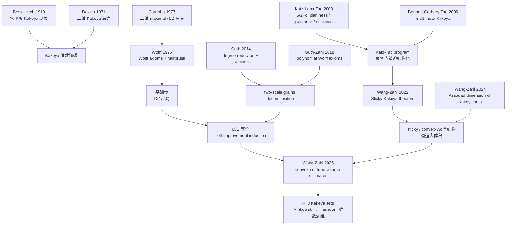

2026 年 ICM 公布菲尔兹奖名单时，Hong Wang（王虹）的官方 citation 看起来像一串专业名词：harmonic analysis、geometric measure theory、multiscale、decoupling、local smoothing、Fourier restriction、Falconer distance sets、Furstenberg sets、Kakeya problem。

如果只把它翻译成“调和分析与几何测度论”，读者很难知道她到底做了什么。

更好的理解方式是：王虹的工作解释了**波、频率、分形和细长管子之间隐藏的同一套几何结构**。一个函数的频率如果集中在曲面附近，它在空间里会像很多细长的波包或管子一样传播；而这些管子如何相交、如何覆盖空间、如何在不同尺度上聚集，正是 Fourier restriction、波方程 local smoothing、Falconer 距离问题、Furstenberg 集和 Kakeya 猜想共同关心的核心。

<!-- truncate -->

:::tip 一句话总结
王虹的菲尔兹奖工作不是“解决了一个孤立题目”，而是在调和分析与几何测度论交界处推进了一整组长期问题：她用多尺度、decoupling、polynomial partitioning、wave packet / tube geometry 等工具，把波方程的平滑性、曲面 Fourier 限制、分形距离集、方向分形和三维 Kakeya 问题放进同一套可操作的几何框架里。
:::

:::info 资料边界
本文基于 [IMU 2026 Fields Medal 页面](https://www.mathunion.org/imu-awards/fields-medal/fields-medals-2026)、[Hong Wang 官方 citation PDF](https://www.mathunion.org/fileadmin/documents/2026-07/Hong_Wang_Citations.pdf)、[ICM 2026 首页](https://www.icm2026.org/)、[王虹个人主页](https://sites.google.com/view/hongwang/home) 以及相关 arXiv 论文。对尚处预印本阶段的结果，本文会区分“论文摘要中的证明声明”和“官方 citation 的保守表述”。
:::

## 官方到底奖励了什么

IMU 的短 citation 写得很明确：王虹因其在 harmonic analysis 和 geometric measure theory 中的工作获奖，包括把 multiscale 与 decoupling 技术用于平面波方程 local smoothing 猜想，并在 Fourier restriction、Falconer distance sets、平面 Furstenberg sets、三维 Kakeya 问题上取得重大进展。

长 citation 进一步强调三点：

1. 她把现代调和分析和几何测度论中的技术延伸、精炼，并在中心问题上取得一系列突破；
2. 她与 Larry Guth、Ruixiang Zhang 引入强有力的 decoupling 与多尺度论证，解决了平面波方程的 local smoothing conjecture；
3. 她与合作者推进了 Falconer、Furstenberg 和三维 Kakeya 等几何测度论问题，并发展出影响当代调和分析的新方法。

这说明菲尔兹奖看重的不是单篇论文，而是一条连续主线：**从 Fourier 分析中的曲面和波，到几何测度论里的分形、方向和管子结构。**

## 为什么这些问题会连在一起

王虹个人主页上对研究兴趣有一个很好的非正式描述：如果一个函数的 Fourier transform 支持在球面、曲面或某种“弯曲”的离散点集附近，我们能对这个函数说什么？如何把函数分解成有意义的小块？这些问题与 decoupling theory、Falconer distance problem 和 incidence geometry 相关。

这段话其实就是一张地图。

在 Fourier 分析里，频率支撑在曲面附近的函数可以分解成很多 wave packets。每个 wave packet 在空间中像一根细长的管子：它有方向、有尺度、会和其他管子相交，也可能在某些区域高度聚集。

于是分析问题变成几何问题：

| 分析语言 | 几何语言 | 相关问题 |
|---|---|---|
| Fourier transform 支撑在曲面上 | 空间中的波包沿方向传播 | Fourier restriction、decoupling |
| 波方程随时间演化 | cone 上的频率与空间-时间管子 | local smoothing |
| 分形测度的 Fourier decay | 分形集合能决定多少距离 | Falconer distance problem |
| 每个方向都有一条分形截线 | 方向、投影、incidence 约束 | Furstenberg sets |
| 每个方向都有单位线段 | 细管覆盖与满维性 | Kakeya problem |

这也是为什么王虹的论文题目看似分散，实际却高度统一：restriction、Falconer、Furstenberg、Kakeya 都在问“同一批方向性结构能否过度集中”。

## 第一条线：local smoothing，波为什么会多一点平滑

波方程描述声波、光波或更抽象的传播现象。一般来说，波不会凭空变得更光滑；但如果我们把波在时间方向上做平均，是否能得到一点额外 regularity？这就是 local smoothing 问题的直觉。

王虹与 Larry Guth、Ruixiang Zhang 的论文 [A sharp square function estimate for the cone in R^3](https://arxiv.org/abs/1909.10693) 证明了三维 cone 的 sharp square function estimate，并由此推出 2+1 维波方程的 local smoothing conjecture。

这里的 cone 不是装饰性的几何对象。波方程的 Fourier 支撑自然落在 cone 上；对 cone 的 square function estimate 正是控制波包如何叠加和相互干涉的关键。

这篇论文的重要性在于：它把 decoupling、多尺度分析和 wave packet 几何推进到可以解决长期猜想的精度。它也是官方 citation 中 “applications of multiscale and decoupling techniques to the local smoothing conjecture for the planar wave equation” 这一句的核心来源。

## 第二条线：Fourier restriction，曲面上的频率如何控制空间中的函数

Fourier restriction 问题问的是：如果一个函数的频率集中在曲面上，能否由曲面上的数据控制空间里的函数大小？这听起来抽象，但它是现代调和分析的核心问题之一，连接 PDE、振荡积分、几何组合和数论。

王虹早期就在 restriction 上取得关键推进。

她的单作者论文 [A restriction estimate in R^3 using brooms](https://arxiv.org/abs/1802.04312) 把 Wolff 的 two-ends argument 与 polynomial partitioning 结合起来，改进三维 paraboloid restriction estimate，并分析了 wave packets 的几何结构。题目中的 “brooms” 可以理解为一簇方向相近、位置相关的波包结构；控制这些结构，就是控制函数大值集的重要一步。

她与 Yumeng Ou 的 [A cone restriction estimate using polynomial partitioning](https://arxiv.org/abs/1704.05485) 则用 polynomial partitioning 改进 truncated cone 的 Fourier restriction estimate，特别解决 `n=5` 的 cone restriction conjecture，并恢复 `3≤n≤4` 的 sharp range。

后续她与 Shukun Wu 在 [An improved restriction estimate in R^3](https://arxiv.org/abs/2210.03878) 和 [Restriction estimates using decoupling theorems and two-ends Furstenberg inequalities](https://arxiv.org/abs/2411.08871) 中继续推进 restriction 路线。后一篇尤其有代表性：它把 restriction conjecture 与 two-ends Furstenberg inequalities 联系起来，显示王虹的工作不是把分析和几何并列摆放，而是在技术上把二者真正互相转化。

## 第三条线：Falconer distance problem，分形集合能决定多少距离

Falconer distance problem 的直觉很简单：如果平面或高维空间中有一个分形集合，它的维数足够大，那么点与点之间的距离集合应该也足够大，甚至有正 Lebesgue 测度。

难点在于，“维数大”并不意味着集合分布均匀。分形可以在许多尺度上高度不均匀，距离也可能因为结构性排列而异常少。

王虹参与的多篇论文把 Fourier restriction、weighted estimates 和 refined Strichartz 方法用于 Falconer 问题。

例如 [Weighted restriction estimates and application to Falconer distance set problem](https://arxiv.org/abs/1802.10186) 通过 polynomial partitioning 和 refined Strichartz 证明 weighted Fourier restriction estimates，并改进三维及更高维 Falconer distance set conjecture 的结果。

在平面情形，[On Falconer's distance set problem in the plane](https://arxiv.org/abs/1808.09346) 证明：如果紧集 `E ⊂ R^2` 的 Hausdorff 维数大于 `5/4`，则存在一点 `x ∈ E`，使 pinned distance set `{|x-y| : y ∈ E}` 有正 Lebesgue 测度。

在偶数维，[An improved result for Falconer's distance set problem in even dimensions](https://arxiv.org/abs/2006.06833) 证明：当 `d≥4` 为偶数，若 `dim_H(E) > d/2 + 1/4`，则距离集有正 Lebesgue 测度。

这些结果共同说明：Falconer 不是孤立的分形问题，它可以通过 Fourier decay、restriction 和波包几何来推进。

## 第四条线：Furstenberg sets，方向分形的维数下界

Furstenberg sets 关心另一种方向性分形：一个集合如果在很多方向上都含有一定维数的线段片段，那么这个集合本身必须有多大？

这个问题把 projection theorem、sum-product、incidence geometry 和 fractal geometry 绑在一起。它也是理解 Kakeya 的一个中间层：Kakeya 要求每个方向都有完整线段，Furstenberg sets 则允许每个方向上只有分形片段。

王虹与 Pablo Shmerkin 的 [Dimensions of Furstenberg sets and an extension of Bourgain's projection theorem](https://arxiv.org/abs/2211.13363) 改进了 Furstenberg 集的维数下界，并扩展 Bourgain 的 discretized projection / sum-product 型结果。

随后 Kevin Ren 与 Hong Wang 的 [Furstenberg sets estimate in the plane](https://arxiv.org/abs/2308.08819) 摘要称完全解决平面 `(s,t)`-Furstenberg set conjecture，证明其 Hausdorff 维数至少为

```text
min(s+t, (3s+t)/2, s+1)
```

并得到离散 sum-product 和投影问题的应用。

这条线的重要性在于：它提供了把“每个方向上有结构”转化为“整体集合必须足够大”的锐利工具。

## 第五条线：三维 Kakeya，所有方向的线段能挤进多小的集合

Kakeya 问题是这组问题里最容易画图、也最难证明的一类。

一个 Kakeya 集包含每个方向的一条单位线段。直觉上，它应该很大；但 Besicovitch 的构造告诉我们，在平面中可以有 Lebesgue 测度为零的 Kakeya 集。于是正确的问题变成：它的 Hausdorff 维数、Minkowski 维数是否仍然必须是满维？

王虹与 Joshua Zahl 在三维 Kakeya 上形成了一条连续推进。

第一步是 [Sticky Kakeya sets and the sticky Kakeya conjecture](https://arxiv.org/abs/2210.09581)。这篇论文研究一种具有近似多尺度自相似结构的 sticky Kakeya sets，并证明三维 sticky Kakeya conjecture。arXiv 页面注明该文将发表于 JAMS。

第二步是 [The Assouad dimension of Kakeya sets in R^3](https://arxiv.org/abs/2401.12337)。论文证明每个三维 Kakeya 集的 Assouad dimension 为 3，并对 Ahlfors-David regular Kakeya sets 和若干稳定维数条件下的 Kakeya sets 得到满 Hausdorff 维数结论。

第三步是 2025 年的 [Volume estimates for unions of convex sets, and the Kakeya set conjecture in three dimensions](https://arxiv.org/abs/2502.17655)。这篇 127 页预印本摘要称：通过研究三维中满足凸集 packing 条件的 `δ`-tubes 并证明其并集具有几乎最大体积，作者证明每个三维 Kakeya 集的 Minkowski 和 Hausdorff 维数都是 3。

这里要保守一点：IMU 官方 citation 没有直接写“完全解决 Kakeya conjecture in R^3”，而是写 “major advances in ... the Kakeya problem in three dimensions”。因此在公共写作里，最稳妥的说法是：**王虹与 Zahl 的预印本宣称证明三维 Kakeya 集满维；官方 citation 将其概括为三维 Kakeya 问题的重大进展。**

### 展开：Wang–Zahl 2025 的论文依赖图

如果从 citation 和证明结构看，这篇 2025 预印本更像 Wang–Zahl 三部曲的收束，而不是凭空出现的一次“单点爆破”。我下载了 arXiv source，粗略统计正文 `\cite{...}` 的 key：出现最多的是 Wang–Zahl 2024 的 Assouad dimension 前作，其次是 Wolff 1995 的 hairbrush / Wolff axioms、Guth 2014 的 graininess decomposition、Wang–Zahl 2022 的 Sticky Kakeya theorem，以及 Guth–Zahl 2018 的 polynomial Wolff axioms。这个计数不是学术影响力排名，但能显示作者自己在证明中反复回到哪些技术节点。

| 前置 paper / 工具 | 在 2025 论文中的作用 | 直观含义 |
|---|---|---|
| Wolff 1995：hairbrush 与 Wolff axioms | 给出初始体积下界，即论文中迭代的 `D(1/2,0)` 基础步 | 先证明管子不可能“太集中”，哪怕离满维还远 |
| Katz–Łaba–Tao 2000：`5/2+c`、planiness / graininess / stickiness | 提供三维 Kakeya counterexample 应有结构的语言 | 如果反例存在，它不应是随机乱糟糟的，而会被迫很有组织 |
| Bennett–Carbery–Tao 2006 与 Guth 2014 | 前者支撑 multilinear Kakeya / planiness，后者把 graininess 变成 polynomial-method 结构定理 | 反例的局部形状会像很多扁平 grains，而不是任意云团 |
| Wang–Zahl 2022：Sticky Kakeya theorem | 证明 sticky 管子族本身已经足以强迫满维 | 如果反例最终呈现多尺度 sticky 结构，就会自我矛盾 |
| Wang–Zahl 2024：Assouad dimension of Kakeya sets | 把 sticky / self-similar 结构与 Assouad 满维联系起来 | 说明三维 Kakeya 的“坏情形”会被压缩到很窄的结构类型 |
| Wang–Zahl 2025：convex-set tube volume estimates | 用凸集 non-clustering、two-scale grains 与自改进迭代覆盖剩余情形 | 把所有可能的三维反例都纳入同一个体积估计机器 |

可以把这条路线画成下面这张依赖图：



证明的逻辑可以压缩成四步。

第一步，**把 Kakeya 集离散化为 `δ`-tubes，并把目标改写成管子并集体积下界**。论文主定理先研究一族 `δ`-tubes：如果它们不在任意凸集中过度聚集，那么这些管子的并集就必须有几乎最大体积。Kakeya 集的满 Minkowski / Hausdorff 维数结论，是这个 tube volume theorem 的推论。

第二步，**把“聚集程度”变成可迭代参数**。论文定义 Katz–Tao Convex Wolff Axioms 的误差 `CKT`，以及 Frostman Slab Wolff Axioms 的误差 `FS`，再把所需体积估计包装为两类断言 `D(σ,ω)` 与 `E(σ,ω)`。粗略说，`σ` 记录离最优体积还有多少损失，`ω` 记录额外尺度损失。目标是从 Wolff hairbrush 给出的 `D(1/2,0)` 出发，迭代到没有损失的 `D(0,0)` / `E(0,0)`。

第三步，**证明自改进：如果某个估计几乎 sharp，那么它反而会暴露更多结构**。这是论文最核心的技术段。作者在两个尺度上做 grains decomposition：粗尺度 `ρ` 看一族胖管子，细尺度 `δ/ρ` 看每根胖管子内部的细管子。过去较粗的估计只看总体 multiplicity；这里更精细地分成 `μ_fine` 和 `μ_coarse`，分别用 `D/E` 在不同尺度上控制。只要结构不够极端，就能把 `D(σ,ω)` 改进为更强的估计。

第四步，**如果无法自改进，剩下的唯一坏情形就是 sticky / convex-Wolff 多尺度结构；但这类结构已被前两篇 Wang–Zahl 论文处理**。2025 论文再用 Nikishin–Stein–Pisier factorization，把这种“每个尺度都很结构化”的管子族转成 Sticky Kakeya theorem 可以吃掉的对象，于是得到几乎最大体积，与“这是反例 / sharp 坏情形”的假设矛盾。

所以这篇论文真正完成的不是“突然发明一个新技巧解决 Kakeya”，而是把过去三十年形成的几条线合成一个闭环：Wolff 给出 hairbrush 和 axioms，Katz–Łaba–Tao 给出三维反例的结构语言，Guth 的 polynomial method 把 grains 做成可用机器，Wang–Zahl 先解决 sticky 情形和 Assouad 情形，最后用 2025 的 convex-set volume estimate 把剩余所有非 sticky / 不规则情形也纳入自改进迭代。

## 方法层：她不是只会解题，而是在重塑工具箱

把这些问题放在一起看，王虹的贡献更像是一套方法论的重塑。

### 1. Wave packets：把函数看成很多管子

Fourier 支撑在曲面附近的函数，可以分解成沿不同方向传播的 wave packets。这让分析问题获得几何形状：管子、方向、尺度、相交、聚集。

### 2. Multiscale：每个尺度都要同时控制

这些问题很少能在单一尺度解决。分形集合、Kakeya tubes 和 wave packets 都会在大尺度、小尺度之间传递信息。多尺度论证的关键是：局部结构不能在层层放大后逃避全局限制。

### 3. Decoupling：把整体拆成可控的小块

Decoupling theory 研究如何把曲面频率支撑的函数拆成小频率块，并估计这些小块重新叠加后的大小。local smoothing 和 restriction 中的许多进展，都依赖这种“拆开后再精确控制”的能力。

### 4. Polynomial partitioning：用代数曲面切开空间

Polynomial partitioning 用多项式零集把空间切成许多区域，迫使波包要么横穿许多 cell，要么贴近低维代数结构。它把连续分析问题转成几何组合问题，是 Guth 以来这条路线的关键技术之一。

### 5. Incidence geometry：数管子、数交点、数方向

Furstenberg、Falconer、Kakeya 和 restriction 最后都会遇到 incidence 问题：多少管子可以穿过多少球？多少方向可以共享同一块空间？多少分形片段可以同时高度重合？王虹的多篇论文都在推进这种计数几何的极限。

## 一张阅读路线图

如果想从零开始读这条主线，可以按下面顺序：

1. 先读 IMU 的 [Fields Medals 2026 页面](https://www.mathunion.org/imu-awards/fields-medal/fields-medals-2026) 和 [Hong Wang citation PDF](https://www.mathunion.org/fileadmin/documents/2026-07/Hong_Wang_Citations.pdf)，获得官方五条线。
2. 读王虹个人主页的研究兴趣段落，理解她如何把 Fourier analysis、decoupling、Falconer 和 incidence geometry 连在一起。
3. 读 [A sharp square function estimate for the cone in R^3](https://arxiv.org/abs/1909.10693)，把 local smoothing 主线立住。
4. 读 [A restriction estimate in R^3 using brooms](https://arxiv.org/abs/1802.04312) 和 [A cone restriction estimate using polynomial partitioning](https://arxiv.org/abs/1704.05485)，看 restriction 与 polynomial partitioning 如何结合。
5. 读 [Furstenberg sets estimate in the plane](https://arxiv.org/abs/2308.08819)，理解方向分形为什么能反过来影响 restriction 和 Kakeya。
6. 最后读 Wang–Zahl 的 [Sticky Kakeya sets](https://arxiv.org/abs/2210.09581)、[Assouad dimension of Kakeya sets in R^3](https://arxiv.org/abs/2401.12337) 和 [Volume estimates for unions of convex sets](https://arxiv.org/abs/2502.17655)，看三维 Kakeya 路线如何从结构定理走向满维结论。

## 和我们已有 ChatBlog 的关系

目前 ChatBlog 里没有直接介绍王虹、菲尔兹奖或这组调和分析工作的文章。最接近的是几篇 AI 数学文章：

- [AI 数学进入开放问题时代了吗：ICM 2026 后的数据集、系统与真实进展](/blog/ai-math-open-conjectures-icm-2026) 提到 ICM 2026、开放猜想和 AlphaEvolve 中的 Kakeya/Nikodym 构造；
- [OpenAI Astra 真的解决了十道数学难题吗？](/blog/openai-astra-ten-math-advances) 和 [OpenAI Astra 的十个数学问题到底在研究什么？](/blog/openai-astra-ten-math-problems-guide) 在球堆积与编码界中介绍过 Fourier 方法的另一个现代应用。

这篇文章的定位不同：它不是 AI 数学新闻，而是一篇人类数学突破的解释性文章。它可以补上 ChatBlog 里目前缺少的“ICM 2026 / Fields Medal / 调和分析与几何测度论”板块，也能为后续讨论 AI 是否能参与研究级数学提供一个真实的人类前沿参照。

## 主要资料来源

- IMU： [Fields Medals 2026](https://www.mathunion.org/imu-awards/fields-medal/fields-medals-2026)
- IMU： [Hong Wang citation PDF](https://www.mathunion.org/fileadmin/documents/2026-07/Hong_Wang_Citations.pdf)
- ICM 2026： [大会首页](https://www.icm2026.org/)
- Hong Wang： [个人主页](https://sites.google.com/view/hongwang/home)
- Guth–Wang–Zhang： [A sharp square function estimate for the cone in R^3](https://arxiv.org/abs/1909.10693)
- Wang： [A restriction estimate in R^3 using brooms](https://arxiv.org/abs/1802.04312)
- Ou–Wang： [A cone restriction estimate using polynomial partitioning](https://arxiv.org/abs/1704.05485)
- Ren–Wang： [Furstenberg sets estimate in the plane](https://arxiv.org/abs/2308.08819)
- Wang–Zahl： [Sticky Kakeya sets and the sticky Kakeya conjecture](https://arxiv.org/abs/2210.09581)、[The Assouad dimension of Kakeya sets in R^3](https://arxiv.org/abs/2401.12337)、[Volume estimates for unions of convex sets, and the Kakeya set conjecture in three dimensions](https://arxiv.org/abs/2502.17655)

## 最后：为什么这是一枚很“现代”的菲尔兹奖

有些菲尔兹奖工作可以用一个漂亮对象概括：某个方程、某个空间、某个分类定理。

王虹的工作更像现代数学的另一种形态：一个问题网络、一组尺度工具、一条跨领域技术链。

她研究的不是单独一根线段、一个距离或一束波，而是这些对象在所有尺度、所有方向、所有可能聚集方式下还能否被控制。

这就是为什么 local smoothing、restriction、Falconer、Furstenberg、Kakeya 会同时出现在同一段 citation 里。它们表面上属于不同问题，底层却共享同一个疑问：

> 当方向性结构试图在空间里过度集中时，数学能否证明它最终必须展开？

王虹的工作给出了许多此前做不到的回答，也把调和分析和几何测度论的共同工具箱向前推进了一大步。
