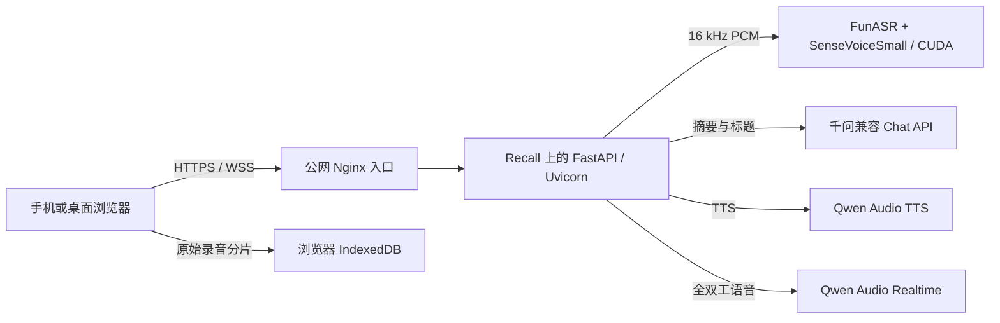

# Speakr：我们现在用的网页录音与实时语音工作台

我们最早只是想做一个顺手的网页录音页：打开浏览器，允许麦克风，然后一边说一边看到文字。真正开始使用以后，事情很快变复杂了。录音能不能暂停，结束后能不能接着录，临时识别结果为什么会反复变化，两小时的会议会不会把浏览器或 GPU 撑满，这些都比“接一个语音模型”更接近真实问题。

现在这套网站放在 [speakr.public.wzhecnu.cn](https://speakr.public.wzhecnu.cn/)。页面中文名仍是“声笺”，代码来自我们持续改造的 Qwen Audio Demo 仓库。它目前有三个相互独立的工作区：会议记录、声音工作室和实时对话。

这里的 Speakr 指 ChatArch 当前部署的这套语音工作台，并不是把同名开源项目原样部署后换了一个页面。

<!-- truncate -->

## 会议记录怎么用

第一次进入时，可以选访客模式，也可以用受邀账号登录。

- 访客记录只保存在当前浏览器的 IndexedDB，单个录音段最多 10 分钟。
- 登录账号的会议文字和摘要会保存在服务器，可以跨设备打开，单个连续录音段最多 2 小时。
- 暂停不计入录音段时长。点结束以后，可以在同一条会议里继续录；打开旧会议也可以继续追加。
- 网站不开放自行注册。账号由管理员在服务器上创建。

开始录音后，页面底部显示真实麦克风波形和本段剩余时间。文字区分成三层：

1. **正式记录**：已经稳定的内容，只会继续增加，不会因为后面的短结果突然消失。
2. **上下文回写**：模型根据稍后的语音重新识别后，仍可能调整的最近几句。
3. **实时识别**：当前最新、最不稳定的一句话。

结束录音时，最后一个识别窗口会先完成，再把文字并入正式记录。摘要页随后整理主题、行动项、风险和待确认问题。会议标题也会自动生成；如果用户自己改过标题，模型不会再覆盖它。

原始录音和转写是两条独立链路。MediaRecorder 每秒产生一个音频分片并写入浏览器 IndexedDB，不会把两小时音频一直堆在 JavaScript 内存里。用户点击下载时，浏览器才读取这些分片并组装成完整文件。转写失败不会直接带走本地录音。

## “回写”到底用了什么

这里最容易产生误解。当前的上下文回写没有为每一句话再调用一次大语言模型。

浏览器把 16 kHz PCM 音频通过 WebSocket 发给服务端。服务端大约每 3 秒重新识别一次当前窗口，窗口长度控制在 42–45 秒。新结果会包含更多上下文，因此模型可能把刚才听错的词改回来。前端的 `TranscriptState` 再比较相邻版本，把稳定句子推到正式记录，把最近一句留在实时区，中间部分放进“回写中”。

这套做法有两个直接好处：

- 回写只使用同一个 ASR 模型，不需要为高频临时文本持续支付大模型调用成本。
- 每次送进 GPU 的音频长度有上限。会议开两小时，识别窗口也不会增长到两小时。

ASR 输出后还有一层很轻的本地整理，例如移除少量语气词、补齐末尾标点。它不是语义改写模型。真正的会议摘要才会进入大语言模型。

## 声音工作室和实时对话

声音工作室目前可以把文字合成为 MP3 或 WAV，内置龙安灵心、龙安鲁风两个音色，也可以填写已经创建好的自定义 voice id。生成后的音频可以直接试听和下载。

页面保留了声音复刻入口，不过当前正式部署没有配置独立的 DashScope Voice API Key，所以创建复刻音色的按钮会保持禁用。这个状态是服务端下发的，前端不会把未配置能力伪装成可用。

实时对话是另一条链路。浏览器持续发送麦克风音频，由服务端 VAD 判断说话开始和结束；模型返回文字和 24 kHz PCM 音频，网页边收边播放。用户重新开口时可以打断正在播放的回答。对话支持模型和音色选择、历史记录、搜索、删除以及 Markdown 导出。当前账号实际可用的 Realtime 模型只有一个，页面不会列出无法调用的占位选项。

## 当前实际使用的模型

| 功能 | 当前模型或实现 | 运行位置 |
| --- | --- | --- |
| 会议语音识别 | FunASR `iic/SenseVoiceSmall` | Recall 服务器，CUDA `cuda:0` |
| 临近文字回写 | 同一个 SenseVoiceSmall 对 42–45 秒窗口重新识别，加前端 revision 状态机 | Recall + 浏览器 |
| ASR 轻量清理 | 本地规则：空白、少量语气词和标点整理 | FastAPI 服务 |
| 会议摘要与整理 | `qwen3.8-max` | 千问兼容 API，经服务端调用 |
| 自动会议标题 | `qwen3.6-flash`，关闭思考模式 | 千问兼容 API，经服务端调用 |
| 文字转语音 | `qwen-audio-3.0-tts-plus` | 千问 TTS WebSocket API |
| 实时语音对话 | `qwen-audio-3.0-realtime-plus` | 千问 Realtime WebSocket API |

API Key 只放在 Recall 服务器的私有环境文件中。浏览器访问的是我们自己的 FastAPI 接口，不会拿到供应商密钥。

## 服务是怎么部署的

应用运行在 Recall 服务器上，由 FastAPI 同时提供页面、HTTP API 和 WebSocket。默认 ASR 在一张 RTX 2080 Ti 上运行，模型加载后留在进程缓存中；服务器还有第二张 GPU，但当前识别通道只使用 `cuda:0`。公网入口负责 HTTPS、WebSocket 升级和长连接超时，随后转发到 Recall。

登录账号的会议文字、摘要和实时对话文字保存在服务器 SQLite。访客模式不把这些内容写入服务器数据库，但音频和文字仍会在转写、摘要请求期间经过服务端处理。ASR 使用的临时 WAV 文件会在每次推理后删除，服务日志只记录分片序号、字节数、输出字数和耗时，不记录完整正文。

## 我们实际测过什么

为了避免用“应该可以”代替验证，目前自动化覆盖了暂停、继续、结束后续录、打开旧会议追加、短 revision 回退、重复句、长句拆分和 40 次连续回写等场景。

长会议测试使用两小时 PCM 流做模拟，完成了 100 次以上上下文窗口轮换，并验证服务端音频历史保持有界。真实链路则用 Qwen TTS 生成中文测试音频，经公网 WebSocket 进入 GPU ASR，再调用 Qwen 生成摘要；最近一次测试得到 5 次累计 revision，最终转写与原文的归一化相似度为 1.0。

还有几件事没有做完：iPhone 和 Android 连续两小时的真机浸泡仍待执行；网页切到后台或锁屏后不承诺继续录音；当前没有说话人分离；声音复刻还缺正式密钥配置。这些边界会直接保留在项目记录里，不会写成已经解决。

## 源码

- 网站：[https://speakr.public.wzhecnu.cn/](https://speakr.public.wzhecnu.cn/)
- GitHub：[ChatArch/qwen-audio-tts-realtime-demo](https://github.com/ChatArch/qwen-audio-tts-realtime-demo)

仓库里包含 FastAPI 后端、单页前端、FunASR worker、账号和会议存储，以及覆盖 UI、ASR、长会议和账号隔离的合同测试。仓库名还保留着早期 Demo 的历史痕迹，当前线上入口统一使用 Speakr。
