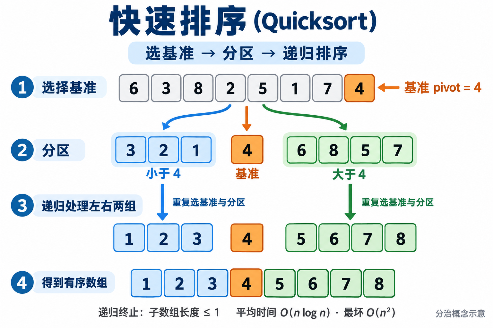

import useBaseUrl from '@docusaurus/useBaseUrl';

给出一段描述，调用图像工具，得到一张可以直接放进课件的图片——这篇指南把这个过程落实到配置和代码。

下面这张快速排序示意图，就是通过 **CRS API Key → Responses API → `image_generation`** 实际生成的。客户端只需要服务地址和一把 CRS 调用 Key。



本次生成使用 `gpt-5.5` 承载工具调用、`gpt-image-2` 绘图，返回一张 **1536 × 1024 的 PNG**，请求约 57 秒完成。图中的输入数组、基准 4、左右分区和最终排序均经过核对。

<!-- truncate -->

本文给出两种使用方式：

1. **在 ChatImg / ChatEnv 环境中运行配套 Python 脚本**：从已有配置读取 Key，生成并保存图片。
2. **直接使用 curl**：自己发送请求，再从响应流中提取 PNG。

两种方式使用同一个 `/responses` 接口。本文的 `generate_image.py` 是配套示例脚本，不是 ChatImg 内置子命令。

<a href={useBaseUrl('/downloads/crs-image-guide/examples.zip')}>下载完整示例包：Python 脚本、curl 脚本、请求 JSON 与提示词</a>

示例中的 `https://crs.example.com` 是占位域名，请替换为自己的 CRS 地址。模型名称以你的 Key 实际可用范围为准；本文示例请求已经在支持这些模型的账号上完成验证。

## 一、使用 ChatImg / ChatEnv 环境生成图片

### 安装工具

在已有的 Python 虚拟环境中安装：

```bash
pip install chatimg
chatimg --version
chatimg --tree
```

本文验证环境为 ChatImg **0.1.5**、ChatEnv **0.2.11**。已有 ChatArch 环境可以直接复用。

如果还没有虚拟环境，可以先创建一个：

```bash
python3 -m venv .venv
source .venv/bin/activate
pip install chatimg
```

### 将 CRS Key 放入 ChatEnv

创建一个名为 `crs` 的 OpenAI 类型配置：

```bash
chatenv new -t oai crs
```

命令会创建配置文件。使用编辑器打开 `~/.chatarch/envs/OpenAI/crs.env`，填写以下字段；如果设置了 `CHATARCH_HOME`，文件位于该目录下的 `envs/OpenAI/crs.env`。已有同名配置则直接使用，不必重新创建。

```bash
curl --version
```

配套脚本会使用系统 curl 发送请求，先确认上面的命令可以运行。然后填写配置：

```env
OPENAI_API_BASE=https://crs.example.com/openai/v1
OPENAI_API_KEY=<YOUR_CRS_API_KEY>
OPENAI_API_MODEL=gpt-5.5
OPENAI_IMAGE_MODEL=gpt-image-2-medium
```

这几个字段分工不同：

| 字段 | 用途 |
|---|---|
| `OPENAI_API_BASE` | CRS 的 OpenAI 兼容入口，包含 `/openai/v1` |
| `OPENAI_API_KEY` | CRS 签发的调用 Key |
| `OPENAI_API_MODEL` | 接收提示词、调用图像工具的承载模型 |
| `OPENAI_IMAGE_MODEL` | 图像模型预设，`-medium` 表示中等质量 |

虽然调用的是 CRS，配置仍放在 ChatEnv 的 **OpenAI 类型**里。配套脚本通过 `--profile crs` 读取这个命名配置，不需要切换全局默认配置。

### 写提示词，运行生成

下载并解压示例包，进入其中的目录。包里的 `prompt.txt` 包含完整的快速排序图提示词，也可以改成自己的描述：

```text
生成一张中文快速排序教学图。
输入数组：[6, 3, 8, 2, 5, 1, 7, 4]。
选择最后一个元素 4 作为基准。
分区为 [3, 2, 1]、[4]、[6, 8, 5, 7]。
左右两组分别递归排序，最后得到 [1, 2, 3, 4, 5, 6, 7, 8]。
使用白底、清晰数字方块与箭头，突出基准和分区关系。
```

执行：

```bash
python generate_image.py \
  --profile crs \
  --host-model gpt-5.5 \
  --image-model gpt-image-2 \
  --size 1536x1024 \
  --quality medium \
  --prompt-file prompt.txt \
  --output quicksort.png
```

脚本完成后会打印图片路径、格式、尺寸和 SHA-256。图片写入指定文件，完整响应保存在同名 `.sse` 文件中，方便之后重新提取，不必重复发起生成请求。

配套脚本读取 Key 的核心代码是：

```python
from pathlib import Path
import os
from chatenv.configs import OpenAIConfig
from chatenv.store import EnvStore

home = Path(os.environ.get("CHATARCH_HOME") or Path.home() / ".chatarch")
values = EnvStore(home / "envs").load_profile(OpenAIConfig, "crs")

api_base = values["OPENAI_API_BASE"].rstrip("/")
api_key = values["OPENAI_API_KEY"]
```

生成流程可以概括为：读取命名配置 → 构造图像工具请求 → 通过 curl 发送 → 提取完整图像 → 校验并保存。Python 负责参数与文件处理，HTTP 调用仍是下一节展示的 curl 请求。

## 二、纯 curl 调用 image tool

这一种方式只需要 curl、jq 和 Base64 解码工具，不需要安装 Python 包。

### 配置地址和 Key

在 Bash 中设置服务地址，并通过安全输入读入 Key：

```bash
export CRS_API_BASE='https://crs.example.com/openai/v1'
read -r -s -p 'CRS API Key: ' CRS_API_KEY
printf '\n'
export CRS_API_KEY
```

完整请求地址是：

```text
POST https://crs.example.com/openai/v1/responses
```

### 准备请求 JSON

示例包已经提供 `request.json`。也可以自行创建，内容如下：

```json
{
  "model": "gpt-5.5",
  "instructions": "Use the image_generation tool to create the requested teaching infographic.",
  "input": [{
    "role": "user",
    "content": [{
      "type": "input_text",
      "text": "生成中文快速排序示意图：数组[6,3,8,2,5,1,7,4]，基准4，分区为[3,2,1]、[4]、[6,8,5,7]，递归排序后得到[1,2,3,4,5,6,7,8]。白底，数字方块和箭头清晰。"
    }]
  }],
  "tools": [{
    "type": "image_generation",
    "model": "gpt-image-2",
    "action": "generate",
    "quality": "medium",
    "size": "1536x1024",
    "partial_images": 1
  }],
  "tool_choice": {"type": "image_generation"},
  "stream": true,
  "store": false
}
```

最值得看清楚的是两个 `model`：外层的 `gpt-5.5` 负责调用工具；`tools` 里的 `gpt-image-2` 负责生成图片。`tool_choice` 明确要求调用图像工具，`stream: true` 表示使用流式响应。

### 发起请求并保存响应

```bash
printf '%s: %s %s\n' Authorization Bearer "$CRS_API_KEY" |
curl --fail-with-body --silent --show-error \
  --connect-timeout 10 --max-time 300 \
  --header @- \
  --header 'Content-Type: application/json' \
  --header 'Accept: text/event-stream' \
  --data-binary @request.json \
  "$CRS_API_BASE/responses" \
  --output response.sse
```

认证头从标准输入传给 curl，实际 Key 不出现在 curl 的命令行参数里。`request.json` 只保存模型、提示词和图像参数，可以与代码一起管理；Key 应留在自己的凭据配置中。

### 从响应中保存 PNG

请求成功退出后，执行：

```bash
set -o pipefail
jq -rRn '
  [inputs
   | select(startswith("data: "))
   | .[6:] | fromjson?
   | if .type == "response.output_item.done" then .item
     elif .type == "response.completed" then .response.output[]?
     else empty end
   | select(.type == "image_generation_call")
   | .result
   | select(type == "string" and length > 0)]
  | last // error("No final image in the stream")
' response.sse | base64 --decode > quicksort.png
```

Responses 返回的是 **SSE 事件流**。完整图片以 Base64 字符串放在 `image_generation_call` 的 `result` 字段中。上面的命令同时接收两种完整结果位置：

- `response.output_item.done` 中的 `item.result`；
- `response.completed` 中的 `response.output[].result`。

这样既能接收独立输出项，也能接收最终汇总。本次示例图片来自第一种位置；shell 解码得到的文件与 Python 解码结果逐字节一致。

如果希望将发送和保存合成一条命令，可以使用示例包中的脚本：

```bash
bash curl_image_tool.sh request.json quicksort.png
```

也可以对已经保存的响应重新解码：

```bash
python generate_image.py \
  --decode response.sse \
  --output quicksort-copy.png
```

### 换一个主题，保留同一套调用方式

做其他图片时，先改提示词，再调整 `size` 和 `quality` 即可。流程图应给出节点和连线，教学图应提供准确的数据与步骤，封面图应描述主题、构图和配色。

这张快速排序图采用的是**分治概念示意**：分区阶段保留 `[3, 2, 1]` 与 `[6, 8, 5, 7]`，下一步才展示递归排序结果。将算法事实先写清楚，模型才能把正确的内容转成清晰的画面。用于正式材料前，再核对图里的文字、数字和关系。

<a href={useBaseUrl('/downloads/crs-image-guide/quicksort.png')}>下载本次生成的 PNG 原图</a>

相关项目：[ChatImg](https://github.com/ChatArch/ChatImg)、[ChatEnv](https://github.com/ChatArch/ChatEnv)、[CRS](https://github.com/Wei-Shaw/claude-relay-service)。
