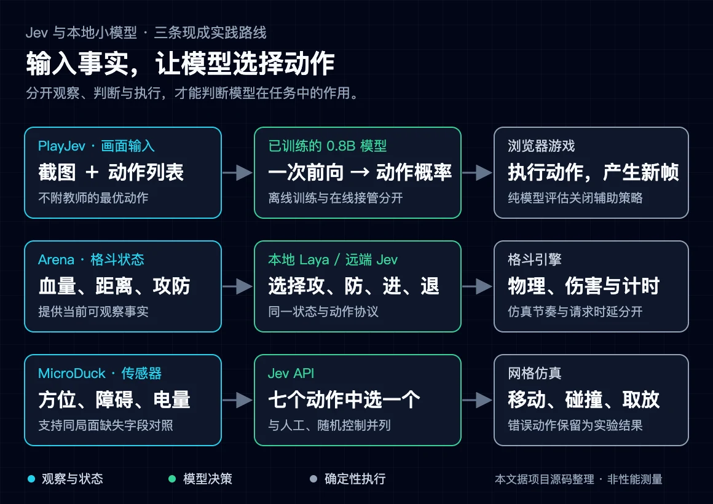
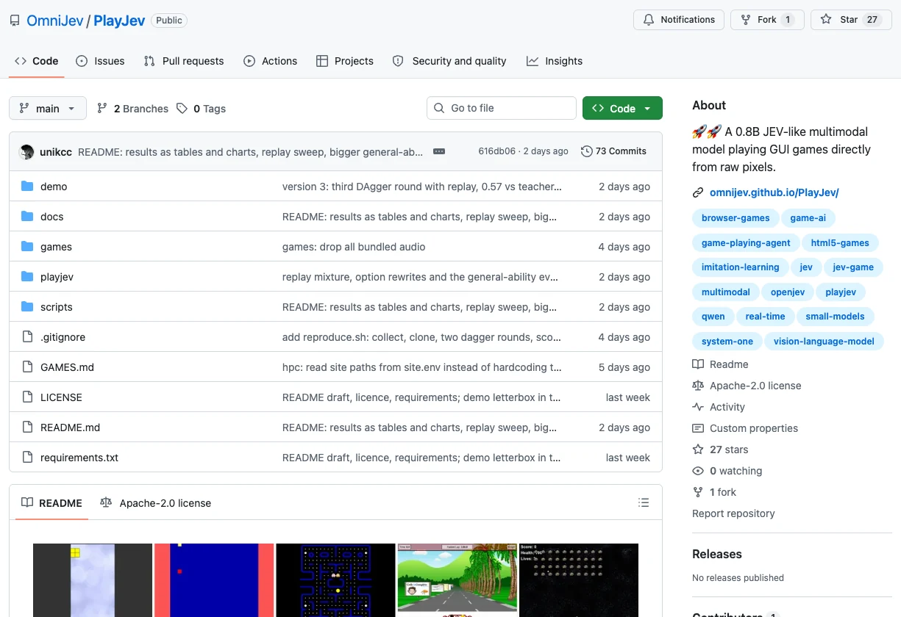
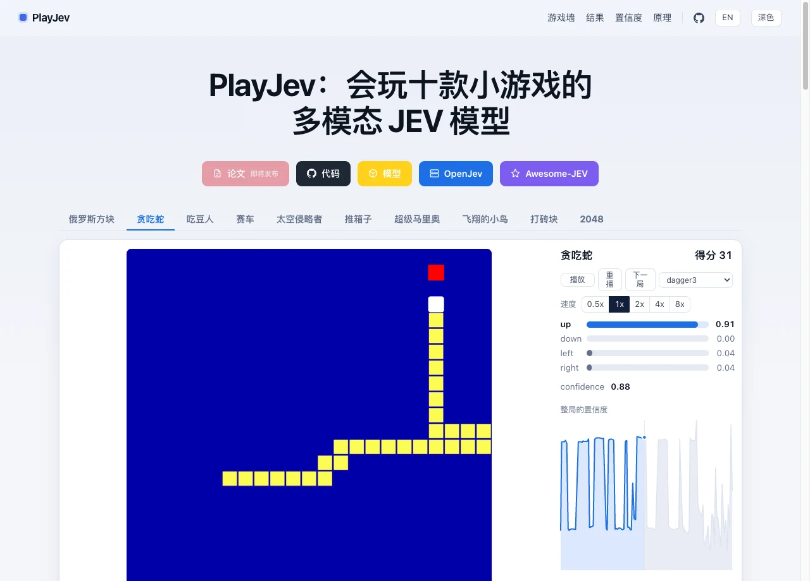
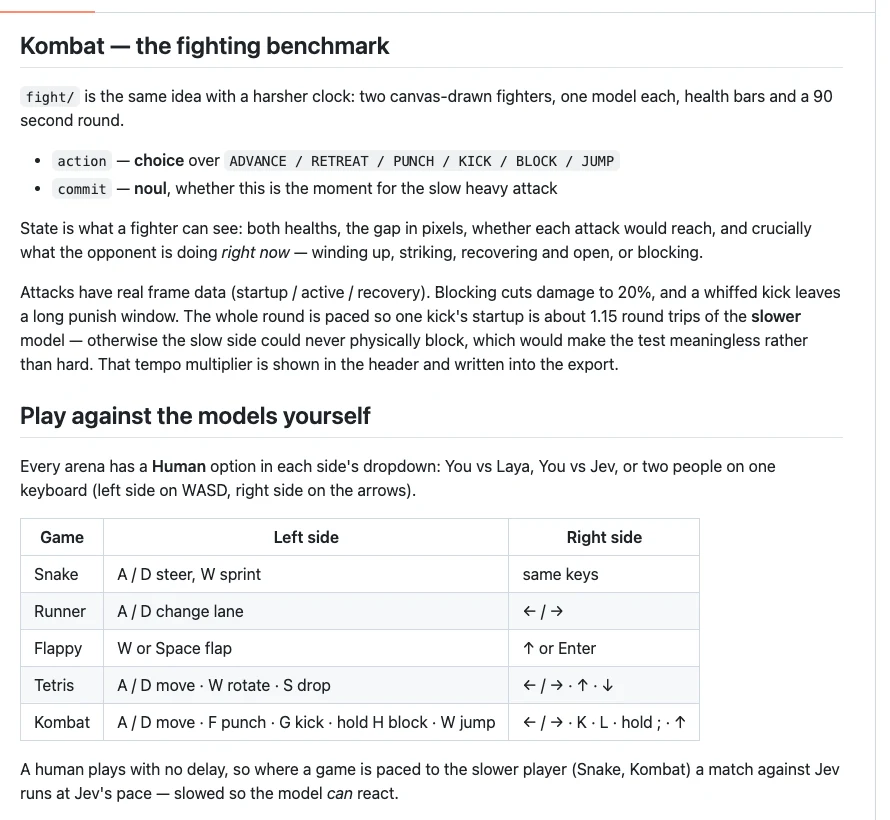
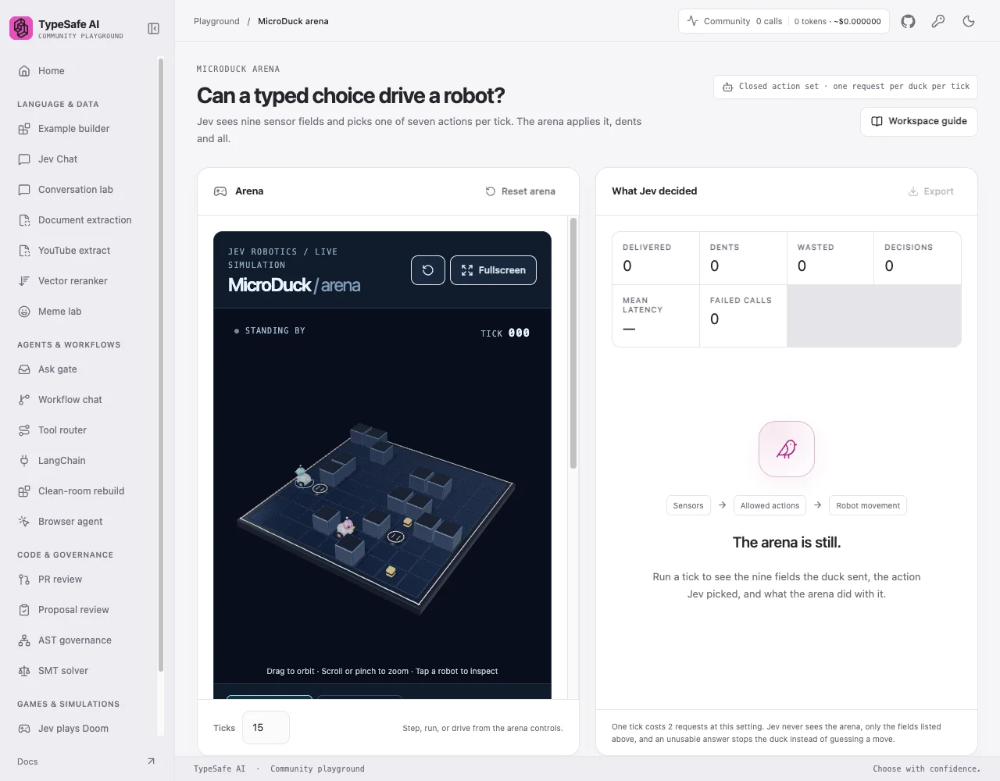

想用一个低延迟模型玩游戏，最省事的起点是找一套已经能运行、还能看清决策过程的项目。画面动起来只是第一步：还要知道模型看到了什么、返回了什么，以及代码有没有替它改动作。

这次筛选了十个现成项目，重点读了三套实现：**PlayJev、本地 Laya 与 Jev 的对战 Arena，以及社区 Playground 里的 MicroDuck**。它们分别代表画面输入、游戏状态输入和传感器输入三条路线。本文整理源码与启动方式，没有把作者报告的速度和得分当作自己的复现实测。

<!-- truncate -->

[](./assets/decision-paths.webp)

*图1：根据项目源码整理的决策路径。图中“执行”包括游戏规则和动作落实，不代表模型已经完成了全部规划。点击图片可查看大图。*

## 先按目标选项目

|你想验证什么|优先项目|运行方式|
|---|---|---|
|公开的小模型能否直接看画面选动作|PlayJev|本地 CUDA 推理＋浏览器游戏|
|同一游戏里比较本地 Laya、Jev 和人类|Laya vs Jev Arena 的 Kombat|Python 服务器＋浏览器对战|
|Jev 如何把传感器状态变成实时动作|Community Playground 的 MicroDuck|Web 应用＋Jev API|

这里有一个名称区别：Jev 是 TypeSafe 的托管模型；Laya 是另一个开源决策模型；PlayJev 则是基于 Qwen3.5-0.8B 训练的社区视觉决策模型。它们可以采用相近的“状态＋候选→选择”接口，但不能因此视为同一个模型。[7][17]

下面的 stars 是 2026-09-24 调研快照，只作项目定位，不代表可靠性排名。

## PlayJev：从画面到动作，权重也公开

**仓库：** https://github.com/OmniJev/PlayJev  
**权重：** https://huggingface.co/OmniJev/PlayJev-0.8B  
**快照：** 27 stars；项目代码与模型权重标注 Apache-2.0。[16][63]

[](./assets/playjev-repository.webp)

*图2：PlayJev 仓库截图。项目同时提供模型代码、游戏环境、训练脚本和展示页面；截图不是运行性能证据。来源：OmniJev/PlayJev。*

### 模型确实读画面

`LocalPolicy.decide()`把当前截图和动作说明交给模型，没有把游戏内部的教师答案一起送进去。`model.py`执行一次视觉模型前向，读取答案位置上候选字母的 logits，再转成动作概率；这条路径没有逐 token 的文本生成循环。[22][23]

例如贪吃蛇的候选是“向上、向下、向左、向右”。这些描述解释动作本身，不会按当前棋盘把某个方向预先标成“Best route”。游戏收到概率最高的动作后推进，再生成下一张图。[22][24]

这是一个适合研究模型贡献的接口：环境负责生成观察、执行动作和计分，模型负责选择。若把模型换成随机策略或教师策略，游戏环境仍然保持不变。[23]

### 展示页与实时模式要分开看

[](./assets/playjev-recorded-demo.webp)

*图3：PlayJev 公开展示页的已录制 Snake 轨迹。图上的得分、动作概率和置信度来自原作者保存的运行记录，不是截图时新发起的推理。来源：PlayJev 展示站。*

公开的 GitHub Pages 和 Hugging Face Space 默认展示录制结果。HF Space 的类型也是静态站点，不承载 GPU 推理。因此，点开网页看见蛇在移动，不能算完成了实时模型部署。[64][67]

项目已经写好了实时路径，不需要另外开发：网页指定 `?server=...` 后进入 `runLive()`，将新截图发给 `/v1/systemone`，读回概率并执行动作；`playjev.serve`负责加载权重和实际推理。[24][67]

### 按原项目方式启动

作者给出的环境是 Python 3.12 和 CUDA GPU，推理约需3GB显存。README里的43ms来自H200，不能直接套用到其他显卡或Mac上。[17]

依赖准备遵循原仓库说明：

```bash
git clone https://github.com/OmniJev/PlayJev.git
cd PlayJev
python3.12 -m venv .venv
source .venv/bin/activate
pip install -r requirements.txt
playwright install chromium
```

先跑一个有界的本地模型 episode：

```bash
python -m playjev.play snake \
  --policy local \
  --ckpt OmniJev/PlayJev-0.8B \
  --pages 1 --episodes 1 --max-steps 2000 \
  --no-skip-noop
```

这会下载尚未缓存的权重并启动浏览器环境。上面的参数按源码核对过，本文没有执行这次安装与推理。[17][23]

有两个开关值得先看清：

- 不传 `--handover`，就不启用运行时教师接管。
- `--no-skip-noop`关闭“动作没改变画面时改走次优动作”的执行器规则。正式使用可以打开辅助，但评估时应分开统计。[23]

需要接网页时，原项目已有服务入口：

```bash
python -m playjev.serve \
  --ckpt OmniJev/PlayJev-0.8B \
  --host 127.0.0.1 --port 18732
```

该服务默认没有鉴权，CORS允许所有来源。先在本地或受控网络使用；对外提供网页时应补访问控制，并验证网页到服务的协议、跨域和浏览器网络限制。不要把一个能在本机监听的接口直接裸露到公网。[24]

### 已有的优化过程是什么

项目提供行为克隆和多轮 DAgger 的训练结果，以及相同留出种子上的随机、模型、教师比较。这里的改进来自模型权重训练，不是只换提示词。个别游戏的阶段成绩会回落，不能只挑增长的几列来描述效果。[17]

教师在离线阶段提供标签，与在线阶段替模型做决定是两回事。PlayJev把二者做成不同路径：纯模型运行、教师运行、显式接管运行都可以分别检查。[23]

如果目标是部署一个真正从游戏画面选择动作的小模型，我会优先原样研究这个项目。打包游戏各有许可证，美术素材的权利也不自动包含在模型的Apache许可内，发布游戏素材前还要单独核对。[17]

## Laya vs Jev Arena：直接比较模型，先看格斗

**仓库：** https://github.com/PromptEngineer48/laya-vs-jev-arena  
**快照：** 27 stars，应用代码MIT。[6]

这个项目已经有模型选择器、双方对战、人工控制、概率面板和JSON导出。如果想继续使用Laya，没必要先重写一套游戏。[7]

[](./assets/arena-kombat-guide.webp)

*图4：原仓库的Kombat用法说明，展示动作、观测与人工操作方式。这里是文档截图，不是本文新跑出的对战成绩。来源：PromptEngineer48/laya-vs-jev-arena。*

### 格斗中的决策分工

`fight.js:senseFor()`提供双方血量、距离、攻击前摇、生效与恢复阶段，以及是否正在防御。模型选择以下动作之一：[31][32]

```text
ADVANCE / RETREAT / PUNCH / KICK / BLOCK / JUMP
```

另一个 `noul` 判断是否适合承诺慢速重击。动作说明告诉模型拳脚的距离、速度和风险，代码负责物理、伤害与动作时序。这些都是重要的辅助信息，但源码没有先为当前状态算出一个“最佳动作”再把它作为答案标签交给模型。[31][32]

这类实验仍需做随机或规则对照，才能衡量模型增加了多少价值；接口设计合理，并不自动等于模型强。

### 原生启动入口

安装原仓库的依赖后：

```bash
python server.py 8740
```

浏览器打开 `/fight/` 是Kombat，`/snake/`是追苹果比赛。双方可以选Laya、Jev或人类；Jev需要TypeSafe API key，本地Laya不需要Jev key。凭据应通过运行环境或私密配置注入，不放进前端和Git提交。[7]

服务器的本地路径是进程内 `laya.Router`，默认checkpoint为 `typed-decisions`。它不是一个自动连接任意Laya服务的前端。作者还注明CPU-only VPS可能约1.8秒一次，Docker镜像默认关闭Laya，所以不能把Human-vs-Jev镜像启动成功当成已经部署了本地模型。[29]

### 哪些成绩不能混着比较

Arena按较慢模型的时延调整双方仿真节奏，Kombat也会扩大反应窗口。这让慢模型有机会作出判断，但需要把“调整后的仿真表现”和真实请求的P50/P95分开报告。[7][31]

Snake分支允许穿过身体、从边缘环绕，并非经典的碰撞即死玩法。Runner和Flappy等分支也把一部分动作控制交给代码。各游戏的分工不同，不能用一句“每一步都是模型决定”概括整个仓库。[7]

因此，第一轮我更建议固定Kombat：保留原输入、动作与节奏说明，直接比较模型，再判断是否值得改造。

## MicroDuck：七个动作驱动一只搬运机器人

**仓库：** https://github.com/TypeSafeAI/typesafe-playground  
**入口：** https://typesafe-ai-playground.vercel.app/microduck  
**快照：** 20 stars，MIT。README明确说明这是独立社区项目，不是TypeSafe官方产品。[2][3]

[](./assets/microduck-interface.webp)

*图5：MicroDuck原项目界面。截图停在初始状态，右上角为0 calls；它展示应用布局和实验入口，本次截图没有调用Jev。来源：TypeSafe Community Playground。*

### 输入是观察，不是预标的最佳动作

`observe()`构造九个当前状态字段：目标距离与方向、前方及左右障碍、电量、是否载货、是否到达目标、上个动作。请求给出七个候选：[42][66][68]

```text
move_forward / move_backward / turn_left / turn_right
stop / pick_up / drop
```

候选说明描述每个动作的含义。模型选择有效动作后，仿真直接执行；撞墙会消耗步数并增加碰撞记录，不被导航算法悄悄改成正确路线。响应格式无效时，解析层会尝试模型概率的argmax；完全没有可用回答则停下，这部分也有来源标记。[42][66]

### 现成的对照比再加版本号更有用

MicroDuck已经提供Jev、随机、人工三种模式，还能在同一局面下故意隐藏传感器字段，比较动作和结果。它记录送出的状态、概率、执行动作、送达和碰撞，以及请求耗时。[41][66][68]

这样的实验可以回答具体问题：缺少左侧障碍信息后，模型是否更容易碰撞？它在同一观察下能否稳定完成拾取和投递？这些问题比单看一局总分更容易解释。

### 自托管的是应用

原项目使用Node.js 22+、pnpm 10.34.5和Next.js。按仓库说明安装后，用`pnpm dev`启动，默认端口3042；实时Jev调用需要服务器环境中的`TYPESAFE_API_KEY`。[3]

这条路线适合快速体验结构化决策，不需要先部署GPU，但也不意味着Jev权重已经自托管。网页、游戏环境在自己的机器，推理仍走服务商API。

## 另外七个项目，各适合研究什么

|项目|调研时stars|值得看的部分与限制|
|---|---:|---|
|[TypeSafe Mario](https://github.com/fhshaik/typesafe-mario)|368|Jev根据模拟器状态选择NES控制宏；输入含代码计算的起跳时限等强特征，需合法ROM，复用前确认许可证。[4][5]|
|[whichxjy/jev-playground](https://github.com/whichxjy/jev-playground)|0|Connect Four、驾驶和跳跃实验；Live与Replay分开，原型成熟度和许可仍待确认。[12][13]|
|[kNES](https://github.com/ArturSkowronski/kNES)|34|完整NES模拟器、MCP与Agent层，支持本地Qwen3.5-4B/SemIf；目标筛选和游戏profile是重要代码层。[18][19]|
|[Jev Drone](https://github.com/RomanSlack/jev-drone)|150|MuJoCo中的视觉感知、导航判断与飞控分层；作者明确把困难隧道路线列为部分成果。[10][11]|
|[Jev plays Pokémon](https://github.com/milanboers/jev-plays-pokemon)|5|模型选择探索、交谈和出口等高层目标；A*/BFS和卡住恢复由代码执行。[20][21]|
|[Jev Browser](https://github.com/jkudish/jev-browser)|249|已有CLI、MCP和库接口，模型从真实网页元素选操作；自由文本输入可能另用LLM。[8][9]|
|[Jev Search](https://github.com/superagents-lab/jev-search)|431|模型负责意图与相关性，Search1API负责检索；现成业务应用，需要分清服务与计费依赖。[14][15]|

## 实践前，把三个问题写进验收

**第一，模型看到的是否只是观察。** 若代码已经计算出最优动作并标成`Best`，测到的是模型对既有答案的分类，不是独立规划能力。环境规则、感知特征和策略提示都可以存在，但需要公开它们的作用。

**第二，动作是谁最终决定的。** 原选、执行动作、规则干预和候选数量都应记录。只有一次执行层改动，也不代表其余步骤全由模型自主决定：输入预处理可能已经排除了大部分选择。

**第三，速度测的是哪一段。** 模型前向时间、请求往返、游戏等待时间和仿真时间不同。硬件、网络、冷启动、是否降低仿真速度，都应随P50/P95一起说明。运行记录可以帮助复盘，但不能替代新的在线调用。

按这三个问题读源码，下一步会比较清楚：想部署公开小模型并研究画面决策，先原样跑PlayJev；想继续用Laya比较动作判断，先看Arena的Kombat；想直接体验Jev API进入游戏循环，就看MicroDuck。先使用项目已有的运行路径，再依据实际缺口决定是否需要改造。

*资料与代码核对时间：2026-09-24。图片由本文从公开仓库和页面采集，界面及素材权利归各项目作者；流程图为根据源码绘制的原创整理。本文没有复现候选项目的模型性能，文中的硬件需求与速度数字均按原作者说明归属。*

## Sources

[2] https://github.com/TypeSafeAI/typesafe-playground — TypeSafeAI/typesafe-playground
[3] https://github.com/TypeSafeAI/typesafe-playground/blob/e5fc697f4a7b995b045000c0e3f915df5a7df198/README.md — TypeSafeAI/typesafe-playground
[4] https://github.com/fhshaik/typesafe-mario — fhshaik/typesafe-mario
[5] https://github.com/fhshaik/typesafe-mario/blob/ca22449ed187118d19326d1f54b01b6636578aa4/README.md — fhshaik/typesafe-mario
[6] https://github.com/PromptEngineer48/laya-vs-jev-arena — PromptEngineer48/laya-vs-jev-arena
[7] https://github.com/PromptEngineer48/laya-vs-jev-arena/blob/b02d19a6659a04142c94efd187caac5e6950fec0/README.md — PromptEngineer48/laya-vs-jev-arena
[8] https://github.com/jkudish/jev-browser — jkudish/jev-browser
[9] https://github.com/jkudish/jev-browser/blob/f2b13a05890c321519d8d76c564e84e26c7e601a/README.md — jkudish/jev-browser
[10] https://github.com/RomanSlack/jev-drone — RomanSlack/jev-drone
[11] https://github.com/RomanSlack/jev-drone/blob/c0efd03d0d33c5f0c0508e9a826ee3d5be342e0b/README.md — RomanSlack/jev-drone
[12] https://github.com/whichxjy/jev-playground — whichxjy/jev-playground
[13] https://github.com/whichxjy/jev-playground/blob/bff6ef8ec70b202ac3da1e957d9e65673e8f3b11/README.md — whichxjy/jev-playground
[14] https://github.com/superagents-lab/jev-search — superagents-lab/jev-search
[15] https://github.com/superagents-lab/jev-search/blob/67027d0185a9b22eb2a178f0eb15250d12ddabe6/README.md — superagents-lab/jev-search
[16] https://github.com/OmniJev/PlayJev — OmniJev/PlayJev
[17] https://github.com/OmniJev/PlayJev/blob/616db06b2c27fd8ba56cfa882558c5688281ac61/README.md — OmniJev/PlayJev
[18] https://github.com/ArturSkowronski/kNES — ArturSkowronski/kNES
[19] https://github.com/ArturSkowronski/kNES/blob/94868d90fed0f28cd4af9701090aa89267d18280/README.md — ArturSkowronski/kNES
[20] https://github.com/milanboers/jev-plays-pokemon — milanboers/jev-plays-pokemon
[21] https://github.com/milanboers/jev-plays-pokemon/blob/0b20f13e48f7e6f71283fc83ddd88c359d71aa32/README.md — milanboers/jev-plays-pokemon
[22] https://github.com/OmniJev/PlayJev/blob/616db06b2c27fd8ba56cfa882558c5688281ac61/playjev/model.py — OmniJev/PlayJev playjev/model.py
[23] https://github.com/OmniJev/PlayJev/blob/616db06b2c27fd8ba56cfa882558c5688281ac61/playjev/play.py — OmniJev/PlayJev playjev/play.py
[24] https://github.com/OmniJev/PlayJev/blob/616db06b2c27fd8ba56cfa882558c5688281ac61/playjev/serve.py — OmniJev/PlayJev playjev/serve.py
[29] https://github.com/PromptEngineer48/laya-vs-jev-arena/blob/b02d19a6659a04142c94efd187caac5e6950fec0/server.py — PromptEngineer48/laya-vs-jev-arena server.py
[31] https://github.com/PromptEngineer48/laya-vs-jev-arena/blob/b02d19a6659a04142c94efd187caac5e6950fec0/fight/fight.js — PromptEngineer48/laya-vs-jev-arena fight/fight.js
[32] https://github.com/PromptEngineer48/laya-vs-jev-arena/blob/b02d19a6659a04142c94efd187caac5e6950fec0/fight/index.html — PromptEngineer48/laya-vs-jev-arena fight/index.html
[41] https://github.com/TypeSafeAI/typesafe-playground/blob/e5fc697f4a7b995b045000c0e3f915df5a7df198/components/MicroDuckLab.tsx — TypeSafeAI/typesafe-playground components/MicroDuckLab.tsx
[42] https://github.com/TypeSafeAI/typesafe-playground/blob/e5fc697f4a7b995b045000c0e3f915df5a7df198/lib/microduckWorld.ts — TypeSafeAI/typesafe-playground lib/microduckWorld.ts
[63] https://huggingface.co/OmniJev/PlayJev-0.8B
[64] https://huggingface.co/spaces/OmniJev/PlayJev
[66] https://github.com/TypeSafeAI/typesafe-playground/blob/e5fc697f4a7b995b045000c0e3f915df5a7df198/lib/driveDuckWithJev.ts
[67] https://github.com/OmniJev/PlayJev/blob/616db06b2c27fd8ba56cfa882558c5688281ac61/demo/demo.js
[68] https://github.com/TypeSafeAI/typesafe-playground/blob/e5fc697f4a7b995b045000c0e3f915df5a7df198/types/microduck.ts
